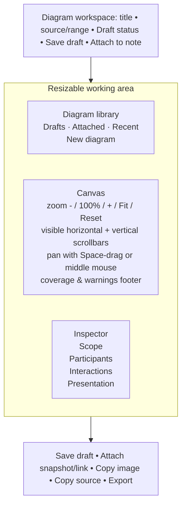

# Sequence-diagram feature review and rework proposal

**Status:** design review only; no production-code changes proposed in this document.

**Scope reviewed:** the sequence-diagram dialog, generation model, renderer, saved annotation
notes, and Markdown/export path. The review is based on the current branch and the supplied
screen capture.

## Executive recommendation

Turn the feature from a one-shot “generate then add a large note” dialog into a persistent
**Diagram workspace** with three deliberate stages:

1. build and understand the flow in a large, navigable canvas;
2. save it as a named draft or improve it later from a diagram list;
3. attach a compact diagram card to a note only when it supports the investigation.

The first release should focus on a much larger workspace, discoverable zoom/navigation,
range-correct participant curation, aliases, compact notes, and drafts. Richer semantic
extraction (rules and repeated external interactions) follows once the workspace makes those
controls understandable.

## What is already strong

- The feature has a dialect-neutral model and keeps a rendered model with the diagram, so arrow
  clicks can navigate back to the originating log line even when the original log is not open.
- The preview is debounced and cancellable; changing controls does not queue expensive scans.
- The generated range is correctly resolved against the filtered visible entries. The renderer
  already protects against pathological image sizes, and the preview does technically support
  horizontal and vertical scrolling.
- The current model already has useful foundations: participant labels, source-method labels,
  error markers, frames, ranges, regex rules, and a per-tab discovery function for diagram notes.

These are good foundations. The rework should preserve them rather than replacing the generator.

## Findings

| Priority | Finding | Evidence and consequence |
| --- | --- | --- |
| P0 | The workspace is too small for its primary task. | The fixed 940 dp dialog leaves roughly 574 dp for the preview after the 330 dp control column; its height is capped at 520 dp. The supplied capture shows the canvas clipped on both axes. |
| P0 | Navigation is effectively invisible. | The preview has scroll state but no visible scrollbars, zoom level, Fit, reset, or pan affordance. A large raster therefore looks like a cropped image rather than a navigable canvas. |
| P0 | Participant selection looks inconsistent with the filtered range. | The UI lists `tab.analysis.tagCounts`—counts across the full tab—while generation derives candidates from the resolved filtered range. Manually choosing a listed tag can also remove all other tags, silently dropping their entries. |
| P0 | Diagram notes are visually and cognitively huge. | A diagram note renders the image and then exposes the full hidden JSON header plus Mermaid/PlantUML in a regular editable text field. This crowds out surrounding investigative prose. |
| P0 | Editing source can make the image and source disagree. | The embedded model continues to render and provide click targets after the fenced source is manually edited. Export uses the edited source, so a note can show one diagram and export another. |
| P0 | There is no “save without attaching” or diagram list. | The coordinator only keeps a transient request and writes on **Add to notes**. Existing diagram discovery finds diagram notes, but there is no UI or durable draft store. |
| P1 | Aliases and source-aware participant names are not exposed. | `DiagramParticipant.label` exists, and source labels can use `Class#method()`, but the dialog only displays raw tag names and has no rename/alias control. Long package/tag names dominate the canvas. |
| P1 | External actors model only one synthetic beginning and end. | The UI explicitly clears other actors’ `in`/`out` selections, and tag-transition generation emits only one first incoming call and one final return. Repeated inbound requests and outbound responses cannot be represented in this mode. |
| P1 | The default inference is too implicit. | “Tag handoff” describes an implementation heuristic, not the coverage or confidence of the resulting interaction. The user cannot see which log lines were omitted, grouped, or represented as self-events. |
| P2 | Useful model capabilities are hidden or underexplained. | There is no title editor, no direct sequence-group range picker even though the model supports it, and regex rules are compact raw fields without validation, preview hit counts, or endpoint guidance. |
| P2 | Regeneration provenance is weak. | The spec stores the source file name, but the editing flow does not surface a mismatch before rebuilding against a different/current tab. |

## Target interaction design

### 1. Diagram workspace, not a narrow modal

Open a window-sized modal (or a dedicated workspace panel) at roughly 86–92% of the application
window, with a sensible minimum of **1,200 × 760 dp**. It must keep the title, status and canvas
controls fixed while only side inspectors scroll. The central canvas should receive at least
**760 × 620 dp** at normal desktop sizes.



Suggested behavior:

- **Canvas controls:** `−`, `+`, `100%`, **Fit**, **Fit width**, **Reset**, and a textual zoom
  percentage. `Ctrl/Cmd + wheel` zooms around the pointer; Space-drag and middle mouse pan.
- **Navigation:** always-visible vertical and horizontal scrollbars, keyboard panning, and a
  small minimap only when the diagram overflows substantially. Do not auto-shrink text below a
  readable threshold merely to fit the canvas.
- **Resizable regions:** the library and inspector can collapse independently. The canvas is the
  primary surface and gets the reclaimed width.
- **Preview truthfulness:** show `shown / scanned` messages, lifelines, hidden/tag-grouped events,
  truncation state, and source-index coverage in one concise footer. Warnings are actionable
  chips that open the relevant inspector section.
- **Entry points:** retain the log context-menu action, but also add a toolbar/Notes-panel action
  and a keyboard command. A saved diagram can be opened without selecting log rows first.

### 2. Scope and participant curation that matches what will be generated

The Participants inspector must compute its candidate list from the *currently resolved range and
active filter*, not the whole tab. It should refresh with the same debounced preview request.

The default view is a recommended set of 4–8 participants, ordered by in-range significance:

- message/event count in the chosen range;
- transitions to/from other participants;
- errors, warnings and source-resolution confidence;
- whether the participant is currently filtered out, grouped, or manually pinned.

Give every candidate an explicit representation choice:

| Choice | Meaning |
| --- | --- |
| **Show** | Keep a separate lifeline. |
| **Group as Other** | Preserve events but collapse this participant into one `Other` lifeline. |
| **Hide** | Omit its events; the coverage footer reports the omission. |

This avoids the current all-or-nothing behavior where selecting a few tags silently discards the
remaining activity. The tag count should be labelled `in selected range`, with an optional
secondary `whole log` count for context—never the other way around.

For each shown participant, provide an inline **Display name** field and a secondary raw identity:

```text
PackageManagerService                         ×
tag: PackageManager     source: PackageManagerService.kt
display: PackageManagerService   [Auto] [Use class] [Use tag]
```

Name precedence should be: user alias → resolved owning class → short/raw tag. Source resolution
must prefer the actual owning declaration/class where available, rather than assuming a Kotlin
file name is always a class. The raw tag remains immutable identity and is shown in a tooltip and
in exported provenance.

### 3. Model repeated external interactions as events, not start/end decoration

Replace the single-select `in` / `out` toggles with **External interaction rules**. An actor can
occur as many times as the evidence supports it.

```text
External interaction
When:  HTTP request (?<verb>GET|POST) (?<path>\S+)
From:  Mobile device             To: NetworkDispatcher
Label: ${verb} ${path}           Matches: 14 lines

When:  response (?<code>\d{3})
From:  NetworkDispatcher         To: Mobile device
Label: ${code} response          Matches: 14 lines
```

- Rules are ordered, enableable cards with sample matches, validation, and explicit source line
  count. They reuse the existing regex/message-rule foundation but make it comprehensible.
- An actor may be used by multiple rules in either direction. There is no “only one inbound/outbound
  actor” restriction.
- Keep **Opening boundary** and **Closing boundary** as optional conveniences for the genuinely
  synthetic first/last arrows, clearly separate from evidence-backed interaction rules.
- Provide templates for HTTP, binder/RPC, broadcast, database, socket, worker/job, and a generic
  capture rule. This makes source-aware logs much more useful than tag transitions alone.

The interaction selector should read in user terms:

1. **Observed events** — every selected log event, best for timelines.
2. **Component handoffs** — inferred tag transitions, clearly labelled as inference.
3. **Extracted interactions** — explicit rules/templates; recommended for requests/responses.

Each mode should display an inclusion summary rather than silently falling back to another mode.

### 4. Compact, trustworthy diagram notes

A diagram attached to notes should be a **Diagram card**, not an exposed implementation blob.

Collapsed card (default):

```text
▸ Package verification flow                         Attached · 21 arrows · 4 lifelines
  Selection: 12:04:15.201–12:04:21.992   ·   2 errors   ·   updated just now
  [Open workspace] [Show diagram] [Copy] [More]
```

Expanded card: the rendered diagram, a short user-authored caption, range/provenance, and actions.
The code is behind **Source (Mermaid, 38 lines)** and remains collapsed by default. The JSON model
header is never shown in normal note editing.

The preferred editing contract is:

- generated source is derived from the diagram model and is read-only in normal use;
- **Edit diagram** opens the workspace and regenerates source/model together;
- an advanced **Edit source** path clearly creates a `source override` state. It must invalidate
  the clickable generated model (or preserve a source hash and render only when it matches), so
  the application never shows a stale image for changed source;
- source-only imported diagrams display as source until an explicit conversion/regeneration can
  establish a reliable model.

This directly removes the current image/source mismatch risk while still respecting advanced users
who need the Mermaid/PlantUML text.

### 5. Persistent diagram library and drafts

Add a per-log **Diagram library** available from the workspace and Notes panel. It contains:

- **Drafts:** saved but not attached to a note;
- **Attached:** diagrams used by one or more notes;
- **Recent:** last edited diagrams across the current investigation;
- search by title, alias/tag, actor, rule/template, range, and status;
- sort/filter by changed date, errors, range length, source file, and attachment state.

Each library item needs a human title, optional description, immutable ID, source-log identity,
range/spec, model/source snapshot, created/updated timestamp, and attachment references. Use a
separate diagram store rather than a hidden `AnnBlock.Note`: a draft must not pollute the notes,
and one diagram may reasonably be attached more than once.

When attaching, offer two semantics:

- **Snapshot (default for reports):** the note keeps the exact rendered version and provenance.
- **Linked working diagram:** the card reflects subsequent saves, with a visible revision/date and
  a one-click **Detach snapshot** action.

If a source log is not open, a saved model remains viewable. If it is open but has a different
fingerprint/file identity, **Regenerate** must show a mismatch warning and require confirmation.

## Suggested implementation sequence

### Phase A — make the existing feature usable (P0)

1. Replace fixed dimensions with a window-sized, resizable dialog/workspace and retain the
   existing `usePlatformDefaultWidth = false` requirement.
2. Add visible scrollbars, pan, zoom, Fit/Reset, keyboard shortcuts, and a persistent preview
   status line.
3. Build participant candidates/counts from the resolved filtered range; report show/group/hide
   coverage and make omissions explicit.
4. Add participant display-name aliases, title editing, and a source-name strategy with safe
   fallbacks.
5. Render diagram notes as collapsible cards and hide code/header by default.
6. Prevent model/source drift with a generated-source contract plus a source hash/override state.
7. Add **Save draft** and a minimal diagram list (draft/attached/recent) before adding more
   generator options.

### Phase B — improve semantic accuracy (P1)

1. Introduce external interaction rules, repeatable actors, templates, validation, and match
   previews; retain explicit opening/closing boundaries only as optional synthetic events.
2. Redesign Rules mode into editable rule cards and surface rule fallbacks/unmatched counts.
3. Add direct range choices for sequence groups and a pre-generation range summary.
4. Surface source-file/fingerprint provenance and safe regeneration confirmation.

### Phase C — advanced analysis (P2)

1. Add grouping strategies (`Other`, package/component grouping, collapsible lifeline groups).
2. Add summary nodes/ellipsis for long repeated regions instead of merely truncating a prefix.
3. Add compare revisions and export presets for report, issue comment, and architecture review.

## Acceptance criteria

The rework is ready for implementation when a tester can:

- create a diagram from a 20–100 line filtered selection, read it without clipping, zoom/pan it,
  and always find their way back to Fit;
- tell exactly how many source lines/events are represented, grouped, hidden, or truncated;
- rename `com.example.sync.Worker` to `Sync worker` without changing its raw tag identity;
- represent several request/response pairs between `Mobile device` and application components,
  not merely a synthetic first and last arrow;
- save a titled draft, close/reopen it, improve it, and attach it to notes later;
- read a note with several diagrams without seeing a wall of Mermaid/PlantUML or metadata;
- never encounter a card whose image, arrow navigation, and exported source describe different
  diagrams;
- receive a clear warning before regeneration against a different source log.

## Design decisions to settle before coding

1. Should attached cards default to snapshots (recommended for report reproducibility) or live
   links (recommended for iterative investigation)? The proposal supports both, but the default
   affects persistence and user expectations.
2. Is source text an advanced export-only artifact, or do we formally support source overrides?
   If overrides are supported, the stale-model safety contract is mandatory.
3. Which source identity is dependable enough for regeneration: file fingerprint, imported-log
   UUID, or both? Filename alone is insufficient.
4. Does the first library release persist per tab/investigation only, or offer a cross-case global
   collection? Start per investigation; cross-case discovery can follow without forcing a global
   taxonomy into the initial UI.

## Current-code traceability

- `ui/SeqDiagramDialog.kt` fixes the dialog at 940 × 520-ish working dimensions; the preview uses
  scroll state but supplies no scrollbar or zoom controls. It also feeds tag candidates from whole-
  tab `tagCounts` and presents actors as single `in`/`out` endpoints.
- `diagram/SeqDiagramBuilder.kt` correctly resolves entries through the filtered visible view, but
  drops entries outside manually selected tags and emits only one leading entry actor / trailing
  exit actor for tag-transition mode.
- `diagram/DiagramModel.kt` already contains `DiagramParticipant.label`, source-method label
  options, `SeqGroupRef`, and per-line rules—foundations that the current dialog does not fully
  expose.
- `ui/SeqDiagramCoordinator.kt` has a transient per-tab last spec and can discover diagram notes,
  but only saves through `Add to notes`; `sourceFile` is recorded but not used for regeneration
  safety.
- `ui/AnnotationPanel.kt` renders the full diagram above a normal editable text field. The model
  remains parseable after source text edits, creating the image/source divergence described above.
- `diagram/DiagramSpecCodec.kt` stores model and source in one note header/fence. It is a good
  compatibility format for snapshots, but is not a draft library or a safe source-override
  contract by itself.
