# Indagium — Software Architecture & Design Document (SAAD)

> **Status:** reverse-engineered from the source tree at app version **1.8.0**.
> Every structural claim below is followed by the file (and where useful the line) that supports it.

---

## 1. About this document

### 1.1 Purpose

This document describes the architecture of Indagium **as it actually exists in the code**, not as it
was originally designed. It is written for someone who has to change the system: a maintainer adding
a feature, a reviewer judging a pull request, or a contributor deciding which package a new file
belongs in.

### 1.2 Method

The document was produced by reading `src/desktopMain`, `src/desktopTest`, `build.gradle.kts`, and
the CI configuration. It contains no aspirational architecture. Where the code carries a comment
recording *why* a decision was made, this document cites the comment's location rather than
re-arguing the point — the comment is the primary source, and it lives next to the code that would
have to change.

### 1.3 How to read the citations

A citation like `utils/Filter.kt:301` means "line 301 of
`src/desktopMain/kotlin/com/indagium/utils/Filter.kt`". Paths are relative to
`src/desktopMain/kotlin/com/indagium/` unless they begin with `src/`, `docs/`, or a repository-root
filename such as `build.gradle.kts`.

Line numbers were correct at the time of writing and will drift. Names — of classes, functions, and
constants — are the stable part of a citation; treat the line number as a hint.

### 1.4 What this document does not cover

- **UI visual design and layout details.** Which composable draws which pixel is in the code and
  changes constantly. Section 11 covers only the *structural* rules of the UI layer.
- **How to use the application.** See [USER_GUIDE.md](USER_GUIDE.md).
- **The MCP tool contract in detail.** See [mcp/AVAILABLE_METHODS.md](mcp/AVAILABLE_METHODS.md).
- **Per-function behaviour.** This is an architecture document, not an API reference.

### 1.5 Table of contents

| # | Section |
|---|---|
| 2 | [System overview](#2-system-overview) |
| 3 | [Architectural drivers and constraints](#3-architectural-drivers-and-constraints) |
| 4 | [Context and deployment](#4-context-and-deployment) |
| 5 | [High-level component architecture](#5-high-level-component-architecture) |
| 6 | [Module boundaries](#6-module-boundaries) |
| 7 | [Package dependency graph](#7-package-dependency-graph) |
| 8 | [Core domain model](#8-core-domain-model) |
| 9 | [Key packages and classes](#9-key-packages-and-classes) |
| 10 | [Data flow: the render pipeline](#10-data-flow-the-render-pipeline) |
| 11 | [State management](#11-state-management) |
| 12 | [Threading and concurrency model](#12-threading-and-concurrency-model) |
| 13 | [Persistence architecture](#13-persistence-architecture) |
| 14 | [External integrations](#14-external-integrations) |
| 15 | [Sequence diagrams](#15-sequence-diagrams) |
| 16 | [AI run lifecycle](#16-ai-run-lifecycle) |
| 17 | [Error handling and resilience](#17-error-handling-and-resilience) |
| 18 | [Security considerations](#18-security-considerations) |
| 19 | [Performance and scalability](#19-performance-and-scalability) |
| 20 | [Build, packaging and release](#20-build-packaging-and-release) |
| 21 | [Testing architecture](#21-testing-architecture) |
| 22 | [Extension points](#22-extension-points) |
| 23 | [Known architectural risks and technical debt](#23-known-architectural-risks-and-technical-debt) |
| 24 | [Glossary](#24-glossary) |
| 25 | [Traceability index](#25-traceability-index) |

---

## 2. System overview

Indagium is a **desktop log viewer for Android logcat files**. It opens logcat captures — including
multi-gigabyte ones and Android bug-report archives — and gives an engineer the tools to reduce them
to the handful of lines that explain a defect: filters, pattern-based folding, crash detection,
annotations that export as a ticket-ready Markdown document, and an optional AI assistant that can
drive all of those tools itself.

### 2.1 Runtime shape

Indagium is **one process**. There is no server component, no database, no user account, and no
network dependency for any core function.

| Property | Value | Evidence |
|---|---|---|
| Process model | Single JVM desktop process | `Main.kt:33` `fun main`, `Main.kt:108` `application { }` |
| UI toolkit | Compose Multiplatform for Desktop (Skia/Skiko) | `build.gradle.kts` `org.jetbrains.compose` 1.11.1 |
| Language / target | Kotlin 2.4.0, KMP with a single `jvm("desktop")` target | `build.gradle.kts` plugins block |
| Java baseline | JDK 21 toolchain | `build.gradle.kts` toolchain declaration |
| Main class | `MainKt` | `build.gradle.kts` `mainClass` |
| Persistence | Plain files in an OS-specific app-data directory | `ui/DesktopStorage.kt:8-46` |
| Network use | Optional and user-initiated only: AI providers, GitHub release check, one-time voice-model download | `ai/`, `update/UpdateChecker.kt`, `voice/VoiceModelInstaller.kt` |
| Inbound network | None unless the user enables the local control server, which binds loopback only | `debug/ControlServer.kt:329`, off by default `model/Model.kt` `mcpControlEnabled` |

The single source set is `desktopMain`, with tests in `desktopTest`. The multiplatform plugin is
used for its toolchain and source-set model, not to target multiple platforms — there is exactly one
target.

### 2.2 Scale of the system

| Metric | Value |
|---|---|
| Production Kotlin | ~46,800 lines in `src/desktopMain` |
| Test Kotlin | ~26,000 lines in `src/desktopTest` |
| Packages | 11 (`model`, `utils`, `ui`, `source`, `cases`, `ai`, `debug`, `video`, `voice`, `update`, `singleinstance`) |
| Test classes | ~90 |
| MCP/automation tools exposed | 55 |

### 2.3 Technology stack

| Concern | Choice | Version | Notes |
|---|---|---|---|
| UI | Compose Multiplatform Desktop, Material 3 | 1.11.1 | `compose.desktop.currentOs` resolves a per-OS Skiko artifact |
| Language | Kotlin Multiplatform | 2.4.0 | Bumped from 2.1.0 specifically to consume the Kotlin MCP SDK |
| MCP server | `io.modelcontextprotocol:kotlin-sdk-server` | 0.14.0 | Provides the `mcpStreamableHttp {}` Ktor helper |
| HTTP server | Ktor CIO + CORS | 3.4.3 | `debug/ControlServer.kt` |
| HTTP client | Ktor CIO | 3.4.3 | AI providers and the update checker |
| Archives | Apache Commons Compress + XZ | 1.28.0 / 1.10 | `.zip` and `.7z` bug reports |
| Video | bytedeco JavaCV + JavaCPP + FFmpeg | 1.5.13 / 8.0.1-1.5.13 | Per-OS native classifier resolved at configure time |
| Speech | whisper-jni | 1.7.1 | Plus a build-time-compiled Apple Speech JNI bridge and a Windows helper process |
| Markdown rendering | multiplatform-markdown-renderer (+ M3) | 0.41.0 | Renders streaming AI answers without a web view |
| Logging binding | slf4j-nop | 2.0.17 | The app never calls SLF4J; the binding only silences the MCP SDK and Ktor |

Dependency choices are annotated in `build.gradle.kts` with the alternatives that were rejected and
why — notably the FFmpeg-over-VLCJ decision (license), and the exclusion of the eleven unused native
libraries JavaCV declares as non-optional transitive dependencies.

---

## 3. Architectural drivers and constraints

These are the forces the code demonstrably answers to. Each one has left a visible mark on the
design; they are listed here because most of the non-obvious decisions in later sections trace back
to one of them.

### D1 — Log files are far larger than the UI can materialise

The system targets logcat captures in the multi-gigabyte / 10-million-line range. This is the single
strongest driver in the codebase and it explains, among other things:

- `EntryIdMap` (`utils/EntryIdMap.kt:9`) being an `AbstractMap` **view** rather than a real
  `HashMap` — the comment records ~700 MB saved at 10M entries.
- `java.util.BitSet` id sets inside `computeItems` instead of `HashSet<Int>` (`utils/Filter.kt:145`).
- Memoisation of the entire item list per tab (`utils/Filter.kt:177`) and a splice fast path for
  single-group expand/collapse (`utils/Filter.kt:194`).
- A hand-rolled `parseThreadtimeFast` tried ahead of the regex chain (`utils/LogParser.kt:127`).
- Parsing being **deliberately sequential** — a parallel implementation benchmarked ~1.7x slower
  (`utils/LogParser.kt:36-38`).

See [§19](#19-performance-and-scalability) for the full treatment. Background: `docs/perf-large-files.md`.

### D2 — Offline and private by default

Log files routinely contain customer data. The architecture treats every outbound byte as something
the user must ask for:

- The control server is off by default and binds loopback only.
- AI API keys are held in memory for one launch and are structurally excluded from serialisation
  (`ui/AppState.kt:963-966`).
- A non-loopback AI endpoint is refused until the user acknowledges a data-disclosure notice
  (`ai/AiProviderProfileSupport.kt:13-40`).
- Voice dictation runs on-device; the model is downloaded once, only after explicit consent.
- The diagnostic log redacts secrets and absolute paths before writing (`debug/AppLogger.kt:104-116`).

### D3 — Single process, no backend

There is nowhere to offload work to. Every expensive operation competes with the UI thread for the
same machine, which is why §12's cancellation and debounce machinery exists at all, and why
`computeItems` needs a cancellation hook that works *without* a coroutine (`utils/Filter.kt:277-289`).

### D4 — Testability without a Compose harness

`AppState` takes every external dependency as a constructor parameter — parser function, storage
directories, control-server factory, directory picker, update checker, video-controller factory
(`ui/AppState.kt:892-953`). This is the seam that lets ~90 test classes exercise application logic
with no UI running, and it is why the project has no DI framework: the constructor *is* the
injection point.

### D5 — Cross-platform packaging with native components

Three OSes, two architectures, and three native dependencies (FFmpeg, whisper.cpp, an Objective-C
speech bridge). This drives the per-OS native classifier logic (`build.gradle.kts:43-58`), the
build-time compilation of the macOS dylib, and the dependency-locking exclusions for artifacts whose
*module name* differs per platform.

### D6 — Source-available licensing

Indagium ships under the PolyForm Perimeter License. This is why there is a build-generated license
resource and a mandatory in-app acceptance gate (`ui/LicenseAgreementDialog.kt`, `AppState.needsLicenseAcceptance`).

---

## 4. Context and deployment

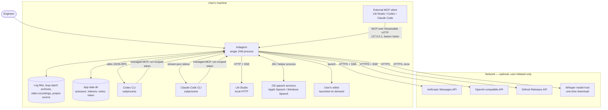

**Key.** Solid arrows are data flow; direction is who initiates. Everything inside `host` is on the
user's own machine. Every element in `net` is optional and reached only after an explicit user
action — none is contacted at startup except the GitHub release check, and only when
`autoCheckUpdates` is on in a packaged build (`Main.kt:206-208`).

Note the two inbound arrows at the bottom: when the user runs a **Codex account** or **Claude Code
account** AI profile, Indagium starts the CLI as a subprocess *and* stands up a private, run-scoped
MCP endpoint that the CLI connects back into. That loop is described in [§14.1](#141-control-server-mcp-and-rest)
and [§15.2](#152-ai-investigation-round-trip).

---

## 5. High-level component architecture

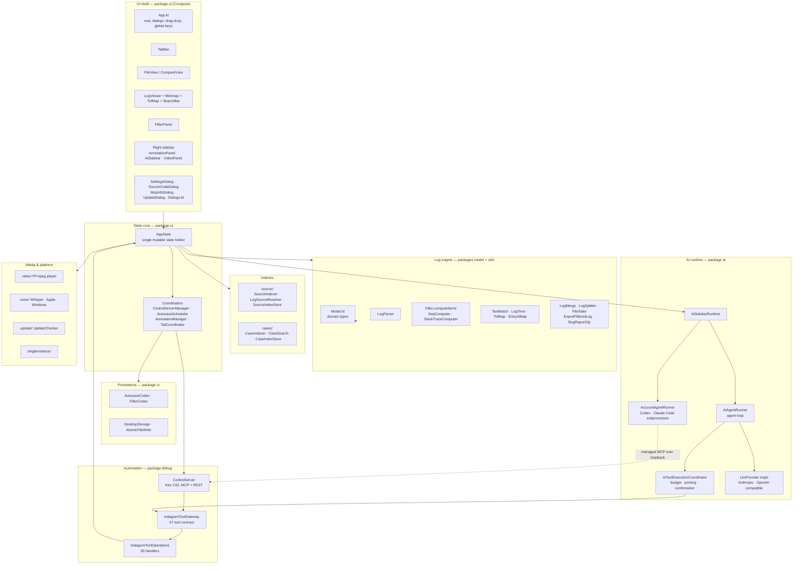

**Key.** Solid arrows are compile-time dependencies or direct calls. The single dashed arrow is a
network hop: account-based AI agents are separate OS processes, so they reach Indagium's tools over
HTTP rather than in-process.

Three things in this diagram are the load-bearing structural decisions:

1. **`AppState` is the hub.** Everything the user can change lives there, and every subsystem either
   reads it or is owned by it. There is no second source of truth.
2. **`IndagiumToolGateway` is a chokepoint.** MCP clients, REST clients, the in-app AI agent, and
   subprocess agents all reach application behaviour through the same 55-entry catalogue. See
   [§14.1](#141-control-server-mcp-and-rest).
3. **`AiToolExecutionCoordinator` sits below the model loop, not beside it.** Both the direct-API
   path and the subprocess-agent path pass through it, so the safety policy is enforced once
   (`ai/AiToolExecutionCoordinator.kt:31,37`).

---

## 6. Module boundaries

Kotlin packages are the module boundary; there is no Gradle multi-project split. The rules below are
observed in the code and enforced by convention and review rather than by tooling.

| Package | Responsibility | May depend on | Must not depend on |
|---|---|---|---|
| `model` | All domain data types. No behaviour beyond trivial accessors and custom `equals`. | Compose `Color` only | Everything else |
| `utils` | Pure log-processing algorithms: parse, filter, fold, merge, split, export, tail, match. | `model` | `ui`, `ai`, `debug`, any Compose UI |
| `source` | Source-code indexing and log-line → call-site resolution. Pure text/regex, no compiler. | `model`, `utils` | `ui`, `ai`, `debug` |
| `cases` | Similarity index over previously written analysis notes. | `model`, `utils` | `ui`, `ai`, `debug` |
| `video` | FFmpeg-backed playback and frame grabbing. | `model` | `ui` |
| `voice` | Audio capture and the three transcription backends. | — | `ui` |
| `update` | GitHub release check and asset download. | — | `ui` |
| `singleinstance` | File-lock + loopback-socket single-instance IPC. | — | Everything else |
| `debug` | Control server, tool catalogue, tool handlers, diagnostic logger. | `ui` (`AppState`), `model`, `utils`, `cases` | Compose UI composables |
| `ai` | Provider clients, agent loop, tool-execution policy, managed MCP leases. | `debug` (gateway), `model`, `ui` (`AppState`) | Compose UI composables |
| `ui` | Compose UI, `AppState`, coordinators, persistence codecs. | Everything | — |

### 6.1 Boundary properties worth preserving

- **`model` and `utils` are UI-free.** The only Compose import is `androidx.compose.ui.graphics.Color`,
  used as a colour value type in `SequenceDef`, `Highlighter`, and friends. This is what allows the
  entire log engine to be unit-tested without a Compose harness.
- **`source` and `cases` are `AppState`-free.** `SourceIndexer` is a pure function of a file list
  (`source/SourceIndexer.kt:9-11`); `CaseIndexer` is a pure function of a directory list
  (`cases/CaseIndexer.kt:9-13`). `CaseSearch` takes its note directories as a **supplier lambda**
  rather than a value, so a settings change is picked up without reconstructing the object
  (`cases/CaseSearch.kt:38-44`).
- **`debug/IndagiumToolOperations` is constructible without a server.** It takes an `AppState` and
  nothing else (`debug/IndagiumToolOperations.kt:63`), which is precisely why the in-app AI agent can
  reuse the identical tool contract without any HTTP involved.
- **UI leaf panels do not receive `AppState`.** `FilterPanel`, `LogViewer`, `AnnotationPanel`,
  `SearchBar`, `Minimap`, and `TidMapOverlay` take plain data plus callback lambdas. The binding is
  done by adapter composables — `BoundFilterPanel` (`ui/FileView.kt:32`) and the inline binding at
  `ui/FileView.kt:188-231`. See [§11.4](#114-the-bound-adapter-pattern) for the trade-off this makes.

---

## 7. Package dependency graph

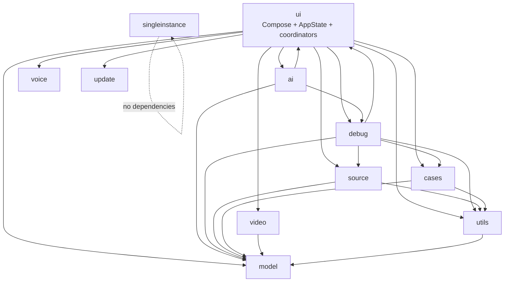

**Key.** Arrows point from dependant to dependency.

**The one cycle.** `ui ↔ ai` and `ui ↔ debug` are genuine bidirectional dependencies, not diagram
artifacts. `debug/IndagiumToolOperations` holds an `AppState`, and `AppState` constructs
`IndagiumToolOperations(this).toolGateway` to hand to the AI runtime (`ui/AppState.kt:970-981`). This
is deliberate: the tools *are* "things the user can do", so they must reach the state that models
what the user can do. It is the main reason a Gradle module split has not been attempted — the cycle
would have to be broken with an interface extraction first. See
[risk R7](#23-known-architectural-risks-and-technical-debt).

`model` is a leaf. `utils` depends only on `model`. `singleinstance` depends on nothing in the
application at all — it runs before `AppState` exists (`Main.kt:106`).

---

## 8. Core domain model

The model is a single file, `model/Model.kt` (925 lines), containing only data types. It is split
across two diagrams below for readability.

### 8.1 The tab aggregate

`LogTab` is the aggregate root. One tab is one opened log file, and everything the user does to that
file hangs off it.

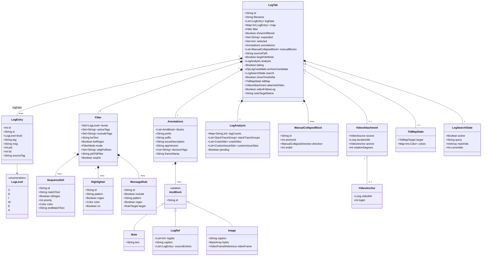

**Notes on the model that are not obvious from the shape:**

- **`rmap` is not a map.** It is an `EntryIdMap` — an `AbstractMap<Int, LogEntry>` view over
  `logData` that resolves ids by dense-index guess plus binary search (`utils/EntryIdMap.kt:9-29`).
  It is valid only because entry ids are strictly increasing in every construction path.
- **`ts` carries no date.** `LogParser` strips the `MM-DD` prefix (`utils/LogParser.kt:100`), which
  is why `LogMerge` and `LogTime` both have documented midnight-boundary caveats.
- **`sourceTag` is set only by `mergeLogs`** to badge which file a merged row came from
  (`model/Model.kt:31-35`).
- **`LogAnalysis.pending` defaults to `true`** so a freshly constructed tab reads "not analysed yet",
  never "analysed, found nothing" (`model/Model.kt:127-134`).
- **`AnnBlock.Image` overrides `equals`/`hashCode` to compare `bytes` by content**
  (`model/Model.kt:254-269`). With the default array-reference comparison, the debounced autosave in
  `ui/App.kt:102` would re-arm forever.
- **Four fields are session-only** and deliberately excluded from persistence: `selected`, `tailing`,
  `search`, `tidMap`, `videoFollowLog`, plus the derived `logData`, `rmap`, `analysis`,
  `largeFileMode`. See [§13.4](#134-what-is-persisted-and-what-is-not).

### 8.2 The view model and settings

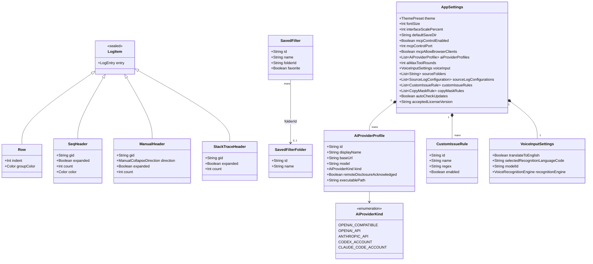

`AiProviderProfile` **has no secret field**, by design (`model/Model.kt:580`). Because `AppSettings`
is the only settings object serialised into the autosave, a pasted API key structurally cannot reach
disk. See [§18.4](#184-ai-provider-credentials).

`LogItem` is the render model — the output of the filter pipeline and the input to the `LazyColumn`.
It is never persisted and never leaves the process.

---

## 9. Key packages and classes

### 9.1 `model`

| Type | File | Role |
|---|---|---|
| `LogEntry`, `LogLevel` | `model/Model.kt:10,23` | One parsed log line |
| `LogTab` | `model/Model.kt:463` | Aggregate root: one open file and all state attached to it |
| `Filter` | `model/Model.kt:154` | The complete filter specification, 18 fields |
| `Annotations`, `AnnBlock` | `model/Model.kt:276,201` | The note document attached to a tab |
| `LogAnalysis`, `CrashSite`, `IssueSite` | `model/Model.kt:116,78,73` | Crash/ANR/custom-issue detection results |
| `LogItem` | `model/Model.kt:882` | Render model produced by `computeItems` |
| `AppSettings`, `ThemePreset` | `model/Model.kt:704,835` | All persisted preferences; 20 themes |

### 9.2 `utils` — the log engine

| File | Role |
|---|---|
| `LogParser.kt` | Parses four logcat formats (`threadtime`, `time`, `brief`, `bare`), per line. Fast path at `:127`, regex fallback chain, tag interning, `RAW` for unrecognised lines |
| `Filter.kt` | `passesFilter` (`:13`), `visibleEntries` (`:132`), `computeItems` (`:301`), `buildMd` (`:700`). The largest single algorithm in the app |
| `SeqComputer.kt` | `computeSeqGroups` (`:79`) — O(n·d) sequence detection with one level of nesting |
| `StackTraceComputer.kt` | Always-on stack folding (`:115`), crash sites (`:189`), custom issue sites (`:212`) |
| `TextMatch.kt` | Shared regex infrastructure: bounded LRU cache, backtracking deadline, `visibleLogLineText` as the single definition of "what the row shows" |
| `EntryIdMap.kt` | Memory-free id → entry lookup view |
| `LogTime.kt` | Allocation-free `HH:MM:SS.mmm` parsing, delta formatting, midnight-rollover correction |
| `TidMap.kt` | Pure core of the thread-map gutter overlay |
| `LogMerge.kt` / `LogSplitter.kt` | Time-ordered merge of multiple files; byte-exact split of one huge file |
| `FileTailer.kt` | Polling tailer with a `WatchService` hint, capped reads, rotation handling |
| `ExportFilteredLog.kt` / `AnnotationExport.kt` / `AnnotationHtml.kt` | TXT/CSV export; annotation image naming; HTML clipboard flavour |
| `BugReportZip.kt` | `.zip`/`.7z` scanning with entry-size and entry-count budgets |
| `AtomicFileWrite.kt` | `writeFileAtomically` — temp file in the destination directory, then `ATOMIC_MOVE` |
| `ImageDownscale.kt` | Hard 1280 px / 400 KB cap on annotation images |
| `Ids.kt` | Process-wide id factory: timestamp + `AtomicLong` counter |

### 9.3 `ui`

| File | Role |
|---|---|
| `AppState.kt` | 6,137 lines. The application's entire mutable state and most of its behaviour. See [§11](#11-state-management) |
| `App.kt` | Root composable: layout routing, all dialogs, drag-and-drop, global key handling, the autosave debounce |
| `FileView.kt` / `CompareView.kt` | Single-tab and two-tab layouts; the `Bound*` adapters |
| `LogViewer.kt` | The log list: `LazyColumn`, horizontal scroll, selection, drag-select, the Original/Filtered split |
| `FilterPanel.kt` | Left sidebar: levels, tags, message rules, highlighters, sequences, collapsed ranges, saved filters |
| `AnnotationPanel.kt` / `AnnotationManager.kt` | Notes UI and the block-model mutations behind it |
| `AiSidebar.kt` | AI panel plus the right-sidebar container that stacks Video / Notes / AI |
| `AutosaveCodec.kt` / `AutosaveScheduler.kt` / `FilterCodec.kt` / `DesktopStorage.kt` | Persistence: encoding, scheduling, the saved-filter library format, path resolution |
| `ControlServerManager.kt` | Control-server lifecycle with a generation-counter race guard |
| `TailCoordinator.kt` | Per-tab live tailing and debounced re-analysis |
| `Components.kt` / `Theme.kt` / `Shortcuts.kt` | Shared widgets, 20 theme palettes, the keyboard-shortcut catalogue |

### 9.4 `debug` — automation

| File | Role |
|---|---|
| `ControlServer.kt` | Ktor CIO server; the 55-entry `MCP_TOOLS` catalogue (`:666`); 50 `REST_ROUTES` (`:1240`); auth, CORS, session reaping |
| `IndagiumToolGateway.kt` | Joins catalogue to handlers, enforces parity, defines the confirmation policy, derives OpenAI function definitions |
| `IndagiumToolOperations.kt` | The 55 handler lambdas (`:66-195`) — the actual behaviour behind every tool |
| `Json.kt` | Hand-rolled JSON encode/decode for flat DTOs |
| `AppLogger.kt` | Opt-in diagnostic log, written in Android threadtime grammar so Indagium can open its own log |

### 9.5 `ai`

| File | Role |
|---|---|
| `LlmProvider.kt` | The provider interface and its streaming event model |
| `AnthropicMessagesProvider.kt` / `OpenAiCompatibleProvider.kt` | The two HTTP providers |
| `ClaudeCodeClient.kt` / `CodexAppServerClient.kt` | Subprocess drivers (stream-json; stdio JSON-RPC) |
| `AccountAgentRunner.kt` | Orchestrates a subprocess agent run, including its managed MCP lease |
| `AiAgentRunner.kt` | The agent loop (`runLoop`, `:277`), session and run model |
| `AiToolExecutionCoordinator.kt` | The single safety policy point under both agent paths |
| `AiToolCallBudget.kt` | Per-run tool-call budget; notes writes are unlimited by design |
| `AiSidebarRuntime.kt` | Bridges UI to runner; provider selection; debounced UI updates |
| `AiInvestigation.kt` | Quick-action prompts, context pinning, evidence extraction |
| `ManagedMcpServerLease.kt` / `ManagedMcpRunRegistry.kt` | Per-run loopback MCP endpoint and its token registry |

### 9.6 `source`, `cases`, and platform packages

| File | Role |
|---|---|
| `source/SourceIndexer.kt` | Builds the call-site index by text scanning and brace matching — no compiler, no parser dependency |
| `source/LogSourceResolver.kt` | Maps `(tag, msg)` back to call sites with confidence ranking |
| `source/SourceIndexStore.kt` | On-disk index, format `indagium-source-index-v1` (a load also accepts the legacy `openLog2-source-index-v1` magic), schema version 9 |
| `source/SourceStructureParser.kt` | Declaration scanner for the read-only source-navigation tools |
| `cases/CaseIndexer.kt` / `CaseSearch.kt` / `CaseIndexStore.kt` | Similarity index over previously written notes; idf-lite scoring with tag boost and stale-version penalty |
| `video/VideoPlayerController.kt` | FFmpeg decode loop on a dedicated thread, audio via `javax.sound.sampled` |
| `voice/VoiceInputController.kt` + backends | Dictation state machine; Whisper JNI, Apple Speech JNI, Windows helper process |
| `update/UpdateChecker.kt` | GitHub Releases API, per-OS asset selection, streamed download to a `.part` file |
| `singleinstance/SingleInstance.kt` | File lock plus loopback socket; forwards file arguments to the running instance |

---

## 10. Data flow: the render pipeline

This is the path every log line takes from disk to screen. It is the hottest code in the
application and the most heavily optimised.

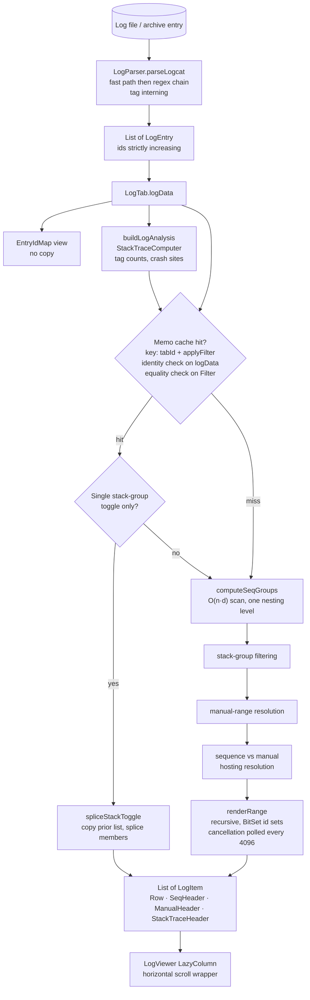

**Key.** Diamonds are decisions taken inside `computeItems` (`utils/Filter.kt:301`).

### 10.1 Stage notes

**Parsing** (`utils/LogParser.kt`). Format detection is **per line, not per file** — a capture that
mixes formats parses correctly. `parseThreadtimeFast` (`:127`) is a hand-rolled scanner for the
dominant format, tried before the regex chain; it is a strict subset that falls back safely. Tags are
interned through a `HashMap` (`:49-51`) to collapse millions of duplicate strings. Lines that match
nothing become `tag = "RAW"` rather than being dropped (`:85`).

**Analysis** is decoupled from parsing. `openFileInternal` publishes the tab with
`pendingAnalysis(logData)` as soon as parsing completes (`ui/AppState.kt:4578-4589`) and only then
runs the expensive `buildLogAnalysis` in the same job (`:4593-4598`). The user sees rows immediately;
crash markers appear a moment later.

**Filtering semantics** (`utils/Filter.kt:32-131`) are, in order: exclusions first, then positive
selectors OR-ed with the base tag filter, then the tag-or-keyword filter. Only `TAGS`-mode message
rules are active — `KEYWORD`-mode rules are preserved for old autosave data and ignored
(`utils/Filter.kt:8-12`).

**Memoisation** (`utils/Filter.kt:159-192`) keys on `"$tabId#$applyFilter"` in a
`ConcurrentHashMap`. Invalidation uses **identity** checks on `logData` and
`analysis.stackTraceGroups` plus **equality** on `Filter` (`:319-323`). A result truncated by a regex
timeout is deliberately *not* cached (`:330-334`).

**The splice fast path** (`utils/Filter.kt:194`) exists because expanding one stack-trace group used
to re-materialise the entire item list. It copies the cached list and splices the member rows in or
out; returning `null` falls back to a full rebuild.

**Cancellation** is covered in [§12.3](#123-cancellation-of-computeitems).

---

## 11. State management

### 11.1 `AppState` is a plain class

`AppState` (`ui/AppState.kt`) is not a ViewModel, not a store, and not managed by any DI container.
It is a plain Kotlin class, instantiated exactly once in `Main.kt:110`, whose fields are all Compose
`mutableStateOf`. Reading a field inside a composable subscribes that composable to it; writing it
schedules recomposition.

Every external dependency is a constructor parameter with a production default
(`ui/AppState.kt:892-953`): the parser function, each storage directory, size budgets, the
control-server factory, the directory picker, the update checker, the video-controller factory. This
is the project's dependency-injection mechanism and its test seam ([D4](#d4--testability-without-a-compose-harness)).

### 11.2 The `stateLock` invariant

> **Every read-modify-write of the `tabs` list goes through `synchronized(stateLock)`.**

`stateLock` is a plain monitor object (`ui/AppState.kt:1276`). The guarded mutators are:

| Function | Line | Purpose |
|---|---|---|
| `upTab(tabId) { LogTab -> LogTab }` | `ui/AppState.kt:1884` | The universal tab mutator |
| `upFlt(tabId) { Filter -> Filter }` | `ui/AppState.kt:1904` → `:1918` | Filter mutation; also demotes an active preset to a draft |
| `upAnn(tabId) { ... }` | `ui/AppState.kt:5436` | Annotation mutation |

The lock is **reentrant** by design — `upFlt` calls `upTab` inside its own `synchronized` block so
that the before-state read, the mutation, and the draft-tracking write cannot be interleaved by a
concurrent tail flush (`ui/AppState.kt:1913-1917`). The same applies to `closeTabsById`,
`reorderTabs`, the loading counters, `publishSourceIndex`, the source-index merge, `resolveLogSource`,
and `restoreTabsFromAutosave`.

Why a lock at all, when Compose snapshot state is thread-safe? Because snapshot safety protects a
*single* field write, not a read-modify-write across several fields. `tabs = tabs.map { ... }` is
three operations, and the control server, the tailer, and the UI can all issue one concurrently.

**Lock ordering rule.** `AutosaveScheduler` uses two locks of its own and is documented as never
holding either while `stateLock` is held (`ui/AutosaveScheduler.kt:44-47`). This is the only
lock-ordering constraint in the system, and it is what keeps a slow disk write from blocking the UI.

### 11.3 Delegation to coordinators

`AppState` delegates five bounded responsibilities:

| Coordinator | Constructed | Owns |
|---|---|---|
| `ControlServerManager` | `ui/AppState.kt:1280` | Control-server start/stop, port changes, token rotation, the generation-counter race guard |
| `AutosaveScheduler` | `ui/AppState.kt:1290` | *When* an autosave write happens; not *what* is written |
| `AnnotationManager` | `ui/AppState.kt:1295` | The annotation block model: add, update, move, reorder, remove |
| `TailCoordinator` | `ui/AppState.kt:1306` | Per-tab `FileTailer` jobs and debounced re-analysis |
| `AiSidebarRuntime` + `AiSessionRegistry` | `ui/AppState.kt:970-981` | AI runs, sessions, provider selection |

Per-tab `VideoPlayerController` instances live in a `ConcurrentHashMap` (`ui/AppState.kt:1338`) with
an injected factory. `VoiceInputController` is the exception — it is created in the composable
(`ui/AiSidebar.kt:328-330`), not on `AppState`, because it is bound to the lifetime of the AI panel.

### 11.4 The `Bound*` adapter pattern

Leaf panels do not receive `AppState`. `FilterPanel` takes plain data and roughly ninety callback
lambdas, wired by `BoundFilterPanel` (`ui/FileView.kt:32-131`); `LogViewer` is bound inline at
`ui/FileView.kt:188-231`.

**The benefit** is that the entire log-viewing UI can be composed in a test or a preview with fake
data, and the panels have no way to reach state they were not given.

**The cost** is a ~100-line adapter per panel that must be edited every time a panel gains a control.
This is a real maintenance tax and is listed as [risk R8](#23-known-architectural-risks-and-technical-debt).

### 11.5 Cross-panel navigation

Panels never call each other. When the notes panel needs the log view to scroll to a line, it sets a
request object carrying a nonce on `AppState`, and the log view consumes it:

- `pendingAnnotationNavigation` / `consumeAnnotationNavigation` (`ui/AppState.kt:1424`, `:2824`)
- `pendingSearchNavigation` / `consumeSearchNavigation` (`ui/AppState.kt:1429`, `:2828`)
- `FilterSearchRequest` (`ui/FileView.kt:17-29`, produced in `ui/App.kt:221-228`)

The nonce is what makes "navigate to the same line twice in a row" work — without it the second
request would be equal to the first and would not trigger recomposition.

---

## 12. Threading and concurrency model

### 12.1 Scopes and dispatchers

| Scope / dispatcher | Where | Used for |
|---|---|---|
| `ioScope = CoroutineScope(SupervisorJob() + Dispatchers.IO)` | `ui/AppState.kt:1264-1265` | The application's single IO scope: file loads, autosave writes, tailing, source indexing, control-server start, search recompute |
| `Dispatchers.Default` | `ui/LogViewer.kt:308`, `ui/AppState.kt:2914`, `ui/Minimap.kt:453`, `ui/TidMap.kt:130` | CPU-bound work: `computeItems` for large files, minimap rendering, TID colouring, custom-issue scanning |
| `CoroutineScope(SupervisorJob() + Dispatchers.Default)` | `ai/AiSidebarRuntime.kt:62` | AI runtime |
| `CoroutineScope(SupervisorJob() + Dispatchers.IO)` | `ai/AccountAgentRunner.kt:29` | Subprocess agent runs |
| Ktor CIO request coroutines | `debug/ControlServer.kt` | Tool invocations from external clients |

`SupervisorJob` throughout means one failed file load cannot cancel the scope and take every other
load with it. `ioJob.cancel()` in `AppState.close()` cancels every tailer for free
(`ui/AppState.kt:1303-1306`).

### 12.2 Dedicated threads

Three subsystems need a real thread rather than a coroutine, because they block indefinitely on
native or IO calls:

| Thread | Where | Why |
|---|---|---|
| `indagium-video-decode` | `video/VideoPlayerController.kt:442` | FFmpeg decode loop with frame pacing |
| `indagium-voice-capture` | `voice/VoiceCapture.kt:88` | Blocking `TargetDataLine` reads |
| Single-instance accept loop | `singleinstance/SingleInstance.kt:178` | Blocking `ServerSocket.accept()` |

There are no `Executors` and no `kotlinx.coroutines.sync.Mutex` anywhere in `desktopMain`.

### 12.3 Cancellation of `computeItems`

`computeItems` and `computeSeqGroups` are **not** suspend functions. They are called from the
synchronous small-file render path, from the control server's `get_visible_lines` route, and from
every test — none of which has a `CoroutineScope` (`utils/Filter.kt:277-284`).

Cancellation is therefore a caller-supplied hook rather than coroutine cancellation:

```kotlin
fun interface CancellationCheck { operator fun invoke() }   // utils/Filter.kt:285
internal const val CANCELLATION_CHECK_INTERVAL = 4096       // utils/Filter.kt:297
```

The hook is polled at two checkpoints: `renderRange`'s main loop (re-entered with its own counter at
each recursion level) and `SeqScan`'s O(n·d) scan (`utils/SeqComputer.kt:36-39`). The only production
opt-in is `ui/LogViewer.kt:314`, which passes `{ ensureActive() }` from inside an
`async(Dispatchers.Default)` in the large-file branch — so when a newer filter change lands, the
`LaunchedEffect` keys cancel the surrounding scope and the in-flight computation stops within 4096
items instead of running to completion on a 10-million-line file.

`ComputeItemsCancellationTest` pins this: it asserts the checkpoint is hit at call **1** for
`computeSeqGroups` and call **2** for `renderRange`, on datasets of `CANCELLATION_CHECK_INTERVAL * 10`
rows, so an early count can only mean the loop genuinely stopped.

### 12.4 Locks

| Lock | Where | Guards |
|---|---|---|
| `stateLock` | `ui/AppState.kt:1276` | Every `tabs` read-modify-write, source-index publication, loading counters |
| `schedulingLock` | `ui/AutosaveScheduler.kt:46` | Replacing or invalidating the debounce job |
| `writerLock` (fair `ReentrantLock`) | `ui/AutosaveScheduler.kt:47` | Serialise + disk write, so all callers observe one total write order |
| `lifecycleLock` | `ui/ControlServerManager.kt` | Server start/stop |
| `ReentrantLock` | `debug/AppLogger.kt:23` | Writer configure/append/close |
| `presentationLock` | `video/VideoPlayerController.kt:472` | Frame presentation between decode and UI threads |
| `writeLock` | `ai/CodexAppServerClient.kt:302` | stdio JSON-RPC framing — two writers would interleave lines |
| `lock` | `cases/CaseSearch.kt:45` | The cached case index and its inverted indexes |

Plus atomics and concurrent collections: `AtomicLong` for id generation (`utils/Ids.kt:7`),
`AtomicInteger` generation counters, `ConcurrentHashMap` for the compute memo, the AI credential
store, active loads, video controllers, and MCP client tracking.

### 12.5 Debounce inventory

Six independent debounces exist. They are listed together because their interaction is not obvious
from any single file:

| Debounce | Interval | Where | Collapses |
|---|---|---|---|
| Content autosave | 400 ms | `ui/App.kt:102-113` | Rapid edits into one write; suppressed entirely while tailing |
| Background autosave | 150 ms | `ui/AutosaveScheduler.kt:20` | Drag bursts (panel resize) into one write |
| Search recompute | 150 ms | `ui/AppState.kt:4064` | Keystrokes in the Find bar |
| Tail re-analysis | 1500 ms | `ui/TailCoordinator.kt:128` | Continuous appends into periodic crash re-detection |
| AI UI update | 75 ms | `ai/AiSidebarRuntime.kt:281-288` | Token deltas, so Markdown is not reparsed per token |
| Loading indicator grace | 250 ms | `ui/LogViewer.kt:72` | Suppresses a flashing spinner for sub-quarter-second recomputes |

### 12.6 Threading map

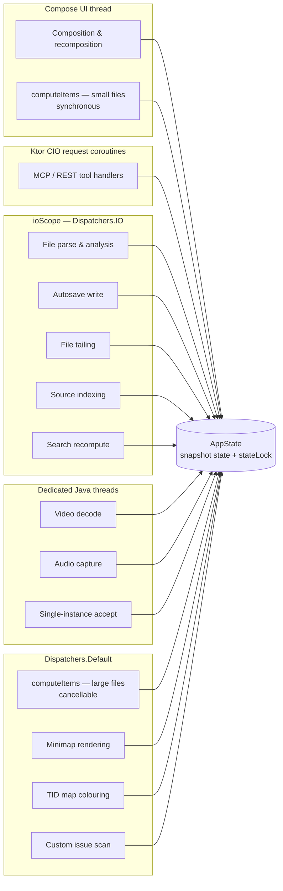

**Key.** Every arrow is a write into `AppState`. Compose `mutableStateOf` is snapshot-safe from any
thread, which is why no `withContext(Dispatchers.Main)` appears anywhere in the codebase; the
`stateLock` in §11.2 handles the compound-update case that snapshot safety does not cover.

---

## 13. Persistence architecture

### 13.1 Storage layout

Everything is a plain file under one app-data directory, resolved per OS by
`DesktopStorage.appDataDir` (`ui/DesktopStorage.kt:241-257`):

| OS | Directory |
|---|---|
| macOS | `~/Library/Application Support/Indagium` |
| Windows | `%APPDATA%\Indagium` (fallback `~/AppData/Roaming/Indagium`) |
| Other | `$XDG_STATE_HOME/Indagium` (fallback `~/.local/state/Indagium`) |

| Path | Contents | Format |
|---|---|---|
| `autosave.cache` | Session: tabs, filters, settings, saved filters, recents | `indagium-cache-v1`, line-oriented (a load also accepts the legacy `openLog2-cache-v1` magic) |
| `source-index` | Indexed `Log.*`/Timber call sites | `indagium-source-index-v1`, schema v9 (a load also accepts the legacy `openLog2-source-index-v1` magic) |
| `case-index` | Similarity index over past analysis notes | `indagium-case-index-v1`, schema v1 (a load also accepts the legacy `openLog2-case-index-v1` magic) |
| `control-token` | Bearer token for the control server | 32 hex chars, plaintext |
| `notes/` | Saved analyses: `<base>_analysis.md` + `.ann` sidecar | Markdown + token format |
| `custom-ai-commands/` | User-defined AI slash commands | One `.md` per command |
| `voice-models/` | Downloaded Whisper models | GGML binary |
| `filter-backups/` | Automatic saved-filter backups | Filter-library JSON |
| `archive-cache/` | Videos extracted from bug-report archives | Raw media, budget-enforced |
| `indagium-debug.log` | Opt-in diagnostic log | Android threadtime text |

#### 13.1.1 The pre-rename directory and the one-time migration

Before the app was renamed from openLog to Indagium, `appDataDir` produced a differently-named
directory on each OS — `DesktopStorage.legacyAppDataDir` (`ui/DesktopStorage.kt:260-264`) still knows
how to compute it, purely so the migration below can find it:

| OS | Legacy directory |
|---|---|
| macOS | `~/Library/Application Support/openLog2` |
| Windows | `%APPDATA%\openLog2` (fallback `~/AppData/Roaming/openLog2`) |
| Other | `$XDG_STATE_HOME/openLog2` (fallback `~/.local/state/openLog2`) |

`DesktopStorage.migrateAppDataDirIfNeeded` (`ui/DesktopStorage.kt:290-293`) runs in `Main.kt` before
`AppState` is constructed — and therefore before autosave restore — so a renamed build never starts
with an existing user's session invisible to it. `migrateAppDataDir` (`ui/DesktopStorage.kt:300-333`)
does the actual work, gated by a `.migrated-from-openLog2` marker file written into the *new* dir once
the run completes (or immediately if there was no legacy dir to copy from), which makes every
subsequent launch a no-op (`MigrationOutcome.AlreadyDone`):

| Entry | Copy mode | Why |
|---|---|---|
| `autosave.cache`, `notes/`, `custom-ai-commands/`, `filter-backups/`, `source-index`, `case-index` | Byte copy | User data and durable indexes worth preserving |
| `voice-models/` | Hardlink (same volume), falling back to a byte copy on any failure | Large, content-addressable, no-op for disk usage when linkable |
| `archive-cache/`, `control-token`, `single-instance.{lock,port}` | **Not migrated** | Derived/rebuildable cache, a per-install secret, and process-local coordination files, respectively — none of them is user data worth carrying forward |
| `openlog-debug.log` | **Not migrated** | Renamed away (now `indagium-debug.log`); an old diagnostic log has no continuing value |

Byte-copied data (not hardlinks) is capped at `MIGRATION_MAX_BYTES` = 2 GiB total
(`ui/DesktopStorage.kt:48`) so a pathological amount of legacy data cannot block startup; entries that
would push the running total over the cap are skipped individually (not partially copied) and the
rest of the migration still completes and still writes the marker. The old directory is never
written to, moved, or deleted by any part of this — the migration is copy-only and one-way, so it is
always safe to delete by hand.

### 13.2 The autosave format

`autosave.cache` is line-oriented `key\tvalue`, where each value is base64-url-encoded without
padding. The first line is a magic string: a write always emits `indagium-cache-v1`, but a read also
accepts the legacy `openLog2-cache-v1` (`AUTOSAVE_MAGIC_CURRENT`/`AUTOSAVE_MAGIC_LEGACY_OPENLOG2`,
`ui/AppState.kt:552-553`) — needed because the one-time migration in §13.1.1 copies a legacy user's
`autosave.cache` forward byte-for-byte, magic string and all, so it must still load. Any other first
line aborts the whole restore (`ui/AppState.kt:5964`, written at `:6119`).

Keys are written in a fixed order — `settings`, `active`, `compare`, `saved`, `activeFilters`,
`drafts`, `transientRegex`, `recent`, `recentNotes`, `filterPanel` — followed by a bare `tabs` marker
line and then one `tab\t<token>` line per tab (`ui/AppState.kt:6118-6136`).

**Two coexisting versioning strategies:**

1. **Token records use append-last versioning.** Fields are joined with `|`, each field
   `fieldToken()`-encoded with `"~"` as the empty sentinel (`ui/AutosaveCodec.kt:287-293`). Decoders
   read positionally with `getOrNull(idx)`, so a new field appended at the end simply defaults to
   absent in older files, and older readers ignore it. There is no version number on tokens — the
   append-last discipline *is* the compatibility mechanism. `tabToken` (`ui/AutosaveCodec.kt:1325`)
   shows this clearly: positions 0-8 are original, 9-12 were appended later.
2. **The settings blob is content-sniffed.** `restoreAutosaveKey` looks at the decoded text: if it
   starts with `{` it parses JSON (`settingsFromJson`, `ui/AutosaveCodec.kt:808`), otherwise it falls
   back to the legacy positional pipe format (`settingsFromToken`, `:468`). New settings go into the
   JSON form, which carries `formatVersion: 1` and keys every field by name. The legacy decoder is
   read-only and explicitly marked "never extend this positional layout again"
   (`ui/AutosaveCodec.kt:460-467`); it must stay byte-compatible with the frozen fixture in
   `AutosaveGoldenV1Test`.

### 13.3 Atomicity

All four stores write through `writeFileAtomically` (`utils/AtomicFileWrite.kt:17`): a temp file
named `.<name>.tmp-<nanoTime>` created **in the destination's own directory** so the subsequent move
stays on one filesystem, then `Files.move(..., REPLACE_EXISTING, ATOMIC_MOVE)`, with a plain-replace
fallback if the filesystem rejects atomic moves. A crash mid-write can therefore never corrupt an
existing autosave — the worst case is a stale but valid file plus an orphaned temp.

### 13.4 What is persisted and what is not

`LogTab.persistedSnapshot()` (`ui/AutosaveCodec.kt:1244`) is the field-for-field mirror of
`tabToken`, and is what the autosave `LaunchedEffect` keys on:

**Persisted:** `id`, `filename`, `sourcePath`, `filter`, `annotations`, `showAnnMd`,
`showUnfiltered`, `expanded`, `manualBlocks`, `archiveCandidate`, `showTimeDelta`, `attachedVideo`,
`noteTargetName`.

**Deliberately not persisted:** `logData` and `rmap` (re-parsed from the file), `analysis`
(recomputed), `largeFileMode` (re-derived from the file size), `selected`, `tailing`, `search`,
`tidMap`, `videoFollowLog` (session-only by product decision — `model/Model.kt:481,490,506,516`).

### 13.5 Restore is metadata-only

This is the most important property of the persistence design. `restoreTabsFromAutosave`
(`ui/AppState.kt:6025`) builds tab shells with `logData = emptyList()` under `stateLock`. Actual
parsing is *queued*, not performed, and is started by `App()` only after first composition via
`scheduleRestoredTabLoad` on `ioScope` (`:6041`).

The consequence: restoring a session with eight multi-gigabyte tabs shows the window immediately with
all filters and notes intact, and the log bodies stream in behind it. Tabs whose backing file no
longer exists are dropped during restore (`ui/AutosaveCodec.kt:1432`).

### 13.6 Notes sidecars

Saved analyses are written as `<base>_analysis.md` plus a `.ann` sidecar holding the full
`annotationsToken`. The Markdown is for humans and ticket systems; the `.ann` restores exact block
structure, including image bytes and log references, when the note is reopened. The 5th token field
carries `sourcePath` (`ui/AppState.kt:5327`), which is what lets the case index associate a note with
the log it came from.

---

## 14. External integrations

### 14.1 Control server: MCP and REST

`debug/ControlServer.kt` exposes Indagium's functionality to external programs.

| Property | Value | Evidence |
|---|---|---|
| Framework | Ktor server, CIO engine | `debug/ControlServer.kt:329` |
| Bind address | `127.0.0.1`, **hard-coded, not configurable** | `debug/ControlServer.kt:329` |
| Default port | 8991, clamped to 1..65535 | `model/Model.kt` `mcpControlPort`; `ui/AppState.kt:210-211` |
| Enabled | **Off by default** | `model/Model.kt` `mcpControlEnabled = false` |
| MCP transport | Streamable HTTP at `/mcp` | `debug/ControlServer.kt` `mcpStreamableHttp` |
| REST | 51 routes | `debug/ControlServer.kt:1240` `REST_ROUTES` |
| Auth | `Authorization: Bearer <32 hex>`, constant-time compare | `debug/ControlServer.kt:126-173` |
| CORS | Installed **only** when `mcpAllowBrowserClients` is on | `debug/ControlServer.kt:336-345` |

**The single tool contract.** This is the structural idea worth understanding. There is one
catalogue, `MCP_TOOLS` (`debug/ControlServer.kt:666`, 56 entries), and one handler map,
`operationHandlers` (`debug/IndagiumToolOperations.kt:66-195`, 56 entries). `IndagiumToolGateway`
joins them and its `init` block **fails fast if they disagree** (`debug/IndagiumToolGateway.kt:22-25`).

Four consumers are then derived from that single pair:

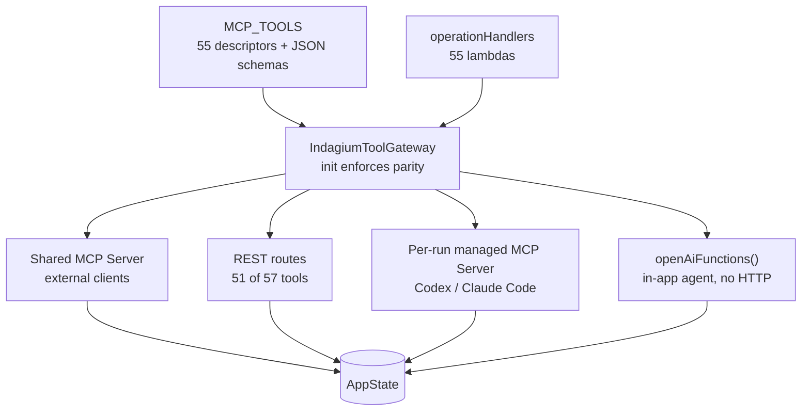

Five tools are MCP-only and have no REST route: `get_sequence_summary`, `get_project_info`,
`search_similar_cases`, `get_case`, `reindex_cases`. This is a real gap, not a rounding — REST has 51
routes against 57 tools.

Because `openAiFunctions()` serialises the *same* `ToolSchema` into OpenAI function definitions
(`debug/IndagiumToolGateway.kt:42-48`), there is no second hand-written tool catalogue anywhere. A
tool added in one place is available to every consumer, or the build fails.

**Confirmation policy** lives on the gateway, not in the UI: thirteen tools that touch files or tab
lifecycle are marked `CONFIRMATION_REQUIRED` (`debug/IndagiumToolGateway.kt:53-61`) — `open_log_file`,
`split_log_file`, `close_tab`, `export_analysis`, `export_filtered_log`, `save_annotations`,
`load_annotations`, `merge_tabs`, `start_tailing`, `stop_tailing`, `clear_all_notes`,
`reindex_sources`, `save_filter_preset`.

**Session hygiene.** MCP sessions are pinged every 120 s with a 5 s timeout, and non-responders are
closed (`debug/ControlServer.kt:312-324`) — without this, an abandoned client would hold a session
forever.

### 14.2 AI providers

Two distinct integration shapes exist, and conflating them is the most common way to misread the
`ai` package.

**Shape 1 — HTTP providers implement `LlmProvider`** (`ai/LlmProvider.kt:10`):

| Provider | Transport | Notes |
|---|---|---|
| `AnthropicMessagesProvider` | Ktor CIO, hand-rolled SSE reader | Replays thinking blocks verbatim with signatures, or the API rejects the turn |
| `OpenAiCompatibleProvider` | Ktor CIO, hand-rolled SSE reader | Opts into `stream_options.include_usage`; detects reasoning models by id pattern |

Both set `requestTimeout = 0` on the engine — CIO's 15 s default breaks local LM Studio generation,
which can legitimately take minutes.

**Shape 2 — account CLIs are subprocesses and do *not* implement `LlmProvider`:**

| Client | Transport | Command |
|---|---|---|
| `ClaudeCodeClient` | Newline-delimited JSON on stdout | `claude --print --output-format stream-json --verbose --include-partial-messages` |
| `CodexAppServerClient` | stdio JSON-RPC (JSONL), numeric request ids | `codex app-server --stdio` |

Both are driven by `AccountAgentRunner`. Indagium holds **no credential** for these — authentication
lives in the user's own CLI installation.

**How a subprocess agent reaches Indagium's tools.** It cannot call in-process, so
`ManagedMcpServerLease` starts a *second* `ControlServer` on port 0 (OS-assigned) with a run-scoped
bearer token registered in `ManagedMcpRunRegistry`. Codex receives the token via the
`INDAGIUM_MCP_TOKEN` environment variable — deliberately not on the command line, where it would be
visible in `ps`. Claude Code receives it in an `Authorization` header inside its `--mcp-config` JSON.
The lease is revoked when the run ends.

### 14.3 Video

`video/VideoPlayerController.kt` decodes with JavaCV's `FFmpegFrameGrabber` on a dedicated thread and
plays audio through `javax.sound.sampled.SourceDataLine`. Frames are downscaled to a 1280 px long
edge during decode, and a frame-drop policy discards frames more than 100 ms late, up to 15
consecutive drops.

The dependency choice is documented in `build.gradle.kts:27-33`: FFmpeg natives ship inside the jar
(no user install), decode every phone recording format including HEVC/`.mov`/WebM, and are
license-clean (Apache wrapper over an LGPL FFmpeg build). VLCJ was rejected as GPLv3, JavaFX Media
for missing HEVC/`.mov`, and GStreamer/libVLC-direct for requiring a per-OS runtime install.

### 14.4 Voice

Three transcription backends, selected per OS by `voice/VoiceRecognitionEngines.kt:14-24`:

| Backend | Mechanism | Notes |
|---|---|---|
| Whisper | `whisper-jni` with a downloaded GGML model | The only engine supporting local translation to English |
| Apple Speech | Objective-C JNI bridge, **compiled at build time** from `native/macos/indagium_speech.m` | Keeping it generated rather than committed makes the native code reviewable and lets notarisation sign the exact dylib built for the release |
| Windows Speech | Out-of-process helper, base64 PCM over the pipe | Requires an installed offline language pack |

The Whisper model is downloaded only after explicit consent, verified by SHA-256, and stored in
`voice-models/`. Recordings and transcripts are never written to disk.

### 14.5 Update checker

`update/UpdateChecker.kt` queries `api.github.com/repos/<repo>/releases/latest`, picks the asset
matching the current OS and architecture (`.dmg` / `.msi` / arch-matched `.deb`), and streams the
download to a `.part` file before an atomic move. `fetchLatest()` never throws except on
cancellation. The automatic startup check is silent on failure; only a manual check surfaces an
error.

### 14.6 Archives

`utils/BugReportZip.kt` reads `.zip` and `.7z` bug reports via Commons Compress, with explicit
budgets against decompression bombs: 500 MB per entry and 20,000 entries scanned, enforced by a
`BoundedInputStream` that raises `ArchiveBudgetExceededException`. Videos found inside an archive are
extracted to `archive-cache/` under a cache budget with unreferenced-file pruning.

### 14.7 Single instance

`singleinstance/SingleInstance.kt` takes a `FileLock` on `single-instance.lock`. The primary instance
binds an ephemeral loopback `ServerSocket` and writes `"<port> <token>"` to a port file with
owner-only POSIX permissions. A secondary instance connects, sends the token plus its file arguments,
and exits before any composition happens (`Main.kt:106`). If the lock cannot be taken *and* the
socket cannot be reached, the app runs anyway in a degraded mode rather than refusing to start.

macOS deliberately skips all of this — LaunchServices and `Desktop.setOpenFileHandler` already
provide the behaviour (`Main.kt:103-106`).

---

## 15. Sequence diagrams

### 15.1 Opening a log file (the primary flow)

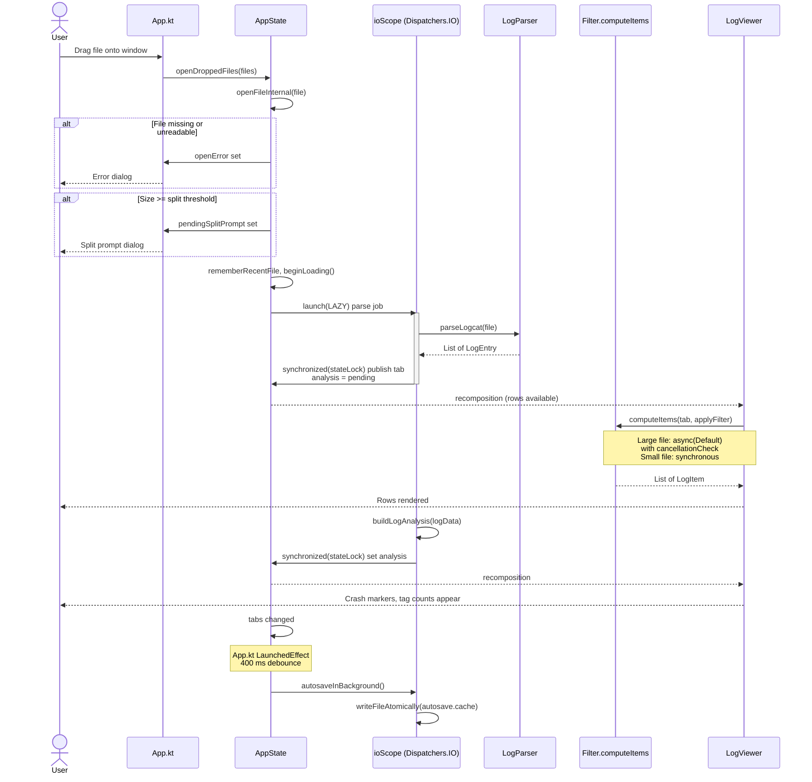

**Key.** Note the two-phase publication: rows appear as soon as parsing finishes, and the expensive
analysis fills in afterwards on the same job. This is what keeps a 2 GB file feeling responsive.

### 15.2 AI investigation round-trip

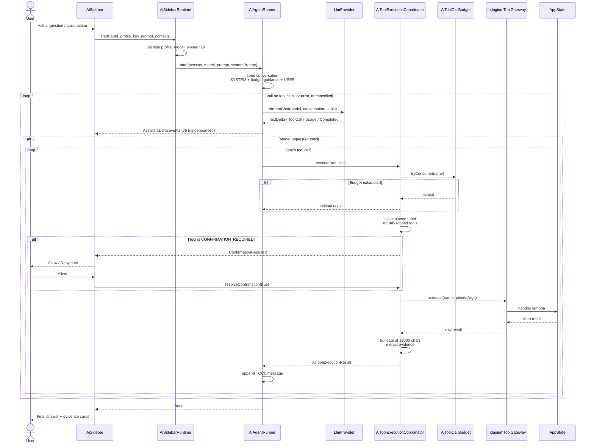

**Key.** The `Policy` participant is the point of the diagram. Budget, tab pinning, the confirmation
gate, result truncation, and evidence extraction all happen there — once — so a subprocess agent
arriving through the managed MCP path (`executeManaged`, `ai/AiToolExecutionCoordinator.kt:37`) gets
identical treatment without a second implementation.

Evidence cards are built **only** from completed gateway results, never from the model's prose
(`ai/AiInvestigation.kt:159-162`). A model that invents a line number cannot produce a clickable link
to it.

### 15.3 External MCP client invoking a tool

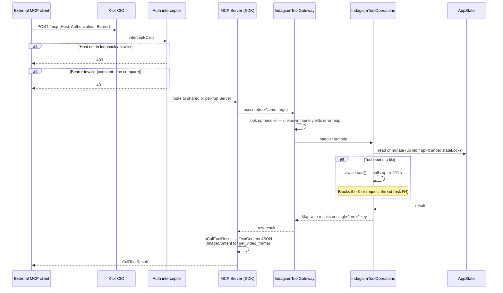

**Key.** Two independent gates run before any tool executes: the `Host` header allowlist (which
defeats DNS rebinding — a malicious page resolving its own hostname to 127.0.0.1 still sends its own
`Host`) and the constant-time bearer comparison. A managed run token is accepted for MCP but
explicitly **rejected** for REST (`debug/ControlServer.kt:420-422`).

Handlers return errors as data — a `Map` with a single `"error"` key — rather than throwing. There
are 117 such returns in `IndagiumToolOperations.kt` against 8 lines containing `try`/`catch`.

### 15.4 Autosave and session restore

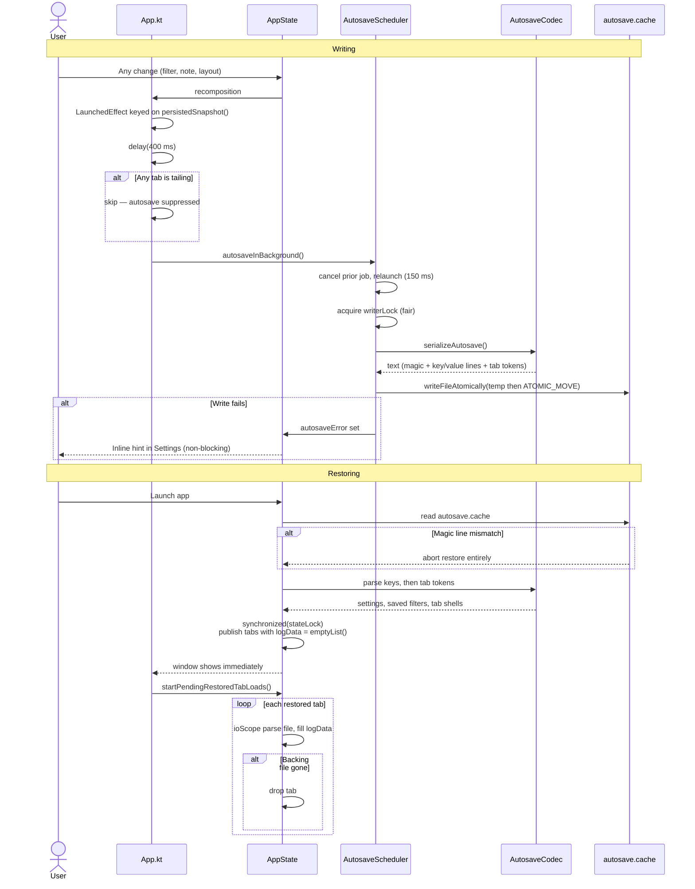

**Key.** The shutdown path differs: `Main.kt`'s `onCloseRequest` calls `autosaveNow()`, which is
**synchronous by design** (`ui/AutosaveScheduler.kt:60-65`) because the process must not exit before
the write lands.

---

## 16. AI run lifecycle

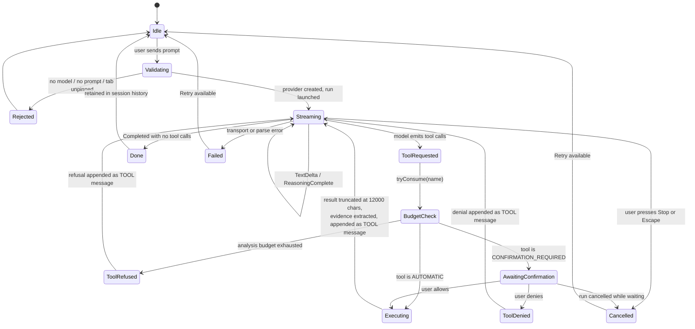

**Key.** Notes and annotation tools do not consume budget (`ai/AiToolCallBudget.kt:74-82`), so the
`BudgetCheck → ToolRefused` edge is unreachable for them. This is deliberate: an agent that has spent
its analysis allowance must still be able to write up what it found.

`Cancelled` is reachable from `AwaitingConfirmation` because a `finally` block cancels every pending
confirmation deferred when the run ends (`ai/AiAgentRunner.kt:256`) — otherwise Stop would hang on a
card nobody was going to click.

Conversations exist only for the current launch. `AiSession` is deliberately not part of `LogTab` or
`AppState`'s persisted surface (`ai/AiAgentRunner.kt:19-22`), so no autosave or export path can
retain one.

---

## 17. Error handling and resilience

### 17.1 The governing idioms

**Cancellation is rethrown; everything else becomes an event.** The recurring pattern across the AI
and IO layers:

```kotlin
catch (cancelled: CancellationException) { throw cancelled }
catch (_: Exception) { emit(Error(...)) }
```

Getting this backwards would convert a user pressing Stop into a spurious error card. Examples:
`ai/AnthropicMessagesProvider.kt:130-134`, `ai/OpenAiCompatibleProvider.kt:130-136`,
`ai/AiToolExecutionCoordinator.kt:92-96`, `ai/ClaudeCodeClient.kt:238-247`.

**`runCatching` for best-effort work.** Every AWT/Desktop call, filesystem probe, reflection hack, and
cleanup path is wrapped. `Main.kt` alone has four in its first 120 lines.

**Errors as data at the tool boundary.** Tool handlers return a `Map` with an `"error"` key rather
than throwing, so the transport layer never has to translate exceptions into protocol errors.

**`SupervisorJob` everywhere.** One failed file load cannot cancel `ioScope` and abort the other
seven tabs still loading.

### 17.2 Failure surfaces

There is **no global exception handler and no crash dialog**. Each failure has a designated surface,
chosen by how much it should interrupt the user:

| Failure | State field | Surface |
|---|---|---|
| Cannot open file | `openError` | Modal dialog (`ui/App.kt:1841-1878`) |
| Filter import failed | `importError` | Modal dialog |
| Filter rename collision | `filterRenameError` | Inline in the rename dialog |
| Autosave write failed | `AutosaveScheduler.autosaveError` | **Inline hint in Settings** — deliberately non-blocking |
| Control server bind failed | `mcpControlError` | Inline in Settings; a failed *persisted* enable auto-reverts the toggle so it cannot crash-loop (`ui/ControlServerManager.kt:137-140`) |
| Diagnostic logging misconfigured | `debugLoggingError` | Inline in Settings, with a retry action |
| Reset app data failed | `resetAppDataError` | Inline in the confirm dialog |
| Update check failed | `updateCheckStatus = Failed` | Text in Settings; **silent** for the automatic startup check |
| Video decode failed | `VideoPlayerController.error`, `FailedVideoPlayerController` | Message in the video panel |
| Load appears hung | `isLoading` + `loadingStatus` | `StuckLoadingDialog` after a delay, offering Cancel loading / Close all tabs / Clear cache / Keep waiting |

The stuck-loading watchdog (`ui/App.kt:281-307`) deserves note: it is the escape hatch for the case
the architecture cannot otherwise recover from — a parse of a pathological file that is technically
progressing but will not finish in useful time.

### 17.3 Resilience in the stores

Every on-disk index degrades to "rebuild" rather than failing:

- Missing file, empty file, wrong magic string, or version mismatch → `null` → full rebuild.
  (`source/SourceIndexStore.kt:133-136`, `cases/CaseIndexStore.kt:112-115`.)
- Each individual line is parsed under its own `runCatching`, so one corrupted record does not
  invalidate the whole file (`source/SourceIndexStore.kt:95`, `cases/CaseIndexStore.kt:88`).
- The autosave is the exception: a wrong magic line aborts the entire restore
  (`ui/AppState.kt:5964`), because a partially restored session is worse than a clean one.

---

## 18. Security considerations

Indagium processes files that frequently contain production data, and it optionally opens a local
network port and runs external programs. This section states each control **and its residual risk**.

### 18.1 Trust boundaries

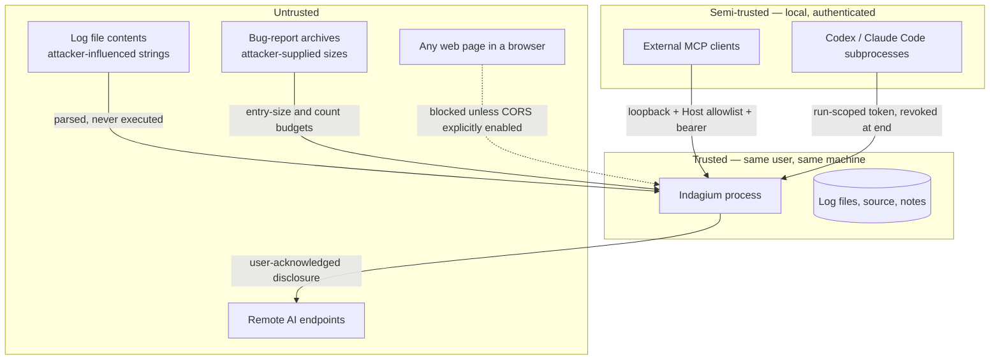

### 18.2 Control-server exposure

| Control | Implementation | Residual risk |
|---|---|---|
| Off by default | `mcpControlEnabled = false` | A user who enables it and forgets leaves it running |
| Loopback bind | `host = "127.0.0.1"`, hard-coded | None from the network; **any local process** can attempt to connect |
| `Host` header allowlist | `{127.0.0.1, localhost, [::1], ::1}` → 403 otherwise | Defeats DNS rebinding, not a local attacker |
| Bearer token | 16 random bytes from `SecureRandom`, hex, compared with `MessageDigest.isEqual` | **Stored in plaintext** at `<appDataDir>/control-token`; owner-only permissions are best-effort and a no-op on Windows. Any process running as the user can read it |
| CORS opt-in | `install(CORS)` only when `mcpAllowBrowserClients` | When enabled, any browser page can reach the port subject to the token |
| Session reaping | 120 s ping, 5 s timeout | Bounded resource leak, not eliminated |

**Deliberate non-control: there is no path sandbox.** `invalidPath` rejects only blank paths and
paths containing NUL (`debug/ControlServer.kt:175-179`). An authenticated client can ask Indagium to
open any file the user can read. This is documented as intentional — opening arbitrary local log
files is the tool's entire purpose — but it means **the bearer token is the only thing standing
between a local process and a file-read primitive**. Treat the token as a credential.

### 18.3 Regular-expression denial of service

Users and AI agents both supply regexes that run against millions of lines. Three controls in
`utils/TextMatch.kt`:

| Control | Value | Purpose |
|---|---|---|
| Per-match deadline | 100 ms | `DeadlineCharSequence` throws from `charAt()` every 1024 calls past the deadline, aborting catastrophic backtracking |
| Per-operation timeout budget | 3 | After three timed-out patterns, all regex is abandoned for the rest of the operation |
| Regex cache | LRU, 256 entries | Bounds memory from an attacker (or agent) supplying unbounded distinct patterns |

A timed-out result is never memoised (`utils/Filter.kt:330-334`), so the user is not stuck with a
silently truncated view.

### 18.4 AI provider credentials

API keys live in `AppState.aiProviderApiKeys`, a `ConcurrentHashMap` (`ui/AppState.kt:966`). The
protection is **structural, not procedural**: `AppSettings` is the only settings object serialised
into `autosave.cache`, and `AiProviderProfile` has no secret field. A key therefore has no path to
disk, to an export, or to a note.

Keys are cleared on profile delete and on `AppState.close()`. They are lost on restart by design.

| Residual risk | Note |
|---|---|
| Keys are in process memory unencrypted | A heap dump or a debugger attached to the process exposes them. No OS keychain integration exists |
| Plain-HTTP endpoints are permitted | Only after the user acknowledges `REMOTE_DISCLOSURE_REQUIRED` (`ai/AiProviderProfileSupport.kt:13`); loopback hosts bypass the gate. The key travels unencrypted if the user accepts |

### 18.5 Subprocess agent containment

| Control | Implementation |
|---|---|
| Claude Code built-in tools disabled | Launched with `--tools ""`, `--strict-mcp-config`, `--permission-mode bypassPermissions` (`ai/ClaudeCodeClient.kt:339-343`) — the agent can reach *only* the managed MCP endpoint |
| Codex user MCP servers disabled | Generated config disables servers from `~/.codex/config.toml` per launch |
| Codex sandbox | `approvalPolicy = "never"`, `sandbox = "read-only"`, `ephemeral = true` |
| Fresh workspace | Each run gets a temp directory, deleted afterwards |
| Token off the command line | Passed via `INDAGIUM_MCP_TOKEN` env var, not argv where `ps` would show it |
| Elicitation filtering | Only `indagium`-server elicitations and MCP tool-call approvals are accepted; everything else is declined |
| stderr redaction | `ProcessDiagnosticTail` strips `bearer …` and `api_key|token|secret|password|authorization = …` before any diagnostic surface can show it |

The account agents receive no source-folder access and no application workspace access; all log and
source evidence reaches them only through Indagium tools.

### 18.6 Log redaction

`AppLogger.safeText` (`debug/AppLogger.kt:108-116`) strips CR/LF/TAB, replaces
`api_key|token|secret|password|authorization` values with `[REDACTED]`, replaces Windows `C:\…` and
POSIX `/…` paths with `[PATH]`, and truncates at 2,000 characters. Diagnostic logging is off by
default. The log is written in Android threadtime grammar so it can be opened in Indagium itself —
a small but genuinely useful design touch.

### 18.7 Archive handling

500 MB per entry and 20,000 entries scanned, enforced by a `BoundedInputStream` that raises
`ArchiveBudgetExceededException` (`utils/BugReportZip.kt:19-35`). This is a zip-bomb control. Entry
paths are used for display and extraction into a dedicated cache directory.

### 18.8 Distribution

The macOS build is **unsigned and un-notarised** — there is no Apple Developer certificate in CI. The
README documents the Gatekeeper workaround. Residual risk: users are instructed to bypass a security
control (`xattr -cr`), which is a habit that generalises badly. Signing is the fix.

---

## 19. Performance and scalability

Performance is an architectural concern here, not a tuning detail: the target file sizes are large
enough that a naive implementation does not merely run slowly, it exhausts heap.

### 19.1 Memory strategy

| Technique | Where | Saving |
|---|---|---|
| `EntryIdMap` as an `AbstractMap` view | `utils/EntryIdMap.kt:9` | ~70 bytes/entry — roughly 700 MB at 10M entries |
| Tag interning during parse | `utils/LogParser.kt:49-51` | Collapses millions of duplicate tag strings to one instance each |
| `BitSet` id sets in `computeItems` | `utils/Filter.kt:145` | ~1 bit/entry versus ~50 bytes for a boxed `HashSet<Int>` |
| Annotation image cap | `utils/ImageDownscale.kt` | 1280 px / 400 KB hard limit — images round-trip through autosave on every debounced edit |
| Streamed export | `utils/ExportFilteredLog.kt:39-44` | Row-by-row through the writer instead of building one giant `String` |
| Capped tail reads | `utils/FileTailer.kt:19` | 4 MiB per poll, with a widen-once fallback for an over-long line |

### 19.2 CPU strategy

| Technique | Where |
|---|---|
| Hand-rolled fast path before the regex chain | `utils/LogParser.kt:127` |
| Sequential parsing (a parallel version benchmarked ~1.7x **slower**) | `utils/LogParser.kt:36-38` |
| Full memoisation of the item list per tab | `utils/Filter.kt:159-192` |
| Splice fast path for single stack-group toggles | `utils/Filter.kt:194` |
| One O(n·d) sequence scan replacing an O(candidates²) version that "never finished" on a 10M-line file | `utils/SeqComputer.kt:10-12` |
| Allocation-free timestamp parsing (runs per visible row per recomposition) | `utils/LogTime.kt:35` |
| Pre-compiled matcher regexes bucketed by tag | `source/LogSourceResolver.kt:24-26` |
| Two O(1)/O(n) column-width bounds instead of scanning all entries | `utils/LogTime.kt:154,175` |

### 19.3 Responsiveness strategy

- **Two-phase file publication** — rows first, analysis second ([§15.1](#151-opening-a-log-file-the-primary-flow)).
- **Metadata-only session restore** — the window appears before any log body is read ([§13.5](#135-restore-is-metadata-only)).
- **Cancellable recomputation** — a superseded `computeItems` stops within 4096 items ([§12.3](#123-cancellation-of-computeitems)).
- **Large-file mode** — a per-tab flag above a size threshold that switches the viewer to the
  cancellable async path.
- **Six independent debounces** ([§12.5](#125-debounce-inventory)).

Detailed measurements and the reasoning behind several of these choices are in
[perf-large-files.md](perf-large-files.md).

---

## 20. Build, packaging and release

### 20.1 Build structure

Single Gradle project, single source set pair (`desktopMain` / `desktopTest`). Version is defined
once as `app.version` in `gradle.properties` and flows into the generated build info, the packaging
config, and the README badge.

Three generated inputs are produced at build time rather than committed:

| Generated | Task | Why |
|---|---|---|
| Build info Kotlin source | `generateBuildInfo` | Version and build metadata available to the app |
| License resources | `generateLicenseResources` | The in-app licence dialog text derives from `LICENSE` + `NOTICE`, so they cannot drift |
| `libindagium_speech.dylib` | `compileAppleSpeechNative` (macOS only) | Keeps the Objective-C reviewable in-tree and lets notarisation sign the exact dylib built for the release |

Note `kotlin.daemon.jvmargs=-Xmx4096m` in `gradle.properties`: the Compose compiler's IR-to-bytecode
transform runs the Kotlin daemon out of its default heap on `SettingsDialog.kt`'s single large
composable. That is a build-level symptom of a code-level issue — see
[risk R9](#23-known-architectural-risks-and-technical-debt).

### 20.2 Native artifact strategy

`bytedecoPlatform` (`build.gradle.kts:43-58`) resolves one native classifier from the machine running
Gradle: `macosx-arm64`, `macosx-x86_64`, `windows-x86_64`, `linux-arm64`, or `linux-x86_64`. Each
installer therefore bundles only its own OS's natives, matching how `compose.desktop.currentOs` and
jpackage already behave. Using `ffmpeg-platform` instead would put every OS's natives into every
installer.

JavaCV's POM declares eleven unused native libraries (OpenCV, Tesseract, OpenBLAS, RealSense,
FlyCapture and others) as non-optional dependencies; all are excluded, and FFmpeg is re-added as an
explicit classifier pair.

### 20.3 Dependency locking

Locking is applied to the four desktop configurations only. Two module patterns are excluded:
`org.jetbrains.compose.desktop:desktop-jvm-*` and `org.jetbrains.skiko:skiko-awt-runtime-*`, because
these resolve to a **different module name** per OS and a single shared lock file cannot express
"either this artifact or that one" — locking one platform's artifact makes the lock unsatisfiable on
every other platform. The comment records that this broke the Linux CI build once.

The bytedeco artifacts are *not* excluded despite also varying per platform, because bytedeco
publishes one module with per-platform **classifiers**, and Gradle's lock file is keyed at the module
level.

### 20.4 Quality gates

| Gate | Configuration |
|---|---|
| detekt | `buildUponDefaultConfig`, **baselined not ignored** — pre-existing findings are suppressed, any new finding fails the build |
| ktlint | Verbose, HTML + Checkstyle reports, generated sources excluded |
| kover | Pure Compose UI classes excluded from coverage as untestable without a Compose harness |

The detekt choice is the notable one: `ignoreFailures` would make findings invisible to every build;
a baseline keeps existing debt quiet while catching new debt.

### 20.5 Release

Pushing a `v*.*.*` tag triggers GitHub Actions, which builds Linux x86-64, Linux arm64, Windows, and
macOS packages and creates a GitHub Release. A manual GitLab mirror runs `.gitlab-ci.yml` on a
separate runner pool as a fallback when GitHub Actions quota is exhausted; there, Linux builds
automatically and Windows/macOS are manual jobs.

`CLAUDE.md` records a hard rule worth repeating here: when `app.version` changes, the README badge
and both `git tag` examples must change in the same commit.

---

## 21. Testing architecture

~90 test classes, ~26,000 lines, in `src/desktopTest`.

### 21.1 The seam

Constructor injection on `AppState` is what makes the suite possible. A test constructs an
`AppState` with a fake parser, temp directories, a stub control-server factory, and a fake update
checker, then exercises real application logic with no UI, no disk of consequence, and no network.
`AppStateBehaviorTest` alone is 6,658 lines — larger than `AppState` itself.

### 21.2 What is protected by dedicated tests

| Invariant | Test |
|---|---|
| Concurrent tab mutation stays consistent | `ConcurrentStateMutationTest` |
| `computeItems` stops promptly when cancelled | `ComputeItemsCancellationTest` |
| The splice fast path produces the same list as a full rebuild | `ComputeItemsSpliceTest` |
| The legacy positional autosave format still parses byte-identically | `AutosaveGoldenV1Test` |
| Autosave scheduling, debouncing, and write ordering | `AutosaveSchedulerTest` |
| Tailer offset capture, rotation, partial lines | `FileTailerTest` |
| Video frame-drop policy | `FrameDropPolicyTest` |
| MCP and REST contract behaviour | `ControlServerTest`, `ControlServerMcpTest`, `IndagiumToolGatewayTest` |
| Every AI provider's stream parsing | `AnthropicMessagesProviderTest`, `OpenAiCompatibleProviderTest`, `ClaudeCodeClientTest`, `CodexAppServerClientTest` |

`AutosaveGoldenV1Test` is the interesting one architecturally: it is a **frozen fixture** that pins
the legacy settings format. It is the reason the positional decoder cannot be deleted, and the reason
the append-last rule must be followed rather than "cleaned up".

`LargeFilePerfHarness` exists for the performance work described in §19 and is not a correctness test.

### 21.3 Coverage policy

Kover excludes `@Composable`-annotated code and the pure-rendering UI classes by name. This is an
honest exclusion rather than a coverage-number optimisation: those files are projections of
`AppState` and cannot be meaningfully unit-tested without a Compose test harness the project has
chosen not to adopt.

---

## 22. Extension points

Concrete recipes for the five changes most likely to be needed.

### 22.1 Add an MCP / automation tool

1. Add a descriptor to `MCP_TOOLS` (`debug/ControlServer.kt:666`) using the `schema(...)` DSL. Mind
   the type tokens: `"array"` means array-of-string, `"array<integer>"` means array-of-number, and
   the distinction measurably changes model behaviour (`debug/ControlServer.kt:530-539`).
2. Add a handler with the **same name** to `operationHandlers`
   (`debug/IndagiumToolOperations.kt:66`). If the names disagree, `IndagiumToolGateway`'s `init`
   throws at construction — you will find out immediately.
3. If the tool touches files or tab lifecycle, add it to `CONFIRMATION_REQUIRED_TOOLS`
   (`debug/IndagiumToolGateway.kt:53`).
4. If it should be tab-scoped for AI runs, add it to `TAB_SCOPED_TOOL_NAMES`
   (`ai/AiToolExecutionCoordinator.kt:165`) so the pinned `tabId` is injected.
5. Optionally add a REST route to `REST_ROUTES` (`debug/ControlServer.kt:1240`).
6. Document it in [mcp/AVAILABLE_METHODS.md](mcp/AVAILABLE_METHODS.md).

No change is needed for the in-app AI agent — `openAiFunctions()` derives its definition from the
same descriptor.

### 22.2 Add an AI provider

**If it speaks HTTP:** implement `LlmProvider` (`ai/LlmProvider.kt:10`), add a value to
`AiProviderKind` (`model/Model.kt:572`), and extend the factory in `AiSidebarRuntime` (`:55-60`).
Honour the contract in the interface doc: transport and parse failures become
`LlmStreamEvent.Error`; `CancellationException` propagates untouched.

**If it is a CLI:** model it on `AccountAgentRunner` rather than `LlmProvider`. It will need a
subprocess driver, a `ManagedMcpServerLease`, and a mapping from its event stream onto `AiRunEvent`.

### 22.3 Add a logcat format

Add a regex to `utils/LogParser.kt` and insert it into the detection chain in `parseLogcatLines`.
Order matters — formats are tried in sequence, and a looser pattern placed early will swallow lines a
stricter one should have claimed. Add cases to `LogParserTest`.

### 22.4 Add a persisted setting

1. Add the field to `AppSettings` (`model/Model.kt:704`) with a default.
2. Add it to `settingsJson()` and `settingsFromJson()` (`ui/AutosaveCodec.kt:550,808`), keyed by
   name.
3. **Do not touch `settingsFromToken`** — the legacy positional decoder is frozen by
   `AutosaveGoldenV1Test`.
4. If the setting belongs to a token-encoded type instead (tab, filter, annotation), **append the
   field at the end** of that token and read it with `getOrNull`. Inserting it in the middle breaks
   every existing autosave.

### 22.5 Add a theme

Add a value to `ThemePreset` (`model/Model.kt:835`) with its label, and extend `themeColors()`
(`ui/Theme.kt:178`). `PaletteTest` and `ThemePaletteTest` check palette completeness.

---

## 23. Known architectural risks and technical debt

Ranked by the cost of leaving them unaddressed. Each is a real, located issue — not a style opinion.

### R1 — `AppState` is a 6,137-line god object

`ui/AppState.kt` holds tab management, file loading, filtering, saved filters, annotations, source
indexing, video mapping, AI wiring, update checking, storage accounting, and every dialog's transient
state. It is by far the most likely file to produce a merge conflict, and the hardest to reason
about.

Mitigations already in place: five extracted coordinators (§11.3) and constructor injection. The
remaining bulk is genuinely cohesive around "the tab list", but the *peripheral* groups — update
checking, storage accounting, source-index orchestration, video mapping — are separable along the
same lines the existing coordinators follow.

**Impact:** high, and compounding. **Effort to improve:** incremental and low-risk, one coordinator
at a time.

### R2 — The legacy positional settings format cannot be removed

`settingsFromToken` (`ui/AutosaveCodec.kt:468`) decodes a positional pipe-delimited blob using index
arithmetic like `mcpIndex + N`. It is frozen by `AutosaveGoldenV1Test`. It cannot be extended and
must not be deleted while any user might still have a pre-JSON autosave.

**Impact:** medium — a permanent comprehension tax and a trap for anyone who "tidies" it.
**Mitigation:** a dated removal policy (e.g. drop it two minor versions after the JSON format
shipped), rather than carrying it indefinitely.

### R3 — Hand-rolled JSON that does not report malformed input

`debug/Json.kt` is a lenient parser: `parseNumber` falls back to `0` on garbage (`:144`) and nothing
raises on malformed input. A client sending a slightly wrong request gets silently coerced values
rather than an error.

**Impact:** medium — wrong behaviour presents as a mysterious no-op. **Mitigation:** strict-mode
parsing that returns an error result, or adopting kotlinx.serialization at this boundary now that it
is already on the classpath for the update checker.

### R4 — `awaitLoad()` blocks a Ktor request thread for up to 120 seconds

`IndagiumToolOperations.awaitLoad` (`:361`, `:371`) uses `Thread.sleep(20)` in a poll loop with a
120-second timeout, executed on the Ktor CIO request coroutine's thread. Several concurrent
`open_log_file` calls against large files can starve the server's thread pool.

**Impact:** medium — degrades an optional subsystem, does not affect the UI. **Mitigation:** make the
handlers suspend and use `withTimeout` + a completion signal instead of polling.

### R5 — The control token is the only barrier to an arbitrary-file-read primitive

By design there is no path sandbox ([§18.2](#182-control-server-exposure)). The token is stored in
plaintext with best-effort permissions that are a no-op on Windows. Any local process running as the
user can read it and then ask Indagium to read any file the user can read.

**Impact:** medium, bounded by "local process already running as you" — but worth stating explicitly
because the current documentation does not. **Mitigation:** an optional approved-roots allowlist for
the file-opening tools, off by default to preserve current behaviour.

### R6 — `stateLock` is a single coarse monitor

Every tab mutation, source-index publication, and load-counter update serialises on one object. It is
correct and simple, and at current concurrency levels it is not a measured bottleneck — but a tailing
tab flushing lines while a large `computeItems` publishes results while an MCP client mutates a
filter all contend on the same lock.

**Impact:** low today, rising with concurrent-tab tailing. **Mitigation:** measure before splitting;
per-tab locks would complicate the multi-tab operations (`closeTabsById`, `reorderTabs`, `mergeTabs`)
that currently get their atomicity for free.

### R7 — The `ui ↔ debug ↔ ai` dependency cycle

Described in [§7](#7-package-dependency-graph). It blocks a Gradle module split, which is the natural
next step for enforcing the boundaries in §6 mechanically rather than by convention.

**Impact:** low now, blocking later. **Mitigation:** extract the `AppState` surface the tools actually
use into an interface in a lower package; `IndagiumToolOperations` would depend on the interface, not
on `ui`.

### R8 — Panel binding adapters are large and hand-maintained

`BoundFilterPanel` (`ui/FileView.kt:32-131`) passes roughly ninety lambdas. Every new filter control
means editing both the panel signature and the adapter, and a missed wiring is a silent no-op rather
than a compile error.

**Impact:** low but constant friction. **Mitigation:** group related callbacks into small interfaces
(`FilterPanelActions`, `SequenceActions`) so a new control adds a method to one interface rather than
a parameter to a 90-argument call site.

### R9 — Single composables large enough to break the compiler's default heap

`SettingsDialog.kt`'s single `SettingsDialog()` composable requires `-Xmx4096m` for the Kotlin daemon
(`gradle.properties`). That is a code-size signal, not a build-configuration problem.

**Impact:** low (build-time only), but it slows every contributor's first build.
**Mitigation:** split the dialog into one composable per settings section — a mechanical change.

### R10 — Duplicated token/base64 helpers across three stores

`AutosaveCodec`, `SourceIndexStore`, and `CaseIndexStore` each implement their own `fieldToken` /
base64-url / `"~"`-sentinel encoding. `SourceIndexStore.kt:9-11` explicitly records that the
duplication exists because the originals are file-private.

**Impact:** low — three copies of a small, stable, well-tested function. **Mitigation:** promote one
copy into `utils` when any of them next needs a change.

### R11 — No global exception handler

An exception escaping a Compose composable or a raw thread terminates or corrupts that surface with
no user-visible explanation and no diagnostic record (unless opt-in logging happens to be on).

**Impact:** low frequency, high confusion when it happens. **Mitigation:** a
`Thread.setDefaultUncaughtExceptionHandler` that writes through `AppLogger` and shows a minimal
"something went wrong, diagnostics saved to …" surface.

### R12 — The macOS artifact is unsigned

Covered in [§18.8](#188-distribution). Users are instructed to run `xattr -cr`, which trains a bad
habit. **Mitigation:** an Apple Developer certificate in CI.

---

## 24. Glossary

| Term | Meaning |
|---|---|
| **Annotation / note block** | One element of a tab's analysis document: text, a log-line reference, an image, or a video frame. Modelled by `AnnBlock`. |
| **Case** | A previously written analysis note, indexed for similarity search so an engineer can find "have we seen this before?" |
| **Compute cache** | The per-tab memoisation of `computeItems` output, keyed by tab id and filter-applied flag. |
| **Confirmation-required tool** | One of thirteen automation tools that pauses for explicit user approval before executing. |
| **Highlighter** | A pattern that colours matching lines without filtering them out. |
| **Large-file mode** | A per-tab flag set above a size threshold that routes item computation onto the cancellable async path. |
| **Managed MCP lease** | A short-lived, run-scoped MCP endpoint on an OS-assigned port, created so a subprocess AI agent can call Indagium's tools. |
| **Manual collapse block** | A user-created folded range: to start, to end, or an explicit range. |
| **Message rule** | An include or exclude rule matching a line's message or PID/TID, optionally scoped to a tag or package. |
| **RAW** | The tag given to a line that matched none of the four logcat formats. Such lines are kept, never dropped. |
| **Sequence** | A user-defined start (and optional end) pattern that folds a recurring region of the log into a collapsible group. |
| **Session-only state** | State intentionally excluded from the autosave: selection, tailing, search, TID map, video-follow, and all AI conversations. |
| **Splice fast path** | An optimisation that mutates a cached item list in place for a single stack-group expand/collapse instead of rebuilding it. |
| **Threadtime** | The default Android logcat format: `MM-DD HH:MM:SS.mmm PID TID L Tag: message`. Also the format Indagium writes its own diagnostic log in. |
| **TID map** | A gutter overlay colouring rows by thread id within a chosen process. |

---

## 25. Traceability index

Where to read about a given source file.

| File or package | Sections |
|---|---|
| `Main.kt` | [2.1](#21-runtime-shape), [14.7](#147-single-instance), [15.4](#154-autosave-and-session-restore) |
| `model/Model.kt` | [8](#8-core-domain-model), [9.1](#91-model) |
| `utils/LogParser.kt` | [10](#10-data-flow-the-render-pipeline), [19.2](#192-cpu-strategy), [22.3](#223-add-a-logcat-format) |
| `utils/Filter.kt` | [10](#10-data-flow-the-render-pipeline), [12.3](#123-cancellation-of-computeitems), [19](#19-performance-and-scalability) |
| `utils/SeqComputer.kt`, `StackTraceComputer.kt` | [9.2](#92-utils--the-log-engine), [10](#10-data-flow-the-render-pipeline) |
| `utils/TextMatch.kt` | [18.3](#183-regular-expression-denial-of-service) |
| `utils/EntryIdMap.kt`, `ImageDownscale.kt`, `FileTailer.kt` | [19.1](#191-memory-strategy) |
| `utils/AtomicFileWrite.kt` | [13.3](#133-atomicity) |
| `utils/BugReportZip.kt` | [14.6](#146-archives), [18.7](#187-archive-handling) |
| `ui/AppState.kt` | [11](#11-state-management), [12](#12-threading-and-concurrency-model), [R1](#r1--appstate-is-a-6137-line-god-object) |
| `ui/App.kt`, `FileView.kt`, `CompareView.kt` | [5](#5-high-level-component-architecture), [11.4](#114-the-bound-adapter-pattern) |
| `ui/AutosaveCodec.kt`, `AutosaveScheduler.kt`, `DesktopStorage.kt` | [13](#13-persistence-architecture), [15.4](#154-autosave-and-session-restore), [22.4](#224-add-a-persisted-setting) |
| `ui/ControlServerManager.kt`, `TailCoordinator.kt`, `AnnotationManager.kt` | [11.3](#113-delegation-to-coordinators) |
| `ui/Shortcuts.kt`, `Theme.kt` | [9.3](#93-ui), [22.5](#225-add-a-theme) |
| `debug/ControlServer.kt`, `IndagiumToolGateway.kt`, `IndagiumToolOperations.kt` | [14.1](#141-control-server-mcp-and-rest), [15.3](#153-external-mcp-client-invoking-a-tool), [18.2](#182-control-server-exposure), [22.1](#221-add-an-mcp--automation-tool) |
| `debug/Json.kt` | [R3](#r3--hand-rolled-json-that-does-not-report-malformed-input) |
| `debug/AppLogger.kt` | [17](#17-error-handling-and-resilience), [18.6](#186-log-redaction) |
| `ai/` (all) | [14.2](#142-ai-providers), [15.2](#152-ai-investigation-round-trip), [16](#16-ai-run-lifecycle), [18.4](#184-ai-provider-credentials), [18.5](#185-subprocess-agent-containment), [22.2](#222-add-an-ai-provider) |
| `source/` (all) | [9.6](#96-source-cases-and-platform-packages), [13.1](#131-storage-layout) |
| `cases/` (all) | [6.1](#61-boundary-properties-worth-preserving), [9.6](#96-source-cases-and-platform-packages) |
| `video/` | [14.3](#143-video), [12.2](#122-dedicated-threads) |
| `voice/` | [14.4](#144-voice) |
| `update/` | [14.5](#145-update-checker) |
| `singleinstance/` | [14.7](#147-single-instance) |
| `build.gradle.kts` | [2.3](#23-technology-stack), [20](#20-build-packaging-and-release) |

---

## Related documents

- [USER_GUIDE.md](USER_GUIDE.md) — how to use Indagium.
- [mcp/README.md](mcp/README.md) — connecting an external MCP client.
- [mcp/AVAILABLE_METHODS.md](mcp/AVAILABLE_METHODS.md) — the tool reference.
- [mcp/ANALYSIS_PLAYBOOK.md](mcp/ANALYSIS_PLAYBOOK.md) — prompt patterns for log analysis.
- [perf-large-files.md](perf-large-files.md) — large-file performance investigation.
