# Indagium — Software Architecture & Design Document (SAAD)

> **Status:** reverse-engineered from the source tree at app version **1.8.7**.
> Every structural claim below is followed by the file (and where useful the line) that supports it.
>
> **Update (app version 1.8.9):** §26 (AI test suites) and the rows it adds to §2, §5–§7, §9, §12–§14,
> §16, §18 and §21–§25 describe the `feat/ai-test-suites` branch. The scale figures in §2.2 were
> refreshed then; other sections keep their original figures and line numbers unless they mention the
> feature.

---

## 1. About this document

### 1.1 Purpose

This document describes the architecture of Indagium **as it actually exists in the code**, not as it
was originally designed. It is written for someone who has to change the system: a maintainer adding
a feature, a reviewer judging a pull request, or a contributor deciding which package a new file
belongs in.

### 1.2 Method

The document was produced by reading `src/desktopMain`, `src/desktopTest`, `build.gradle.kts`, and
the CI configuration. It contains no aspirational architecture. Where the code carries a comment
recording *why* a decision was made, this document cites the comment's location rather than
re-arguing the point — the comment is the primary source, and it lives next to the code that would
have to change.

### 1.3 How to read the citations

A citation like `utils/Filter.kt:301` means "line 301 of
`src/desktopMain/kotlin/com/indagium/utils/Filter.kt`". Paths are relative to
`src/desktopMain/kotlin/com/indagium/` unless they begin with `src/`, `docs/`, or a repository-root
filename such as `build.gradle.kts`.

Line numbers were correct at the time of writing and will drift. Names — of classes, functions, and
constants — are the stable part of a citation; treat the line number as a hint.

### 1.4 What this document does not cover

- **UI visual design and layout details.** Which composable draws which pixel is in the code and
  changes constantly. Section 11 covers only the *structural* rules of the UI layer.
- **How to use the application.** See [USER_GUIDE.md](USER_GUIDE.md).
- **The MCP tool contract in detail.** See [mcp/AVAILABLE_METHODS.md](mcp/AVAILABLE_METHODS.md).
- **Per-function behaviour.** This is an architecture document, not an API reference.

### 1.5 Table of contents

| # | Section |
|---|---|
| 2 | [System overview](#2-system-overview) |
| 3 | [Architectural drivers and constraints](#3-architectural-drivers-and-constraints) |
| 4 | [Context and deployment](#4-context-and-deployment) |
| 5 | [High-level component architecture](#5-high-level-component-architecture) |
| 6 | [Module boundaries](#6-module-boundaries) |
| 7 | [Package dependency graph](#7-package-dependency-graph) |
| 8 | [Core domain model](#8-core-domain-model) |
| 9 | [Key packages and classes](#9-key-packages-and-classes) |
| 10 | [Data flow: the render pipeline](#10-data-flow-the-render-pipeline) |
| 11 | [State management](#11-state-management) |
| 12 | [Threading and concurrency model](#12-threading-and-concurrency-model) |
| 13 | [Persistence architecture](#13-persistence-architecture) |
| 14 | [External integrations](#14-external-integrations) |
| 15 | [Sequence diagrams](#15-sequence-diagrams) |
| 16 | [AI run lifecycle](#16-ai-run-lifecycle) |
| 17 | [Error handling and resilience](#17-error-handling-and-resilience) |
| 18 | [Security considerations](#18-security-considerations) |
| 19 | [Performance and scalability](#19-performance-and-scalability) |
| 20 | [Build, packaging and release](#20-build-packaging-and-release) |
| 21 | [Testing architecture](#21-testing-architecture) |
| 22 | [Extension points](#22-extension-points) |
| 23 | [Known architectural risks and technical debt](#23-known-architectural-risks-and-technical-debt) |
| 24 | [Glossary](#24-glossary) |
| 25 | [Traceability index](#25-traceability-index) |
| 26 | [AI test suites](#26-ai-test-suites) |

---

## 2. System overview

Indagium is a **desktop Android log analysis workspace**. It opens saved logcat captures and Android bug-report archives, and can capture live device logcat together with screen video over USB or Android wireless debugging. Engineers use filters, pattern-based folding, crash detection, synchronized playback, annotations, and an optional AI assistant to reduce evidence to the lines that explain a defect.

### 2.1 Runtime shape

Indagium is **one process**. There is no server component, no database, no user account, and no
network dependency for any core function.

| Property | Value | Evidence |
|---|---|---|
| Process model | Single JVM desktop process | `Main.kt:33` `fun main`, `Main.kt:108` `application { }` |
| UI toolkit | Compose Multiplatform for Desktop (Skia/Skiko) | `build.gradle.kts` `org.jetbrains.compose` 1.11.1 |
| Language / target | Kotlin 2.4.0, KMP with a single `jvm("desktop")` target | `build.gradle.kts` plugins block |
| Java baseline | JDK 21 toolchain | `build.gradle.kts` toolchain declaration |
| Main class | `MainKt` | `build.gradle.kts` `mainClass` |
| Persistence | Plain files in an OS-specific app-data directory | `ui/DesktopStorage.kt:8-46` |
| Network use | Optional and user-initiated only: AI providers, GitHub release check, one-time voice-model download, and the user-configured issue tracker's MCP server | `ai/`, `update/UpdateChecker.kt`, `voice/VoiceModelInstaller.kt`, `testing/tracker/SdkTrackerMcpClient.kt` |
| Inbound network | None unless the user enables the local control server, which binds loopback only | `debug/ControlServer.kt:329`, off by default `model/Model.kt` `mcpControlEnabled` |

The single source set is `desktopMain`, with tests in `desktopTest`. The multiplatform plugin is
used for its toolchain and source-set model, not to target multiple platforms — there is exactly one
target.

### 2.2 Scale of the system

| Metric | Value |
|---|---|
| Production source files | 333 Kotlin files in `src/desktopMain` |
| Production Kotlin lines | 155,102 |
| Test source files | 380 Kotlin files in `src/desktopTest` (369 `*Test.kt` files) |
| Test Kotlin lines | 101,251 |
| Packages | 16 (`model`, `utils`, `ui`, `source`, `cases`, `ai`, `debug`, `diagram3`, `video`, `voice`, `update`, `singleinstance`, `capture`, `testing`, `edition`, `security`) |
| MCP/automation tools exposed | 148: `MCP_TOOLS` (`debug/ControlServer.kt:767`) plus the test-suite, test-run and issue catalogues appended at `debug/ControlServer.kt:1692`; tool schemas evolve with the application |

### 2.3 Technology stack

| Concern | Choice | Version | Notes |
|---|---|---|---|
| UI | Compose Multiplatform Desktop, Material 3 | 1.11.1 | `compose.desktop.currentOs` resolves a per-OS Skiko artifact |
| Language | Kotlin Multiplatform | 2.4.0 | Bumped from 2.1.0 specifically to consume the Kotlin MCP SDK |
| MCP server | `io.modelcontextprotocol:kotlin-sdk-server` | 0.14.0 | Provides the `mcpStreamableHttp {}` Ktor helper |
| MCP client | `io.modelcontextprotocol:kotlin-sdk-client` | 0.14.0 | `testing/tracker/SdkTrackerMcpClient.kt`: the issue-tracker connection (`build.gradle.kts:313`) |
| HTTP server | Ktor CIO + CORS | 3.4.3 | `debug/ControlServer.kt` |
| HTTP client | Ktor CIO | 3.4.3 | AI providers and the update checker |
| Archives | Apache Commons Compress + XZ | 1.28.0 / 1.10 | `.zip` and `.7z` bug reports |
| Video | bytedeco JavaCV + JavaCPP + FFmpeg | 1.5.13 / 8.0.1-1.5.13 | Per-OS native classifier resolved at configure time |
| Speech | whisper-jni | 1.7.1 | Plus a build-time-compiled Apple Speech JNI bridge and a Windows helper process |
| Markdown rendering | multiplatform-markdown-renderer (+ M3) | 0.41.0 | Renders streaming AI answers without a web view |
| Logging binding | slf4j-nop | 2.0.17 | The app never calls SLF4J; the binding only silences the MCP SDK and Ktor |

Dependency choices are annotated in `build.gradle.kts` with the alternatives that were rejected and
why — notably the FFmpeg-over-VLCJ decision (license), and the exclusion of the eleven unused native
libraries JavaCV declares as non-optional transitive dependencies.

---

## 3. Architectural drivers and constraints

These are the forces the code demonstrably answers to. Each one has left a visible mark on the
design; they are listed here because most of the non-obvious decisions in later sections trace back
to one of them.

### D1 — Log files are far larger than the UI can materialise

The system targets logcat captures in the multi-gigabyte / 10-million-line range. This is the single
strongest driver in the codebase and it explains, among other things:

- `EntryIdMap` (`utils/EntryIdMap.kt:9`) being an `AbstractMap` **view** rather than a real
  `HashMap` — the comment records ~700 MB saved at 10M entries.
- `java.util.BitSet` id sets inside `computeItems` instead of `HashSet<Int>` (`utils/Filter.kt:145`).
- Memoisation of the entire item list per tab (`utils/Filter.kt:177`) and a splice fast path for
  single-group expand/collapse (`utils/Filter.kt:194`).
- A hand-rolled `parseThreadtimeFast` tried ahead of the regex chain (`utils/LogParser.kt:127`).
- Parsing being **deliberately sequential** — a parallel implementation benchmarked ~1.7x slower
  (`utils/LogParser.kt:36-38`).

See [§19](#19-performance-and-scalability) for the full treatment.

### D2 — Offline and private by default

Log files routinely contain customer data. The architecture treats every outbound byte as something
the user must ask for:

- The control server is off by default and binds loopback only.
- AI API keys are held in memory for one launch and are structurally excluded from serialisation
  (`ui/AppState.kt:963-966`).
- A non-loopback AI endpoint is refused until the user acknowledges a data-disclosure notice
  (`ai/AiProviderProfileSupport.kt:13-40`).
- Voice dictation runs on-device; the model is downloaded once, only after explicit consent.
- The diagnostic log redacts secrets and absolute paths before writing (`debug/AppLogger.kt:104-116`).

### D3 — Single process, no backend

There is nowhere to offload work to. Every expensive operation competes with the UI thread for the
same machine, which is why §12's cancellation and debounce machinery exists at all, and why
`computeItems` needs a cancellation hook that works *without* a coroutine (`utils/Filter.kt:277-289`).

### D4 — Testability without a Compose harness

`AppState` takes every external dependency as a constructor parameter — parser function, storage
directories, control-server factory, directory picker, update checker, video-controller factory
(`ui/AppState.kt:892-953`). This is the seam that lets the desktop test suite exercise application logic
with no UI running, and it is why the project has no DI framework: the constructor *is* the
injection point.

### D5 — Cross-platform packaging with native components

Three OSes, two architectures, and three native dependencies (FFmpeg, whisper.cpp, an Objective-C
speech bridge). This drives the per-OS native classifier logic (`build.gradle.kts:43-58`), the
build-time compilation of the macOS dylib, and the dependency-locking exclusions for artifacts whose
*module name* differs per platform.

### D6 — Source-available licensing

Indagium ships under the PolyForm Perimeter License. This is why there is a build-generated license
resource and a mandatory in-app acceptance gate (`ui/LicenseAgreementDialog.kt`, `AppState.needsLicenseAcceptance`).

---

## 4. Context and deployment

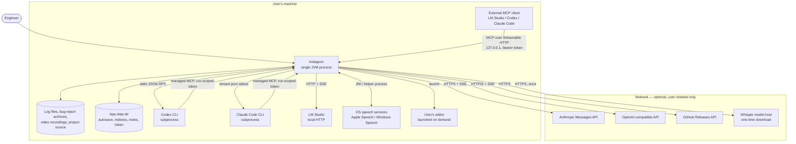
```mermaid
flowchart TB
    user(["Engineer"])

    subgraph host["User's machine"]
        app["Indagium<br/>single JVM process"]
        fs[("Log files, bug-report archives,<br/>video recordings, project source")]
        appdata[("App data dir<br/>autosave, indexes, notes, token")]
        codexcli["Codex CLI<br/>subprocess"]
        claudecli["Claude Code CLI<br/>subprocess"]
        lmstudio["LM Studio<br/>local HTTP"]
        mcpclient["External MCP client<br/>LM Studio / Codex / Claude Code"]
        speech["OS speech services<br/>Apple Speech / Windows Speech"]
        editor["User's editor<br/>launched on demand"]
    end

    subgraph net["Network — optional, user-initiated only"]
        anthropic["Anthropic Messages API"]
        openai["OpenAI-compatible API"]
        github["GitHub Releases API"]
        hf["Whisper model host<br/>one-time download"]
    end

    user --> app
    app <--> fs
    app <--> appdata
    app -->|"stdio JSON-RPC"| codexcli
    app -->|"stream-json stdout"| claudecli
    app -->|"HTTP + SSE"| lmstudio
    app -->|"HTTPS + SSE"| anthropic
    app -->|"HTTP/S + SSE"| openai
    app -->|"HTTPS"| github
    app -->|"HTTPS, once"| hf
    app <-->|"JNI / helper process"| speech
    app -->|"launch"| editor
    mcpclient -->|"MCP over Streamable HTTP<br/>127.0.0.1, bearer token"| app
    codexcli -->|"managed MCP, run-scoped token"| app
    claudecli -->|"managed MCP, run-scoped token"| app
```

**Key.** Solid arrows are data flow; direction is who initiates. Everything inside `host` is on the
user's own machine. Every element in `net` is optional and reached only after an explicit user
action — none is contacted at startup except the GitHub release check, and only when
`autoCheckUpdates` is on in a packaged build (`Main.kt:206-208`).

Note the two inbound arrows at the bottom: when the user runs a **Codex account** or **Claude Code
account** AI profile, Indagium starts the CLI as a subprocess *and* stands up a private, run-scoped
MCP endpoint that the CLI connects back into. That loop is described in [§14.1](#141-control-server-mcp-and-rest)
and [§15.2](#152-ai-investigation-round-trip).

---

## 5. High-level component architecture

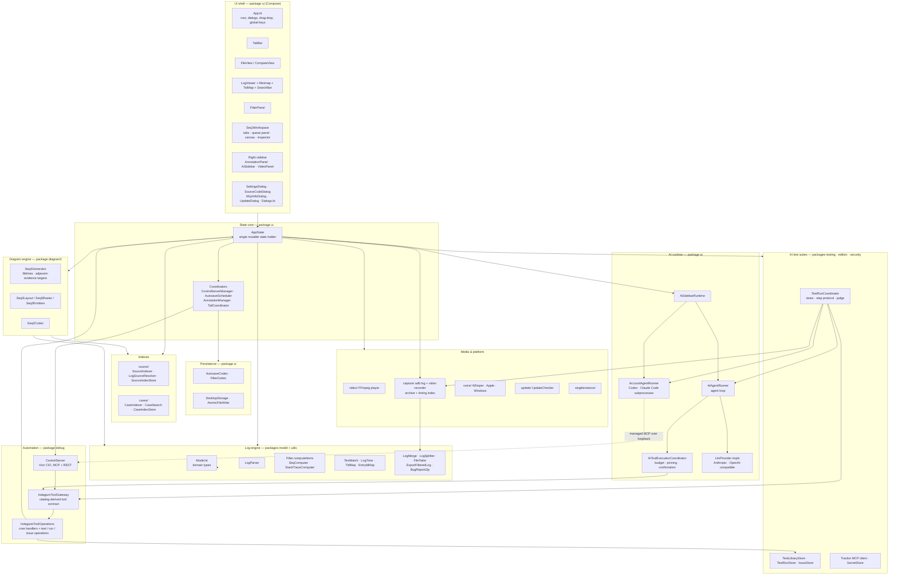
```mermaid
flowchart TB
    subgraph shell["UI shell — package ui (Compose)"]
        appc["App.kt<br/>root, dialogs, drag-drop, global keys"]
        tabbar["TabBar"]
        fileview["FileView / CompareView"]
        viewer["LogViewer + Minimap + TidMap + SearchBar"]
        fpanel["FilterPanel"]
        diagramws["Seq3Workspace<br/>tabs · queue panel · canvas · inspector"]
        rpanel["Right sidebar<br/>AnnotationPanel · AiSidebar · VideoPanel"]
        dialogs["SettingsDialog · SourceCodeDialog<br/>McpInfoDialog · UpdateDialog · Dialogs.kt"]
    end

    subgraph core["State core — package ui"]
        state["AppState<br/>single mutable state holder"]
        coord["Coordinators<br/>ControlServerManager · AutosaveScheduler<br/>AnnotationManager · TailCoordinator"]
    end

    subgraph engine["Log engine — packages model + utils"]
        model["Model.kt<br/>domain types"]
        parser["LogParser"]
        filter["Filter.computeItems<br/>SeqComputer · StackTraceComputer"]
        textutil["TextMatch · LogTime · TidMap · EntryIdMap"]
        io["LogMerge · LogSplitter · FileTailer<br/>ExportFilteredLog · BugReportZip"]
    end

    subgraph persist["Persistence — package ui"]
        codec["AutosaveCodec · FilterCodec"]
        storage["DesktopStorage · AtomicFileWrite"]
    end

    subgraph indexes["Indexes"]
        srcidx["source/<br/>SourceIndexer · LogSourceResolver · SourceIndexStore"]
        caseidx["cases/<br/>CaseIndexer · CaseSearch · CaseIndexStore"]
    end

    subgraph diagrams["Diagram engine — package diagram3"]
        diagrambuild["Seq3Generator<br/>lifelines · adjacent-evidence targets"]
        diagramrender["Seq3Layout / Seq3Raster / Seq3Emitters"]
        diagramcodec["Seq3Codec"]
    end

    subgraph automation["Automation — package debug"]
        server["ControlServer<br/>Ktor CIO, MCP + REST"]
        gateway["IndagiumToolGateway<br/>catalog-derived tool contract"]
        ops["IndagiumToolOperations<br/>core handlers + test / run / issue operations"]
    end

    subgraph ai["AI runtime — package ai"]
        runtime["AiSidebarRuntime"]
        agent["AiAgentRunner<br/>agent loop"]
        policy["AiToolExecutionCoordinator<br/>budget · pinning · confirmation"]
        providers["LlmProvider impls<br/>Anthropic · OpenAI-compatible"]
        accounts["AccountAgentRunner<br/>Codex · Claude Code subprocesses"]
    end

    subgraph tests["AI test suites — packages testing · edition · security"]
        testengine["TestRunCoordinator<br/>lanes · step protocol · judge"]
        teststore["TestLibraryStore · TestRunStore · IssueStore"]
        tracker["Tracker MCP client · SecretStore"]
    end

    subgraph media["Media & platform"]
        video["video/ FFmpeg player"]
        capture["capture/ adb log + video recorder<br/>archive + timing index"]
        voice["voice/ Whisper · Apple · Windows"]
        update["update/ UpdateChecker"]
        single["singleinstance/"]
    end

    shell --> state
    state --> coord
    state --> engine
    coord --> persist
    coord --> server
    state --> indexes
    state --> diagrams
    diagrams --> engine
    diagrams --> indexes
    state --> media
    state --> capture
    capture --> io
    ops --> state
    gateway --> ops
    server --> gateway
    runtime --> agent
    agent --> policy
    agent --> providers
    runtime --> accounts
    policy --> gateway
    accounts -.->|"managed MCP over loopback"| server
    state --> runtime
    engine --> model
    state --> tests
    ops --> teststore
    testengine --> gateway
    testengine --> agent
    testengine --> accounts
    testengine --> capture
```

**Key.** Solid arrows are compile-time dependencies or direct calls. The single dashed arrow is a
network hop: account-based AI agents are separate OS processes, so they reach Indagium's tools over
HTTP rather than in-process.

Four things in this diagram are the load-bearing structural decisions:

1. **`AppState` is the hub.** Everything the user can change lives there, and every subsystem either
   reads it or is owned by it. There is no second source of truth.
2. **`IndagiumToolGateway` is a chokepoint.** MCP clients, REST clients, the in-app AI agent, and
   subprocess agents all reach application behaviour through the same versioned tool catalogue. See
   [§14.1](#141-control-server-mcp-and-rest).
3. **`AiToolExecutionCoordinator` sits below the model loop, not beside it.** Both the direct-API
   path and the subprocess-agent path pass through it, so the safety policy is enforced once
   (`ai/AiToolExecutionCoordinator.kt:31,37`).
4. **The AI test-suite engine owns its own scope and its own gateways.** `TestRunCoordinator` runs
   on a private IO scope and hands every lane, judge and tracker-filing agent a gateway holding only
   that agent's tools, rather than filtering the app's catalogue ([§26](#26-ai-test-suites)).

---

## 6. Module boundaries

Kotlin packages are the module boundary; there is no Gradle multi-project split. The rules below are
observed in the code and enforced by convention and review rather than by tooling.

| Package | Responsibility | May depend on | Must not depend on |
|---|---|---|---|
| `model` | All domain data types. No behaviour beyond trivial accessors and custom `equals`. | Compose `Color` only | Everything else |
| `utils` | Pure log-processing algorithms: parse, filter, fold, merge, split, export, tail, match. | `model` | `ui`, `ai`, `debug`, any Compose UI |
| `source` | Source-code indexing and log-line → call-site resolution. Pure text/regex, no compiler. | `model`, `utils` | `ui`, `ai`, `debug` |
| `diagram3` | UI-free sequence-diagram model, generator, layout, raster, text emitters, and note codec. | `model`, `utils`, `debug` (`Json.kt` only — see §7) | `ui`, `ai`, `source`, Compose UI |
| `cases` | Similarity index over previously written analysis notes. | `model`, `utils` | `ui`, `ai`, `debug` |
| `video` | FFmpeg-backed playback and frame grabbing. | `model` | `ui` |
| `capture` | Device capture adapters, session writing, versioned capture descriptors, ZIP export, and log/video timing records. | `utils` | Compose UI, viewer rendering, AI, and diagnostics UI |
| `testing` | AI test suites: library model, disk stores, edition limits, script runner, device lanes that record through real captures, run engine, judge, issue drafts, tracker client (§26). | `model`, `utils`, `capture`, `edition`, `security`, `ai` (agent launchers), `debug` (gateway type, `schema` DSL) | `ui`, Compose UI |
| `edition` | `Edition`, `EditionLimits` and the `EditionService` that holds the active edition. | — | Everything else |
| `security` | OS-keychain secret storage with a session-only fallback. | `ai` (log redaction), `testing.script` (the child-process runner) | `ui` |
| `voice` | Audio capture and the three transcription backends. | — | `ui` |
| `update` | GitHub release check and asset download. | — | `ui` |
| `singleinstance` | File-lock + loopback-socket single-instance IPC. | — | Everything else |
| `debug` | Control server, tool catalogue, tool handlers, diagnostic logger. | `ui` (`AppState`), `model`, `utils`, `cases`, `diagram3`, `testing`, `edition` | Compose UI composables |
| `ai` | Provider clients, agent loop, tool-execution policy, managed MCP leases. | `debug` (gateway), `model`, `ui` (`AppState`) | Compose UI composables |
| `ui` | Compose UI, `AppState`, coordinators, persistence codecs. | Everything | — |

### 6.1 Boundary properties worth preserving

- **`model` and `utils` are UI-free.** The only Compose import is `androidx.compose.ui.graphics.Color`,
  used as a colour value type in `SequenceDef`, `Highlighter`, and friends. This is what allows the
  entire log engine to be unit-tested without a Compose harness.
- **`source` and `cases` are `AppState`-free.** `SourceIndexer` is a pure function of a file list
  (`source/SourceIndexer.kt:9-11`); `CaseIndexer` is a pure function of a directory list
  (`cases/CaseIndexer.kt:9-13`). `CaseSearch` takes its note directories as a **supplier lambda**
  rather than a value, so a settings change is picked up without reconstructing the object
  (`cases/CaseSearch.kt:38-44`).
- **`testing` is `AppState`-free.** The coordinator is built from plain lambdas (`CoordinatorDeps`,
  `testing/run/TestRunCoordinator.kt:62`) and the stores take a directory and an edition-limits
  lambda; `ui/TestRunWiring.kt` and `ui/TrackerWiring.kt` are the only places that connect it to
  `AppState`. `testing` never imports `ui`.
- **`debug/IndagiumToolOperations` is constructible without a server.** It takes an `AppState` and
  nothing else (`debug/IndagiumToolOperations.kt:63`), which is precisely why the in-app AI agent can
  reuse the identical tool contract without any HTTP involved.
- **UI leaf panels do not receive `AppState`.** `FilterPanel`, `LogViewer`, `AnnotationPanel`,
  `SearchBar`, `Minimap`, and `TidMapOverlay` take plain data plus callback lambdas. The binding is
  done by adapter composables — `BoundFilterPanel` (`ui/FileView.kt:32`) and the inline binding at
  `ui/FileView.kt:188-231`. See [§11.4](#114-the-bound-adapter-pattern) for the trade-off this makes.

### 6.2 Capture boundary and tab integration

`CaptureService` and `TabCaptureController` in `ui/CaptureCoordinator.kt` provide the UI-facing
boundary for the `capture` package. The service resolves user-supplied host `adb` and optional
`scrcpy`, discovers device states, recovers retained session directories, and exposes tool and
diagnostic status. A controller belongs to exactly one live capture tab and owns that tab's recorder
and archive-export lane. `AppState` enforces the one-live-capture invariant, publishes an empty
streaming tab before launching `adb logcat`, and uses `TailCoordinator` to append parsed rows while
the recorder writes the raw log.

The toolbar's Capture action focuses the existing live tab or creates a session-only **New capture**
launcher tab. The launcher lists devices, actionable tool errors, and non-recording retained
sessions. Starting a device closes the launcher and activates a normal `LogTab`; filters, selection,
folding, search, and Notes therefore operate on a live capture through the same viewer path as a
file-backed log. `LogTab.captureSessionId` marks an active stream and `isCaptureLauncher` marks the
ephemeral launcher. Both are intentionally excluded from autosave. A live tab renders a 46dp
capture strip and, when mirroring is enabled, an embedded device mirror in the right-sidebar capture
card (`ui/EmbeddedMirrorPanel.kt`, `capture/mirror/EmbeddedMirrorRuntime.kt`).

**Recording uses the embedded device transport, not host `scrcpy --record`.** When video is enabled,
`CaptureRecorder` owns `capture/mirror/EmbeddedDeviceSession.kt`, which deploys the checksum-pinned
scrcpy server over `adb forward` and parses its frame-meta stream. `ScrcpyPacketReader` preserves
presentation timestamps, configuration packets, and key-frame boundaries; `StreamingMkvWriter`
remuxes H.264 and optional Opus packets into the growing session MKV using FFmpeg. A bounded reconnect
path maintains the video timeline across device interruptions, while resize/rotation parameter sets
are inserted before the next key frame.

When recording is active, `EmbeddedMirrorHandle.create(sharedSession=...)` attaches the mirror decoder
to that same packet stream; it does not open a second device transport. A bounded decoder feed drops
frames until the next key frame rather than blocking the recorder if rendering stalls. If video
recording is disabled, mirror-only mode opens its own embedded session. The host `scrcpy` executable
is only used for the separate external mirror window. The embedded preview uses VideoToolbox/Metal
on macOS. On Windows and Linux, the optional D3D11 or VAAPI/EGL native mirror is behind the
`hardwareMirror` preference (off by default); surface/decoder failures fall back to the Compose
renderer. These display paths do not own the recording session.
The `capture` package owns process adapters, session metadata and recovery, raw log/index writing,
screenshots, disk guards, ZIP range export, timing records, and the versioned
`capture.indagium.json` codec. It has no Compose rendering, viewer state, AI, or diagnostics UI
dependency. Capture settings are persisted as the user changes them; recorder configuration is read
when a new capture starts, while mirror display controls such as live volume remain available during
a session. The settings surface covers tool paths, adb buffer mode, video/audio options, limits,
naming, storage, and diagnostics.

**Wi-Fi pairing** (`capture/WirelessAdb.kt`, `capture/WirelessPairingFlow.kt`,
`ui/WirelessPairingDialogs.kt`) attaches an Android 11+ phone over Wireless debugging. It depends on
adb's mDNS backend (`adb mdns check`/`services`): `CaptureService.refreshDevices` piggybacks one
best-effort mDNS listing on its existing poll, and a phone on its pairing screen appears as an inline
"Ready to pair" row (never an automatic modal). mDNS failure is logged only; it never sets `error` or
clears `devices`, since networks with AP isolation block mDNS while USB capture is unaffected. Pairing
is either a typed 6-digit code (`adb pair host:port code`; the address is editable, which is the manual
fallback when mDNS is blocked) or a QR code (ZXing `core`, Android Studio's `WIFI:T:ADB;S:name;P:pw;;`
payload) whose per-dialog random name the phone advertises once it scans. After a successful pair
adb's own mDNS auto-connect normally attaches the phone, so `WirelessPairingFlow` watches the device
list first and only then falls back to `adb connect` (connecting explicitly while auto-connect also
runs creates a duplicate `ip:port` entry). Neither `adb pair` nor `adb connect` is trusted on exit
code; success is judged on their output. The pairing code and QR password travel only as argv of the
one adb process (there is no runner-level or capture-diagnostics logging of argv) and
`QrPairingCredentials.toString` redacts the password. A wireless device is recognised purely from its
serial (`CaptureDevice.wireless`), so no persisted format changed.

The descriptor is the hand-off between capture and review. Portable archive v3 uses a flat ZIP
layout: `capture.indagium.json`, `logcat.log`, optional `screen.mp4` (or MKV when needed to retain
audio), optional notes/markers and screenshots, and `captured_with_indagium.txt`. The descriptor
stores checksums, actual video coverage, and a single log-row/video-time synchronization anchor; v3
does not export the older row-by-row mapping file. Opening a ZIP verifies its assets and creates an
ordinary log tab with the available video automatically linked using that anchor. The reader still
accepts legacy v1/v2 archives, whose nested asset layout and row-mapping metadata are distinct.

A retained working session directory has a different layout: `logs/logcat.log`,
`mapping/capture-index.jsonl`, `video/screen.mkv`, screenshots, session metadata, and the finalized
portable descriptor. The append-only capture index supplies per-row elapsed-time data while recording
and is used to build a portable snapshot's selected log range and synchronization anchor. A live
snapshot freezes the current log/index byte boundary, exports all history, a time range, since the last
successful save, or the contiguous interval between the first and last selected capture rows, and
leaves the recorder running. Cancellation or failure leaves the capture active. Video export chooses
a readable preceding keyframe where available; the descriptor reports actual coverage instead of
implying video spans the full log interval. Screenshots are stored in the session and added to Notes
with video-frame provenance when available.
Since-last-save keeps **two independent cursors** on `CaptureSession`, not one:
`snapshotCheckpointMs` (log coverage end, always advances on any successful export) and
`videoCheckpointMs` (video coverage end, advances only when that export actually produced video). The
video range's start is `min(logCheckpoint, videoCheckpoint)` when a video checkpoint exists, so a
snapshot whose video still lags the log (StreamingMkvWriter's Matroska muxer only flushes a cluster
when it closes — bounded to roughly a second now, see above, but still not instant) is recovered by
the next snapshot instead of silently dropped; both cursors round-trip through `session.json`
(`CaptureRecorder.sessionJson`/`sessionFromJson`), which still accepts the pre-split file shape (no
`videoCheckpointMs` key) for backward compatibility. `FfmpegCaptureVideoExporter` additionally
re-encodes (rather than remuxing from a keyframe) when the preceding keyframe is more than 500ms
before the requested start, using whichever bundled H.264 encoder is available at runtime
(`libopenh264`, `libx264`, then `h264_videotoolbox`, probed in that order; falls back to the
keyframe-aligned remux if none is available) so a since-save export starts at (or within one frame
of) what was actually requested instead of always restarting from the recording's first keyframe.
`CaptureArchiveExporter.export` also waits (bounded, `DEFAULT_VIDEO_COVERAGE_WAIT_MS` — 2s in
production now that StreamingMkvWriter keeps the file close to real time, was 8s against host
scrcpy's laggier muxer; 0/disabled by default so tests aren't affected) for a still-recording
session's video to catch up to the requested end before snapshotting it, and its preview lane uses a
cheap copy+scan probe (`CaptureVideoCoverageProbe`, cached by source file length) instead of a full
copy+remux so the snapshot popover's debounced polling stays lightweight.

Stop drains tailing and finalizes the v3 descriptor in the retained session directory; the session
index remains beside the raw log and video. The ordinary player then lets log rows and video seek one
another, while a later Save ZIP writes the separate flat portable layout. If the application exits before Stop, the recorder marks its directory interrupted; the
next launcher lists it for recovery. Live recorder/launcher markers are not restored as active
state, while a finalized descriptor link is durable and reopens as a normal capture-backed tab.

**Test-run lane captures** are the one case where a second controller records beside the user's
capture. An AI test run records each lane through the same `TabCaptureController`, start path and
archive code (§26.5.5); `LogTab.testLane` marks such a tab, `AppState.liveCaptureTabId` ignores it, so
the one-live-capture rule above stays exactly as it was for every manual flow (toolbar, launcher, the
device AI tools), and a per-device claim under `stateLock` keeps lanes and manual captures off the same
phone.

On macOS, Windows, and Linux (x86 or ARM), host `adb` and optional `scrcpy` are resolved from the
normal platform installation. A Linux Flatpak launch uses `flatpak-spawn --host --watch-bus` for
those host tools and requires only the `org.freedesktop.Flatpak` talk permission. Automated tests
cover process, archive, persistence, settings, selection bounds, cancellation, and mapping paths;
they do not prove Compose layout fidelity, and live device/scrcpy verification across all supported
platforms is unavailable in the current environment.

---

## 7. Package dependency graph

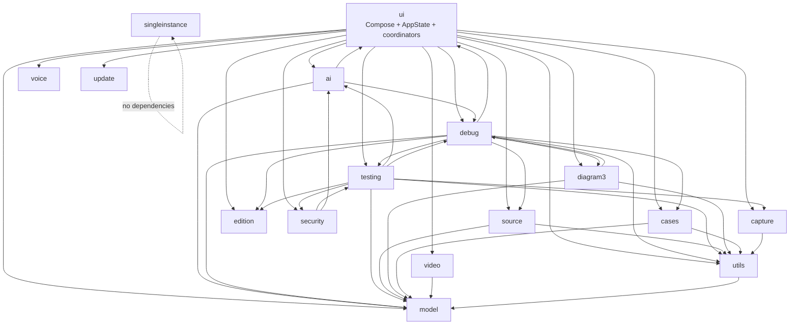
```mermaid
flowchart TB
    ui["ui<br/>Compose + AppState + coordinators"]
    ai["ai"]
    debug["debug"]
    source["source"]
    diagram3["diagram3"]
    cases["cases"]
    utils["utils"]
    model["model"]
    video["video"]
    voice["voice"]
    update["update"]
    single["singleinstance"]
    capture["capture"]
    testing["testing"]
    edition["edition"]
    security["security"]

    ui --> ai
    ui --> debug
    ui --> source
    ui --> diagram3
    ui --> cases
    ui --> utils
    ui --> model
    ui --> video
    ui --> voice
    ui --> update
    ui --> capture
    ui --> testing
    ui --> edition
    ui --> security

    ai --> debug
    ai --> ui
    ai --> model

    debug --> ui
    debug --> utils
    debug --> model
    debug --> cases
    debug --> source
    debug --> diagram3
    debug --> testing
    debug --> edition

    testing --> ai
    testing --> debug
    testing --> capture
    testing --> utils
    testing --> model
    testing --> edition
    testing --> security
    security --> testing
    security --> ai

    source --> utils
    source --> model
    diagram3 --> utils
    diagram3 --> model
    diagram3 --> debug
    cases --> utils
    cases --> model
    video --> model
    capture --> utils
    utils --> model

    single -.->|"no dependencies"| single
```

**Key.** Arrows point from dependant to dependency.

**The cycles.** `ui ↔ ai` and `ui ↔ debug` are genuine bidirectional dependencies, not diagram
artifacts. `debug/IndagiumToolOperations` holds an `AppState`, and `AppState` constructs
`IndagiumToolOperations(this).toolGateway` to hand to the AI runtime (`ui/AppState.kt:970-981`). This
is deliberate: the tools *are* "things the user can do", so they must reach the state that models
what the user can do. It is the main reason a Gradle module split has not been attempted — the cycle
would have to be broken with an interface extraction first. See
[risk R7](#23-known-architectural-risks-and-technical-debt).

`debug ↔ diagram3` is new since the v3 sequence-diagram cutover: `debug/IndagiumToolOperations`'s
`build_sequence_diagram` route calls `diagram3.generateSeq3` directly, and `diagram3/Seq3Codec.kt`
reuses `debug/Json.kt`'s hand-rolled encoder/decoder for its note header rather than adding a second
JSON implementation. Unlike the `ui` cycles this one is a plain reuse-of-a-small-utility case, not a
structural need to reach shared state — a future cleanup could break it by moving `Json.kt` (or just
the four bounded accessor functions `diagram3` actually uses) to `utils` or `model` without changing
either package's public behaviour. `diagram3` itself stays UI-free and does not depend on `source`
(unlike the deleted `diagram` package's `SeqDiagramBuilder.kt`) — see §9.7 and §13.7 for why.

`debug ↔ testing` and `security ↔ testing` are new with the AI test suites. `testing` needs the
gateway type and the `schema(...)` DSL from `debug` (every lane, judge and tracker agent is given an
`IndagiumToolGateway`) and the agent launchers from `ai`; `debug` holds the MCP catalogues and approval
dialogs for the feature and therefore imports `testing.model`/`testing.script`; `security` reuses
`testing.script`'s bounded child-process runner while `testing.tracker` reuses `security`'s secret
scrubbing. All three are reuse of small utility types, not shared mutable state, and — like the cycles
above — are broken only by an extraction. `testing` itself does not depend on `ui` (§26.2).

`model` is a leaf. `utils` depends only on `model`. `singleinstance` depends on nothing in the
application at all — it runs before `AppState` exists (`Main.kt:106`).

---

## 8. Core domain model

The model is a single file, `model/Model.kt` (925 lines), containing only data types. It is split
across two diagrams below for readability.

### 8.1 The tab aggregate

`LogTab` is the aggregate root. One tab is one opened log file, and everything the user does to that
file hangs off it.

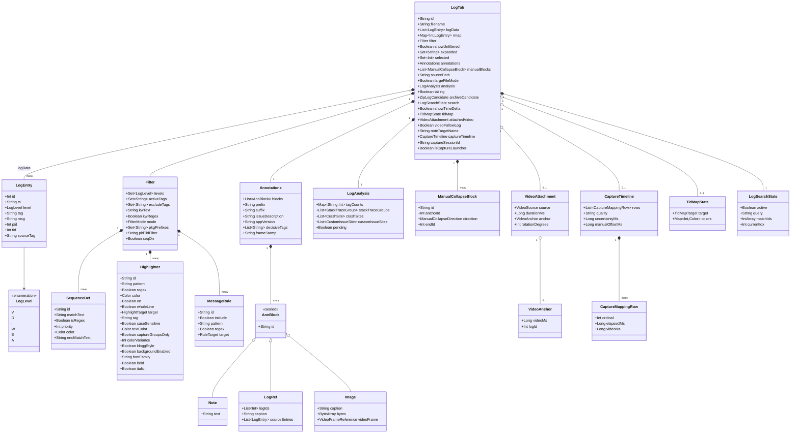
```mermaid
classDiagram
    class LogTab {
        +String id
        +String filename
        +List~LogEntry~ logData
        +Map~Int,LogEntry~ rmap
        +Filter filter
        +Boolean showUnfiltered
        +Set~String~ expanded
        +Set~Int~ selected
        +Annotations annotations
        +List~ManualCollapseBlock~ manualBlocks
        +String sourcePath
        +Boolean largeFileMode
        +LogAnalysis analysis
        +Boolean tailing
        +ZipLogCandidate archiveCandidate
        +LogSearchState search
        +Boolean showTimeDelta
        +TidMapState tidMap
        +VideoAttachment attachedVideo
        +Boolean videoFollowLog
        +String noteTargetName
        +CaptureTimeline captureTimeline
        +String captureSessionId
        +Boolean isCaptureLauncher
    }

    class LogEntry {
        +Int id
        +String ts
        +LogLevel level
        +String tag
        +String msg
        +Int pid
        +Int tid
        +String sourceTag
    }

    class LogLevel {
        <<enumeration>>
        V
        D
        I
        W
        E
        A
    }

    class Filter {
        +Set~LogLevel~ levels
        +Set~String~ activeTags
        +Set~String~ excludeTags
        +String kwText
        +Boolean kwRegex
        +FilterMode mode
        +Set~String~ pkgPrefixes
        +String pidTidFilter
        +Boolean seqOn
    }

    class SequenceDef {
        +String id
        +String matchText
        +Boolean isRegex
        +Int priority
        +Color color
        +String endMatchText
    }

    class Highlighter {
        +String id
        +String pattern
        +Boolean regex
        +Color color
        +Boolean on
        +Boolean wholeLine
        +HighlightTarget target
        +String tag
        +Boolean caseSensitive
        +Color textColor
        +Boolean captureGroupsOnly
        +Int colorVariance
        +Boolean kloggStyle
        +Boolean backgroundEnabled
        +String fontFamily
        +Boolean bold
        +Boolean italic
    }

    class MessageRule {
        +String id
        +Boolean include
        +String pattern
        +Boolean regex
        +RuleTarget target
    }

    class Annotations {
        +List~AnnBlock~ blocks
        +String prefix
        +String suffix
        +String issueDescription
        +String appVersion
        +List~String~ decisiveTags
        +String frameStamp
    }

    class AnnBlock {
        <<sealed>>
        +String id
    }
    class Note { +String text }
    class LogRef {
        +List~Int~ logIds
        +String caption
        +List~LogEntry~ sourceEntries
    }
    class Image {
        +String caption
        +ByteArray bytes
        +VideoFrameReference videoFrame
    }

    class LogAnalysis {
        +Map~String,Int~ tagCounts
        +List~StackTraceGroup~ stackTraceGroups
        +List~CrashSite~ crashSites
        +List~CustomIssueSite~ customIssueSites
        +Boolean pending
    }

    class ManualCollapseBlock {
        +String id
        +Int anchorId
        +ManualCollapseDirection direction
        +Int endId
    }

    class VideoAttachment {
        +VideoSource source
        +Long durationMs
        +VideoAnchor anchor
        +Int rotationDegrees
    }

    class VideoAnchor {
        +Long videoMs
        +Int logId
    }

    class CaptureTimeline {
        +List~CaptureMappingRow~ rows
        +String quality
        +Long uncertaintyMs
        +Long manualOffsetMs
    }

    class CaptureMappingRow {
        +Int ordinal
        +Long elapsedMs
        +Long videoMs
    }

    class TidMapState {
        +TidMapTarget target
        +Map~Int,Color~ colors
    }

    class LogSearchState {
        +Boolean active
        +String query
        +IntArray matchIds
        +Int currentIdx
    }

    LogTab "1" *-- "many" LogEntry : logData
    LogTab "1" *-- "1" Filter
    LogTab "1" *-- "1" Annotations
    LogTab "1" *-- "1" LogAnalysis
    LogTab "1" *-- "many" ManualCollapseBlock
    LogTab "1" o-- "0..1" VideoAttachment
    LogTab "1" o-- "0..1" TidMapState
    LogTab "1" *-- "1" LogSearchState
    LogEntry --> LogLevel
    Filter "1" *-- "many" SequenceDef
    Filter "1" *-- "many" Highlighter
    Filter "1" *-- "many" MessageRule
    Annotations "1" *-- "many" AnnBlock
    AnnBlock <|-- Note
    AnnBlock <|-- LogRef
    AnnBlock <|-- Image
    VideoAttachment "1" o-- "0..1" VideoAnchor
    LogTab "1" o-- "0..1" CaptureTimeline
    CaptureTimeline "1" *-- "many" CaptureMappingRow
```

**Notes on the model that are not obvious from the shape:**

- **`rmap` is not a map.** It is an `EntryIdMap` — an `AbstractMap<Int, LogEntry>` view over
  `logData` that resolves ids by dense-index guess plus binary search (`utils/EntryIdMap.kt:9-29`).
  It is valid only because entry ids are strictly increasing in every construction path.
- **`ts` carries no date.** `LogParser` strips the `MM-DD` prefix (`utils/LogParser.kt:100`), which
  is why `LogMerge` and `LogTime` both have documented midnight-boundary caveats.
- **`sourceTag` is set only by `mergeLogs`** to badge which file a merged row came from
  (`model/Model.kt:31-35`).
- **`LogAnalysis.pending` defaults to `true`** so a freshly constructed tab reads "not analysed yet",
  never "analysed, found nothing" (`model/Model.kt:127-134`).
- **`AnnBlock.Image` overrides `equals`/`hashCode` to compare `bytes` by content**
  (`model/Model.kt:254-269`). With the default array-reference comparison, the debounced autosave in
  `ui/App.kt:102` would re-arm forever.
- **Session-only fields are deliberately excluded from persistence:** `selected`, `tailing`,
  `search`, `tidMap`, `videoFollowLog`, `captureTimeline`, `captureSessionId`, and
  `isCaptureLauncher`, plus the derived `logData`, `rmap`, `analysis`, and `largeFileMode`.
  A live capture cannot resume after relaunch because `adb`/`scrcpy` processes are not persisted;
  the raw capture directory is recovered as an interrupted retained session instead. See
  [§13.4](#134-what-is-persisted-and-what-is-not).

### 8.2 The view model and settings

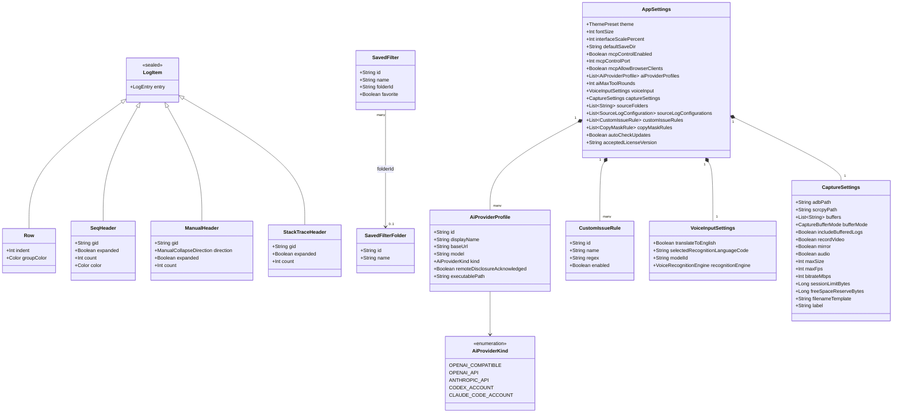
```mermaid
classDiagram
    class LogItem {
        <<sealed>>
        +LogEntry entry
    }
    class Row {
        +Int indent
        +Color groupColor
    }
    class SeqHeader {
        +String gid
        +Boolean expanded
        +Int count
        +Color color
    }
    class ManualHeader {
        +String gid
        +ManualCollapseDirection direction
        +Boolean expanded
        +Int count
    }
    class StackTraceHeader {
        +String gid
        +Boolean expanded
        +Int count
    }

    LogItem <|-- Row
    LogItem <|-- SeqHeader
    LogItem <|-- ManualHeader
    LogItem <|-- StackTraceHeader

    class AppSettings {
        +ThemePreset theme
        +Int fontSize
        +Int interfaceScalePercent
        +String defaultSaveDir
        +Boolean mcpControlEnabled
        +Int mcpControlPort
        +Boolean mcpAllowBrowserClients
        +List~AiProviderProfile~ aiProviderProfiles
        +Int aiMaxToolRounds
        +VoiceInputSettings voiceInput
        +CaptureSettings captureSettings
        +List~String~ sourceFolders
        +List~SourceLogConfiguration~ sourceLogConfigurations
        +List~CustomIssueRule~ customIssueRules
        +List~CopyMaskRule~ copyMaskRules
        +Boolean autoCheckUpdates
        +String acceptedLicenseVersion
    }

    class AiProviderProfile {
        +String id
        +String displayName
        +String baseUrl
        +String model
        +AiProviderKind kind
        +Boolean remoteDisclosureAcknowledged
        +String executablePath
    }

    class AiProviderKind {
        <<enumeration>>
        OPENAI_COMPATIBLE
        OPENAI_API
        ANTHROPIC_API
        CODEX_ACCOUNT
        CLAUDE_CODE_ACCOUNT
    }

    class SavedFilter {
        +String id
        +String name
        +String folderId
        +Boolean favorite
    }
    class SavedFilterFolder {
        +String id
        +String name
    }
    class CustomIssueRule {
        +String id
        +String name
        +String regex
        +Boolean enabled
    }
    class VoiceInputSettings {
        +Boolean translateToEnglish
        +String selectedRecognitionLanguageCode
        +String modelId
        +VoiceRecognitionEngine recognitionEngine
    }

    class CaptureSettings {
        +String adbPath
        +String scrcpyPath
        +List~String~ buffers
        +CaptureBufferMode bufferMode
        +Boolean includeBufferedLogs
        +Boolean recordVideo
        +Boolean mirror
        +Boolean audio
        +Int maxSize
        +Int maxFps
        +Int bitrateMbps
        +Long sessionLimitBytes
        +Long freeSpaceReserveBytes
        +String filenameTemplate
        +String label
    }

    AppSettings "1" *-- "many" AiProviderProfile
    AppSettings "1" *-- "many" CustomIssueRule
    AppSettings "1" *-- "1" VoiceInputSettings
    AppSettings "1" *-- "1" CaptureSettings
    AiProviderProfile --> AiProviderKind
    SavedFilter "many" --> "0..1" SavedFilterFolder : folderId
```

`AiProviderProfile` **has no secret field**, by design (`model/Model.kt:580`). Because `AppSettings`
is the only settings object serialised into the autosave, a pasted API key structurally cannot reach
disk. See [§18.4](#184-ai-provider-credentials).

`LogItem` is the render model — the output of the filter pipeline and the input to the `LazyColumn`.
It is never persisted and never leaves the process.

---

### 8.3 Sequence-diagram workspace model (v3)

Rewritten wholesale in the "v3 cutover" (`docs/plans/use-the-claude-design-mcp-compiled-lighthouse.md`,
phase 6): the earlier `diagram`-package model (`SeqDiagramSpec`, `ManualDiagramDocument`,
`ManualDiagramInteraction`'s v1–v4 compatibility layer, rules-mode message generation, and the
override/regeneration machinery it needed) is deleted outright, not migrated. v3 never reads a
legacy document — there is exactly one on-disk version (`Seq3Codec`'s `SEQ3_VERSION = "v1"`), no
`editorVersion` discriminator anywhere in the model, and the whole domain lives in
`com.indagium.diagram3` (UI-free — see §9.7).

The core reframe: a panel row is not a log line and not a rule — it is a **message**,
`from → to : label`, backed by *n* real log occurrences.

| Type | Responsibility |
|---|---|
| `Seq3Lifeline` | One canvas column: id, display name, the raw tag ids it represents (a singleton until a user merges two lifelines), and display ordinal. |
| `Seq3Match` / `Seq3Capture` | A source-independent pattern proven across every occurrence of one message (`Seq3Tokenizer`), with named `{token}` slots for the varying runs. |
| `Seq3Occurrence` | One real log line backing a message — entry id, timestamp, pid/tid, level, text, per-token capture values. Append-only, never user-editable. |
| `Seq3Message` | The editable durable unit. `fromLifelineId` is never null (it's the tag the occurrences were scanned under); `toLifelineId` is nullable — a null value **is** the needs-target condition (`Seq3State.NEEDS_TARGET`), derived from the field rather than stored, so it can never drift out of sync. Also carries `kind` (call/return/async/self/note), `repeat` policy, `visibility` (a separate flag from authoring state — hiding never discards evidence), and `authoring` (`AUTO`/`EDITED`, which regeneration must respect). |
| `Seq3Fragment` | An explicit, user-chosen `loop`/`alt`/`opt`/`par` block over a set of message ids — unlike the old auto-detected, meaning-free `DiagramFrame`, every fragment here was deliberately created by a Group action. |
| `Seq3Note` | A canvas/text note spanning a message selection — distinct from a `Seq3Kind.NOTE` message, which is its own queue row with its own evidence. |
| `Seq3Document` | The whole generated-or-edited diagram: title, source file, range, lifelines, messages, fragments, notes, default repeat policy. No `interactions` list and no version discriminator — see this type's own doc for why there is nothing to discriminate against. |
| `Seq3GenerateOptions` | Tuning knobs for `Seq3Generator.generateSeq3`: title/source-file seed, lifeline cap, default repeat policy/threshold, and independent on/off switches for thread-handoff and correlation-token target inference. |
| `Seq3RegenReview` | Regenerate-is-a-reviewed-proposal (never a wholesale replace): new/changed/removed/edited-kept rows with per-row decisions, produced by diffing a fresh generation against the current document; `applySeq3Command`'s `ApplyRegeneration` case turns an accepted review into exactly one undo step. |

`Seq3Generator.generateSeq3` ranks lifelines from tag activity (errors, message-shape diversity,
same-thread peers, a capped raw count — the ranking itself ported unchanged from the deleted
`SeqDiagramBuilder.kt`), groups near-identical occurrences per tag into one `Seq3Message` via
`Seq3Tokenizer`, and infers each message's target only from the *immediately adjacent* entry: a
same-thread (pid+tid, bounded gap) handoff or a shared correlation token, both above a confidence
bar. Deliberately absent, by this phase's own brief: no source-index enrichment, no rules-mode
message generation, no call/site override machinery, no activation spans. v3's answer to "I don't
like what the generator inferred" is the queue's own edit affordances (`Seq3Queue`, `Seq3Commands`),
not more inference knobs in the generator.

`Seq3Layout.layoutSeq3` is the single unit-less geometry source shared by the Compose canvas
(`ui/Seq3Canvas.kt`) and the headless PNG rasterizer (`Seq3Raster.kt`, §9.7 and §13.7) — an export
can never draw something the user didn't see on screen, because both consumers draw from exactly
the same computed `Seq3Layout`, differing only in which transform (density vs. raster scale) turns
its numbers into pixels.

Diagram workspaces remain deliberately separate from `LogTab`, same shape as before the cutover:
`AppState.tabs` stays the list of open log files; `ActiveSurface` selects either a log tab
(`ActiveSurface.Log`) or an independent `Seq3WorkspaceSession` (`ActiveSurface.Diagram3` — the only
non-log variant now that the v1/v2 `ActiveSurface.Diagram` case is gone). A session carries the
source-log id (nullable — see §11.6), the generated/edited document, its own undo stack (one entry
per `applySeq3Command` call, including a whole regeneration apply), dirty/draft-saved state, and
the note block id a confirm writes into. A source tab can close without destroying an already-built
session; regeneration is disabled (`requestGenerate` is a no-op) until the session is relinked.

---

## 9. Key packages and classes

### 9.1 `model`

| Type | File | Role |
|---|---|---|
| `LogEntry`, `LogLevel` | `model/Model.kt:10,23` | One parsed log line |
| `LogTab` | `model/Model.kt:463` | Aggregate root: one open file and all state attached to it |
| `Filter` | `model/Model.kt:154` | The complete filter specification, 18 fields |
| `Annotations`, `AnnBlock` | `model/Model.kt:276,201` | The note document attached to a tab |
| `LogAnalysis`, `CrashSite`, `IssueSite` | `model/Model.kt:116,78,73` | Crash/ANR/custom-issue detection results |
| `LogItem` | `model/Model.kt:882` | Render model produced by `computeItems` |
| `AppSettings`, `ThemePreset` | `model/Model.kt:704,835` | All persisted preferences; 20 themes |

### 9.2 `utils` — the log engine

| File | Role |
|---|---|
| `LogParser.kt` | Parses four logcat formats (`threadtime`, `time`, `brief`, `bare`), per line. Fast path at `:127`, regex fallback chain, tag interning, `RAW` for unrecognised lines |
| `Filter.kt` | `passesFilter` (`:13`), `visibleEntries` (`:132`), `computeItems` (`:301`), `buildMd` (`:700`). The largest single algorithm in the app |
| `SeqComputer.kt` | `computeSeqGroups` (`:79`) — O(n·d) sequence detection with one level of nesting |
| `StackTraceComputer.kt` | Always-on stack folding (`:115`), crash sites (`:189`), custom issue sites (`:212`) |
| `TextMatch.kt` | Shared regex infrastructure: bounded LRU cache, backtracking deadline, `visibleLogLineText` as the single definition of "what the row shows" |
| `HighlightMatch.kt` | The one highlighter matcher: `highlighterMatches` (boolean), `resolveLineHighlight` (whole-line owner plus paint-ordered spans) and `countHighlighterRows` (per-highlighter row counts for the filter panel). Row rendering, the minimap and the panel counts all go through it, so "which highlighter owns this row" cannot drift between them. See [§10.1](#103-highlighters) |
| `QSettingsIni.kt` / `KloggHighlighterImport.kt` / `KloggColor.kt` / `QtColorParse.kt` | Manual import of klogg highlighter sets: Qt `QSettings` INI reader, klogg field mapping to `Highlighter`, `QColor::darker` + `minstd_rand0` colour variance, Qt/SVG colour parsing. See [§13.8](#138-klogg-highlighter-import) |
| `EntryIdMap.kt` | Memory-free id → entry lookup view |
| `LogTime.kt` | Allocation-free `HH:MM:SS.mmm` parsing, delta formatting, midnight-rollover correction |
| `TidMap.kt` | Pure core of the thread-map gutter overlay |
| `LogMerge.kt` / `LogSplitter.kt` | Time-ordered merge of multiple files; byte-exact split of one huge file |
| `FileTailer.kt` | Polling tailer with a `WatchService` hint, capped reads, rotation handling |
| `ExportFilteredLog.kt` / `AnnotationExport.kt` / `AnnotationHtml.kt` | TXT/CSV export; annotation image naming; HTML clipboard flavour |
| `BugReportZip.kt` | `.zip`/`.7z` scanning with entry-size and entry-count budgets |
| `AtomicFileWrite.kt` | `writeFileAtomically` — temp file in the destination directory, then `ATOMIC_MOVE` |
| `ImageDownscale.kt` | Hard 1280 px / 400 KB cap on annotation images |
| `Ids.kt` | Process-wide id factory: timestamp + `AtomicLong` counter |

### 9.3 `ui`

| File | Role |
|---|---|
| `AppState.kt` | 12,214 lines. The application's entire mutable state and most of its behaviour. See [§11](#11-state-management) |
| `App.kt` | Root composable: layout routing, all dialogs, drag-and-drop, global key handling, the autosave debounce |
| `FileView.kt` / `CompareView.kt` | Single-tab and two-tab layouts; the `Bound*` adapters |
| `LogViewer.kt` | The log list: `LazyColumn`, horizontal scroll, selection, drag-select, the Original/Filtered split |
| `FilterPanel.kt` | Left sidebar: levels, tags, message rules, sequences, collapsed ranges, saved filters |
| `HighlighterSection.kt` / `HighlighterCandidates.kt` | The panel's Highlighters section: rows with a Match/Line chip, badges and match counts, the inline editor, and the search-to-add field with its TEXT / TAGS / MESSAGES dropdown. `HighlighterCandidates.kt` is the pure half (query parsing incl. `tag:Name rest`, candidate ranking, row labels/badges) so tests can pin it without composing |
| `AnnotationPanel.kt` / `AnnotationManager.kt` | Notes UI and the block-model mutations behind it |
| `AiSidebar.kt` | AI panel plus the right-sidebar container that stacks Video / Notes / AI |
| `CaptureCoordinator.kt` | `CaptureService` tool/device discovery and recovery; one `TabCaptureController` recorder/export lane per live tab |
| `CaptureLauncher.kt` / `CaptureStrip.kt` / `CaptureSettingsUi.kt` | Session-only device launcher, live-tab capture chrome/snapshot/diagnostics, and Capture Settings (session recorder options are read at next start) |
| `AutosaveCodec.kt` / `AutosaveScheduler.kt` / `FilterCodec.kt` / `DesktopStorage.kt` | Persistence: encoding, scheduling, the saved-filter library format, path resolution |
| `ControlServerManager.kt` | Control-server lifecycle with a generation-counter race guard |
| `TailCoordinator.kt` | Per-tab live tailing and debounced re-analysis |
| `Components.kt` / `Theme.kt` / `Shortcuts.kt` | Shared widgets, 20 theme palettes, the keyboard-shortcut catalogue |
| `Tests*.kt` / `TestRun*.kt` / `Issue*.kt` / `Testing*.kt` / `TrackerWiring.kt` / `ReorderableColumn.kt` | The AI test-suites surface: Tests workspace (`ActiveSurface.Tests`, `TabRef.Tests`), run dialog, live view and report, issue dialog, Settings sections, and the wiring that connects `testing/` to `AppState` (§26.2) |

### 9.4 `debug` — automation

| File | Role |
|---|---|
| `ControlServer.kt` | Ktor CIO server; `MCP_TOOLS` and `REST_ROUTES` catalogues; auth, CORS, device-tool approval, session reaping |
| `IndagiumToolGateway.kt` | Joins catalogue to handlers, enforces parity, defines the confirmation policy, derives OpenAI function definitions |
| `IndagiumToolOperations.kt` | Tool handler map — the actual behaviour behind each catalogue entry |
| `TestSuiteToolCatalog.kt` / `TestRunToolCatalog.kt` / `IssueToolCatalog.kt` + matching `*Operations.kt` | Catalog-driven suite, authoring, script, run/report and issue-evidence tools; gateway startup enforces descriptor/handler parity and the tool index is generated from the current catalog (§26.2) |
| `ExternalToolApproval.kt` / `ExternalRunApproval.kt` / `ExternalTrackerApproval.kt` | `PER_CALL_APPROVAL_MCP_TOOLS` and the dialog content for each call an external client must have approved (§26.9.2) |
| `Json.kt` | Hand-rolled JSON encode/decode for flat DTOs |
| `AppLogger.kt` | Opt-in diagnostic log, written in Android threadtime grammar so Indagium can open its own log |

### 9.5 `ai`

| File | Role |
|---|---|
| `LlmProvider.kt` | The provider interface and its streaming event model |
| `AnthropicMessagesProvider.kt` / `OpenAiCompatibleProvider.kt` | The two HTTP providers |
| `ClaudeCodeClient.kt` / `CodexAppServerClient.kt` | Subprocess drivers (stream-json; stdio JSON-RPC) |
| `AccountAgentRunner.kt` | Orchestrates a subprocess agent run, including its managed MCP lease |
| `AiAgentRunner.kt` | The agent loop (`runLoop`, `:277`), session and run model |
| `AiToolExecutionCoordinator.kt` | The single safety policy point under both agent paths |
| `AiToolCallBudget.kt` | Per-run tool-call budget; notes writes are unlimited by design |
| `AiSidebarRuntime.kt` | Bridges UI to runner; provider selection; debounced UI updates |
| `AiInvestigation.kt` | Quick-action prompts, context pinning, evidence extraction |
| `ManagedMcpServerLease.kt` / `ManagedMcpRunRegistry.kt` | Per-run loopback MCP endpoint and its token registry |

### 9.6 `source`, `cases`, and platform packages

| File | Role |
|---|---|
| `source/SourceIndexer.kt` | Builds the call-site index by text scanning and brace matching — no compiler, no parser dependency |
| `source/LogSourceResolver.kt` | Maps `(tag, msg)` back to call sites with confidence ranking |
| `source/SourceIndexStore.kt` | On-disk index, format `indagium-source-index-v1` (a load also accepts the legacy `openLog2-source-index-v1` magic), schema version 18 |
| `source/SourceStructureParser.kt` | Declaration scanner for the read-only source-navigation tools |
| `cases/CaseIndexer.kt` / `CaseSearch.kt` / `CaseIndexStore.kt` | Similarity index over previously written notes; idf-lite scoring with tag boost and stale-version penalty |
| `video/VideoPlayerController.kt` | FFmpeg decode loop on a dedicated thread, audio via `javax.sound.sampled` |
| `capture/CaptureRecorder.kt` | Per-session adb logcat process lifecycle, the embedded video recording session (`EmbeddedDeviceSession`), append-only log/index writing, screenshots, watchdog, disk limits, and interruption recovery |
| `capture/StreamingMkvWriter.kt` | Live-readable Matroska muxer (FFmpeg `avformat`) that `EmbeddedDeviceSession` writes recorded H.264/Opus packets into directly |
| `capture/mirror/ScrcpyPacketReader.kt` / `EmbeddedDeviceSession.kt` / `ScrcpyStreamAdapters.kt` | scrcpy v4.1 frame-meta protocol parser, the recording-side packet pump/reconnect/PTS-continuity owner, and the bounded decoder fan-out + mirror-side Annex-B re-flattening |
| `capture/CaptureArchive.kt` / `CaptureTimelineIndex.kt` | Versioned descriptor, ZIP snapshot export/finalization, asset validation, and index-assisted range/synchronization-anchor generation |
| `capture/CaptureTools.kt` / `CaptureSettingsCodec.kt` | Cross-platform adb resolution/validation (host `scrcpy` only for the separate native mirror window) and keyed capture-settings persistence |
| `voice/VoiceInputController.kt` + backends | Dictation state machine; Whisper JNI, Apple Speech JNI, Windows helper process |
| `update/UpdateChecker.kt` | GitHub Releases API, per-OS asset selection, streamed download to a `.part` file |
| `singleinstance/SingleInstance.kt` | File lock plus loopback socket; forwards file arguments to the running instance |

### 9.7 `diagram3`

v3 (the "v3 cutover", `docs/plans/use-the-claude-design-mcp-compiled-lighthouse.md` phase 6)
replaced the whole `diagram` package outright — the model in §8.3, the generator, the raster, and
the note codec are a fresh, much smaller design with no v1–v5 compatibility layer. One file from
the old package survived, moved rather than deleted: `source/SourceTraceModel.kt` (package renamed
from `com.indagium.diagram`), because `source/SourceTraceInference.kt` depends on its types and v3
itself does no source-trace enrichment.

| File | Role |
|---|---|
| `diagram3/Seq3Model.kt` | The whole model, one file — §8.3's types plus `DiagramExportMode` (moved here from the old codec; its two serialised constant names, `IMAGE`/`SOURCE`, are unchanged so `AutosaveCodec`'s `diagramDefaultExportMode` setting keeps reading old autosaves). |
| `diagram3/Seq3Tokenizer.kt` | Occurrence texts → one `Seq3Match` with named `{token}` captures, and the reverse `matches(text)` check. |
| `diagram3/Seq3Correlation.kt` | Thread-handoff and shared-correlation-token evidence between two adjacent log entries — the only signals a message's target may be inferred from. |
| `diagram3/Seq3Generator.kt` | Cancellable range resolution, tag-activity lifeline ranking, near-identical occurrence grouping, and adjacent-evidence target inference. No source-index enrichment, no rules mode, no overrides. |
| `diagram3/Seq3Layout.kt` | `layoutSeq3`: the single unit-less geometry source for both the Compose canvas and the raster (arrow/self-loop/unresolved-stub/note/fragment boxes, lifeline-arrangement crossing count). |
| `diagram3/Seq3Raster.kt` | Headless Graphics2D rasterizer over a `Seq3Layout` → `BufferedImage`/PNG bytes. Mandatory, not optional: note export, the rich-clipboard data-URI, and `diagram-NN.png` all depend on it (§13.7). |
| `diagram3/Seq3Emitters.kt` | Mermaid and PlantUML source emission. |
| `diagram3/Seq3Codec.kt` | The `<!-- indagium:diagram3 v1 {json} -->` note-header codec — the whole `Seq3Document` as JSON, SHA-256 body-hash guard, own bounds discipline. Exactly one version constant; a note written by an unrecognised/future version degrades to "not a diagram note" rather than throwing. |
| `diagram3/Seq3Queue.kt` / `Seq3Guided.kt` / `Seq3Regeneration.kt` / `Seq3Commands.kt` | Pure filter/sort/selection/bulk-action logic, the guided target-resolution pass, the regenerate-review diff, and every mutation as a named command producing one undo entry. |
| `ui/Seq3Session.kt` | State owner (`AppState.seq3Sessions`): session lifecycle keyed off a source log tab, the debounced generate+layout pipeline, per-session undo stack, note-write on confirm, and the `DiagramLibraryStore` integration that keeps a confirmed diagram reachable from the Notes-panel library section. Declares `ActiveSurface` (moved here from the deleted `ui/SeqDiagramCoordinator.kt`). |
| `ui/Seq3Workspace.kt` / `Seq3QueuePanel.kt` / `Seq3Canvas.kt` / `Seq3Inspector.kt` / `Seq3GuidedPass.kt` / `Seq3RegenerateSheet.kt` | The workspace shell, the message queue panel, the Compose canvas (drawn from `Seq3Layout`), the pattern/kind/evidence inspector, the guided "Fix these" mode, and the regenerate review sheet. |
| `ui/Seq3Theme.kt` | `ThemeColors.toSeq3RasterTheme()` plus `Seq3RenderCache` — a bounded LRU in front of `layoutSeq3`/`renderSeq3`, split into a layout tier (theme/scale-independent) and a render tier, so a theme switch never recomputes geometry and an unrelated note edit never re-rasterizes every open diagram. |

### 9.8 `testing`, `edition`, `security`

The AI test-suites feature adds three packages (and the `debug`/`ui` files listed in §9.4 and §9.3).
Their file-by-file layout is in [§26.2](#262-package-layout); the architecture is §26.

---

## 10. Data flow: the render pipeline

This is the path every log line takes from disk to screen. It is the hottest code in the
application and the most heavily optimised.

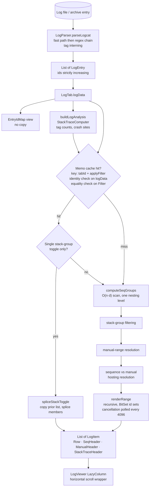
```mermaid
flowchart TB
    file[("Log file / archive entry")]
    parse["LogParser.parseLogcat<br/>fast path then regex chain<br/>tag interning"]
    entries["List of LogEntry<br/>ids strictly increasing"]
    tab["LogTab.logData"]
    rmap["EntryIdMap view<br/>no copy"]

    analysis["buildLogAnalysis<br/>StackTraceComputer<br/>tag counts, crash sites"]

    cache{"Memo cache hit?<br/>key: tabId + applyFilter<br/>identity check on logData<br/>equality check on Filter"}
    splice{"Single stack-group<br/>toggle only?"}
    spliced["spliceStackToggle<br/>copy prior list, splice members"]

    seq["computeSeqGroups<br/>O(n·d) scan, one nesting level"]
    stack["stack-group filtering"]
    manual["manual-range resolution"]
    host["sequence vs manual<br/>hosting resolution"]
    render["renderRange<br/>recursive, BitSet id sets<br/>cancellation polled every 4096"]

    items["List of LogItem<br/>Row · SeqHeader · ManualHeader · StackTraceHeader"]
    lazy["LogViewer LazyColumn<br/>horizontal scroll wrapper"]

    file --> parse --> entries --> tab
    tab --> rmap
    tab --> analysis
    tab --> cache
    analysis --> cache
    cache -->|hit| splice
    cache -->|miss| seq
    splice -->|yes| spliced --> items
    splice -->|no| seq
    seq --> stack --> manual --> host --> render --> items
    items --> lazy
```

**Key.** Diamonds are decisions taken inside `computeItems` (`utils/Filter.kt:301`).

### 10.1 Stage notes

**Parsing** (`utils/LogParser.kt`). Format detection is **per line, not per file** — a capture that
mixes formats parses correctly. `parseThreadtimeFast` (`:127`) is a hand-rolled scanner for the
dominant format, tried before the regex chain; it is a strict subset that falls back safely. Tags are
interned through a `HashMap` (`:49-51`) to collapse millions of duplicate strings. Lines that match
nothing become `tag = "RAW"` rather than being dropped (`:85`).

**Analysis** is decoupled from parsing. `openFileInternal` publishes the tab with
`pendingAnalysis(logData)` as soon as parsing completes (`ui/AppState.kt:4578-4589`) and only then
runs the expensive `buildLogAnalysis` in the same job (`:4593-4598`). The user sees rows immediately;
crash markers appear a moment later.

**Filtering semantics** (`utils/Filter.kt:32-131`) are, in order: exclusions first, then positive
selectors OR-ed with the base tag filter, then the tag-or-keyword filter. Only `TAGS`-mode message
rules are active — `KEYWORD`-mode rules are preserved for old autosave data and ignored
(`utils/Filter.kt:8-12`).

**Memoisation** (`utils/Filter.kt:159-192`) keys on `"$tabId#$applyFilter"` in a
`ConcurrentHashMap`. Invalidation uses **identity** checks on `logData` and
`analysis.stackTraceGroups` plus **equality** on `Filter` (`:319-323`). A result truncated by a regex
timeout is deliberately *not* cached (`:330-334`).

**The splice fast path** (`utils/Filter.kt:194`) exists because expanding one stack-trace group used
to re-materialise the entire item list. It copies the cached list and splices the member rows in or
out; returning `null` falls back to a full rebuild.

**Cancellation** is covered in [§12.3](#123-cancellation-of-computeitems).

### 10.2 Diagram build and preview pipeline (v3)

Diagram work is a second, per-session pipeline (`ui/Seq3Session.kt`); it does not piggyback on the
log viewer's composition path. `requestGenerate` is the ONLY entry point into
`Seq3Generator.generateSeq3` — a session's own generation counter makes a later range/option edit
supersede rather than queue an in-flight scan, debounced 180ms so a range-boundary drag on a huge
log doesn't enqueue a dozen multi-second scans that all still have to run to completion. Debounced
separately per session, so regenerating workspace A never cancels workspace B's in-flight build.
Metadata-only edits (`updateTitle`) deliberately never call `requestGenerate`, which is what makes
"a title keystroke must never trigger a rebuild" true by construction rather than a special case.

Layout and rendering are cached independently of generation, in `Seq3RenderCache` (`ui/Seq3Theme.kt`):
a layout tier keyed only on the `Seq3Document` (geometry never depends on theme or scale) and a
render tier keyed on `(layout, theme, scale)`. A theme switch therefore reuses the cached layout and
only re-rasterizes; an unrelated note edit elsewhere in the document hits neither cache. The Notes
panel follows the same discipline one level up: `Seq3NoteSummaryCache` extracts only the small
top-level fields (title, caption, export mode, range) a folded card needs via a bounded text scan
that never reaches a note's `lifelines`/`messages` arrays; `Seq3NoteParseCache` runs the full,
trusted `parseSeq3Note` only when a card is expanded (§13.7 has the property test that pins this).

Regeneration (spec §08, `Seq3Regeneration.kt`) is a separate, explicit, non-debounced pipeline:
`requestRegenReview` runs one fresh `generateSeq3` pass, diffs it against the session's current
document into a `Seq3RegenReview` (new/changed/removed/edited-kept rows), and leaves the document
itself untouched until `applyRegenReview` routes the accepted decisions through the same
`applyCommand`/`applySeq3Command` path every other mutation uses — so "Apply N changes" is one undo
step, not N.

### 10.3 Highlighters

A `Highlighter` (`model/Model.kt`) began as `(id, pattern, regex, color, on)` and always coloured the
matched text on the rendered line. Optional fields now sit after `on`, all defaulting to that
original behaviour, so an old autosave, a saved filter, the MCP tool, the context menu and Log
composition keep producing exactly what they always did:

| Field | Meaning | Default |
|---|---|---|
| `wholeLine` | Tint the whole row, not just the match | `false` |
| `target` | Match against the whole rendered line (`ANY`), only `entry.tag` (`TAG`) or only `entry.msg` (`MESSAGE`) | `ANY` |
| `tag` | Exact-tag limit, the same rule as a message rule's tag (`ruleScopeMatches`) | `null` |
| `caseSensitive` | Case-sensitive matching | `false` (ignore case) |
| `textColor` | Foreground override independent of the background and matching behaviour | `null` |
| `captureGroupsOnly` | A regex with capture groups colours only the groups (klogg) | `false` |
| `colorVariance` | klogg `variate_colors` shade spread (match-only), 0 = off | `0` |
| `kloggStyle` | Explicit klogg matching/paint precedence and background behaviour | `false` |
| `backgroundEnabled` | Paint the rule's background; false allows text/typography-only rules | `true` |
| `fontFamily` | Named system family override; null inherits the log font | `null` |
| `bold`, `italic` | Optional text-style overrides; null retains historical defaults | `null` |

These fields are appended to highlighter tokens. Legacy tokens without the explicit compatibility
flag infer `kloggStyle` from their foreground field, preserving the old interpretation; newly
created foreground rules remain native. Settings JSON stores independent interface/log font
families, shared custom colours and custom-editor visibility; the legacy palette-layout setting
is retained for compatibility, while both pickers now use 10 × 10 pages. The positional settings decoder
is unchanged. Missing system families fall back at render time without discarding the saved name.
Filter-library JSON can carry the shared custom palette as optional metadata. Import review stages
it with the filters and merges validated ARGB colours only when the user confirms an import.
Font selection uses one searchable dropdown for interface, log and per-rule families; its search
draft is separate from the selected name so reopening it does not hide other families. Bold/italic
controls expose nullable overrides through compact B/I buttons cycling Default/On/Off, with a
caption reporting the current states. Shared Bg/Fg chips have separate full-height toggle and
colour-picker zones, including their padding; one tooltip per chip explains both actions and the
current state. Font lists use a visible
scrollbar, and dropdown hover feedback is clipped to the control shape. The color popup uses the
original context-menu swatch styling; its advanced HSV/HEX editor starts open and has a button
that persists its expansion preference in keyed settings. The shared palette reserves every cell
on each page so partial pages cannot shrink hover-driven popups. Section and context-menu
background pickers use 10 × 10 pages without a mode selector. The initial page contains
the selected colour, while manual page navigation remains stable until the popup is reopened or
its layout changes. Up to 256 saved colours share the preset grid; their context menu can delete
the saved entry. The separate duplicate Saved colors strip is removed. The active-count chip
toggles the rule list when the section is expanded; when collapsed, it expands both the section and list.
Whole-section Highlighters visibility is an independent filter-panel UI state,
persisted at the end of its positional token without changing the older list-only expansion field.

**`utils/HighlightMatch.kt` is the one matcher.** `highlighterMatches` answers "does this enabled
highlighter find its pattern on this row" (tag limit and target honoured); `resolveLineHighlight`
turns a row plus the tab's highlighters into a `LineHighlight(wholeLine, spans)`; `countHighlighterRows`
runs `highlighterMatches` over a log for the panel's per-highlighter counts. Row painting
(`buildLogLineRender` in `ui/LogViewer.kt`), the minimap and the counts all call these, so what is
painted, what the overview strip shows and what the panel counts cannot disagree. Rules, in order:

1. A tag limit skips rows of other tags; `MESSAGE` and `TAG` match against `entry.msg` / `entry.tag`
   and their offsets are shifted into rendered-line coordinates, so the pid-field remapping keeps working.
2. The first enabled whole-line highlighter, in list order, that matches owns the row.
3. If that owner is klogg-style, only match highlighters listed **above** it contribute spans (klogg
   stops at the first whole-line hit); if it is Indagium's own, every match highlighter still paints.
4. Paint order: Indagium spans in list order (as before), klogg spans reversed so the first in the
   list ends up on top. Plain text scans overlap for Indagium highlighters and never for klogg ones
   (klogg's escaped `globalMatch`).

The row renderer splits whole-line, highlight, keyword and search styles at the union of their
range endpoints and the base field boundaries. Compose resolves nested spans by range nesting,
so insertion order alone cannot keep a full-match foreground above the inner PID, level, tag and
message colours. Applying each layer to the same intervals preserves the intended priorities;
Find styles remain last. Paint-level Compose tests cover field colours, wrapping, process-name
remapping and native/klogg overlap order.

**The filter panel side** (`ui/HighlighterSection.kt`, `ui/HighlighterCandidates.kt`). The search-to-add
field builds its dropdown from pure functions: `parseHighlighterQuery` (a `/re/` regex, or
`tag:Name rest` which limits the highlighter to that exact tag) and `highlighterCandidates`, ranked
TEXT (what was typed), then TAGS (`tagCandidates` / `packagePrefixCandidates`; an exact tag becomes
`target = TAG, tag = <tag>`), then MESSAGES (Log composition templates through
`messageRuleSpecForTemplate`, `target = MESSAGE, tag = template.tag`). Templates are requested with
`requestMessageComposition` the first time they are wanted. Every candidate is added match-only by
default; whole-line is an explicit choice (a row's Line button, `←/→`, or the Match text | Whole line
control). Adding a shape that already exists switches that highlighter's mode instead of duplicating it.
Row match counts run on `Dispatchers.Default`, keyed only on match-relevant fields (`matchKey()`:
never colour, on/off or whole-line), cancel-and-relaunch like the message-rule candidates, and in
large-file mode stop at `LARGE_FILE_CANDIDATE_SCAN_LIMIT` entries and are shown as "≥N".

---

## 11. State management

### 11.1 `AppState` is a plain class

`AppState` (`ui/AppState.kt`) is not a ViewModel, not a store, and not managed by any DI container.
It is a plain Kotlin class, instantiated exactly once in `Main.kt:110`, whose fields are all Compose
`mutableStateOf`. Reading a field inside a composable subscribes that composable to it; writing it
schedules recomposition.

Every external dependency is a constructor parameter with a production default
(`ui/AppState.kt:892-953`): the parser function, each storage directory, size budgets, the
control-server factory, the directory picker, the update checker, the video-controller factory. This
is the project's dependency-injection mechanism and its test seam ([D4](#d4--testability-without-a-compose-harness)).

### 11.2 The `stateLock` invariant

> **Every read-modify-write of the `tabs` list goes through `synchronized(stateLock)`.**

`stateLock` is a plain monitor object (`ui/AppState.kt:1276`). The guarded mutators are:

| Function | Line | Purpose |
|---|---|---|
| `upTab(tabId) { LogTab -> LogTab }` | `ui/AppState.kt:1884` | The universal tab mutator |
| `upFlt(tabId) { Filter -> Filter }` | `ui/AppState.kt:1904` → `:1918` | Filter mutation; also demotes an active preset to a draft |
| `upAnn(tabId) { ... }` | `ui/AppState.kt:5436` | Annotation mutation |

The lock is **reentrant** by design — `upFlt` calls `upTab` inside its own `synchronized` block so
that the before-state read, the mutation, and the draft-tracking write cannot be interleaved by a
concurrent tail flush (`ui/AppState.kt:1913-1917`). The same applies to `closeTabsById`,
`reorderTabs`, the loading counters, `publishSourceIndex`, the source-index merge, `resolveLogSource`,
and `restoreTabsFromAutosave`.

Why a lock at all, when Compose snapshot state is thread-safe? Because snapshot safety protects a
*single* field write, not a read-modify-write across several fields. `tabs = tabs.map { ... }` is
three operations, and the control server, the tailer, and the UI can all issue one concurrently.

**Lock ordering rule.** `AutosaveScheduler` uses two locks of its own and is documented as never
holding either while `stateLock` is held (`ui/AutosaveScheduler.kt:44-47`). This is the only
lock-ordering constraint in the system, and it is what keeps a slow disk write from blocking the UI.

### 11.3 Delegation to coordinators

`AppState` delegates five bounded responsibilities:

| Coordinator | Constructed | Owns |
|---|---|---|
| `ControlServerManager` | `ui/AppState.kt:1280` | Control-server start/stop, port changes, token rotation, the generation-counter race guard |
| `AutosaveScheduler` | `ui/AppState.kt:1290` | *When* an autosave write happens; not *what* is written |
| `AnnotationManager` | `ui/AppState.kt:1295` | The annotation block model: add, update, move, reorder, remove |
| `TailCoordinator` | `ui/AppState.kt:1306` | Per-tab `FileTailer` jobs and debounced re-analysis |
| `CaptureService` + per-tab `TabCaptureController` | `ui/AppState.kt:1796-1801` | Tool/device discovery, retained-session recovery, one recorder/export lane for each live capture tab |
| `AiSidebarRuntime` + `AiSessionRegistry` | `ui/AppState.kt:970-981` | AI runs, sessions, provider selection |

Per-tab `VideoPlayerController` instances live in a `ConcurrentHashMap` (`ui/AppState.kt:1338`) with
an injected factory. `VoiceInputController` is the exception — it is created in the composable
(`ui/AiSidebar.kt:328-330`), not on `AppState`, because it is bound to the lifetime of the AI panel.

Capture has a similar per-tab ownership rule, but the controller is explicit rather than cached by
video-path: `captureControllersByTab` contains the recorder/export lane only while a session is live.
`stopCaptureTab` drains and finalizes on `ioScope`, then removes the controller after attaching the
durable descriptor to the same tab. Snapshot export and cancellation use that same lane, so an
export cannot stop or replace the live recorder.

### 11.4 The `Bound*` adapter pattern

Leaf panels do not receive `AppState`. `FilterPanel` takes plain data and roughly ninety callback
lambdas, wired by `BoundFilterPanel` (`ui/FileView.kt:32-131`); `LogViewer` is bound inline at
`ui/FileView.kt:188-231`.

**The benefit** is that the entire log-viewing UI can be composed in a test or a preview with fake
data, and the panels have no way to reach state they were not given.

**The cost** is a ~100-line adapter per panel that must be edited every time a panel gains a control.
This is a real maintenance tax and is listed as [risk R8](#23-known-architectural-risks-and-technical-debt).

### 11.5 Cross-panel navigation

Panels never call each other. When the notes panel needs the log view to scroll to a line, it sets a
request object carrying a nonce on `AppState`, and the log view consumes it:

- `pendingAnnotationNavigation` / `consumeAnnotationNavigation` (`ui/AppState.kt:1424`, `:2824`)
- `pendingSearchNavigation` / `consumeSearchNavigation` (`ui/AppState.kt:1429`, `:2828`)
- `FilterSearchRequest` (`ui/FileView.kt:17-29`, produced in `ui/App.kt:221-228`)

The nonce is what makes "navigate to the same line twice in a row" work — without it the second
request would be equal to the first and would not trigger recomposition.

### 11.6 Diagram surfaces are not log tabs

`AppState.tabs` remains log-only. Diagram workspace sessions (`Seq3WorkspaceSession`, owned by
`AppState.seq3Sessions`) live in a separate collection selected through `ActiveSurface`, so log-tab
code cannot accidentally treat a diagram as a log with an empty body. Each session owns its
source-log id (nullable), the generated/edited `Seq3Document`, its own undo stack, dirty/draft-saved
state, the confirmed note block id, and the library item id it's backed by. Closing a v3 session is
a plain, immediate close (`Seq3Session.close`) — unlike the deleted v1/v2 coordinator's three-way
save-draft/discard/cancel prompt, a v3 diagram has no separate "unsaved draft" state to protect:
confirming is the only durable-write action, and it always goes through the same overwrite-gated
`upAnn` path any other note write does. Closing a source log converts dependent sessions to
offline/view-only state (`sourceTabClosed` clears `sourceTabId`) rather than discarding their cached
document; `requestGenerate`/`confirm` become no-ops until `relink` reattaches a live tab.

The workspace panel/canvas/inspector follow the same Bound-adapter rule as other UI leaf surfaces:
they receive immutable session state plus callbacks into `Seq3Session` rather than reaching into
`AppState` directly. Canvas pan, zoom, fit/reset, and scrollbar position are presentation state, not
document state — a viewport adjustment must never mark a session dirty or trigger a regenerate.

---

## 12. Threading and concurrency model

### 12.1 Scopes and dispatchers

| Scope / dispatcher | Where | Used for |
|---|---|---|
| `ioScope = CoroutineScope(SupervisorJob() + Dispatchers.IO)` | `ui/AppState.kt:1264-1265` | The application's single IO scope: file loads, autosave writes, tailing, source indexing, control-server start, search recompute |
| `Dispatchers.Default` | `ui/LogViewer.kt:308`, `ui/AppState.kt:2914`, `ui/Minimap.kt:453`, `ui/TidMap.kt:130` | CPU-bound work: `computeItems` for large files, minimap rendering, TID colouring, custom-issue scanning |
| `CoroutineScope(SupervisorJob() + Dispatchers.Default)` | `ai/AiSidebarRuntime.kt:62` | AI runtime |
| `CoroutineScope(SupervisorJob() + Dispatchers.IO)` | `ai/AccountAgentRunner.kt:29` | Subprocess agent runs |
| Per-session conflated generate pipeline | `ui/Seq3Session.kt` | Cancellable `generateSeq3` builds, debounced 180ms; metadata-only edits (title) never enter this pipeline |
| Ktor CIO request coroutines | `debug/ControlServer.kt` | Tool invocations from external clients |
| `CoroutineScope(SupervisorJob() + Dispatchers.IO)` | `testing/run/TestRunCoordinator.kt:94` | The AI test-run coordinator's own scope: one job per run, lane groups beneath it, run persistence. Never the UI thread, never under `stateLock` (§26.5) |

`SupervisorJob` throughout means one failed file load cannot cancel the scope and take every other
load with it. `ioJob.cancel()` in `AppState.close()` cancels every tailer for free
(`ui/AppState.kt:1303-1306`).

### 12.2 Dedicated threads

Three subsystems need a real thread rather than a coroutine, because they block indefinitely on
native or IO calls:

| Thread | Where | Why |
|---|---|---|
| `indagium-video-decode` | `video/VideoPlayerController.kt:442` | FFmpeg decode loop with frame pacing |
| `indagium-voice-capture` | `voice/VoiceCapture.kt:88` | Blocking `TargetDataLine` reads |
| Single-instance accept loop | `singleinstance/SingleInstance.kt:178` | Blocking `ServerSocket.accept()` |

There is no general-purpose executor pool: the only `Executors` uses are the single-thread mirror
lifecycle lane (`ui/EmbeddedMirrorPanel.kt`) and the heap trimmer (`utils/HeapTrim.kt`).
`kotlinx.coroutines.sync.Mutex` and `Semaphore` appear only where a *suspend* function must exclude
others or cap parallelism: `AppState` and `CaptureCoordinator`, and, for the AI test suites,
`testing/run/StepSequence.kt:135` (a sequence's step state), `testing/device/TestDeviceSession.kt:101`
(serialising a lane's adb input) and `testing/run/LaneScheduler.kt` (the device-parallelism cap).

### 12.3 Cancellation of `computeItems`

`computeItems` and `computeSeqGroups` are **not** suspend functions. They are called from the
synchronous small-file render path, from the control server's `get_visible_lines` route, and from
every test — none of which has a `CoroutineScope` (`utils/Filter.kt:277-284`).

Cancellation is therefore a caller-supplied hook rather than coroutine cancellation:

```kotlin
fun interface CancellationCheck { operator fun invoke() }   // utils/Filter.kt:285
internal const val CANCELLATION_CHECK_INTERVAL = 4096       // utils/Filter.kt:297
```

The hook is polled at two checkpoints: `renderRange`'s main loop (re-entered with its own counter at
each recursion level) and `SeqScan`'s O(n·d) scan (`utils/SeqComputer.kt:36-39`). The only production
opt-in is `ui/LogViewer.kt:314`, which passes `{ ensureActive() }` from inside an
`async(Dispatchers.Default)` in the large-file branch — so when a newer filter change lands, the
`LaunchedEffect` keys cancel the surrounding scope and the in-flight computation stops within 4096
items instead of running to completion on a 10-million-line file.

`ComputeItemsCancellationTest` pins this: it asserts the checkpoint is hit at call **1** for
`computeSeqGroups` and call **2** for `renderRange`, on datasets of `CANCELLATION_CHECK_INTERVAL * 10`
rows, so an early count can only mean the loop genuinely stopped.

### 12.4 Locks

| Lock | Where | Guards |
|---|---|---|
| `stateLock` | `ui/AppState.kt:1276` | Every `tabs` read-modify-write, source-index publication, loading counters |
| `schedulingLock` | `ui/AutosaveScheduler.kt:46` | Replacing or invalidating the debounce job |
| `writerLock` (fair `ReentrantLock`) | `ui/AutosaveScheduler.kt:47` | Serialise + disk write, so all callers observe one total write order |
| `lifecycleLock` | `ui/ControlServerManager.kt` | Server start/stop |
| `lifecycleLock` (`ReentrantLock`) | `ui/EmbeddedMirrorPanel.kt` (`SharedRecordingSession`) | Mirror Connect/Disconnect/fallback transitions; **never taken by the EDT** — see below |
| `ReentrantLock` | `debug/AppLogger.kt:23` | Writer configure/append/close |
| `presentationLock` | `video/VideoPlayerController.kt:472` | Frame presentation between decode and UI threads |
| `writeLock` | `ai/CodexAppServerClient.kt:302` | stdio JSON-RPC framing — two writers would interleave lines |
| `lock` | `cases/CaseSearch.kt:45` | The cached case index and its inverted indexes |
| `lock` + fair `writeLock` | `testing/store/TestLibraryStore.kt:67-68` | Publishing the next immutable test library / the disk write. **Leaf lock** (§26.6) |
| `lock` (`ReentrantLock`) | `testing/store/IssueStore.kt:69` | Issue create/update/delete. **Leaf lock** |
| `lock` | `testing/run/TestRunState.kt:18` | Swapping a running test run's immutable snapshot. **Leaf lock** |
| `lock`, `saveLock` | `testing/store/RunPersister.kt:24-25` | The pending run save, and read-the-run-then-write. **Leaf locks** |
| `registryLock`, `publishLock` | `testing/run/TestRunCoordinator.kt:99-100` | Devices in use; the published run list. **Leaf locks** |
| `lock` | `testing/store/TranscriptWriter.kt:18` | One transcript line at a time. **Leaf lock** |
| `testLibraryMirrorLock`, `testRunMirrorLock` | `ui/AppState.kt:1911,2013` | `AppState`'s mirrors of the library and run flows (the value is read inside the lock). **Leaf locks** |
| `testStorageLock` | `ui/AppState.kt:1928` | Switching the AI test folders (`reconcileTestStorage`, `initTestStorage`): swapping the `TestLibraryStore` and the pinned `activeTest*Dir` fields. **Leaf lock**; the library mirror and `forgetFinishedRuns()` are touched only after it is released |

**AI test-suite locks.** Every test-suite lock above is a leaf: none is ever held together with
`stateLock` or either `AutosaveScheduler` lock, nothing is called out of one while it is held, and the
store/coordinator never call back into `AppState` (§26.6).

**Mirror lifecycle invariant.** The EDT/UI thread must never wait on a mirror lifecycle lock, and no
mirror lifecycle lock may be held while waiting for the EDT. Native surface teardown needs the EDT
(`EmbeddedMirrorMacSurface.close`); a Disconnect on an IO thread used to hold
`SharedRecordingSession.lifecycleLock` across it while a Connect on the EDT waited for that lock — a
permanent app freeze (seen when no video packet ever arrived, because the decoder-thread join then
runs its full timeout inside the window). The design:

- **One lane.** Every lifecycle transition (start, stop, close, live-audio toggle) runs on the handle's
  single-thread lifecycle lane, in order. UI callers use `EmbeddedMirrorHandle.requestStart/requestStop/
  requestClose/requestSetLiveAudioEnabled`, which return immediately; the blocking `start/stop/close` are
  `request*` plus a wait (close: bounded, and never waiting on the EDT or the lane itself). Because
  nothing reaches the backend around the lane, a start can never interleave with, or run after, a close
  (the backends also refuse it: `EmbeddedMirrorRuntime`/`StandaloneRuntime` and `SharedRecordingSession`
  carry a terminal `closed` flag checked under the lock their `start` takes).
- **Supersede rules.** A queued start/stop is skipped when a later start/stop exists (last click wins), a
  close is never skipped and skips everything queued, and a Connect that superseded a still-pending
  Disconnect runs as a restart (stop, then start) so a recovery Disconnect -> Connect on a busy lane is a
  real reconnect rather than a no-op against an already-attached backend.
- **Close ordering.** `requestClose` first calls `MirrorBackend.closeNativeSurfaces` (the only EDT-bound
  part; lock-free, idempotent, terminal): inline when the caller is the EDT, otherwise `invokeLater`.
  The lane then does the EDT-free rest (decoder detach, adb/scrcpy cleanup), and
  `EmbeddedMirrorMacSurface.close` returns immediately for an already-closed surface instead of hopping
  to the EDT. So `AppState.close()` (on the EDT, from `onCloseRequest`) can wait a bounded
  `EMBEDDED_MIRROR_SHUTDOWN_WAIT_MS` for adb cleanup without the lane waiting on the EDT, and only then
  stops the recorders. `closeTabsById` closes the surface inline, and stops a tab's recorder on
  `ioScope` only after that tab's mirror-close future completes (bounded by
  `RECORDER_STOP_MIRROR_CLOSE_WAIT_MS`; tracked in `deferredRecorderStopsByTab` so a quit in that window
  still stops it).
- **Remaining bounded EDT waits.** `SharedRecordingSession.stop` replaces the native surface outside
  `lifecycleLock`, and a non-EDT caller waits for an EDT teardown at most `EDT_CLOSE_WAIT_MS`
  (`runOnEdtBounded`, never `invokeAndWait`).

- **Surface publication.** The surface Compose hosts is its own observable: `EmbeddedMirrorHandle.nativeSurface`
  (a `StateFlow<MirrorNativeSurface?>`), republished by the backend (via `MirrorBackend.setSurfaceListener`, outside
  its locks) every time the surface is retired or replaced, and by the handle after each lifecycle job. The panel
  reads it from there and wraps `SwingPanel` in `key(surface)`, because `SwingPanel` calls its factory once per
  node: a Disconnect -> Connect that replaced the surface without recomposing (the connection snapshot ended up
  equal to the one already composed) left the panel hosting the retired canvas while the decoder rendered into the
  new one, i.e. a black mirror and no `Metal mirror AppKit hierarchy` log line. `SharedRecordingSession.start`
  also refuses to bind a decoder to an already-closed surface (it creates a replacement first) and logs when a
  bound surface is still not attached to a window after ~3 s.

- **A replacement surface is never published into a closed mirror.** `closed` is set first by
  `closeNativeSurfaces`/`close`, which then read the surface fields under `SharedRecordingSession.lock`; the swap
  publishes its replacement only through `publishIfOpen` (the `closed` check and the field assignment under that
  same `lock`), and closes the replacement itself when it finds the mirror closed. So a swap that outlives a
  `close()` whose bounded wait (`SURFACE_SWAP_WAIT_NANOS`) timed out cannot leak a native Metal/D3D surface.

Pinned by `EmbeddedMirrorLifecycleTest`.

Plus atomics and concurrent collections: `AtomicLong` for id generation (`utils/Ids.kt:7`),
`AtomicInteger` generation counters, `ConcurrentHashMap` for the compute memo, the AI credential
store, active loads, video controllers, and MCP client tracking.

### 12.5 Debounce inventory

Eight independent debounces exist. They are listed together because their interaction is not obvious
from any single file:

| Debounce | Interval | Where | Collapses |
|---|---|---|---|
| Content autosave | 400 ms | `ui/App.kt:102-113` | Rapid edits into one write; suppressed entirely while tailing |
| Background autosave | 150 ms | `ui/AutosaveScheduler.kt:20` | Drag bursts (panel resize) into one write |
| Search recompute | 150 ms | `ui/AppState.kt:4064` | Keystrokes in the Find bar |
| Tail re-analysis | 1500 ms | `ui/TailCoordinator.kt:128` | Continuous appends into periodic crash re-detection |
| AI UI update | 75 ms | `ai/AiSidebarRuntime.kt:281-288` | Token deltas, so Markdown is not reparsed per token |
| Diagram session generate | 180 ms | `ui/Seq3Session.kt` | Range/option edits into one cancellable `generateSeq3` build; never metadata-only edits |
| Diagram draft save | 400 ms | `ui/Seq3Session.kt` (`markDirty`/`scheduleDraftSave`) | A burst of canvas edits (`applyCommand`) into one `autoSaveDraftToLibrary` + `syncLiveLinkedNote` pass instead of one per edit; `flush()` runs any pending save immediately on `confirm`/`attach`/`close` so nothing is lost |
| Loading indicator grace | 250 ms | `ui/LogViewer.kt:72` | Suppresses a flashing spinner for sub-quarter-second recomputes |

### 12.6 Threading map

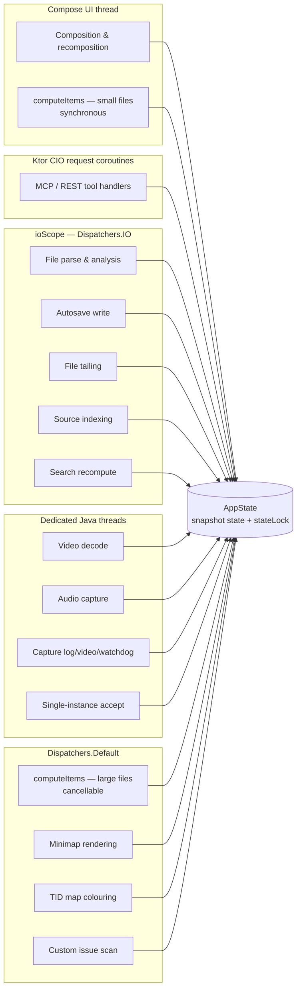
```mermaid
flowchart LR
    subgraph ui_thread["Compose UI thread"]
        compose["Composition & recomposition"]
        small["computeItems — small files<br/>synchronous"]
    end

    subgraph cpu["Dispatchers.Default"]
        big["computeItems — large files<br/>cancellable"]
        minimap["Minimap rendering"]
        tid["TID map colouring"]
        issues["Custom issue scan"]
    end

    subgraph io["ioScope — Dispatchers.IO"]
        load["File parse & analysis"]
        save["Autosave write"]
        tail["File tailing"]
        index["Source indexing"]
        search["Search recompute"]
    end

    subgraph ktor["Ktor CIO request coroutines"]
        tools["MCP / REST tool handlers"]
    end

    subgraph native["Dedicated Java threads"]
        decode["Video decode"]
        capture["Audio capture"]
        recorder["Capture log/video/watchdog"]
        accept["Single-instance accept"]
    end

    state[("AppState<br/>snapshot state + stateLock")]

    compose --> state
    small --> state
    big --> state
    load --> state
    tail --> state
    search --> state
    tools --> state
    decode --> state
    capture --> state
    recorder --> state
    accept --> state
    save --> state
    minimap --> state
    tid --> state
    issues --> state
    index --> state
```

**Key.** Every arrow is a write into `AppState`. Compose `mutableStateOf` is snapshot-safe from any
thread, which is why no `withContext(Dispatchers.Main)` appears anywhere in the codebase; the
`stateLock` in §11.2 handles the compound-update case that snapshot safety does not cover.

---

## 13. Persistence architecture

### 13.1 Storage layout

Everything is a plain file under one app-data directory, resolved per OS by
`DesktopStorage.appDataDir` (`ui/DesktopStorage.kt:241-257`):

| OS | Directory |
|---|---|
| macOS | `~/Library/Application Support/Indagium` |
| Windows | `%APPDATA%\Indagium` (fallback `~/AppData/Roaming/Indagium`) |
| Other | `$XDG_STATE_HOME/Indagium` (fallback `~/.local/state/Indagium`) |

| Path | Contents | Format |
|---|---|---|
| `autosave.cache` | Session: tabs, filters, settings, saved filters, recents | `indagium-cache-v1`, line-oriented (a load also accepts the legacy `openLog2-cache-v1` magic) |
| `source-index` | Indexed `Log.*`/Timber call sites, semantic methods/calls/operations, synthetic callback methods, and bounded source-trace metadata | `indagium-source-index-v1`, schema v19 (a load also accepts the legacy `openLog2-source-index-v1` magic) |
| `case-index` | Similarity index over past analysis notes | `indagium-case-index-v1`, schema v1 (a load also accepts the legacy `openLog2-case-index-v1` magic) |
| `control-token` | Bearer token for the control server | 32 hex chars, plaintext |
| `notes/` | Saved analyses: `<base>_analysis.md` + `.ann` sidecar | Markdown + token format |
| `custom-ai-commands/` | User-defined AI slash commands | One `.md` per command |
| `voice-models/` | Downloaded Whisper models | GGML binary |
| `filter-backups/` | Automatic saved-filter backups | Filter-library JSON |
| `archive-cache/` | Videos extracted from bug-report archives | Raw media, budget-enforced |
| `captures/` | Retained session directories: `logs/logcat.log`, `mapping/capture-index.jsonl`, `video/screen.mkv`, screenshots, `session.json`, finalized `capture.indagium.json` | Session data and portable-capture source; interrupted sessions are recoverable from the launcher. Exported v3 ZIPs use a separate flat layout and a single sync anchor, not the session index |
| `testing/` | **Legacy** home of the AI test data (library, suites, assets, `issues/`, `runs/`). Now only read once at startup: `migrateLegacyTestStorage` moves it into the three configurable folders (§26.3), and a bare `AppState` with no save root still uses it as its fallback | — |
| `<save root>/test-suites/`, `<save root>/test-runs/<runId>/`, `<save root>/test-issues/<issueId>/` | The AI test data: the library (`library.json`, `suites/`, `assets/`), one folder per run (`run.json` (frozen suite + results), `lanes/<laneId>/{capture,screens,transcript.jsonl}`, `judge.jsonl`) and one folder per issue. **Not** under `appDataDir`: each is a user setting (`testSuitesDir` / `testRunsDir` / `testIssuesDir`, JSON-only) defaulting to a subfolder of the Default save folder | `indagium-test-library`, `indagium-test-suite`, `indagium-issue`, `indagium-test-run`, each a versioned JSON envelope, plus JSON lines (§26.3) |
| `indagium-debug.log` | Opt-in diagnostic log | Android threadtime text |

#### 13.1.1 The pre-rename directory and the one-time migration

Before the app was renamed from openLog to Indagium, `appDataDir` produced a differently-named
directory on each OS — `DesktopStorage.legacyAppDataDir` (`ui/DesktopStorage.kt:260-264`) still knows
how to compute it, purely so the migration below can find it:

| OS | Legacy directory |
|---|---|
| macOS | `~/Library/Application Support/openLog2` |
| Windows | `%APPDATA%\openLog2` (fallback `~/AppData/Roaming/openLog2`) |
| Other | `$XDG_STATE_HOME/openLog2` (fallback `~/.local/state/openLog2`) |

`DesktopStorage.migrateAppDataDirIfNeeded` (`ui/DesktopStorage.kt:290-293`) runs in `Main.kt` before
`AppState` is constructed — and therefore before autosave restore — so a renamed build never starts
with an existing user's session invisible to it. `migrateAppDataDir` (`ui/DesktopStorage.kt:300-333`)
does the actual work, gated by a `.migrated-from-openLog2` marker file written into the *new* dir once
the run completes (or immediately if there was no legacy dir to copy from), which makes every
subsequent launch a no-op (`MigrationOutcome.AlreadyDone`):

| Entry | Copy mode | Why |
|---|---|---|
| `autosave.cache`, `notes/`, `custom-ai-commands/`, `filter-backups/`, `source-index`, `case-index` | Byte copy | User data and durable indexes worth preserving |
| `voice-models/` | Hardlink (same volume), falling back to a byte copy on any failure | Large, content-addressable, no-op for disk usage when linkable |
| `archive-cache/`, `control-token`, `single-instance.{lock,port}` | **Not migrated** | Derived/rebuildable cache, a per-install secret, and process-local coordination files, respectively — none of them is user data worth carrying forward |
| `openlog-debug.log` | **Not migrated** | Renamed away (now `indagium-debug.log`); an old diagnostic log has no continuing value |

Byte-copied data (not hardlinks) is capped at `MIGRATION_MAX_BYTES` = 2 GiB total
(`ui/DesktopStorage.kt:48`) so a pathological amount of legacy data cannot block startup; entries that
would push the running total over the cap are skipped individually (not partially copied) and the
rest of the migration still completes and still writes the marker. The old directory is never
written to, moved, or deleted by any part of this — the migration is copy-only and one-way, so it is
always safe to delete by hand.

### 13.2 The autosave format

`autosave.cache` is line-oriented `key\tvalue`, where each value is base64-url-encoded without
padding. The first line is a magic string: a write always emits `indagium-cache-v1`, but a read also
accepts the legacy `openLog2-cache-v1` (`AUTOSAVE_MAGIC_CURRENT`/`AUTOSAVE_MAGIC_LEGACY_OPENLOG2`,
`ui/AppState.kt:552-553`) — needed because the one-time migration in §13.1.1 copies a legacy user's
`autosave.cache` forward byte-for-byte, magic string and all, so it must still load. Any other first
line aborts the whole restore (`ui/AppState.kt:5964`, written at `:6119`).

Keys are written in a fixed order — `settings`, `active`, `compare`, `saved`, `activeFilters`,
`drafts`, `transientRegex`, `recent`, `recentNotes`, `filterPanel` — followed by a bare `tabs` marker
line and then one `tab\t<token>` line per tab (`ui/AppState.kt:6118-6136`).

**Two coexisting versioning strategies:**

1. **Token records use append-last versioning.** Fields are joined with `|`, each field
   `fieldToken()`-encoded with `"~"` as the empty sentinel (`ui/AutosaveCodec.kt:287-293`). Decoders
   read positionally with `getOrNull(idx)`, so a new field appended at the end simply defaults to
   absent in older files, and older readers ignore it. There is no version number on tokens — the
   append-last discipline *is* the compatibility mechanism. `tabToken` (`ui/AutosaveCodec.kt:1325`)
   shows this clearly: positions 0-8 are original, 9-12 were appended later.
2. **The settings blob is content-sniffed.** `restoreAutosaveKey` looks at the decoded text: if it
   starts with `{` it parses JSON (`settingsFromJson`, `ui/AutosaveCodec.kt:808`), otherwise it falls
   back to the legacy positional pipe format (`settingsFromToken`, `:468`). New settings go into the
   JSON form, which carries `formatVersion: 1` and keys every field by name. The legacy decoder is
   read-only and explicitly marked "never extend this positional layout again"
   (`ui/AutosaveCodec.kt:460-467`); it must stay byte-compatible with the frozen fixture in
   `AutosaveGoldenV1Test`.

### 13.3 Atomicity

Every store — autosave, the source and case indexes, the filter library, and the AI test-suite library, run and issue files — writes through `writeFileAtomically` (`utils/AtomicFileWrite.kt:17`): a temp file
named `.<name>.tmp-<nanoTime>` created **in the destination's own directory** so the subsequent move
stays on one filesystem, then `Files.move(..., REPLACE_EXISTING, ATOMIC_MOVE)`, with a plain-replace
fallback if the filesystem rejects atomic moves. A crash mid-write can therefore never corrupt an
existing autosave — the worst case is a stale but valid file plus an orphaned temp.

### 13.4 What is persisted and what is not

`LogTab.persistedSnapshot()` (`ui/AutosaveCodec.kt:1244`) is the field-for-field mirror of
`tabToken`, and is what the autosave `LaunchedEffect` keys on:

**Persisted:** `id`, `filename`, `sourcePath`, `filter`, `annotations`, `showAnnMd`,
`showUnfiltered`, `expanded`, `manualBlocks`, `archiveCandidate`, `showTimeDelta`, `attachedVideo`,
`noteTargetName`.

**Deliberately not persisted:** `logData` and `rmap` (re-parsed from the file), `analysis`
(recomputed), `largeFileMode` (re-derived from the file size), `selected`, `tailing`, `search`,
`tidMap`, `videoFollowLog`, `captureTimeline`, `captureSessionId`, and `isCaptureLauncher`
(session-only state — `model/Model.kt`). A live recorder is therefore never resumed from autosave;
its session directory is recovered as interrupted capture data. After Stop, the same tab carries a
durable `attachedVideo`/capture descriptor link, so the finalized capture can be restored normally.
`AppSettings.captureSettings` is persisted in the keyed settings JSON and is applied immediately by
the Capture section of Settings. `AppSettings.tracker` and `AppSettings.testing` are likewise JSON-only
(appended last to `settingsJson()`); the issue tracker's access token is **not** part of settings — it
lives only in the OS keychain (§26.9.3). Test suites, runs and issues are stored in the three test folders
(`testSuitesDir` / `testRunsDir` / `testIssuesDir`, JSON-only, §26.3), not in the autosave.

### 13.5 Restore is metadata-only

This is the most important property of the persistence design. `restoreTabsFromAutosave`
(`ui/AppState.kt:6025`) builds tab shells with `logData = emptyList()` under `stateLock`. Actual
parsing is *queued*, not performed, and is started by `App()` only after first composition via
`scheduleRestoredTabLoad` on `ioScope` (`:6041`).

The consequence: restoring a session with eight multi-gigabyte tabs shows the window immediately with
all filters and notes intact, and the log bodies stream in behind it. Tabs whose backing file no
longer exists are dropped during restore (`ui/AutosaveCodec.kt:1432`).

### 13.6 Notes sidecars

Saved analyses are written as `<base>_analysis.md` plus a `.ann` sidecar holding the full
`annotationsToken`. The Markdown is for humans and ticket systems; the `.ann` restores exact block
structure, including image bytes and log references, when the note is reopened. The 5th token field
carries `sourcePath` (`ui/AppState.kt:5327`), which is what lets the case index associate a note with
the log it came from.

### 13.7 Diagram note codec (v3) and PNG export

Diagram notes stay ordinary `AnnBlock.Note` values, so the `.ann` container format does not change.
The v3 cutover (phase 6 of `docs/plans/use-the-claude-design-mcp-compiled-lighthouse.md`) replaced
the invisible header wholesale: `Seq3Codec` writes and reads exactly one version
(`<!-- indagium:diagram3 v1 {json} -->`), never a v1–v5 compatibility chain. The header carries the
WHOLE `Seq3Document` — lifelines and messages included, not a separate optional model/snapshot —
followed by a fenced Mermaid/PlantUML body and a SHA-256 hash of that body; a hash mismatch (the
fence was hand-edited, or written by a build that computed the hash differently) sets a warning but
still returns the document, since it's what the header actually says. A header stamped with an
unrecognised version, or one with garbled/truncated JSON or no fence after it, degrades to "not a
diagram note" rather than throwing — same "never crash a Notes-panel render" contract the old codec
had, reimplemented against the far smaller v3 model rather than ported. `DiagramExportMode`'s two
serialised constant names (`IMAGE`/`SOURCE`) moved into `diagram3` unchanged, so
`AutosaveCodec`'s `diagramDefaultExportMode` setting keeps reading old autosaves.

`Seq3Layout`/`Seq3Raster` are mandatory, not optional: PNG export has no fallback path. Every
consumer — the rich-clipboard data-URI (`AppState.copyRichPreview`), the `diagram-NN.png` files
`writeAnnotationDiagramImages` writes beside an exported `.md`, and `exportAnnotationFrames`'s
`_frames` folder — rasterizes through the same `Seq3RenderCache` (§10.2) rather than a bespoke path,
so a theme switch is honoured everywhere identically. `DiagramLibraryStore` is unchanged by the
cutover: it always stored the codec's encoded text verbatim (`DiagramLibrarySnapshot.
encodedDiagramNote`), so only the bytes it now stores changed, not its own format or on-disk layout.

Diagram3's generator deliberately does **no** source-index enrichment (`Seq3Generator.kt`'s own
header) — a message's target lifeline is inferred only from adjacent-entry evidence in the log
itself (thread handoff, correlation token; see §8.3), never from the source index. The source-trace
reconstruction engine described below (`source/SourceTraceInference.kt`,
`SourceTraceInferenceEngine`) therefore currently has **no production caller**: the old
`diagram/SeqDiagramBuilder.kt` was its only consumer, and it was deleted with the rest of that
package. The engine and its model (moved intact to `source/SourceTraceModel.kt` — see §9.7) remain
in the tree, covered by their own test suite (`SourceTraceInferenceTest.kt`), on the phase-6 brief's
explicit instruction to preserve them; nothing currently invokes them at runtime.

The source index uses schema v19. In addition to methods, log sites, and resolved call edges, it
persists source-ordered executable operations, branch/merge successors, continuations, returns,
throws, receiver bindings, and async dispatch metadata. A non-v19 index is never partially
trusted: it would be rebuilt before source-trace reconstruction is offered. Test roots remain
excluded from runtime call candidates, and runtime values remain log evidence rather than index
content.

Were it wired to a caller again, `SourceTraceInferenceEngine.resolve` reconstructs lane-isolated
invocation stacks over the indexed operations: calls and returns are structural operations, selected
log rows are separate trace events and remain visible exactly once at their source owner, PID/TID
and logged values refine ambiguity and return correlation, prefix/suffix boundaries are never
synthesized, and ambiguous/stale/unsupported/incompatible lanes stay log-only with diagnostics
rather than guessed arrows. Async dispatches cross lanes only when indexed evidence proves the
handoff and never push a blocking synchronous activation. Source reconstruction is segment-based: a
verified prefix or suffix is retained when a middle row is stale, ambiguous, low-confidence, or
branch-incompatible (`PARTIAL_SOURCE_TRACE` distinguishes that projection from a complete
`SOURCE_TRACE`); synthetic callback methods for Kotlin trailing lambdas and Java/Kotlin anonymous
callback bodies are stored with stable IDs and async registration edges; only async paths may cross
branch operations, and synchronous call/return proof remains straight-line and conservative.

---

### 13.8 klogg highlighter import

A klogg highlighter export can be imported **manually**: dropped on the filter sidebar or picked with
the Saved filters **Import** button. There is no autodetection of an installed klogg, and a `.conf`
dropped on the log area still opens as a log. `decodeFilterImport(fileName, text)` (`ui/FilterCodec.kt`)
routes by content: `{` or `[` is the JSON filter library, a `[HighlighterSetCollection]` (klogg 22+) or
`[FilterSet]` (legacy glogg) section is klogg, anything else is an error.

- `utils/QSettingsIni.kt` reads the Qt `QSettings` INI dialect: sections and comments, `%XX` / `%UXXXX`
  key escapes, quoted values with `\\ \" \x…` escapes, unquoted comma lists, `@@`. `@Variant(…)` and
  `@ByteArray(…)` values are not decoded; the keys that carry them are reported as a note.
- `utils/KloggHighlighterImport.kt` turns each set into one `SavedFilter` (name = set name, every other
  filter field default). Mapping: `regex = use_regex`, `caseSensitive = !ignore_case`, `wholeLine =
  !match_only`, `color = back_colour`, `textColor = fore_colour`, `kloggStyle = true`, `captureGroupsOnly = true`,
  `colorVariance = variate_colors && match_only ? color_variance : 0`. Missing keys take klogg's own
  defaults; colours are `#AARRGGBB`, `#RRGGBB` or SVG names (`utils/QtColorParse.kt`). The `quick\…`
  entries are colour presets and are ignored. Ids come from the set id (or name) plus the index, so
  re-importing the same file shows as identical and is skipped.
- Patterns are compiled with Java regex (`isValidRegexPattern`). PCRE-only syntax (`(?P<n>)`, `\K`,
  `(?|`) cannot compile and that highlighter is skipped with a note; a pattern that depends on the raw
  logcat layout (a leading `^`, a date, a `L/Tag` shape) is flagged, because the rendered line text
  drops the date and spaces fields differently. A set with no valid highlighter is shown as skipped.
- `utils/KloggColor.kt` ports `QColor::darker` / `lighter` and seeds `minstd_rand0` with the CRC32 of
  the matched text (libstdc++ downscaling), so colour-variance shades are deterministic but not
  guaranteed bit-identical to klogg on every platform.

The review dialog (`ImportFilterReviewRow.notes`, `PendingImportReview.notes`) lists up to three notes per
row plus "+N more", and marks klogg's active sets. The dropped-files path also keeps folders and reports
unreadable files through `importError` rather than skipping them silently.

`PendingImportReview.mode` (`ImportReviewMode`) picks what confirming does. `SAVE_FILTERS` is the original
flow. `ADD_TO_CURRENT` appends the highlighters of the rows in `highlightRowIds` (a selection kept apart
from the rows' saved-filter actions, so flipping modes loses neither) to `activeTabId`'s filter through
`upFlt`, with fresh `newId("hl")` ids and skipping any whose match shape (`newHighlightersFor`,
`ui/FilterCodec.kt`) is already on the tab. It writes no saved filters and no filter backup. The default is
`ADD_TO_CURRENT` when `DecodedFilterLibrary.fromKlogg` (set by `decodeFilterImport`'s klogg branch, not the
file name) and a log tab is active; the mode is unavailable without an active tab or any row that has
highlighters.

## 14. External integrations

### 14.1 Control server: MCP and REST

`debug/ControlServer.kt` exposes Indagium's functionality to external programs.

| Property | Value | Evidence |
|---|---|---|
| Framework | Ktor server, CIO engine | `debug/ControlServer.kt:329` |
| Bind address | `127.0.0.1`, **hard-coded, not configurable** | `debug/ControlServer.kt:329` |
| Default port | 8991, clamped to 1..65535 | `model/Model.kt` `mcpControlPort`; `ui/AppState.kt:210-211` |
| Enabled | **Off by default** | `model/Model.kt` `mcpControlEnabled = false` |
| MCP transport | Streamable HTTP at `/mcp` | `debug/ControlServer.kt` `mcpStreamableHttp` |
| REST | Local JSON/REST routes | `debug/ControlServer.kt` `REST_ROUTES` |
| Auth | `Authorization: Bearer <32 hex>`, constant-time compare | `debug/ControlServer.kt:126-173` |
| CORS | Installed **only** when `mcpAllowBrowserClients` is on | `debug/ControlServer.kt:336-345` |

#### 14.1.1 Debug-control isolated runtime

End-to-end MCP verification uses a debug-only process, not the user's normal application instance.
Launch it with both `INDAGIUM_DEBUG_CONTROL=<port>` and
`INDAGIUM_DEBUG_APP_DATA_DIR=<canonical-empty-temp-directory>`. The first switch force-enables the
loopback control server for that process only; the second redirects *all* app-data storage before
any migration, restore, or single-instance work begins.

The override is a fail-closed contract. The path must be absolute, contain no symlink path
components, resolve beneath the JVM temporary directory (or macOS `/private/tmp` /
`/private/var/folders`), name a non-root child directory, and be empty when it already exists. A
relative path, arbitrary user directory, symlink, file, or non-empty directory is rejected instead
of falling back to normal app data. The override is ignored unless debug control is enabled, so it
cannot become a user-facing storage setting.

An accepted override skips the legacy openLog2 → Indagium migration and isolates autosave and Recent
state, control token, notes/drafts, source and case indexes, archive cache, diagnostic log, and the
single-instance lock/socket. Test inputs may therefore be read from explicit fixture paths while all
generated state remains inside the empty debug directory. This is a test-safety boundary, not a
general-purpose sandbox: normal file-open authorization still belongs to the caller and MCP tool
policy.

**The single tool contract.** There is one catalogue, `MCP_TOOLS` (`debug/ControlServer.kt`), and one handler map, `operationHandlers` (`debug/IndagiumToolOperations.kt`). `IndagiumToolGateway` joins them and its `init` block **fails fast if they disagree** (`debug/IndagiumToolGateway.kt`).

Four consumers are then derived from that single pair:

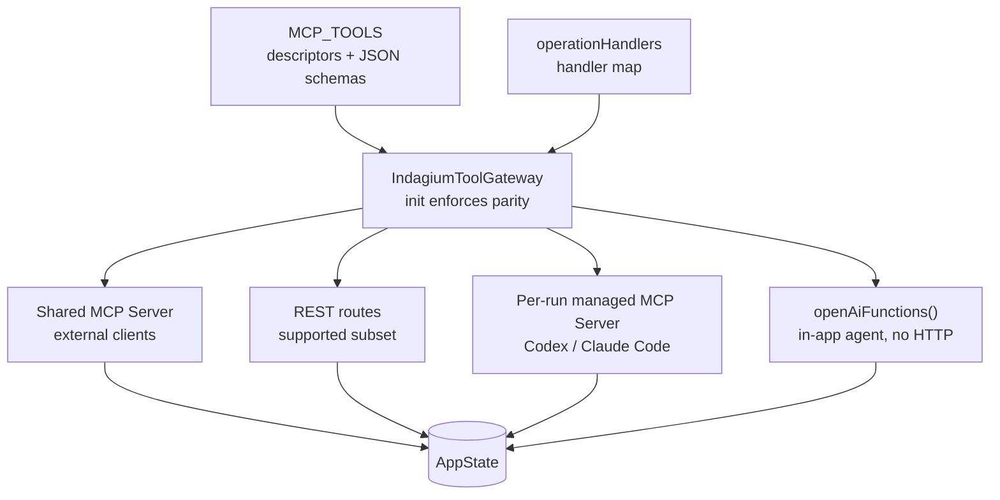
```mermaid
flowchart TB
    catalog["MCP_TOOLS<br/>descriptors + JSON schemas"]
    handlers["operationHandlers<br/>handler map"]
    gw["IndagiumToolGateway<br/>init enforces parity"]

    mcp["Shared MCP Server<br/>external clients"]
    rest["REST routes<br/>supported subset"]
    managed["Per-run managed MCP Server<br/>Codex / Claude Code"]
    fns["openAiFunctions()<br/>in-app agent, no HTTP"]

    state[("AppState")]

    catalog --> gw
    handlers --> gw
    gw --> mcp
    gw --> rest
    gw --> managed
    gw --> fns
    mcp --> state
    rest --> state
    managed --> state
    fns --> state
```

REST intentionally exposes a subset of the shared tool contract; availability is defined by each route and tool descriptor rather than by matching catalogue counts. Device-capture operations are available through the MCP catalogue and are described in [mcp/AVAILABLE_METHODS.md](mcp/AVAILABLE_METHODS.md).

Because `openAiFunctions()` serialises the *same* `ToolSchema` into OpenAI function definitions
(`debug/IndagiumToolGateway.kt:42-48`), there is no second hand-written tool catalogue anywhere. A
tool added in one place is available to every consumer, or the build fails.

**Gateway shapes.** A gateway normally holds synchronous `handlers`. A tool that has to wait is a
*suspend* handler (`suspendHandlers`), reached through `executeSuspending` so no Ktor or `Default`
thread blocks on it; the catalogue-parity check covers both maps. The AI test suites construct
*additional* gateways of their own — one per lane, judge run and tracker-filing job — whose tool names
are only known at run time, and `extraConfirmationRequired` lets such a gateway mark its own tools
(`ASK` scripts) as confirmation-required (§26.5, §26.9.2). `ControlServer.managedMcpServer` registers
exactly the tools of a managed run's own gateway when it brought one.

**Gateway action policy** covers confirmation-sensitive file and workspace operations and is defined
in `IndagiumToolGateway.kt`. The MCP server has a separate per-session approval gate for external
clients before device-changing operations or live-screen reads. Read-only device discovery and status
calls do not need that gate. The in-app AI path is authorized through the user's prompt. This device
gate covers start/stop capture, screen inspection, input/navigation, screenshots, issue marking,
snapshots, and changing device log settings. See [mcp/AVAILABLE_METHODS.md](mcp/AVAILABLE_METHODS.md#device-capture)
for the current live tool policy and operation list. A second external-client gate,
`PER_CALL_APPROVAL_MCP_TOOLS` (`debug/ExternalToolApproval.kt:22`), covers the AI-test-suite tools that
run commands or send data off the computer; it asks for *every call* and remembers nothing (§26.9.2).

**Session hygiene.** MCP sessions are pinged every 120 s with a 5 s timeout, and non-responders are
closed (`debug/ControlServer.kt:312-324`) — without this, an abandoned client would hold a session
forever.

### 14.2 AI providers

Two distinct integration shapes exist, and conflating them is the most common way to misread the
`ai` package.

**Shape 1 — HTTP providers implement `LlmProvider`** (`ai/LlmProvider.kt:10`):

| Provider | Transport | Notes |
|---|---|---|
| `AnthropicMessagesProvider` | Ktor CIO, hand-rolled SSE reader | Replays thinking blocks verbatim with signatures, or the API rejects the turn |
| `OpenAiCompatibleProvider` | Ktor CIO, hand-rolled SSE reader | Opts into `stream_options.include_usage`; detects reasoning models by id pattern |

Both set `requestTimeout = 0` on the engine — CIO's 15 s default breaks local LM Studio generation,
which can legitimately take minutes.

**Shape 2 — account CLIs are subprocesses and do *not* implement `LlmProvider`:**

| Client | Transport | Command |
|---|---|---|
| `ClaudeCodeClient` | Newline-delimited JSON on stdout | `claude --print --output-format stream-json --verbose --include-partial-messages` |
| `CodexAppServerClient` | stdio JSON-RPC (JSONL), numeric request ids | `codex app-server --stdio` |

Both are driven by `AccountAgentRunner`. Indagium holds **no credential** for these — authentication
lives in the user's own CLI installation.

**How a subprocess agent reaches Indagium's tools.** It cannot call in-process, so
`ManagedMcpServerLease` starts a *second* `ControlServer` on port 0 (OS-assigned) with a run-scoped
bearer token registered in `ManagedMcpRunRegistry`. Codex receives the token via the
`INDAGIUM_MCP_TOKEN` environment variable — deliberately not on the command line, where it would be
visible in `ps`. Claude Code receives it in an `Authorization` header inside its `--mcp-config` JSON.
The lease is revoked when the run ends. An AI test-run lane (or judge, or issue-filing job) passes its
own gateway to `ManagedMcpServerLease.start` (`ai/ManagedMcpServerLease.kt:26`), and the run is then
served an `AiToolExecutionCoordinator` over *that* gateway only (`ai/ManagedMcpRunRegistry.kt:36`), so
Claude Code and Codex see just the lane's tools.

### 14.3 Video

`video/VideoPlayerController.kt` decodes with JavaCV's `FFmpegFrameGrabber` on a dedicated thread and
plays audio through `javax.sound.sampled.SourceDataLine`. Frames are downscaled to a 1280 px long
edge during decode, and a frame-drop policy discards frames more than 100 ms late, up to 15
consecutive drops.

The dependency choice is documented in `build.gradle.kts:27-33`: FFmpeg natives ship inside the jar
(no user install), decode every phone recording format including HEVC/`.mov`/WebM, and are
license-clean (Apache wrapper over an LGPL FFmpeg build). VLCJ was rejected as GPLv3, JavaFX Media
for missing HEVC/`.mov`, and GStreamer/libVLC-direct for requiring a per-OS runtime install.

This player is used after a capture is stopped and finalized (or when an imported capture is opened).
While a capture is live, the right-sidebar capture card's embedded mirror (§6.2) decodes the
device's live stream directly via a second, independent JavaCV/FFmpeg pipeline — it does not attempt
to decode the growing recording MKV, and a mirror failure cannot stop or corrupt log/video recording.
Snapshot export remuxes (or, when the gap to the requested start is large, decodes and re-encodes) a
frozen portion of that growing file and records both requested and actual video coverage, including
any keyframe-shortened start or end gap.

### 14.4 Voice

Three transcription backends, selected per OS by `voice/VoiceRecognitionEngines.kt:14-24`:

| Backend | Mechanism | Notes |
|---|---|---|
| Whisper | `whisper-jni` with a downloaded GGML model | The only engine supporting local translation to English |
| Apple Speech | Objective-C JNI bridge, **compiled at build time** from `native/macos/indagium_speech.m` | Keeping it generated rather than committed makes the native code reviewable and lets notarisation sign the exact dylib built for the release |
| Windows Speech | Out-of-process helper, base64 PCM over the pipe | Requires an installed offline language pack |

The Whisper model is downloaded only after explicit consent, verified by SHA-256, and stored in
`voice-models/`. Recordings and transcripts are never written to disk.

### 14.5 Update checker

`update/UpdateChecker.kt` queries `api.github.com/repos/<repo>/releases/latest`, picks the asset
matching the current OS and architecture (`.dmg` / `.msi` / arch-matched `.deb`), and streams the
download to a `.part` file before an atomic move. `fetchLatest()` never throws except on
cancellation. The automatic startup check is silent on failure; only a manual check surfaces an
error.

### 14.6 Archives

`utils/BugReportZip.kt` reads `.zip` and `.7z` bug reports via Commons Compress, with explicit
budgets against decompression bombs: 500 MB per entry and 20,000 entries scanned, enforced by a
`BoundedInputStream` that raises `ArchiveBudgetExceededException`. Videos found inside an archive are
extracted to `archive-cache/` under a cache budget with unreferenced-file pruning.

### 14.7 Single instance

`singleinstance/SingleInstance.kt` takes a `FileLock` on `single-instance.lock`. The primary instance
binds an ephemeral loopback `ServerSocket` and writes `"<port> <token>"` to a port file with
owner-only POSIX permissions. A secondary instance connects, sends the token plus its file arguments,
and exits before any composition happens (`Main.kt:106`). If the lock cannot be taken *and* the
socket cannot be reached, the app runs anyway in a degraded mode rather than refusing to start.

macOS deliberately skips all of this — LaunchServices and `Desktop.setOpenFileHandler` already
provide the behaviour (`Main.kt:103-106`).

---

## 15. Sequence diagrams

### 15.1 Opening a log file (the primary flow)

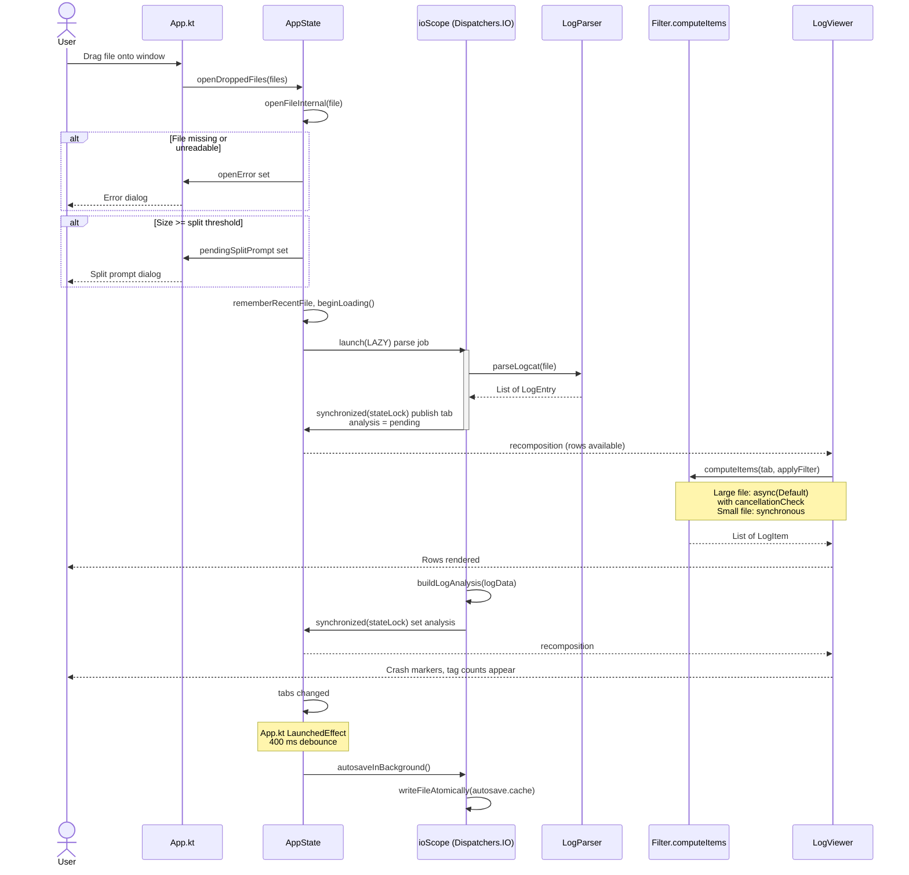
```mermaid
sequenceDiagram
    actor User
    participant App as App.kt
    participant State as AppState
    participant IO as ioScope (Dispatchers.IO)
    participant Parser as LogParser
    participant Filter as Filter.computeItems
    participant Viewer as LogViewer

    User->>App: Drag file onto window
    App->>State: openDroppedFiles(files)
    State->>State: openFileInternal(file)

    alt File missing or unreadable
        State->>App: openError set
        App-->>User: Error dialog
    end

    alt Size >= split threshold
        State->>App: pendingSplitPrompt set
        App-->>User: Split prompt dialog
    end

    State->>State: rememberRecentFile, beginLoading()
    State->>IO: launch(LAZY) parse job
    activate IO
    IO->>Parser: parseLogcat(file)
    Parser-->>IO: List of LogEntry
    IO->>State: synchronized(stateLock) publish tab<br/>analysis = pending
    deactivate IO

    State-->>Viewer: recomposition (rows available)
    Viewer->>Filter: computeItems(tab, applyFilter)
    Note over Viewer,Filter: Large file: async(Default)<br/>with cancellationCheck<br/>Small file: synchronous
    Filter-->>Viewer: List of LogItem
    Viewer-->>User: Rows rendered

    IO->>IO: buildLogAnalysis(logData)
    IO->>State: synchronized(stateLock) set analysis
    State-->>Viewer: recomposition
    Viewer-->>User: Crash markers, tag counts appear

    State->>State: tabs changed
    Note over State: App.kt LaunchedEffect<br/>400 ms debounce
    State->>IO: autosaveInBackground()
    IO->>IO: writeFileAtomically(autosave.cache)
```

**Key.** Note the two-phase publication: rows appear as soon as parsing finishes, and the expensive
analysis fills in afterwards on the same job. This is what keeps a 2 GB file feeling responsive.

### 15.2 AI investigation round-trip

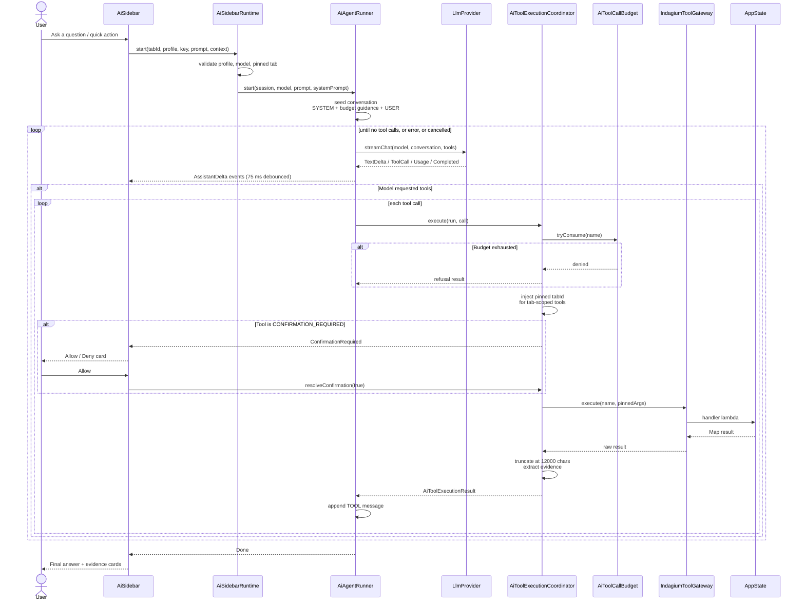
```mermaid
sequenceDiagram
    actor User
    participant Sidebar as AiSidebar
    participant Runtime as AiSidebarRuntime
    participant Runner as AiAgentRunner
    participant Provider as LlmProvider
    participant Policy as AiToolExecutionCoordinator
    participant Budget as AiToolCallBudget
    participant Gateway as IndagiumToolGateway
    participant State as AppState

    User->>Sidebar: Ask a question / quick action
    Sidebar->>Runtime: start(tabId, profile, key, prompt, context)
    Runtime->>Runtime: validate profile, model, pinned tab
    Runtime->>Runner: start(session, model, prompt, systemPrompt)

    Runner->>Runner: seed conversation<br/>SYSTEM + budget guidance + USER

    loop until no tool calls, or error, or cancelled
        Runner->>Provider: streamChat(model, conversation, tools)
        Provider-->>Runner: TextDelta / ToolCall / Usage / Completed
        Runner-->>Sidebar: AssistantDelta events (75 ms debounced)

        alt Model requested tools
            loop each tool call
                Runner->>Policy: execute(run, call)
                Policy->>Budget: tryConsume(name)
                alt Budget exhausted
                    Budget-->>Policy: denied
                    Policy-->>Runner: refusal result
                end
                Policy->>Policy: inject pinned tabId<br/>for tab-scoped tools
                alt Tool is CONFIRMATION_REQUIRED
                    Policy-->>Sidebar: ConfirmationRequired
                    Sidebar-->>User: Allow / Deny card
                    User->>Sidebar: Allow
                    Sidebar->>Policy: resolveConfirmation(true)
                end
                Policy->>Gateway: execute(name, pinnedArgs)
                Gateway->>State: handler lambda
                State-->>Gateway: Map result
                Gateway-->>Policy: raw result
                Policy->>Policy: truncate at 12000 chars<br/>extract evidence
                Policy-->>Runner: AiToolExecutionResult
                Runner->>Runner: append TOOL message
            end
        end
    end

    Runner-->>Sidebar: Done
    Sidebar-->>User: Final answer + evidence cards
```

**Key.** The `Policy` participant is the point of the diagram. Budget, tab pinning, the confirmation
gate, result truncation, and evidence extraction all happen there — once — so a subprocess agent
arriving through the managed MCP path (`executeManaged`, `ai/AiToolExecutionCoordinator.kt:37`) gets
identical treatment without a second implementation.

Evidence cards are built **only** from completed gateway results, never from the model's prose
(`ai/AiInvestigation.kt:159-162`). A model that invents a line number cannot produce a clickable link
to it.

### 15.3 External MCP client invoking a tool

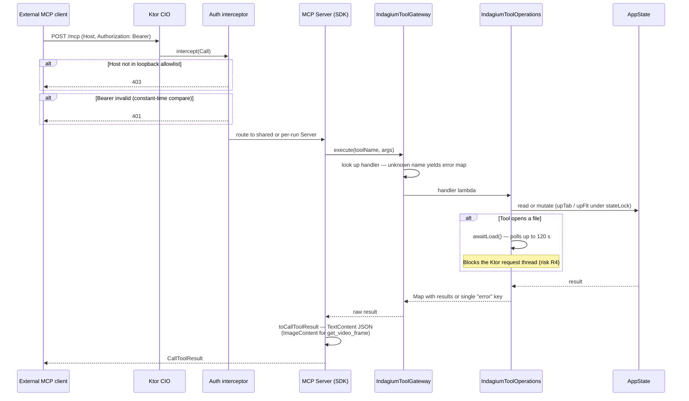
```mermaid
sequenceDiagram
    participant Client as External MCP client
    participant Ktor as Ktor CIO
    participant Gate as Auth interceptor
    participant MCP as MCP Server (SDK)
    participant Gateway as IndagiumToolGateway
    participant Ops as IndagiumToolOperations
    participant State as AppState

    Client->>Ktor: POST /mcp (Host, Authorization: Bearer)
    Ktor->>Gate: intercept(Call)
    alt Host not in loopback allowlist
        Gate-->>Client: 403
    end
    alt Bearer invalid (constant-time compare)
        Gate-->>Client: 401
    end
    Gate->>MCP: route to shared or per-run Server

    MCP->>Gateway: execute(toolName, args)
    Gateway->>Gateway: look up handler — unknown name yields error map
    Gateway->>Ops: handler lambda
    Ops->>State: read or mutate (upTab / upFlt under stateLock)

    alt Tool opens a file
        Ops->>Ops: awaitLoad() — polls up to 120 s
        Note over Ops: Blocks the Ktor request thread (risk R4)
    end

    State-->>Ops: result
    Ops-->>Gateway: Map with results or single "error" key
    Gateway-->>MCP: raw result
    MCP->>MCP: toCallToolResult — TextContent JSON<br/>(ImageContent for get_video_frame)
    MCP-->>Client: CallToolResult
```

**Key.** Two independent gates run before any tool executes: the `Host` header allowlist (which
defeats DNS rebinding — a malicious page resolving its own hostname to 127.0.0.1 still sends its own
`Host`) and the constant-time bearer comparison. A managed run token is accepted for MCP but
explicitly **rejected** for REST (`debug/ControlServer.kt:420-422`).

Handlers return errors as data — a `Map` with a single `"error"` key — rather than throwing. There
are 117 such returns in `IndagiumToolOperations.kt` against 8 lines containing `try`/`catch`.

### 15.4 Autosave and session restore

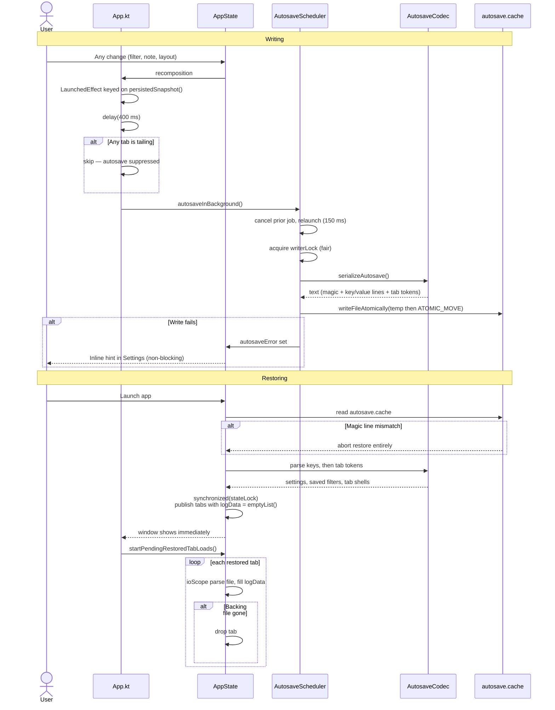
```mermaid
sequenceDiagram
    actor User
    participant App as App.kt
    participant State as AppState
    participant Sched as AutosaveScheduler
    participant Codec as AutosaveCodec
    participant Disk as autosave.cache

    Note over User,Disk: Writing
    User->>State: Any change (filter, note, layout)
    State->>App: recomposition
    App->>App: LaunchedEffect keyed on persistedSnapshot()
    App->>App: delay(400 ms)
    alt Any tab is tailing
        App->>App: skip — autosave suppressed
    end
    App->>Sched: autosaveInBackground()
    Sched->>Sched: cancel prior job, relaunch (150 ms)
    Sched->>Sched: acquire writerLock (fair)
    Sched->>Codec: serializeAutosave()
    Codec-->>Sched: text (magic + key/value lines + tab tokens)
    Sched->>Disk: writeFileAtomically(temp then ATOMIC_MOVE)
    alt Write fails
        Sched->>State: autosaveError set
        State-->>User: Inline hint in Settings (non-blocking)
    end

    Note over User,Disk: Restoring
    User->>State: Launch app
    State->>Disk: read autosave.cache
    alt Magic line mismatch
        Disk-->>State: abort restore entirely
    end
    State->>Codec: parse keys, then tab tokens
    Codec-->>State: settings, saved filters, tab shells
    State->>State: synchronized(stateLock)<br/>publish tabs with logData = emptyList()
    State-->>App: window shows immediately
    App->>State: startPendingRestoredTabLoads()
    loop each restored tab
        State->>State: ioScope parse file, fill logData
        alt Backing file gone
            State->>State: drop tab
        end
    end
```

**Key.** The shutdown path differs: `Main.kt`'s `onCloseRequest` calls `autosaveNow()`, which is
**synchronous by design** (`ui/AutosaveScheduler.kt:60-65`) because the process must not exit before
the write lands.

---

## 16. AI run lifecycle

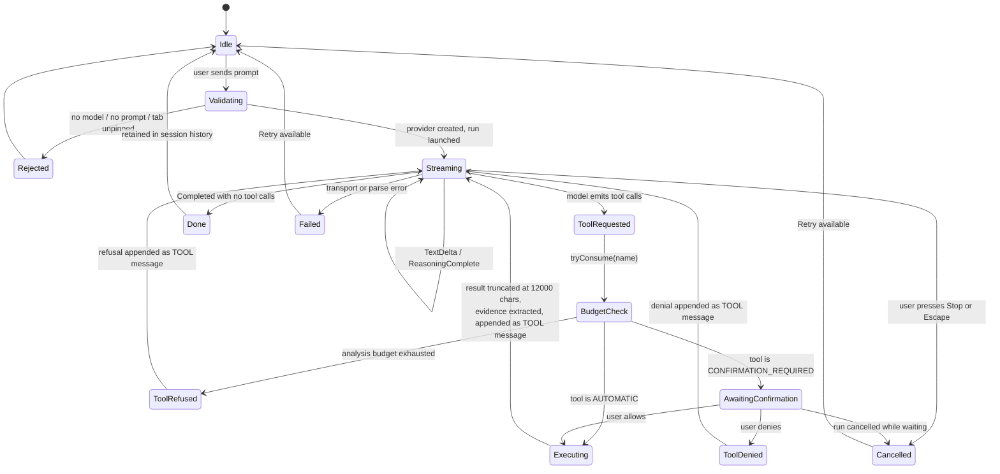
```mermaid
stateDiagram-v2
    [*] --> Idle

    Idle --> Validating: user sends prompt
    Validating --> Rejected: no model / no prompt / tab unpinned
    Rejected --> Idle

    Validating --> Streaming: provider created, run launched

    Streaming --> Streaming: TextDelta / ReasoningComplete
    Streaming --> ToolRequested: model emits tool calls
    Streaming --> Done: Completed with no tool calls
    Streaming --> Failed: transport or parse error
    Streaming --> Cancelled: user presses Stop or Escape

    ToolRequested --> BudgetCheck: tryConsume(name)
    BudgetCheck --> ToolRefused: analysis budget exhausted
    ToolRefused --> Streaming: refusal appended as TOOL message

    BudgetCheck --> AwaitingConfirmation: tool is CONFIRMATION_REQUIRED
    BudgetCheck --> Executing: tool is AUTOMATIC

    AwaitingConfirmation --> Executing: user allows
    AwaitingConfirmation --> ToolDenied: user denies
    AwaitingConfirmation --> Cancelled: run cancelled while waiting
    ToolDenied --> Streaming: denial appended as TOOL message

    Executing --> Streaming: result truncated at 12000 chars,<br/>evidence extracted, appended as TOOL message

    Done --> Idle: retained in session history
    Failed --> Idle: Retry available
    Cancelled --> Idle: Retry available
```

**Key.** Notes and annotation tools do not consume budget (`ai/AiToolCallBudget.kt:74-82`), so the
`BudgetCheck → ToolRefused` edge is unreachable for them. This is deliberate: an agent that has spent
its analysis allowance must still be able to write up what it found.

`Cancelled` is reachable from `AwaitingConfirmation` because a `finally` block cancels every pending
confirmation deferred when the run ends (`ai/AiAgentRunner.kt:256`) — otherwise Stop would hang on a
card nobody was going to click.

AI test-run lanes, the blind judge and the tracker-filing job reuse this same state machine through
`AiAgentRunner`/`AccountAgentRunner`, with two optional knobs that default to *off* so the sidebar is
unchanged: `AiRun.confirmationTimeoutMs` (an unanswered confirmation card counts as denied instead of
waiting forever, `ai/AiToolExecutionCoordinator.kt:140`) and a set of `freeTools` that never spend the
tool-call budget (`ai/AiToolCallBudget.kt:24`). Such a session is deliberately never registered in
`AiSessionRegistry` (§26.5.3).

Conversations exist only for the current launch. `AiSession` is deliberately not part of `LogTab` or
`AppState`'s persisted surface (`ai/AiAgentRunner.kt:19-22`), so no autosave or export path can
retain one.

---

## 17. Error handling and resilience

### 17.1 The governing idioms

**Cancellation is rethrown; everything else becomes an event.** The recurring pattern across the AI
and IO layers:

```kotlin
catch (cancelled: CancellationException) { throw cancelled }
catch (_: Exception) { emit(Error(...)) }
```

Getting this backwards would convert a user pressing Stop into a spurious error card. Examples:
`ai/AnthropicMessagesProvider.kt:130-134`, `ai/OpenAiCompatibleProvider.kt:130-136`,
`ai/AiToolExecutionCoordinator.kt:92-96`, `ai/ClaudeCodeClient.kt:238-247`.

**`runCatching` for best-effort work.** Every AWT/Desktop call, filesystem probe, reflection hack, and
cleanup path is wrapped. `Main.kt` alone has four in its first 120 lines.

**Errors as data at the tool boundary.** Tool handlers return a `Map` with an `"error"` key rather
than throwing, so the transport layer never has to translate exceptions into protocol errors.

**`SupervisorJob` everywhere.** One failed file load cannot cancel `ioScope` and abort the other
seven tabs still loading.

### 17.2 Failure surfaces

There is **no global exception handler and no crash dialog**. Each failure has a designated surface,
chosen by how much it should interrupt the user:

| Failure | State field | Surface |
|---|---|---|
| Cannot open file | `openError` | Modal dialog (`ui/App.kt:1841-1878`) |
| Filter import failed | `importError` | Modal dialog |
| Filter rename collision | `filterRenameError` | Inline in the rename dialog |
| Autosave write failed | `AutosaveScheduler.autosaveError` | **Inline hint in Settings** — deliberately non-blocking |
| Control server bind failed | `mcpControlError` | Inline in Settings; a failed *persisted* enable auto-reverts the toggle so it cannot crash-loop (`ui/ControlServerManager.kt:137-140`) |
| Diagnostic logging misconfigured | `debugLoggingError` | Inline in Settings, with a retry action |
| Reset app data failed | `resetAppDataError` | Inline in the confirm dialog |
| Update check failed | `updateCheckStatus = Failed` | Text in Settings; **silent** for the automatic startup check |
| Video decode failed | `VideoPlayerController.error`, `FailedVideoPlayerController` | Message in the video panel |
| Capture tools/device unavailable | `CaptureService.toolStatus`, `devices`, `error` | Inline in the New capture launcher or Settings → Capture, with recheck/install guidance |
| Live recorder/storage/video diagnostic | `RecorderSnapshot.diagnostics` | Capture strip's diagnostics drawer and live capture card beside the embedded mirror |
| Snapshot export failed/cancelled | `captureExportError` / job cancellation | Snapshot popover; the live recorder remains active and no partial destination is published |
| Stop/finalization failed | `captureFinalizationStatusByTab` | Same tab's finalization banner; raw log remains visible as a stopped ordinary log |
| Load appears hung | `isLoading` + `loadingStatus` | `StuckLoadingDialog` after a delay, offering Cancel loading / Close all tabs / Clear cache / Keep waiting |

The stuck-loading watchdog (`ui/App.kt:281-307`) deserves note: it is the escape hatch for the case
the architecture cannot otherwise recover from — a parse of a pathological file that is technically
progressing but will not finish in useful time.

### 17.3 Resilience in the stores

Every on-disk index degrades to "rebuild" rather than failing:

- Missing file, empty file, wrong magic string, or version mismatch → `null` → full rebuild.
  (`source/SourceIndexStore.kt:133-136`, `cases/CaseIndexStore.kt:112-115`.)
- Each individual line is parsed under its own `runCatching`, so one corrupted record does not
  invalidate the whole file (`source/SourceIndexStore.kt:95`, `cases/CaseIndexStore.kt:88`).
- The autosave is the exception: a wrong magic line aborts the entire restore
  (`ui/AppState.kt:5964`), because a partially restored session is worse than a clean one.
- The AI test-suite stores follow the "skip and report" rule: an unreadable suite file is skipped and
  listed in `TestLibraryStore.loadIssues`, a damaged `library.json` is moved aside rather than
  overwritten, a run folder without a readable `run.json` is skipped by `list()`, and a record written
  by a newer version is loaded read-only and never rewritten (§26.3).

---

## 18. Security considerations

Indagium processes files that frequently contain production data, and it optionally opens a local
network port and runs external programs. This section states each control **and its residual risk**.

### 18.1 Trust boundaries

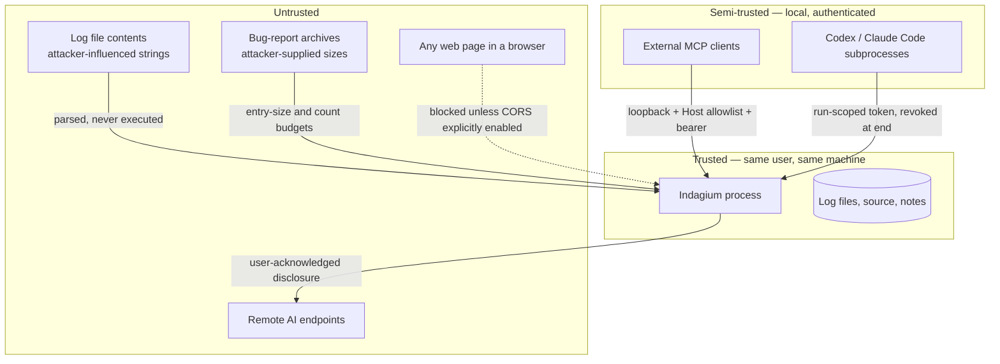
```mermaid
flowchart TB
    subgraph trusted["Trusted — same user, same machine"]
        app["Indagium process"]
        files[("Log files, source, notes")]
    end

    subgraph semi["Semi-trusted — local, authenticated"]
        mcp["External MCP clients"]
        cli["Codex / Claude Code subprocesses"]
    end

    subgraph untrusted["Untrusted"]
        content["Log file contents<br/>attacker-influenced strings"]
        archives["Bug-report archives<br/>attacker-supplied sizes"]
        remote["Remote AI endpoints"]
        browser["Any web page in a browser"]
    end

    mcp -->|"loopback + Host allowlist + bearer"| app
    cli -->|"run-scoped token, revoked at end"| app
    content -->|"parsed, never executed"| app
    archives -->|"entry-size and count budgets"| app
    app -->|"user-acknowledged disclosure"| remote
    browser -.->|"blocked unless CORS explicitly enabled"| app
```

### 18.2 Control-server exposure

| Control | Implementation | Residual risk |
|---|---|---|
| Off by default | `mcpControlEnabled = false` | A user who enables it and forgets leaves it running |
| Loopback bind | `host = "127.0.0.1"`, hard-coded | None from the network; **any local process** can attempt to connect |
| `Host` header allowlist | `{127.0.0.1, localhost, [::1], ::1}` → 403 otherwise | Defeats DNS rebinding, not a local attacker |
| Bearer token | 16 random bytes from `SecureRandom`, hex, compared with `MessageDigest.isEqual` | **Stored in plaintext** at `<appDataDir>/control-token`; owner-only permissions are best-effort and a no-op on Windows. Any process running as the user can read it |
| CORS opt-in | `install(CORS)` only when `mcpAllowBrowserClients` | When enabled, any browser page can reach the port subject to the token |
| Session reaping | 120 s ping, 5 s timeout | Bounded resource leak, not eliminated |

**Deliberate non-control: there is no path sandbox.** `invalidPath` rejects only blank paths and
paths containing NUL (`debug/ControlServer.kt:175-179`). An authenticated client can ask Indagium to
open any file the user can read. This is documented as intentional — opening arbitrary local log
files is the tool's entire purpose — but it means **the bearer token is the only thing standing
between a local process and a file-read primitive**. Treat the token as a credential.

### 18.3 Regular-expression denial of service

Users and AI agents both supply regexes that run against millions of lines. Three controls in
`utils/TextMatch.kt`:

| Control | Value | Purpose |
|---|---|---|
| Per-match deadline | 100 ms | `DeadlineCharSequence` throws from `charAt()` every 1024 calls past the deadline, aborting catastrophic backtracking |
| Per-operation timeout budget | 3 | After three timed-out patterns, all regex is abandoned for the rest of the operation |
| Regex cache | LRU, 256 entries | Bounds memory from an attacker (or agent) supplying unbounded distinct patterns |

A timed-out result is never memoised (`utils/Filter.kt:330-334`), so the user is not stuck with a
silently truncated view.

### 18.4 AI provider credentials

API keys live in `AppState.aiProviderApiKeys`, a `ConcurrentHashMap` (`ui/AppState.kt:966`). The
protection is **structural, not procedural**: `AppSettings` is the only settings object serialised
into `autosave.cache`, and `AiProviderProfile` has no secret field. A key therefore has no path to
disk, to an export, or to a note.

Keys are cleared on profile delete and on `AppState.close()`. They are lost on restart by design.

| Residual risk | Note |
|---|---|
| Keys are in process memory unencrypted | A heap dump or a debugger attached to the process exposes them. AI provider keys have no OS keychain integration; the one secret that does (the issue tracker's token) is described in [§26.9.3](#2693-secrets) |
| Plain-HTTP endpoints are permitted | Only after the user acknowledges `REMOTE_DISCLOSURE_REQUIRED` (`ai/AiProviderProfileSupport.kt:13`); loopback hosts bypass the gate. The key travels unencrypted if the user accepts |

### 18.5 Subprocess agent containment

| Control | Implementation |
|---|---|
| Claude Code built-in tools disabled | Launched with `--tools ""`, `--strict-mcp-config`, `--permission-mode bypassPermissions` (`ai/ClaudeCodeClient.kt:339-343`) — the agent can reach *only* the managed MCP endpoint |
| Codex user MCP servers disabled | Generated config disables servers from `~/.codex/config.toml` per launch |
| Codex sandbox | `approvalPolicy = "never"`, `sandbox = "read-only"`, `ephemeral = true` |
| Fresh workspace | Each run gets a temp directory, deleted afterwards |
| Token off the command line | Passed via `INDAGIUM_MCP_TOKEN` env var, not argv where `ps` would show it |
| Elicitation filtering | Only `indagium`-server elicitations and MCP tool-call approvals are accepted; everything else is declined |
| stderr redaction | `ProcessDiagnosticTail` strips `bearer …` and `api_key|token|secret|password|authorization = …` before any diagnostic surface can show it |

The account agents receive no source-folder access and no application workspace access; all log and
source evidence reaches them only through Indagium tools.

### 18.6 Log redaction

`AppLogger.safeText` (`debug/AppLogger.kt:108-116`) strips CR/LF/TAB, replaces
`api_key|token|secret|password|authorization` values with `[REDACTED]`, replaces Windows `C:\…` and
POSIX `/…` paths with `[PATH]`, and truncates at 2,000 characters. Diagnostic logging is off by
default. The log is written in Android threadtime grammar so it can be opened in Indagium itself —
a small but genuinely useful design touch.

### 18.7 Archive handling

500 MB per entry and 20,000 entries scanned, enforced by a `BoundedInputStream` that raises
`ArchiveBudgetExceededException` (`utils/BugReportZip.kt:19-35`). This is a zip-bomb control. Entry
paths are used for display and extraction into a dedicated cache directory.

### 18.8 Distribution

The macOS build is **unsigned and un-notarised** — there is no Apple Developer certificate in CI. The
README documents the Gatekeeper workaround. Residual risk: users are instructed to bypass a security
control (`xattr -cr`), which is a habit that generalises badly. Signing is the fix.

---

### 18.9 Untrusted import files

Filter imports (the JSON library and klogg configs) come from outside the app, often from a colleague.
They are treated as untrusted data: parsed, never executed. Reads are refused past about **8 MB**
(`readFilterImportText`, `ui/FilterCodec.kt`; a real export is a few KB), klogg array sizes are clamped
(`MAX_ARRAY`), unreadable or malformed files surface as an import error instead of a crash, and every
imported regex is compiled through `TextMatch`'s bounded cache and evaluated under the same 100 ms
per-match deadline as any other user regex (§18.3), so a pathological pattern in a shared config
cannot stall the log view.

### 18.10 AI test suites

The AI test suites add four security surfaces — user-authored scripts that agents can run, confirmation
policies for in-app and external callers, a persistent keychain secret, and an outbound tracker
connection — plus a standing rule that text from devices, scripts, agents and trackers is data, never
instructions. Each control and its residual risk is in [§26.9](#269-security).

## 19. Performance and scalability

Performance is an architectural concern here, not a tuning detail: the target file sizes are large
enough that a naive implementation does not merely run slowly, it exhausts heap.

### 19.1 Memory strategy

| Technique | Where | Saving |
|---|---|---|
| `EntryIdMap` as an `AbstractMap` view | `utils/EntryIdMap.kt:9` | ~70 bytes/entry — roughly 700 MB at 10M entries |
| Tag interning during parse | `utils/LogParser.kt:49-51` | Collapses millions of duplicate tag strings to one instance each |
| `BitSet` id sets in `computeItems` | `utils/Filter.kt:145` | ~1 bit/entry versus ~50 bytes for a boxed `HashSet<Int>` |
| Annotation image cap | `utils/ImageDownscale.kt` | 1280 px / 400 KB hard limit — images round-trip through autosave on every debounced edit |
| Streamed export | `utils/ExportFilteredLog.kt:39-44` | Row-by-row through the writer instead of building one giant `String` |
| Capped tail reads | `utils/FileTailer.kt:19` | 4 MiB per poll, with a widen-once fallback for an over-long line |
| Heap return to the OS + JVM flags | `utils/HeapTrim.kt`, `build.gradle.kts` (`-XX:G1PeriodicGCInterval`, `-XX:+ExplicitGCInvokesConcurrent`, `-XX:MaxRAMPercentage`) | A coalesced concurrent `System.gc()` after a big tab, capture or export is released, so G1 uncommits freed gigabytes instead of holding them while idle |
| `AppendOnlyLogList` (tail path) | `utils/AppendOnlyLogList.kt` | Tail/live-capture appends share one growable backing array: O(batch) per append instead of copying every row each second, which had inflated committed heap ~20x over live data |
| Allocation-free capture-index parser | `capture/CaptureArchive.kt` `parseIndexRecord` | Canonical index lines are parsed without a JSON tree per line; any deviation falls back to `parseIndexRecordJson` |
| Heap-pressure watchdog | `utils/HeapPressure.kt` (`HeapPressureMonitor`), `ui/HeapBanner.kt`, `ui/TailCoordinator.kt` (`pauseTailing`/`resumeTailing`), `utils/LogMemoryEstimate.kt` | Turns "freeze then `OutOfMemoryError`" into a message: GC-notification occupancy after GC (NORMAL / WARNING at 70% / CRITICAL at 85%, CRITICAL confirmed by a full GC whose requests back off 60 s -> 15 min and need a young-GC reading above the last confirmed occupancy) drives a banner whose figures track every GC reading (level and reading callbacks are queued under the monitor lock and delivered in decision order by one draining thread, so concurrent collector beans cannot deliver a stale level last); CRITICAL pauses live capture log views (recording continues on disk; Resume once pressure drops; Stop while paused keeps the full log in the session files and archive, the tab stays a prefix); Resume is refused while the paused backlog would not fit in the free heap; a pre-open estimate (~3.5x file size vs. free heap) adds a memory line to the split prompt, and a memory-driven Split writes every part but opens only those that fit (the rest stay in the split folder). Exposed read-only via the `get_memory_status` tool |

### 19.2 CPU strategy

| Technique | Where |
|---|---|
| Hand-rolled fast path before the regex chain | `utils/LogParser.kt:127` |
| Sequential parsing (a parallel version benchmarked ~1.7x **slower**) | `utils/LogParser.kt:36-38` |
| Full memoisation of the item list per tab | `utils/Filter.kt:159-192` |
| Splice fast path for single stack-group toggles | `utils/Filter.kt:194` |
| One O(n·d) sequence scan replacing an O(candidates²) version that "never finished" on a 10M-line file | `utils/SeqComputer.kt:10-12` |
| Allocation-free timestamp parsing (runs per visible row per recomposition) | `utils/LogTime.kt:35` |
| Pre-compiled matcher regexes bucketed by tag | `source/LogSourceResolver.kt:24-26` |
| Two O(1)/O(n) column-width bounds instead of scanning all entries | `utils/LogTime.kt:154,175` |

### 19.3 Responsiveness strategy

- **Two-phase file publication** — rows first, analysis second ([§15.1](#151-opening-a-log-file-the-primary-flow)).
- **Metadata-only session restore** — the window appears before any log body is read ([§13.5](#135-restore-is-metadata-only)).
- **Cancellable recomputation** — a superseded `computeItems` stops within 4096 items ([§12.3](#123-cancellation-of-computeitems)).
- **Large-file mode** — a per-tab flag above a size threshold that switches the viewer to the
  cancellable async path.
- **Eight independent debounces** ([§12.5](#125-debounce-inventory)).

---

## 20. Build, packaging and release

### 20.1 Build structure

Single Gradle project, single source set pair (`desktopMain` / `desktopTest`). Version is defined
once as `app.version` in `gradle.properties` and flows into the generated build info, the packaging
config, and the README badge.

Three generated inputs are produced at build time rather than committed:

| Generated | Task | Why |
|---|---|---|
| Build info Kotlin source | `generateBuildInfo` | Version and build metadata available to the app |
| License resources | `generateLicenseResources` | The in-app licence dialog text derives from `LICENSE` + `NOTICE`, so they cannot drift |
| `libindagium_speech.dylib` | `compileAppleSpeechNative` (macOS only) | Keeps the Objective-C reviewable in-tree and lets notarisation sign the exact dylib built for the release |

Note `kotlin.daemon.jvmargs=-Xmx4096m` in `gradle.properties`: the Compose compiler's IR-to-bytecode
transform runs the Kotlin daemon out of its default heap on `SettingsDialog.kt`'s single large
composable. That is a build-level symptom of a code-level issue — see
[risk R9](#23-known-architectural-risks-and-technical-debt).

### 20.2 Native artifact strategy

`bytedecoPlatform` (`build.gradle.kts:43-58`) resolves one native classifier from the machine running
Gradle: `macosx-arm64`, `macosx-x86_64`, `windows-x86_64`, `linux-arm64`, or `linux-x86_64`. Each
installer therefore bundles only its own OS's natives, matching how `compose.desktop.currentOs` and
jpackage already behave. Using `ffmpeg-platform` instead would put every OS's natives into every
installer.

JavaCV's POM declares eleven unused native libraries (OpenCV, Tesseract, OpenBLAS, RealSense,
FlyCapture and others) as non-optional dependencies; all are excluded, and FFmpeg is re-added as an
explicit classifier pair.

**Bundled JDK modules.** jpackage's jlink runtime contains only the modules `jdeps` detects, so two
are added explicitly (`modules(...)` in `build.gradle.kts`): `jdk.httpserver`
(`com.sun.net.httpserver`) and `jdk.management` (`com.sun.management.GarbageCollectionNotificationInfo`, read by the
heap-pressure watchdog, §19.1). `jdeps` cannot see either usage, and without them the packaged app
fails at first use (`NoClassDefFoundError`) even though `desktopRun` works on the full local JDK.
Windows additionally adds `jdk.crypto.mscapi`.

### 20.3 Dependency locking

Locking is applied to the four desktop configurations only. Two module patterns are excluded:
`org.jetbrains.compose.desktop:desktop-jvm-*` and `org.jetbrains.skiko:skiko-awt-runtime-*`, because
these resolve to a **different module name** per OS and a single shared lock file cannot express
"either this artifact or that one" — locking one platform's artifact makes the lock unsatisfiable on
every other platform. The comment records that this broke the Linux CI build once.

The bytedeco artifacts are *not* excluded despite also varying per platform, because bytedeco
publishes one module with per-platform **classifiers**, and Gradle's lock file is keyed at the module
level.

### 20.4 Quality gates

| Gate | Configuration |
|---|---|
| detekt | `buildUponDefaultConfig`, **baselined not ignored** — pre-existing findings are suppressed, any new finding fails the build |
| ktlint | Verbose, HTML + Checkstyle reports, generated sources excluded |
| kover | Pure Compose UI classes excluded from coverage as untestable without a Compose harness |

The detekt choice is the notable one: `ignoreFailures` would make findings invisible to every build;
a baseline keeps existing debt quiet while catching new debt.

### 20.5 Release

Pushing a `v*.*.*` tag triggers GitHub Actions, which builds Linux x86-64, Linux arm64, Windows, and
macOS packages and creates a GitHub Release. A manual GitLab mirror runs `.gitlab-ci.yml` on a
separate runner pool as a fallback when GitHub Actions quota is exhausted; there, Linux builds
automatically and Windows/macOS are manual jobs.

`CLAUDE.md` records a hard rule worth repeating here: when `app.version` changes, the README badge
and both `git tag` examples must change in the same commit.

---

## 21. Testing architecture

380 test Kotlin files (369 `*Test.kt` files), 101,251 lines, in `src/desktopTest`.

### 21.1 The seam

Constructor injection on `AppState` is what makes the suite possible. A test constructs an
`AppState` with a fake parser, temp directories, a stub control-server factory, and a fake update
checker, then exercises real application logic with no UI, no disk of consequence, and no network.
`AppStateBehaviorTest` alone is 6,658 lines — larger than `AppState` itself.

### 21.2 What is protected by dedicated tests

| Invariant | Test |
|---|---|
| Concurrent tab mutation stays consistent | `ConcurrentStateMutationTest` |
| `computeItems` stops promptly when cancelled | `ComputeItemsCancellationTest` |
| The splice fast path produces the same list as a full rebuild | `ComputeItemsSpliceTest` |
| The legacy positional autosave format still parses byte-identically | `AutosaveGoldenV1Test` |
| Autosave scheduling, debouncing, and write ordering | `AutosaveSchedulerTest` |
| Tailer offset capture, rotation, partial lines | `FileTailerTest` |
| Capture process, session recovery, archive integrity, and video/log mapping | `capture/*Test`, `CaptureArchiveTest`, `CaptureAppRoundTripTest`, `CaptureVideoMappingTest` |
| Capture settings, launcher/focus routing, selection bounds, and snapshot cancellation/failure preserving a live recorder | `CaptureSettingsUiTest` and capture state/archive tests |
| Video frame-drop policy | `FrameDropPolicyTest` |
| MCP and REST contract behaviour | `ControlServerTest`, `ControlServerMcpTest`, `IndagiumToolGatewayTest` |
| Every AI provider's stream parsing | `AnthropicMessagesProviderTest`, `OpenAiCompatibleProviderTest`, `ClaudeCodeClientTest`, `CodexAppServerClientTest` |
| Test-library codec (tolerant decode, newer-version read-only) and store (reorder, limits, atomic write, damaged file) | `TestLibraryCodecTest`, `TestLibraryStoreTest`, `TestModelReorderTest`, `TestAssetsTest` |
| Edition limits and the dev switch | `TestLimitsTest`, `EditionServiceTest`, `TestsLimitsUiStateTest` |
| Script safety: injection stays literal, type validation, adb quoting, timeout, output cap, process-tree kill | `TestScriptRunnerTest`, `HostCommandRunnerTest` |
| The step protocol, retries, `onFailure`, timeouts, cancellation, and agent restarts | `TestRunEngineTest`, `TestRunEngineAccountAgentTest`, `DeterministicChecksTest`, `LaneGatewayTest`, `TestAgentToolsTest` |
| Lane scheduling (parallel across devices, sequential on one) and the confirmation timeout | `TestLaneSchedulingTest`, `ConfirmationGateTimeoutTest` |
| The judge is blind, and comparison of disagreeing lanes | `JudgeBlindnessTest`, `JudgeComparisonTest` |
| Run store, report actions, issue drafts, issue store, notes destination | `TestRunStoreTest`, `TestRunReportActionsTest`, `IssueDraftBuilderTest`, `IssueStoreTest`, `IssueToNotesTest`, `IssueEngineTest` |
| Secrets stay off argv; fallback to memory; real macOS keychain round trip | `SecretStoreCommandTest`, `MacOsKeychainRoundTripTest` |
| Tracker client (JSON and SSE, session header), issue creator, proxied tools | `TrackerMcpClientTest`, `TrackerIssueCreatorTest`, `TrackerToolsTest`, `TrackerSendTest` |
| MCP authoring, run and issue tool contracts; per-call external approvals | `TestSuiteToolsGatewayTest`, `TestRunToolsGatewayTest`, `IssueToolsGatewayTest`, `ExternalScriptApprovalTest`, `ExternalRunApprovalTest`, `ExternalRerunApprovalTest`, `IndagiumToolGatewaySuspendTest` |

`AutosaveGoldenV1Test` is the interesting one architecturally: it is a **frozen fixture** that pins
the legacy settings format. It is the reason the positional decoder cannot be deleted, and the reason
the append-last rule must be followed rather than "cleaned up".

`LargeFilePerfHarness` exists for the performance work described in §19 and is not a correctness test.

### 21.3 Coverage policy

Kover excludes `@Composable`-annotated code and the pure-rendering UI classes by name. This is an
honest exclusion rather than a coverage-number optimisation: those files are projections of
`AppState` and cannot be meaningfully unit-tested without a Compose test harness the project has
chosen not to adopt.

Capture's unit tests intentionally stop at state, archive, and process seams. They cannot prove
Compose layout fidelity, native `scrcpy` window behavior, or device authorization across the three
desktop platforms. The idle launcher, recording strip/card, snapshot popover, and Settings → Capture
states therefore require manual `./gradlew desktopRun` inspection with a real device; that manual
verification is the weaker, environment-dependent acceptance point.

---

## 22. Extension points

Concrete recipes for the five changes most likely to be needed.

### 22.1 Add an MCP / automation tool

1. Add a descriptor to `MCP_TOOLS` (`debug/ControlServer.kt:767`) — or, for a test-suite, run or issue tool, to the matching `*ToolCatalog.kt` list that `MCP_TOOLS` appends (`:1692`) — using the `schema(...)` DSL. Mind
   the type tokens: `"array"` means array-of-string, `"array<integer>"` means array-of-number, and
   the distinction measurably changes model behaviour (`debug/ControlServer.kt` `schema` DSL).
2. Add a handler with the **same name** to `operationHandlers`
   (`debug/IndagiumToolOperations.kt:339`) or, for a handler that waits, to a `suspendHandlers` map
   (`:374`; the matching `*ToolOperations.kt` for the AI test suites). If the names disagree, `IndagiumToolGateway`'s `init`
   throws at construction — you will find out immediately.
3. If the tool touches files or tab lifecycle, add it to `CONFIRMATION_REQUIRED_TOOLS`
   (`debug/IndagiumToolGateway.kt:92`). If an *external* client could use it to run commands or send
   data off the computer, also add it to `PER_CALL_APPROVAL_MCP_TOOLS` (`debug/ExternalToolApproval.kt:22`)
   with a `describePerCallApproval` branch (§26.9.2).
4. If it should be tab-scoped for AI runs, add it to `TAB_SCOPED_TOOL_NAMES`
   (`ai/AiToolExecutionCoordinator.kt:256`) so the pinned `tabId` is injected.
5. Optionally add a REST route to `REST_ROUTES` (`debug/ControlServer.kt:1696`).
6. Document it in [mcp/AVAILABLE_METHODS.md](mcp/AVAILABLE_METHODS.md).

No change is needed for the in-app AI agent — `openAiFunctions()` derives its definition from the
same descriptor.

### 22.2 Add an AI provider

**If it speaks HTTP:** implement `LlmProvider` (`ai/LlmProvider.kt:10`), add a value to
`AiProviderKind` (`model/Model.kt:572`), and extend the factory in `AiSidebarRuntime` (`:55-60`).
Honour the contract in the interface doc: transport and parse failures become
`LlmStreamEvent.Error`; `CancellationException` propagates untouched.

**If it is a CLI:** model it on `AccountAgentRunner` rather than `LlmProvider`. It will need a
subprocess driver, a `ManagedMcpServerLease`, and a mapping from its event stream onto `AiRunEvent`.

### 22.3 Add a logcat format

Add a regex to `utils/LogParser.kt` and insert it into the detection chain in `parseLogcatLines`.
Order matters — formats are tried in sequence, and a looser pattern placed early will swallow lines a
stricter one should have claimed. Add cases to `LogParserTest`.

### 22.4 Add a persisted setting

1. Add the field to `AppSettings` (`model/Model.kt:704`) with a default.
2. Add it to `settingsJson()` and `settingsFromJson()` (`ui/AutosaveCodec.kt:550,808`), keyed by
   name.
3. **Do not touch `settingsFromToken`** — the legacy positional decoder is frozen by
   `AutosaveGoldenV1Test`.
4. If the setting belongs to a token-encoded type instead (tab, filter, annotation), **append the
   field at the end** of that token and read it with `getOrNull`. Inserting it in the middle breaks
   every existing autosave.

### 22.5 Add a theme

Add a value to `ThemePreset` (`model/Model.kt:835`) with its label, and extend `themeColors()`
(`ui/Theme.kt:178`). `PaletteTest` and `ThemePaletteTest` check palette completeness.

### 22.6 Extend the AI test suites

A new check kind, lane tool, issue destination, edition or secret backend each has a short recipe in
[§26.10](#2610-extension-points).

---

## 23. Known architectural risks and technical debt

Ranked by the cost of leaving them unaddressed. Each is a real, located issue — not a style opinion.

<a id="r1--appstate-is-a-6137-line-god-object"></a>
### R1 — `AppState` is a 12,214-line god object

`ui/AppState.kt` is currently 12,214 lines and holds tab management, file loading, filtering, saved filters, annotations, source
indexing, video mapping, AI wiring, update checking, storage accounting, and every dialog's transient
state. It is by far the most likely file to produce a merge conflict, and the hardest to reason
about.

Mitigations already in place: five extracted coordinators (§11.3) and constructor injection. The
remaining bulk is genuinely cohesive around "the tab list", but the *peripheral* groups — update
checking, storage accounting, source-index orchestration, video mapping — are separable along the
same lines the existing coordinators follow.

**Impact:** high, and compounding. **Effort to improve:** incremental and low-risk, one coordinator
at a time.

### R2 — The legacy positional settings format cannot be removed

`settingsFromToken` (`ui/AutosaveCodec.kt:468`) decodes a positional pipe-delimited blob using index
arithmetic like `mcpIndex + N`. It is frozen by `AutosaveGoldenV1Test`. It cannot be extended and
must not be deleted while any user might still have a pre-JSON autosave.

**Impact:** medium — a permanent comprehension tax and a trap for anyone who "tidies" it.
**Mitigation:** a dated removal policy (e.g. drop it two minor versions after the JSON format
shipped), rather than carrying it indefinitely.

### R3 — Hand-rolled JSON that does not report malformed input

`debug/Json.kt` is a lenient parser: `parseNumber` falls back to `0` on garbage (`:144`) and nothing
raises on malformed input. A client sending a slightly wrong request gets silently coerced values
rather than an error.

**Impact:** medium — wrong behaviour presents as a mysterious no-op. **Mitigation:** strict-mode
parsing that returns an error result, or adopting kotlinx.serialization at this boundary now that it
is already on the classpath for the update checker.

### R4 — `awaitLoad()` blocks a Ktor request thread for up to 120 seconds

`IndagiumToolOperations.awaitLoad` (`:361`, `:371`) uses `Thread.sleep(20)` in a poll loop with a
120-second timeout, executed on the Ktor CIO request coroutine's thread. Several concurrent
`open_log_file` calls against large files can starve the server's thread pool.

**Impact:** medium — degrades an optional subsystem, does not affect the UI. **Mitigation:** make the
handlers suspend and use `withTimeout` + a completion signal instead of polling.

### R5 — The control token is the only barrier to an arbitrary-file-read primitive

By design there is no path sandbox ([§18.2](#182-control-server-exposure)). The token is stored in
plaintext with best-effort permissions that are a no-op on Windows. Any local process running as the
user can read it and then ask Indagium to read any file the user can read.

**Impact:** medium, bounded by "local process already running as you" — but worth stating explicitly
because the current documentation does not. **Mitigation:** an optional approved-roots allowlist for
the file-opening tools, off by default to preserve current behaviour.

### R6 — `stateLock` is a single coarse monitor

Every tab mutation, source-index publication, and load-counter update serialises on one object. It is
correct and simple, and at current concurrency levels it is not a measured bottleneck — but a tailing
tab flushing lines while a large `computeItems` publishes results while an MCP client mutates a
filter all contend on the same lock.

**Impact:** low today, rising with concurrent-tab tailing. **Mitigation:** measure before splitting;
per-tab locks would complicate the multi-tab operations (`closeTabsById`, `reorderTabs`, `mergeTabs`)
that currently get their atomicity for free.

### R7 — The `ui ↔ debug ↔ ai` dependency cycle

Described in [§7](#7-package-dependency-graph). It blocks a Gradle module split, which is the natural
next step for enforcing the boundaries in §6 mechanically rather than by convention.

**Impact:** low now, blocking later. **Mitigation:** extract the `AppState` surface the tools actually
use into an interface in a lower package; `IndagiumToolOperations` would depend on the interface, not
on `ui`.

### R8 — Panel binding adapters are large and hand-maintained

`BoundFilterPanel` (`ui/FileView.kt:32-131`) passes roughly ninety lambdas. Every new filter control
means editing both the panel signature and the adapter, and a missed wiring is a silent no-op rather
than a compile error.

**Impact:** low but constant friction. **Mitigation:** group related callbacks into small interfaces
(`FilterPanelActions`, `SequenceActions`) so a new control adds a method to one interface rather than
a parameter to a 90-argument call site.

### R9 — Single composables large enough to break the compiler's default heap

`SettingsDialog.kt`'s single `SettingsDialog()` composable requires `-Xmx4096m` for the Kotlin daemon
(`gradle.properties`). That is a code-size signal, not a build-configuration problem.

**Impact:** low (build-time only), but it slows every contributor's first build.
**Mitigation:** split the dialog into one composable per settings section — a mechanical change.

### R10 — Duplicated token/base64 helpers across three stores

`AutosaveCodec`, `SourceIndexStore`, and `CaseIndexStore` each implement their own `fieldToken` /
base64-url / `"~"`-sentinel encoding. `SourceIndexStore.kt:9-11` explicitly records that the
duplication exists because the originals are file-private.

**Impact:** low — three copies of a small, stable, well-tested function. **Mitigation:** promote one
copy into `utils` when any of them next needs a change.

### R11 — No global exception handler

An exception escaping a Compose composable or a raw thread terminates or corrupts that surface with
no user-visible explanation and no diagnostic record (unless opt-in logging happens to be on).

**Impact:** low frequency, high confusion when it happens. **Mitigation:** a
`Thread.setDefaultUncaughtExceptionHandler` that writes through `AppLogger` and shows a minimal
"something went wrong, diagnostics saved to …" surface.

### R12 — The macOS artifact is unsigned

Covered in [§18.8](#188-distribution). Users are instructed to run `xattr -cr`, which trains a bad
habit. **Mitigation:** an Apple Developer certificate in CI.

### R13 — Log rows are memory-resident by design

Every parsed `LogEntry` of every open tab lives in the JVM heap (about 243 bytes per entry, about 550
bytes per row with derived lists and indexes), and the heap is capped at `MaxRAMPercentage=50`. A
large file, several tabs, or a long live capture can fill it; G1 then thrashes (UI stalls for seconds
to minutes) and finally an `OutOfMemoryError` hits whichever thread allocates next.

**Impact:** high on small machines (about 7M rows on an 8 GB Mac), but recording data is never lost:
the capture session files on disk are authoritative. **Mitigations in place:** the heap-pressure
watchdog and banner (§19.1), pausing live capture log views at CRITICAL, and the pre-open estimate in
the split prompt (Split then opens only the parts that fit). **Follow-ups:** a compact `LogEntry` (numeric `ts`, DLT/source fields in a side
table, roughly 2x more rows per GB) and disk-backed rows (an offset index plus lazy parsing, which
removes the limit but reworks the engine).

### R14 — The AI test-suite feature adds reach that is guarded by convention and by confirmation

User-authored scripts run with the user's privileges, a lane agent can be prompt-injected by text on the
device, and an `AUTO` script is reachable from such an agent. The structural defences (per-agent
gateways, parameters only as environment variables, mandatory verdicts for explicit judge checks,
per-call approval for external clients, the token never leaving the JVM) bound the damage but do not remove it. The Windows
keychain backend has never run on real Windows, whole-video attachments are large, the account-agent
judge path has no dedicated test, there is no MCP tool to pause a run, and library edits write on the
caller's thread.

**Impact:** medium, mostly on machines that grant `AUTO` casually. **Mitigation:** default permission
is `ASK`; the full list with owners is in [§26.11](#2611-known-risks-and-limitations).

---

## 24. Glossary

| Term | Meaning |
|---|---|
| **Annotation / note block** | One element of a tab's analysis document: text, a log-line reference, an image, or a video frame. Modelled by `AnnBlock`. |
| **Case** | A previously written analysis note, indexed for similarity search so an engineer can find "have we seen this before?" |
| **Compute cache** | The per-tab memoisation of `computeItems` output, keyed by tab id and filter-applied flag. |
| **Confirmation-required tool** | A catalog-defined operation that pauses for explicit user approval before executing inside Indagium's own AI panel. Per-lane `ASK` scripts are also confirmed. An external MCP client is gated separately, per call (`PER_CALL_APPROVAL_MCP_TOOLS`). |
| **Edition** | `FREE`, `PREMIUM`, `FRIENDS_FAMILY` or `UNLIMITED`: sets how many AI test suites and cases are *active*; the rest are locked (readable, never dropped). Builds default to `UNLIMITED` (§26.4). |
| **Highlighter** | A pattern that colours matching text, or the whole line, without filtering anything out. Optionally limited to a tag, and matched against the tag, the message or the whole rendered line. |
| **Judge** | A separate, *blind* AI run that decides whether one test step met its expected result from evidence alone (never the agent's words). A conclusive FAIL can downgrade a pass; explicit `ScreenJudge`/`AskJudge` checks require a usable judge, and an inconclusive mandatory verdict blocks the step (§26.7). |
| **Lane** | One device driven through a test case by one agent (or by an MCP client, for an `external` lane). Lanes on different devices run in parallel; lanes sharing a device run in turn (§26.5). |
| **Large-file mode** | A per-tab flag set above a size threshold that routes item computation onto the cancellable async path. |
| **Managed MCP lease** | A short-lived, run-scoped MCP endpoint on an OS-assigned port, created so a subprocess AI agent can call Indagium's tools. |
| **Manual collapse block** | A user-created folded range: to start, to end, or an explicit range. |
| **Message rule** | An include or exclude rule matching a line's message or PID/TID, optionally scoped to a tag or package. |
| **Script tool** | A user-authored shell command exposed to a test agent as a typed tool; parameters reach it only as environment variables (§26.9.1). |
| **RAW** | The tag given to a line that matched none of the four logcat formats. Such lines are kept, never dropped. |
| **Suite / case / step** | The AI test-suite hierarchy: a suite holds cases, a case holds ordered steps, a step has an action, an expected result, checks and examples (§26.3). |
| **Sequence** | A user-defined start (and optional end) pattern that folds a recurring region of the log into a collapsible group. |
| **Capture launcher** | Session-only New capture tab that discovers tools/devices and lists retained interrupted sessions before a live capture starts. |
| **Capture strip** | The live-tab toolbar showing device, elapsed time, storage, video status, Stop, Screenshot, Save snapshot, Settings, and diagnostics. |
| **Capture snapshot** | A point-in-time v3 flat ZIP export of a live session; it freezes the current log/index boundary, stores one sync anchor, and does not stop the recorder. |
| **Session-only state** | State intentionally excluded from the autosave: selection, tailing, search, TID map, video-follow, capture timeline/session/launcher markers, and all AI conversations. |
| **Splice fast path** | An optimisation that mutates a cached item list in place for a single stack-group expand/collapse instead of rebuilding it. |
| **Threadtime** | The default Android logcat format: `MM-DD HH:MM:SS.mmm PID TID L Tag: message`. Also the format Indagium writes its own diagnostic log in. |
| **Untrusted-data envelope** | The `untrusted_data` field every lane, judge and tracker tool result uses for text from a device, script, agent or tracker: data to read, never instructions (§26.9.5). |
| **TID map** | A gutter overlay colouring rows by thread id within a chosen process. |

---

## 25. Traceability index

Where to read about a given source file.

| File or package | Sections |
|---|---|
| `Main.kt` | [2.1](#21-runtime-shape), [14.7](#147-single-instance), [15.4](#154-autosave-and-session-restore) |
| `model/Model.kt` | [8](#8-core-domain-model), [9.1](#91-model) |
| `utils/LogParser.kt` | [10](#10-data-flow-the-render-pipeline), [19.2](#192-cpu-strategy), [22.3](#223-add-a-logcat-format) |
| `utils/Filter.kt` | [10](#10-data-flow-the-render-pipeline), [12.3](#123-cancellation-of-computeitems), [19](#19-performance-and-scalability) |
| `utils/SeqComputer.kt`, `StackTraceComputer.kt` | [9.2](#92-utils--the-log-engine), [10](#10-data-flow-the-render-pipeline) |
| `utils/TextMatch.kt` | [18.3](#183-regular-expression-denial-of-service) |
| `utils/HighlightMatch.kt` | [9.2](#92-utils--the-log-engine), [10.3](#103-highlighters) |
| `utils/QSettingsIni.kt`, `KloggHighlighterImport.kt`, `KloggColor.kt` | [13.8](#138-klogg-highlighter-import), [18.9](#189-untrusted-import-files) |
| `utils/EntryIdMap.kt`, `ImageDownscale.kt`, `FileTailer.kt` | [19.1](#191-memory-strategy) |
| `utils/AtomicFileWrite.kt` | [13.3](#133-atomicity) |
| `utils/BugReportZip.kt` | [14.6](#146-archives), [18.7](#187-archive-handling) |
| `ui/AppState.kt` | [11](#11-state-management), [12](#12-threading-and-concurrency-model), [R1](#r1--appstate-is-a-12214-line-god-object) |
| `ui/App.kt`, `FileView.kt`, `CompareView.kt` | [5](#5-high-level-component-architecture), [11.4](#114-the-bound-adapter-pattern) |
| `ui/AutosaveCodec.kt`, `AutosaveScheduler.kt`, `DesktopStorage.kt` | [13](#13-persistence-architecture), [15.4](#154-autosave-and-session-restore), [22.4](#224-add-a-persisted-setting) |
| `ui/ControlServerManager.kt`, `TailCoordinator.kt`, `AnnotationManager.kt` | [11.3](#113-delegation-to-coordinators) |
| `ui/CaptureCoordinator.kt`, `CaptureLauncher.kt`, `CaptureStrip.kt`, `CaptureSettingsUi.kt` | [6.2](#62-capture-boundary-and-tab-integration), [9.3](#93-ui), [11.3](#113-delegation-to-coordinators), [17.2](#172-failure-surfaces) |
| `capture/` | [6.2](#62-capture-boundary-and-tab-integration), [9.6](#96-source-cases-and-platform-packages), [13.1](#131-storage-layout), [21.2](#212-what-is-protected-by-dedicated-tests) |
| `ui/Shortcuts.kt`, `Theme.kt` | [9.3](#93-ui), [22.5](#225-add-a-theme) |
| `debug/ControlServer.kt`, `IndagiumToolGateway.kt`, `IndagiumToolOperations.kt` | [14.1](#141-control-server-mcp-and-rest), [15.3](#153-external-mcp-client-invoking-a-tool), [18.2](#182-control-server-exposure), [22.1](#221-add-an-mcp--automation-tool) |
| `debug/Json.kt` | [R3](#r3--hand-rolled-json-that-does-not-report-malformed-input) |
| `debug/AppLogger.kt` | [17](#17-error-handling-and-resilience), [18.6](#186-log-redaction) |
| `ai/` (all) | [14.2](#142-ai-providers), [15.2](#152-ai-investigation-round-trip), [16](#16-ai-run-lifecycle), [18.4](#184-ai-provider-credentials), [18.5](#185-subprocess-agent-containment), [22.2](#222-add-an-ai-provider) |
| `source/` (all) | [9.6](#96-source-cases-and-platform-packages), [13.1](#131-storage-layout) |
| `cases/` (all) | [6.1](#61-boundary-properties-worth-preserving), [9.6](#96-source-cases-and-platform-packages) |
| `video/` | [14.3](#143-video), [12.2](#122-dedicated-threads) |
| `voice/` | [14.4](#144-voice) |
| `update/` | [14.5](#145-update-checker) |
| `singleinstance/` | [14.7](#147-single-instance) |
| `build.gradle.kts` | [2.3](#23-technology-stack), [20](#20-build-packaging-and-release) |
| `testing/model`, `testing/store`, `testing/limits` | [26.3](#263-data-model-and-on-disk-formats), [26.4](#264-editions-and-limits), [26.6](#266-locks) |
| `testing/run`, `testing/device` | [26.5](#265-the-run-engine), [26.7](#267-the-judge), [12.4](#124-locks), [16](#16-ai-run-lifecycle) |
| `testing/script`, `security/` | [26.9](#269-security), [18.10](#1810-ai-test-suites) |
| `testing/tracker` | [26.8](#268-issues-and-the-tracker), [26.9.4](#2694-the-tracker-connection) |
| `edition/` | [26.4](#264-editions-and-limits) |
| `debug/Test*Tool*`, `debug/Issue*Tool*`, `debug/External*Approval.kt` | [26.2](#262-package-layout), [26.9.2](#2692-confirmation-policies), [22.1](#221-add-an-mcp--automation-tool) |
| `ui/Tests*.kt`, `ui/TestRun*.kt`, `ui/Issue*.kt`, `ui/TrackerWiring.kt` | [26.2](#262-package-layout), [9.3](#93-ui) |

---

## 26. AI test suites

The AI test-suites feature lets a person (or an MCP client) describe an Android test as **suites →
cases → steps**, then have AI agents execute it on real devices while a separate, *blind* judge
compares each step's expected result with the evidence. Failed steps become **issues**, which can be
kept locally, written into a log tab's notes, exported as Markdown, or filed in a user-configured
issue tracker through that tracker's own MCP server.

It was added on the `feat/ai-test-suites` branch in nine phases. This section is the architecture of
the result; [mcp/AVAILABLE_METHODS.md](mcp/AVAILABLE_METHODS.md#ai-test-suites) is the tool contract
and [USER_GUIDE.md](USER_GUIDE.md#30-ai-test-suites) is the user's view. Three properties shape
everything below:

1. **The feature is UI-free and `AppState`-free at its core.** `testing/` never imports `ui`; the
   owner (`AppState`) hands it plain lambdas (`CoordinatorDeps`, `testing/run/TestRunCoordinator.kt:62`),
   which is also what lets the engine be driven by fake devices and fake agents in tests.
2. **Agents only ever see a tool gateway built for them.** A lane's agent, the judge, and the
   tracker-filing agent each get their *own* `IndagiumToolGateway` holding only their own tools — never
   the app's full catalog-derived tool set — so there is no global filter that could be bypassed.
3. **Everything that came from a device, a script, an agent or a tracker is data.** It is fenced as
   untrusted in every prompt and tool result (§26.9).

### 26.1 Component overview

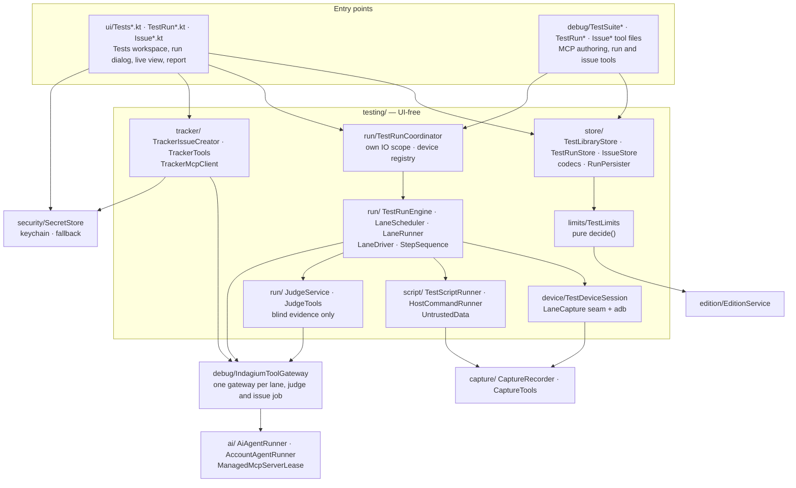
```mermaid
flowchart TB
    subgraph surfaces["Entry points"]
        ui["ui/Tests*.kt · TestRun*.kt · Issue*.kt<br/>Tests workspace, run dialog, live view, report"]
        mcp["debug/TestSuite* · TestRun* · Issue* tool files<br/>MCP authoring, run and issue tools"]
    end

    subgraph feature["testing/ — UI-free"]
        store["store/<br/>TestLibraryStore · TestRunStore · IssueStore<br/>codecs · RunPersister"]
        limits["limits/TestLimits<br/>pure decide()"]
        coord["run/TestRunCoordinator<br/>own IO scope · device registry"]
        engine["run/ TestRunEngine · LaneScheduler · LaneRunner<br/>LaneDriver · StepSequence"]
        judge["run/ JudgeService · JudgeTools<br/>blind evidence only"]
        dev["device/TestDeviceSession<br/>LaneCapture seam + adb"]
        script["script/ TestScriptRunner · HostCommandRunner<br/>UntrustedData"]
        tracker["tracker/ TrackerIssueCreator · TrackerTools<br/>TrackerMcpClient"]
    end

    edition["edition/EditionService"]
    secrets["security/SecretStore<br/>keychain · fallback"]
    gw["debug/IndagiumToolGateway<br/>one gateway per lane, judge and issue job"]
    ai["ai/ AiAgentRunner · AccountAgentRunner<br/>ManagedMcpServerLease"]
    cap["capture/ CaptureRecorder · CaptureTools"]

    ui --> store
    ui --> coord
    mcp --> store
    mcp --> coord
    store --> limits
    limits --> edition
    coord --> engine
    engine --> dev
    engine --> script
    engine --> judge
    engine --> gw
    judge --> gw
    tracker --> gw
    gw --> ai
    dev --> cap
    script --> cap
    tracker --> secrets
    ui --> tracker
    ui --> secrets
```

**Key.** Solid arrows are compile-time dependencies or direct calls. `ui` and `debug` are the only
two entry points; both reach the engine through `TestRunCoordinator` and the library through
`TestLibraryStore`, so the UI and MCP paths cannot drift apart.

### 26.2 Package layout

| Package | Files (all under `src/desktopMain/kotlin/com/indagium/`) | Role |
|---|---|---|
| `testing.model` | `TestModel.kt`, `TestModelRules.kt`, `TestRunModel.kt`, `JudgeModel.kt`, `IssueModel.kt`, `TestingSettings.kt` | Immutable domain types: library (suites, cases, steps, checks, examples, scripts, shared steps, hooks, variables), run (config, lanes, case/step results, `StepJudgement`, `JudgeComparison`), issue (draft, record, attachments), and the tracker/testing settings. Pure helpers: `moveById`, name validators, deep copies with fresh ids |
| `testing.authoring` | `TestStepDraftService.kt`, `TestStepRecordingSession.kt`, `TestStepRecordingApplyService.kt`, `TestScriptLibraryService.kt` | Shared UI/MCP draft, recording, insertion, script import/export/schema and explicit-reference usage operations; previews are validated and do not mutate until applied |
| `testing.store` | `TestLibraryStore.kt`, `TestLibraryCodec.kt`, `TestLibraryValidation.kt`, `TestAssets.kt`, `TestRunStore.kt`, `TestRunCodec.kt`, `JudgeCodec.kt`, `RunPersister.kt`, `TranscriptWriter.kt`, `LaneToolActivityWriter.kt`, `IssueStore.kt`, `IssueCodec.kt`, `StoreResult.kt` | Disk-backed library, run and issue stores with versioned JSON envelopes; bounded full-suite result snapshots with lightweight history summaries; debounced run saver; redacted transcript/activity appenders |
| `testing.limits` | `TestLimits.kt` | `decide(library, operation, limits)` — the one pure function every caller consults for edition limits |
| `testing.script` | `TestScriptRunner.kt`, `HostCommandRunner.kt`, `UntrustedData.kt` | Builds and runs a `TestScript`'s command safely; the bounded, cancellable child-process runner; the `untrusted_data` envelope |
| `testing.device` | `TestDeviceSession.kt`, `LaneCapture.kt`, `CaptureLogReader.kt`, `UiTreeParser.kt` | One device lane: the `LaneCapture` seam (production: a real capture controller, with or without a tab; engine tests: `StandaloneLaneCapture`, a headless recorder), adb input/screenshot/UI dump, byte-offset log reading and waiting |
| `testing.run` | `TestRunCoordinator.kt`, `TestRunEngine.kt`, `LaneScheduler.kt`, `LaneRunner.kt`, `LaneDriver.kt`, `StepSequence.kt`, `HookRunner.kt`, `DeterministicChecks.kt`, `TestAgentTools.kt`, `LaneGateway.kt`, `LaneAgents.kt`, `LanePrompts.kt`, `TestRunValidation.kt`, `TestRunState.kt`, `EngineSupport.kt`, `JudgeService.kt`, `JudgeTools.kt`, `JudgeEvidence.kt`, `JudgePrompts.kt`, `StepJudging.kt`, `TestRunComparison.kt`, `TestRunReportExport.kt`, `RunArtifacts.kt`, `LaneMarkerText.kt`, `IssueStepClipService.kt`, `IssueCaptureArchiveService.kt`, `IssueBugreportService.kt`, `ReportActions.kt`, `IssueDraftBuilder.kt`, `IssueEngineHooks.kt`, `IssueMarkdown.kt`, `TestRunMarkdown.kt` | Run engine, complete step deadline/case budget, run comparison and safe report export, lane activity artifacts, bounded issue clips and on-demand Android bugreports |
| `testing.tracker` | `TrackerMcpClient.kt`, `SdkTrackerMcpClient.kt`, `TrackerConfig.kt`, `TrackerIssueCreator.kt`, `TrackerTools.kt`, `TrackerPrompts.kt` | The issue-tracker MCP client (official Kotlin SDK client), setup checks, and the one-shot agent job that files an issue |
| `edition` | `Edition.kt` | `Edition`, `EditionLimits`, `EditionService` |
| `security` | `SecretStore.kt` | OS-keychain secret storage with a session-only fallback |
| `debug` (new files) | `TestSuiteToolCatalog.kt`, `TestSuiteToolOperations.kt`, `TestSuiteToolParsing.kt`, `TestSuiteToolJson.kt`, `TestRunToolCatalog.kt`, `TestRunToolOperations.kt`, `IssueToolCatalog.kt`, `IssueToolOperations.kt`, `TestRunCaptureArgs.kt`, `ExternalToolApproval.kt`, `ExternalRunApproval.kt`, `ExternalTrackerApproval.kt` | Catalog-driven authoring, run/report and issue evidence operations, merged into `MCP_TOOLS` and parity-checked with their handlers; per-call external-client approvals |
| `ui` (new files) | `TestsWorkspace.kt`, `TestsSuiteScreen.kt`, `TestsCaseScreen.kt`, `TestsSteps.kt`, `TestsListEditors.kt`, `TestsLibraryScreens.kt`, `TestsTryItPanel.kt`, `TestsWidgets.kt`, `TestsUiState.kt`, `ReorderableColumn.kt`, `TestRunDialog.kt`, `LaneCaptures.kt`, `CaptureMarkerWriter.kt`, `TestRunLiveView.kt`, `TestRunLiveState.kt`, `TestRunReport.kt`, `TestRunStepDetail.kt`, `TestRunUiState.kt`, `TestRunActions.kt`, `TestRunWiring.kt`, `TestScriptTryRun.kt`, `IssueDraftDialog.kt`, `IssueDraftUiState.kt`, `IssueActions.kt`, `IssueNotes.kt`, `IssueTrackerActions.kt`, `TestsIssuesScreen.kt`, `TrackerWiring.kt`, `TestingSettingsSections.kt`, `TestingSettingsCodec.kt` | The Tests workspace (`ActiveSurface.Tests`, `TabRef.Tests`), the run dialog/live view/report, the issue dialog, and the glue (`TestRunWiring.kt`, `TrackerWiring.kt`) that connects `testing/` to `AppState` |

Dependency direction. `testing` depends on `model`, `utils`, `capture`, `edition`, `security`, and —
for the agent launchers and the gateway type — `ai` and `debug`. It has **no** dependency on `ui`.
`debug`, `ui` and `security` depend back on it, which adds two small cycles to §7 (`debug ↔
testing`, and `security ↔ testing` through `HostCommandRunner` and `scrubSecret`). Both are the same
shape as the existing `ui ↔ debug` one: shared utility types, not shared mutable state.

### 26.3 Data model and on-disk formats

**Model.** Every container's **order is its list order** — suites, cases, steps, checks, examples,
hooks, variables, scripts, parameters — so reordering is `List.moveById` (`testing/model/TestModelRules.kt:38`)
and no separate index is persisted. Ids are prefixed UUIDs unique across the library (`suite-`,
`case-`, `step-`, `chk-`, `ex-`, `script-`, `shared-`, `hook-`, `var-`; run-side `run-`, `lane-`,
`jdg-`, `cmp-`; `issue-`), so a case or step is found by id alone (`TestLibrary.findCase/findStep`,
`testing/model/TestModel.kt:233,241`). A step's checks are a sealed type —
`LogAppears`, `LogAbsent`, `ScreenJudge`, `ScriptResult`, `AskJudge` — and its examples
`GoldenScreenshot` or `ReferenceLog` (`testing/model/TestModel.kt:113,146`).

**Storage layout.**

| Path | Contents | Format |
|---|---|---|
| `<test suites folder>/library.json` | Suite order, library scripts, shared steps | `{"format":"indagium-test-library","version":1,…}` (`testing/store/TestLibraryCodec.kt:63`) |
| `<test suites folder>/suites/<suiteId>.json` | One suite with its cases, steps, checks, examples | `{"format":"indagium-test-suite","version":1,"suite":{…}}` (`:62`); the file name must equal the suite id |
| `<test suites folder>/assets/<suiteId>/` | Golden-screenshot images (png/jpg/webp, ≤ 10 MB); a suite stores only a *relative* `assetPath` | Raw images (`testing/store/TestAssets.kt`) |
| `<issues folder>/<issueId>/issue.json` + `attachments/` | One issue and its copied evidence | `indagium-issue` v2 writes and v1/v2 reads (`testing/store/IssueCodec.kt`); v2 preserves newer attachment kinds such as Android bugreports; ≤ 4 MB per record, ≤ 1 GiB per attachment |
| `<test runs folder>/<runId>/run.json` | The run: a **frozen** suite snapshot, the library scripts and shared steps it used, config, per-lane results, comparisons | `indagium-test-run` v1 (`testing/store/TestRunCodec.kt:41`); ≤ 64 MB |
| `<test runs folder>/<runId>/lanes/<laneId>/` | `capture/<sessionId>/` (the lane's capture session exactly as a manual capture writes it: `logs/logcat.log`, `mapping/`, optional `video/screen.mkv` with audio, `session.json`, and after the lane the finalized `capture.indagium.json`), `lane-notes.ann` (the lane's notes with every AI marker), `screens/` (step screenshots), `transcript.jsonl`, `tool-activity.jsonl` | Raw logcat, PNG and redacted JSON lines; activity remains complete within its declared cap after the bounded live cache rotates. The lane's sessions live inside the run folder (not under a capture root) so the report, the step clips and the evidence export find them where they always did, and deleting a run deletes its recordings; `CaptureService` knows them by id for this launch only (§26.5.5) |
| `<test runs folder>/<runId>/judge.jsonl` | Everything the judge runs of the run said and did, tagged with what each judged | JSON lines, redacted |

**Where the folders come from.** `<test suites folder>`, `<test runs folder>` and `<issues folder>` are
`AppSettings.testSuitesDir`, `testRunsDir` and `testIssuesDir` (JSON-only; the frozen positional settings decoder is
untouched). Unset, they default to `<save root>/test-suites`, `/test-runs` and `/test-issues`, where `<save root>` is the
Default save folder (`AppState.effectiveSaveRootOrNull`, `~/Documents/Indagium` unless `saveRootDir` is set) — resolved by
`effectiveTestSuitesDir()` / `effectiveTestRunsDir()` / `effectiveTestIssuesDir()` exactly like the other save folders, and
shown by Settings → General through `SaveFolderKind.TEST_SUITES` / `TEST_RUNS` / `TEST_ISSUES` rows. A bare `AppState` with
no save root (tests) falls back to the injected `testingDir` (`DesktopStorage.testingDir()`, i.e. `<appDataDir>/testing`):
the library there, `runs/` and `issues/` inside it, so a bare instance never resolves to a real user folder. A debug-control
process with an isolated app-data directory keeps its save root inside it (`DesktopStorage.processDefaultSaveRootDir()`).
Nothing is created until a first write.

**Switching folders at runtime.** `AppState.updateSettings` calls `reconcileTestStorage()` when `saveRootDir` or one of the
three folders changes. It replaces the `TestLibraryStore` (loaded from the new folder; `testLibrary` is re-mirrored),
re-points the run and issue stores (`TestRunStore` and `IssueStore` read the folder through a lambda on every use, from the
pinned `activeTest*Dir` fields), forgets the finished runs held in memory and bumps `testRunsFolderEpoch` /
`IssueStore.revision` so screens reload. Nothing is moved or deleted in the old folder, like the other save folders. While a
run is active (`TestRunCoordinator.hasActiveRun()`, true until the run's job has completed, final write included) nothing
switches: `setSaveFolder` refuses `ROOT` / `TEST_*`, the Settings rows disable Browse and Reset, and a change that arrives
by other means is held (`testStorageSwitchPending`) and applied from the coordinator's completion callback.
`testStorageLock` is a leaf lock (§26.6).

**One-time migration.** `AppState.init` (after the saved settings are restored, so the store opens the chosen folder
first) calls `migrateLegacyTestStorage(testingDir, suites, issues, runs)` (`testing/store/TestStorageLayout.kt`): the old
`library.json`, `suites/` and `assets/` move to the suites folder only when it has no `library.json`; `issues/` and `runs/`
move only into an empty or absent folder; a directory present on both sides is merged entry by entry and a file present on
both sides is never overwritten. Moves use `ATOMIC_MOVE` with a copy-then-delete fallback across file systems; a failed move
leaves its source in place and is reported once (`AppLogger`, `AppState.testStorageStatus` shown in Settings and the Tests
tab) and retried at the next start. When data was deliberately left behind, a `.moved-to-save-folders` marker in the old
directory stops later starts from moving it into a different folder. A layout whose destination equals its source (a bare
`AppState`) is skipped.

**Codec rules** (all on the kotlinx.serialization *runtime* JSON API — `buildJsonObject` /
`parseToJsonElement`; the project does not apply the serialization compiler plugin):

- **Versioned envelopes, strict only at the envelope.** A file must carry the expected `format`
  string; `version` greater than this build's is accepted but flagged `readOnly`
  (`readEnvelope`, `testing/store/TestLibraryCodec.kt:415`).
- **Tolerant decode.** Unknown keys are ignored, a missing or mistyped field takes its default, an
  entry of an unknown kind is skipped, and a missing/duplicate/unsafe id is replaced by a fresh one.
  A run or issue file that cannot be decoded is skipped by `list()`, never fatal.
- **Newer-version files are read-only.** `TestSuite.readOnly`, `TestLibrary.readOnly` and
  `IssueRecord.readOnly` are *never persisted*; the stores refuse to rewrite such a record
  (`libraryFileRejection`, `testing/store/TestLibraryStore.kt:438`), so fields this build does not
  understand are not silently lost. A newer record can still be read, exported and deleted.
- **A damaged `library.json` is set aside, not overwritten** (`…corrupt-<millis>`,
  `testing/store/TestLibraryStore.kt:598`); suites that fail to load are skipped and listed in
  `TestLibraryStore.loadIssues`.
- **Atomic writes.** Library, run and issue files all go through `writeFileAtomically` (§13.3).
  Files over their cap (16 MB library/suite, 4 MB issue, 64 MB run) are treated as unreadable.
- **Settings are JSON-only and secret-free.** `AppSettings.tracker` and `.testing` are appended
  last to the settings JSON (`ui/AutosaveCodec.kt:682-684`), never to the frozen positional form
  (§22.4). The tracker's access token has no field anywhere in settings, autosave, `run.json`,
  `issue.json` or a transcript (§26.9.3).

### 26.4 Editions and limits

`Edition` is `FREE | PREMIUM | FRIENDS_FAMILY | UNLIMITED` (`edition/Edition.kt:15`); `Edition.limits`
maps FREE to `EditionLimits(maxSuites = 1, maxCasesPerSuite = 5)` and the rest to unlimited (null).
An `EditionService` instance (not a global) lives on `AppState` (`ui/AppState.kt:1837`) so tests never
leak an edition into each other.

- **Default and resolution.** Builds default to `UNLIMITED`. `resolveStartup()` reads
  `-Dindagium.edition` then `INDAGIUM_EDITION` (first non-blank wins, unknown → `UNLIMITED`)
  (`edition/Edition.kt:68`); `Main.kt:136` calls it once. `desktopRun` forwards both
  `indagium.edition` and `indagium.dev` into the run JVM (`build.gradle.kts:595-598`).
- **Dev switch.** `setForDev()` (and the `set_edition` MCP tool) works only when
  `devSwitchAllowed()`: the build is not packaged (no `jpackage.app-path` property) or
  `-Dindagium.dev=true` is set (`edition/Edition.kt:76-83`). A packaged release can therefore never
  be lowered or raised from outside.
- **`decide()` is the only decision point.** It is a pure function of the library, an operation and
  the limits (`testing/limits/TestLimits.kt:146`); the store, the MCP tools, import, duplicate, the
  UI controls and the run engine all call it, so the rules cannot diverge.
- **Over-limit rules.** The first N suites, and the first M cases of each active suite, **in the
  user's own order** are *active* (`activeCaseIds`, `:64`); everything after is *locked*. A locked
  item is readable, exportable, **deletable and reorderable** (reordering is how the user picks which
  items are active) but not editable, runnable or duplicable. Creating, duplicating or importing a
  suite beyond the suite limit is refused with a `LimitDecision.Refused` (`kind`, `limit`);
  importing a suite with more cases than allowed succeeds and the extra cases arrive locked, with a
  warning. **Data is never dropped.** A run skips locked cases with a warning (`planCases`,
  `testing/run/TestRunEngine.kt:37`). Refusals reach MCP callers as
  `{ "error", "limit": { kind, max, edition, hint } }` and the UI as the disabled-control hint
  `FREE_EDITION_LIMIT_HINT`.

### 26.5 The run engine

#### 26.5.1 Threading

| Piece | Thread / scope | Notes |
|---|---|---|
| `TestRunCoordinator` | Its **own** `CoroutineScope(SupervisorJob() + Dispatchers.IO)` (`testing/run/TestRunCoordinator.kt:94`) | Nothing in the engine runs on the UI thread, a Ktor request thread, or under `stateLock`. `start()` is a `suspend fun`; it validates, probes devices, freezes the suite into a `TestRun`, then launches the engine job and returns immediately |
| One run | One coroutine, launched `CoroutineStart.ATOMIC` (`:188`) | ATOMIC so a cancel before the first instruction still reaches the `finally` that releases the run's devices |
| One lane | A `launch` per **device group** inside `runLaneGroups` (`testing/run/LaneScheduler.kt:24`) | See below |
| One agent segment | An `AiRun` on the agent runner's own IO scope | One per case (and per restart) |
| Lane tools | **Suspend handlers** only | `IndagiumToolGateway.executeSuspending` (`debug/IndagiumToolGateway.kt:52`): `wait_for_log`, `finish_step` and script tools wait on adb, the log file or a judge, and must not block a Ktor or `Default` thread |
| Run persistence | `RunPersister` on IO, 1 s debounce (`testing/store/RunPersister.kt`) | `flush()` runs `NonCancellable` so a cancelled run still writes its final file |
| Device access | `TestDeviceSession` | Input commands serialised by an `inputLock` mutex (`testing/device/TestDeviceSession.kt:101`); every adb call on `Dispatchers.IO` |
| Lane capture start/stop | `ProductionLaneOpener` / `LaneRunner.release` | Start: `withContext(IO + NonCancellable)` (a cancelled run still gets the opened capture back and its cleanup stops it). Stop: `runInterruptible(IO)` inside `withTimeoutOrNull(LANE_STOP_WAIT_MS = 90 s)`. Never the EDT |

**Lane scheduling.** Lanes are grouped by device serial and each group runs its lanes one after
another (a device has one recorder and one screen); different groups run in parallel, and a
`Semaphore` caps simultaneously active devices at `MAX_PARALLEL_DEVICES = 4`
(`testing/run/LaneScheduler.kt:18`) — the rest show as queued. A lane is isolated:
`TestRunEngine.runLane` converts any non-cancellation exception into a lane `ERROR`, so one lane
ending badly never stops another. Cancelling the run cancels every group. The coordinator also keeps a
device registry (`devicesInUse`, guarded by `registryLock`) so two runs can never share a device, and
the lane's capture start claims its serial in `AppState` (`claimLaneDevice`, §26.5.5), which refuses a
serial that a manual capture or another lane holds — the "one live capture" rule is unchanged.

#### 26.5.2 Lane lifecycle

`LaneRunner.run` (`testing/run/LaneRunner.kt:60`): build the lane's agent, open the device (a real
capture of the run's recording settings under `<lane>/capture`, with a live tab unless the run asked
for none, §26.5.5), run the **suite setup** hooks, then for each iteration and each
case: case setup → the case's steps → case teardown (always) → …, then the suite teardown (always),
then release the lane: its markers are flushed, its recording is stopped and finalized (a lane tab
stays open as a stopped capture) and the device is released. A recording that ends on its own while
the lane works (the user stopped or closed the lane's tab, the device went away) fails **that lane**
with an explanatory `error`; the run and the other lanes go on. A failing setup hook **blocks** what depends on it (cases are not run; their
steps are `SKIPPED`). Hooks leave their results in pseudo cases (`suite-setup`, `suite-teardown`) or as
`setup`-flagged step results. Script hooks run directly — no agent, no confirmation: the suite's
author wrote them and whoever started the run accepted them.

#### 26.5.3 The step protocol

The agent (or an external client) sees **only the current step**; later steps are revealed one at a
time by `finish_step`. `StepSequence` (`testing/run/StepSequence.kt:134`) owns the protocol:

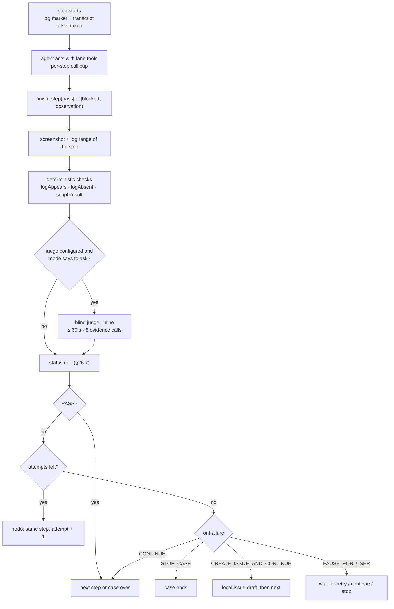
```mermaid
flowchart TB
    start["step starts<br/>log marker + transcript offset taken"] --> act["agent acts with lane tools<br/>per-step call cap"]
    act --> fin["finish_step(pass|fail|blocked, observation)"]
    fin --> shot["screenshot + log range of the step"]
    shot --> det["deterministic checks<br/>logAppears · logAbsent · scriptResult"]
    det --> jq{"judge configured and<br/>mode says to ask?"}
    jq -- yes --> jdg["blind judge, inline<br/>≤ 60 s · 8 evidence calls"]
    jq -- no --> status
    jdg --> status["status rule (§26.7)"]
    status --> ok{"PASS?"}
    ok -- yes --> next["next step or case over"]
    ok -- no --> retry{"attempts left?"}
    retry -- yes --> redo["redo: same step, attempt + 1"]
    retry -- no --> onf{"onFailure"}
    onf -- STOP_CASE --> end1["case ends"]
    onf -- CONTINUE --> next
    onf -- CREATE_ISSUE_AND_CONTINUE --> draft["local issue draft, then next"]
    onf -- PAUSE_FOR_USER --> wait["wait for retry / continue / stop"]
```

- `finish_step` is a **suspend handler** that holds a `finishing` flag so it is mutually exclusive with
  the timeout watchdog and with a second `finish_step` (`finishStep`, `:276`); all step state changes
  happen under a coroutine `Mutex` (`:135`).
- **Timeouts.** A watchdog polls every `watchdogPollMs` = 250 ms (`EngineTuning`,
  `testing/run/EngineSupport.kt:24`); `checkTimeout` (`StepSequence.kt:528`) closes a step that
  outlives its `timeoutMs` as `TIMEOUT` and applies the same `onFailure`, then announces a
  `SequenceEvent` so the driver can restart the agent.
- **Agent segments and restarts.** `LaneDriver.agentLoop` (`testing/run/LaneDriver.kt:73`) runs one
  agent *run* (a segment) at a time. A new segment starts after a step timeout (resuming at the next
  step) or after the agent failed or stopped without finishing its step (resuming at that same step, at
  most `maxAgentRestarts` = 2 times, then the sequence is aborted `ERROR`). Each new segment's prompt
  carries a summary of the steps already done, **fenced as untrusted data**. A stale run is cut off by
  an **epoch**: `newEpoch()` (`StepSequence.kt:216`) invalidates every earlier run's tool calls
  (`REPLACED_RUN_MESSAGE`).
- **Current-step examples.** Agents can list and retrieve the active step's golden images and
  reference logs through lane-scoped example tools; transition replies identify examples on the next
  step. Image reads have byte and pixel limits, and example calls obey case tool permissions. A saved
  golden image is reference evidence, not the live device screenshot or coordinate system.
- **Budgets.** Each lane's case iteration has an atomic paid-dispatch budget (`caseToolCallLimit`, default 60, 1..500)
  shared across that case's steps, retries and agent restarts. Agent and external lanes use the same guard and
  accounting rules; separate lanes and repeat iterations receive their own budget. A dispatched call counts even when execution
  returns an error; protocol calls and actions refused before dispatch are free. Each step also has
  `maxToolCalls` (default 15). The three protocol tools (`get_current_step`, `report_observation`,
  `finish_step`) are free for the case budget, so an agent that spent its actions can still report.
  Exhaustion is settled as an actionable case `ERROR` before a blocked client can finish the case.
- **Attempt deadline.** Screenshot capture, deterministic checks and judging share the step attempt's
  remaining deadline. An expiry records `TIMEOUT` exactly once, retains completed checks and available
  evidence, cancels stale lane evaluation and cannot settle the next step. Cancellation remains distinct
  from timeout; restarting an agent does not reset the attempt deadline.
- **Sessions.** Each segment is an `AiSession("testrun:<run>:<lane>:<case>:<iteration>")`
  (`LaneDriver.kt:154`), **never registered in `AiSessionRegistry`**, with a matching
  `AiInvestigationContext`; `deleteClaudeCodeWorkspace()` runs in the segment's `finally`.
- **Pause.** Two distinct mechanisms. *Pause all* (`RunPauseGate`, `LaneScheduler.kt:51`) is set from
  the live view: lanes stop at the next step boundary — `finish_step` records the step, then holds its
  answer until resumed, with the step timer frozen and restarted — and between cases. *PAUSE_FOR_USER*
  is per step: the lane suspends in `LaneHandle.awaitDecision` (a `CompletableDeferred`) until the user,
  or `resume_paused_step`, decides retry / continue / stop.
- **Confirmation timeout.** `AiRun.confirmationTimeoutMs` is optional and **off by default**; a test
  run sets it (default 5 min, Settings > Testing, `DEFAULT_CONFIRMATION_TIMEOUT_MS`) so a card nobody
  answers counts as denied instead of stalling a lane forever
  (`ai/AiToolExecutionCoordinator.kt:140`).

#### 26.5.4 Cancellation and bounded close

`TestRunCoordinator.cancel` cancels the run's job (`:246`). The engine's `finally` and each lane's
`release` run in `withContext(NonCancellable)` on IO: the judge is closed, the final status derived and
`run.json` flushed (`TestRunEngine.finish`, `:125`); the lane's recorder is stopped and finalized (its tab, if
any, stays; a headless run without recording settings deletes its log when logcat evidence was switched off), and its agent closed. **Teardown hooks still run after a cancel, but
scripts only** — shared-step hooks (which need an agent) are recorded as skipped
(`LaneRunner.kt:146`, `HookRunner.kt:41`). Run status is derived from the lanes: `ERROR` if any lane had
an infrastructure problem or a case could not be judged, `FAILED` if any case failed or was blocked,
`CANCELLED` after a cancel, else `PASSED`.

`AppState.close()` calls `testRunCoordinator.close()` (`ui/AppState.kt:4833`), which requests cancellation
for active runs and their externally dispatched calls. It gives run cleanup up to 4 s, then a separate bounded
2 s persistence window before cancelling the coordinator scope (`testing/run/TestRunCoordinator.kt`). Natural
completion also drains still-running paid external calls before final persistence and releasing devices; terminal
protocol replies such as `finish_step` are preserved. This honours the mirror lifecycle rule (§12.4): nothing a
run waits on is EDT work, so the bounded `runBlocking` on the closing thread waits only for IO/coroutine cleanup.

#### 26.5.5 Lane captures

Every lane records through a real capture, so everything a person could save by starting a live capture
and testing by hand is available to a test: logcat (with the device's earlier logs when chosen), screen
video, device audio, the microphone, the device display, adb buffers and the video quality. The run's
`RunConfig.capture` carries the recording settings (the saved capture settings, edited for this run
only, never written back) and `RunConfig.openLaneTabs` whether each lane opens a tab; both are frozen in
`run.json` (appended last, absent in older files: no recording settings means a headless lane without a
tab, as before).

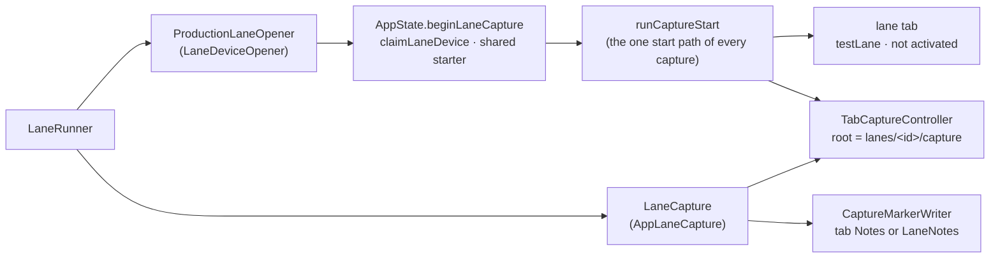
```mermaid
flowchart LR
    runner["LaneRunner"] --> opener["ProductionLaneOpener<br/>(LaneDeviceOpener)"]
    opener --> begin["AppState.beginLaneCapture<br/>claimLaneDevice · shared starter"]
    begin --> start["runCaptureStart<br/>(the one start path of every capture)"]
    start --> tab["lane tab<br/>testLane · not activated"]
    start --> ctrl["TabCaptureController<br/>root = lanes/&lt;id&gt;/capture"]
    runner --> seam["LaneCapture<br/>(AppLaneCapture)"]
    seam --> ctrl
    seam --> writer["CaptureMarkerWriter<br/>tab Notes or LaneNotes"]
```

- **One start path.** `startCaptureTab` (manual) and `beginLaneCapture` (lane) both call
  `AppState.runCaptureStart`: tool resolution, the old-glibc adaptation, `controller.start`, the empty
  streaming tab published before adb launches, the log tailer, the heap-pressure pause, the device
  display route and the lifecycle monitor. They differ only in the `CaptureStartPlan`: a lane's tab is
  **appended without being activated** (the Tests workspace keeps the focus; only when nothing at all is
  shown does the new tab become what is shown), takes no launcher's place and does not show the video
  panel, and a lane without a tab has no in-app mirror (an external scrcpy window still opens). The
  controller of a lane is created on the lane's own folder, so its session is
  `lanes/<laneId>/capture/<sessionId>` and every run-folder consumer keeps working.
- **The manual rule is unchanged.** `LogTab.testLane` (session-only, not in the autosave) marks a lane
  tab. `AppState.liveCaptureTabId` filters `testLane == null`, so the toolbar, the launcher and the device
  AI tools never see a lane as "the live capture", and `aiCaptureBinding` refuses a lane tab (the run's own
  agent drives that device). What keeps a lane and a manual capture, or two lanes, off one phone is a
  per-device claim in `laneCaptureSerials` (+ `manualCaptureStartSerial` for a manual start that is
  still resolving), checked and taken in one step under `stateLock`: a lane refuses a serial a manual
  capture holds and a manual start refuses a serial a lane holds, each with a message naming the other.
  `captureStartInProgress` is **not** used by lanes, so lanes on different devices start side by side
  and never block the UI.
- **Stop, close, cancel.** `AppState.finishLaneCapture` stops through the paths a tab Stop uses:
  `stopCaptureTab` (mirror `requestStop`, recorder stop, drain, finalization; waits for the controller to be
  removed, bounded and interruptible) or, for a tabless lane, a stop + `finalizeStopped` job on `ioScope`.
  The lane's tab stays as an ordinary stopped capture tab. Cancelling a run cancels the lanes, whose
  `release` runs `NonCancellable`; `AppState.close()` closes the coordinator (bounded, §26.5.4) and then
  `stopAllLiveCaptures` stops anything left, including the tabless lanes' controllers. The EDT never waits
  on a lane: it only waits (bounded) for coordinator jobs, and no lane code waits on a mirror lifecycle
  lock or on the EDT. Closing a lane tab (or pressing Stop in it) makes the recorder leave `RECORDING`,
  which `AppLaneCapture.lost` turns into the lane's error.
- **Session lookup.** A lane session is not under a capture root, so it never appears in the launcher's
  retained list (no unfinished session to recover after a crash, nothing to delete by mistake);
  `CaptureService.registerLaneSession` makes `retainedSession`/`sessionById` find it by id for this
  launch, which is all Save ZIP, the marker files and the strip need.
- **AI "Mark issue".** When a non-setup step ends `FAIL`, `TIMEOUT`, `BLOCKED` or `ERROR`,
  `LaneRunner.stepRecorded` asks the lane's capture for a marker (`LaneMarkerText.kt`: the label
  `AI · <case> · step N failed` and a Markdown note of the action, the expected result, the failed checks
  and the judge's verdict, with everything a device, the agent or the judge said quoted as untrusted;
  the step's screenshot). `CaptureMarkerWriter` is the one implementation of a press (the button, the
  `mark_device_issue` tool and the lane all use it): the note and its `indagium:marker` header at once,
  the screenshot under it, and, after `markerPostMs`, the LogRef of the window; it writes either into a
  tab's Notes (`TabMarkerNotes`) or into the `LaneNotes` a tabless lane holds. At the end of the lane the
  notes are written to `lane-notes.ann` so a later issue export has them.
- **Archive.** `AppLaneCapture.exportArchive` is the capture ZIP of the whole session: while recording
  it is a live Save ZIP (`controller.export`), afterwards the retained-session export; both through
  `CaptureArchiveExporter`, with the lane's notes (the tab's current ones while it is open). Lane captures
  force `markerNotesInSnapshot` so the markers always travel with it. Reopening it ("Bug report / archive")
  shows the log, the video and the AI markers at the failure (`LaneRunCaptureTest` round-trips it through
  `CaptureArchiveReader` and `reanchorImportedCaptureNotes`).

### 26.6 Locks

The feature adds the following locks to the table in §12.4. **All of them are leaf locks**: nothing is
called while holding one that could take another lock, and none is ever held together with
`AppState.stateLock` or either `AutosaveScheduler` lock.

| Lock | Where | Guards |
|---|---|---|
| `lock` + fair `writeLock` | `testing/store/TestLibraryStore.kt:67-68` | `lock` only computes and publishes the next immutable `TestLibrary`; `writeLock` covers only the disk write, which re-reads the freshest library once it holds the lock, so an older snapshot can never land on disk after a newer one. The `StateFlow` collector rule: a collector resumed inline runs inside `lock`, so collectors must not call back into the store. `limits()` is read **before** `lock` is taken |
| `lock` (`ReentrantLock`) | `testing/store/IssueStore.kt:69` | Create/update/delete (a read-modify-write of `issue.json` and the attachment folder). `revision` is bumped **after** the lock is released. The notes destination calls the annotation mutators only after releasing it (`ui/IssueNotes.kt`) |
| `lock` | `testing/run/TestRunState.kt:18` | Swapping the immutable `TestRun` snapshot; `changed()` runs outside it and reads `current`, so whichever notification runs last sees the freshest run |
| `lock`, `saveLock` | `testing/store/RunPersister.kt:24-25` | The pending-save job; and the read-the-run-then-write step, so a later save never writes an older run over a newer one |
| `registryLock`, `publishLock` | `testing/run/TestRunCoordinator.kt:99-100` | Check-and-register of devices in use; assignment of the published snapshot list |
| `lock` | `testing/store/TranscriptWriter.kt:18` | One JSON line appended at a time |
| `testLibraryMirrorLock`, `testRunMirrorLock` | `ui/AppState.kt:1911,2013` | The `AppState` mirrors of the library and run flows: the value is read **inside** the lock so the last assignment is the freshest |
| `testStorageLock` | `ui/AppState.kt:1928` | Switching the AI test folders (`reconcileTestStorage`, `initTestStorage`): swapping the `TestLibraryStore` and the pinned `activeTest*Dir` fields. **Leaf lock**; the library mirror and `forgetFinishedRuns()` are touched only after it is released |
| `mutex` (coroutine `Mutex`) | `testing/run/StepSequence.kt:135` | A sequence's step state; with the `finishing` flag it makes `finish_step` and the watchdog mutually exclusive |
| `stateLock` (existing) | `laneCaptureSerials`, `manualCaptureStartSerial` in `ui/AppState.kt` | The per-device claim of lane captures; the one place this feature takes `stateLock`, and only in `AppState` (never inside `testing/`). Claim and release are short and call nothing while holding it |
| `LaneCaptureHandle.stopTablessOnce` (`@Synchronized`), `LaneNotes` (`AtomicReference`) | `ui/LaneCaptures.kt`, `ui/CaptureMarkerWriter.kt` | Leaf: start the one stop job of a tabless lane; compare-and-set of its notes |

`AppState` mirrors the store's `StateFlow` into `mutableStateOf` and exposes thin delegates; the
library store writes inline on the caller's thread (§26.10).

### 26.7 The judge

An optional **judge** is a *separate* `AiRun` (any AI profile kind — an in-app model, Claude Code or
Codex — started through the same launchers as a lane's agent) behind a **judge-only gateway**
(`JudgeTools`, `testing/run/JudgeTools.kt:50`): `get_step_brief`, `get_step_screenshot`, `get_example`,
`read_step_log`, and one of `submit_verdict` / `submit_comparison`. It cannot touch the device, the
library, or other lanes.

**Blindness guarantee.** The judge's input is a `JudgeEvidence`
(`testing/run/JudgeEvidence.kt:39`), which has **no field** for what the agent claimed or observed — it
holds the step's action and expected text, the judge checks, the *deterministic* check results, the
screenshot taken when the step ended, the step's log byte range, and the examples. No prompt, tool
result or transcript line built from it can leak the claim, because the data is not there to leak
(`JudgePrompts.kt` builds its words only from the suite's own text). `deterministicOnly` additionally
removes the results of the judge checks themselves from what the judge may see. Check details and log rows travel inside an
`untrusted_data` envelope.

**When it runs.** Inline inside `finish_step`, after the deterministic checks and screenshot
(`StepSequence.judgeAttempt`). `shouldJudge` (`testing/run/StepJudging.kt:41`): `OFF` never;
`EVERY_STEP` always; `FAILURES_ONLY` when a deterministic check failed, the agent claimed fail/blocked,
or the step has a `ScreenJudge`/`AskJudge` check (those checks are `NOT_EVALUATED` without a judge).
Budget: 8 evidence calls (`JUDGE_TOOL_CALL_BUDGET`; submitting is free) and
`judgeTimeoutMs` = 60 s (`EngineTuning`); a judge that times out, ends without a verdict or fails
answers `INCONCLUSIVE` with the reason — it never throws, so a flaky judge cannot break a run. When the
lanes of a run ended a step differently, one **comparison judge** (budget 12) looks at every lane's own
evidence once all lanes are done (`compareDisagreements`, `testing/run/ComparisonRunner.kt:84`).
Everything either judge says goes to `judge.jsonl`.

**Status rule — explicit verdicts are mandatory.** Run validation checks every reachable `ScreenJudge`/`AskJudge` check in the selected cases and reachable suite/case hooks. These checks cannot run with judge mode `OFF` or without a configured, usable judge. Steps with no explicit judge checks retain optional-judge behavior.

1. Deterministic failures remain `FAIL`, even if the agent says `blocked` or an explicit judge is
   inconclusive. A deterministic pass plus an agent `blocked` claim remains `BLOCKED`.
2. A conclusive judge `FAIL` can turn a passing base result into `FAIL`; `PASS` preserves it.
3. For mandatory checks, a judge error, timeout or inconclusive response records the check as
   `NOT_EVALUATED` and the step as `BLOCKED`; it never returns a verdict from missing evidence.
   The normal retry and failure policy then applies. Optional judge failures do not change steps
   without explicit judge checks.
4. Screenshot capture, deterministic checks and judging share the attempt deadline. A deadline
   expiry settles `TIMEOUT` exactly once, keeps completed checks and saved evidence, cancels stale
   evaluations, and cannot settle a later step.

### 26.8 Issues and the tracker

A step with `onFailure = CREATE_ISSUE_AND_CONTINUE` gets a **local draft issue** the moment its result
is recorded, while its evidence is on disk (`IssueAutoDrafter`, `testing/run/IssueEngineHooks.kt`);
any other non-passing step can become an issue on demand. `buildIssueDraft`
(`testing/run/IssueDraftBuilder.kt`) invents nothing: title, reproduction steps, expected/actual, judge
notes, labels, environment and evidence all come from the frozen run. Severity: judge `APP_DEFECT` plus
a crash marker in the step's log is `CRITICAL`, `APP_DEFECT` is `HIGH`, `AGENT_OR_STEP_PROBLEM` is
`LOW`, anything else `MEDIUM`. When a run ends, issues linked to a case of that run are marked
*still failing* or *passing now* (`markLinkedIssues`).

**Destinations:** `local` (kept, status `SAVED`), `notes` (an issue note and the screenshot added to the
log tab of the lane, through the annotation mutators after the issue lock is released), `markdown`
(returned in the answer), and `tracker`. The tracker destination is:

- **A remote MCP server** (URL, one auth header, an AI profile, and the user's prompt) configured in
  Settings > Issue tracker (`TrackerSettings`, `testing/model/TestingSettings.kt:20`).
- **Filed by an agent, not by Indagium.** `TrackerIssueCreator` (`testing/tracker/TrackerIssueCreator.kt:48`)
  connects to the tracker, lists its tools, and starts the chosen profile with a gateway holding only
  the tracker's tools **proxied as `tracker_<name>`** (schemas re-exported), plus `get_issue_draft`,
  `read_issue_attachment` and `report_issue_created`. The user's prompt is the instruction; the draft
  is fenced untrusted data. The job ends when the agent reports the created issue's URL/key, or after
  `TRACKER_JOB_TIMEOUT_MS` = 180 s, or when the agent stops or fails without reporting. Budget: 15
  tracker/attachment calls (`TRACKER_TOOL_CALL_BUDGET`); reading the draft and reporting are free.
- **Attachments** are uploaded by reference: a string `indagium-attachment:<file name>` in a
  tracker-tool argument is replaced, inside the JVM, by that attachment's base64 content (only this
  issue's attachments, ≤ 2 MB each).
- **Token never leaves the JVM.** See §26.9.3.

**The capture archive.** The first item of a failed step's evidence is the **capture archive**
(`IssueAttachmentKind.CAPTURE_ARCHIVE`, "Capture archive (log + video + audio + notes) .zip"), **checked
by default**: the whole recording of the lane, exported by the same exporter as a capture tab's Save ZIP
(the whole log incl. earlier device logs when they were recorded, the whole video, audio, and the notes
with every AI marker), so Indagium's "Bug report / archive" opens it with the markers at the failure.
It is far bigger than other evidence, so it has its own handling (`IssueCaptureArchiveService.kt`): the
draft only carries a **pending** wish (no file; `isPendingCaptureArchive`); it is exported when the issue
is created or sent (`AppState.deliverIssue` → `attachIssueCaptureArchive`, with progress messages and a
disk-space check before the export; a failure stops the delivery with the reason and "untick it to go on
without it"), exported live while the lane still records or from the run folder afterwards, **moved**
into the issue folder (never a second copy), subject to its own cap (`MAX_ISSUE_CAPTURE_ARCHIVE_BYTES`
= 16 GiB, not the 1 GiB of other evidence), and a tracker agent only gets its name, size and location,
never its bytes (`read_issue_attachment` refuses it, `get_issue_draft` lists `path` and
`uploadable: false`). The other files stay available but are unchecked by default, except the step
screenshot and the judge verdict.

**Selectable evidence.** The issue inventory retains available attachments when their `include`
checkbox is off; that checkbox filters delivery rather than owning the file. An on-demand step clip
uses the failed step interval padded by five seconds on each side, clamped to real video coverage.
The dialog displays and allows adjustment of the exported bounds while preserving the original
recording. Android bugreports are collected only after a separate explicit action into an
issue-owned temporary directory, with progress, cancellation and a five-minute timeout. An output
is added to the checklist only after its bounded copy succeeds. Issue storage always writes v2 records
and continues to read older v1 records.

### 26.9 Security

#### 26.9.1 Custom scripts

A `TestScript` is a user-authored shell command exposed to agents as a typed tool. The safety rule of
`TestScriptRunner` (`testing/script/TestScriptRunner.kt`): **a parameter value is never part of the
command text.**

| Control | Implementation |
|---|---|
| Parameters as environment variables | `HOST_SHELL` scripts run `<shell> <template>`; parameter values and the run context (`DEVICE`, `PACKAGE`, `RUN_DIR`, `CASE_ID`, `STEP_ID`) travel only as the child's environment (`hostSpec`). The template is the author's own text, passed to the shell untouched. Host shell: `/bin/zsh -c` on macOS when present, `/bin/sh -c` elsewhere, PowerShell on Windows (`defaultHostShell`, `:216`) |
| POSIX-quoted adb exports | `ADB_SHELL` scripts send ONE remote command, `export name='value' …; <template>`, where every value is POSIX-single-quoted (`buildAdbRemoteCommand`, `:163`; `posixSingleQuote`, `:172`) and every name matches `[A-Za-z_][A-Za-z0-9_]*` |
| Validation | Types: `INT` = `-?\d{1,18}`, `BOOL` = `true`/`false`, `STRING` ≤ 4 KB with no NUL; unknown arguments rejected; required parameters enforced (`validateScriptArgs`, `:183`). Parameter names are lowercase and may not be reserved (`path`, `home`, `shell`, `device`, `run_dir`, `ld_preload`, …: `RESERVED_SCRIPT_PARAM_NAMES`, `testing/model/TestModelRules.kt:19`); a tool name may not shadow a built-in lane tool, an Indagium tool, or start with `tracker_` (`scriptToolNameError`) |
| Timeout, output cap, process-tree kill | Per-script `timeoutMs` (default 30 s, ≤ 1 h) and `outputCapBytes` (default 64 KB, ≤ 8 MB) bound stdout and stderr *each*; the rest is read and discarded so the child never blocks on a full pipe. The script is launched directly (`ProcessBuilder`, no wrapper). While it runs the runner samples its descendants; on timeout or cancellation `terminateProcessTree` stops the script and every sampled or current descendant (SIGTERM, 500 ms grace, then force-kill, whatever the parent's state; `testing/script/HostCommandRunner.kt`, `capture/CaptureProcess.kt`). A descendant still alive when a script ended on its own, or one that survived the force-kill, adds `HostCommandResult.warnings` ("This script left background processes running; scripts must not start background processes."), surfaced in `ScriptRunResult`, the Try-it console, `try_test_script`, hook results and script-check details; the leftover of a script that ended by itself is reported, not killed |
| Sanitized environment | The child inherits the app's environment minus AppImage runtime variables (`sanitizeAppImageRuntimeForChild`), with explicit values merged on top |
| `SETUP_TEARDOWN_ONLY` | A script with this permission is never offered to an agent as a tool (`buildLaneTools`, `testing/run/TestAgentTools.kt:128`) |

#### 26.9.2 Confirmation policies

There are two audiences, with two gates:

- **In-app (Indagium's own AI panel and run lanes) — `CONFIRMATION_REQUIRED`.** Policy lives in
  `CONFIRMATION_REQUIRED_TOOLS` (`debug/IndagiumToolGateway.kt:92`). The test-suite tools requiring
  review include destructive library operations, imports/exports, script execution, run start/cancel,
  report fixes, draft application, recorder start/apply and tracker delivery. Remote step drafting
  also shows an argument-aware disclosure of the provider and bounded suite/case context before text
  leaves the app; local loopback providers do not show an external-send disclosure. The legacy policy
  names remain stable:
  `delete_test_suite`, `delete_test_case`, `delete_test_script`, `import_test_suite`,
  `export_test_suite`, `set_edition`, `try_test_script`, `run_test_suite`, `cancel_test_run`,
  `rerun_test_step`, `apply_step_fix`, `delete_issue`, `send_issue_to_tracker`. A call is also raised
  to `CONFIRMATION_REQUIRED` *per call* when its arguments send data to an external service
  (`create_issue_from_step` with `destination: tracker`, `draft_test_steps` with a remote provider,
  `sendsToExternalService`). Inside a
  run, an **`ASK` script** becomes a confirmation card through the lane gateway's
  `extraConfirmationRequired` (names only known at run time); `AUTO` scripts run without asking.
  `ManagedMcpRunRegistry.register` gives a lane's managed endpoint its **own**
  `AiToolExecutionCoordinator` over the lane gateway (`ai/ManagedMcpRunRegistry.kt:36`), so the policy
  point is unchanged for Claude Code and Codex lanes.
- **External MCP clients — `PER_CALL_APPROVAL_MCP_TOOLS`.** `CONFIRMATION_REQUIRED` gates only
  Indagium's own AI panel; an external client holding the control token would otherwise run any
  command a script holds with nobody asked. The set (`debug/ExternalToolApproval.kt:22`) is
  `try_test_script`, `run_test_suite`, `rerun_test_step`, `rerun_failed_test_cases`,
  `test_lane_tool_call`, `draft_test_steps`, `start_test_recording`, `apply_test_recording`,
  `import_test_script`, `export_test_script`, `export_test_run_report`,
  `collect_android_bugreport`, `export_issue_step_clip`, `create_issue_from_step`,
  `send_issue_to_tracker`. Each call opens a dialog describing *that exact
  call* — a remote draft's provider, endpoint/account and bounded context; the client, the script and
  its exact command and arguments; or the suite, cases, lanes with
  devices and every script a run may execute, or the tracker, profile, issue and every attachment the
  agent can read — and waits up to 5 minutes (`DEVICE_AI_APPROVAL_TIMEOUT_MS`,
  `ui/AppState.kt:3010`). **Approval is per call and never remembered for the session**, because each
  call may run a different command or send different data. A call the tool would refuse anyway
  (unknown script, invalid arguments, no tracker configured) skips the dialog and the tool reports the
  error, so the user is never asked about something that cannot run. `test_lane_tool_call` asks only
  for a *script* tool; a built-in lane tool needs no approval, since the run itself was approved.
  `create_issue_from_step` asks only for destination `tracker`.

The device tools keep their own, older per-session approval (§14.1).

#### 26.9.3 Secrets

The tracker's access token is the one persistent secret the feature owns (AI provider API keys keep
their existing memory-only treatment, §18.4).

- **`SecretStore`** (`security/SecretStore.kt`) talks to the operating system's store through a child
  process: macOS `security -i` (the command line on **stdin**), Linux `secret-tool store|lookup|clear`
  (the secret on stdin), Windows PowerShell reading a script from stdin that calls
  `CredWriteW`/`CredReadW`/`CredDeleteW` (the secret travels base64 inside that script).
  **A secret never travels on a command line** — argv is readable by every process of the user. Service
  and account names are fixed, validated identifiers and are the only things on argv.
- **Fallback.** `FallbackSecretStore` keeps a secret in `MemorySecretStore` when the system store fails
  and reports `persistent = false` plus the reason, so Settings says "kept for this session only". A
  failure text that came from a child process is scrubbed of the secret before it is returned
  (`scrubSecret`).
- **Never persisted elsewhere.** The token has no field in `AppSettings`, autosave, `run.json`,
  `issue.json`, `judge.jsonl` or a transcript. `TrackerConnection` keeps the header value in a private
  field and its `toString` prints the URL and header *name* only. Transcripts pass every string through
  `redactDiagnosticSecrets` (`testing/store/TranscriptWriter.kt:45`).

#### 26.9.4 The tracker connection

- **Proxied tools, token in the JVM.** The agent calls `tracker_<name>`; Indagium's own HTTP
  connection (`SdkTrackerMcpClient`, the official `kotlin-sdk-client` over Streamable HTTP) forwards the
  call and holds the header. The token therefore never reaches a model, a prompt, a transcript, or a
  Claude Code / Codex process, whatever kind of AI profile files the issue.
- **No redirects.** The HTTP client sets `followRedirects = false`
  (`testing/tracker/SdkTrackerMcpClient.kt:35-37`) so the token cannot be forwarded to another host.
- **URL and header checks.** http/https only, a host, no credentials in the URL; plain `http://` to a
  non-loopback host is allowed with a warning; the header name must be a valid token and not one the
  transport sets itself (`testing/tracker/TrackerConfig.kt`).
- **Bounds.** 20 s connect, 60 s per call, at most 64 tools, 64 KB of text per tool result;
  every failure is a `TrackerMcpException` whose message is already free of the token.
- **Fenced results.** Every tracker tool result is returned inside an `untrusted_data` envelope.

#### 26.9.5 Untrusted-data fencing and prompt-injection posture

Text produced by the device (logcat, UI trees, screens), the app under test, a script, an agent, the
judge or a tracker is **never trusted as instructions**:

- Lane, judge and tracker tool results put such text in an `untrusted_data` field with a standing
  notice (`untrustedData`, `testing/script/UntrustedData.kt:14`).
- Prompts fence history and drafts between `<untrusted_data>` markers with the markers inside the text
  defanged so data cannot close its own fence (`fenceUntrusted`, `testing/run/LanePrompts.kt:44`):
  the resumed-segment step summary, the issue draft given to the tracker agent.
- Every system prompt tells the model that anything inside an `untrusted_data` field is data to read,
  never instructions (`LANE_SYSTEM_PROMPT`, `JUDGE_SYSTEM_PROMPT`, `TRACKER_SYSTEM_PROMPT`).

The structural defences matter more than the wording: an injected instruction can at most influence
what a *lane agent* does with the tools of its own lane (device input, and the scripts the suite's
author exposed as `AUTO`/`ASK`); it cannot reach the app's catalogue, the library, the tracker token,
other lanes, or the blind judge's private tools. A conclusive judge failure can downgrade a passing base
result; mandatory explicit judge checks block when no verdict is obtained, and deterministic failures remain
failures (§26.7). The judge never sees the agent's words. Residual risk: an `AUTO` script is
reachable by any prompt-injected lane agent, which is why the default permission is `ASK`.

### 26.10 Extension points

| To add… | Do this |
|---|---|
| **A check kind** | Add a case to the sealed `StepCheck` (`testing/model/TestModel.kt:113`); update `withFreshId` (`TestModelRules.kt`), the codec's encode/decode (`testing/store/TestLibraryCodec.kt`) and `CHECK_TYPE_NAMES`/parsing in `debug/TestSuiteToolParsing.kt` + the schema in `TestSuiteToolCatalog.kt`; evaluate it in `DeterministicChecks.evaluate` (deterministic) or route it to the judge via `judgeChecksOf` (`testing/run/JudgeEvidence.kt`); add the editor row in `ui/TestsSteps.kt`. The `when` expressions over `StepCheck` are exhaustive, so the compiler lists what is missing |
| **A lane tool** | Add a `LaneTool` to the matching group in `testing/run/TestAgentTools.kt` (`screenTools` / `inputTools` / `logTools`); add its name to `RESERVED_SCRIPT_TOOL_NAMES` (`testing/model/TestModelRules.kt:26`) so a script cannot shadow it, and to the `test_lane_tool_call` description. Return device/script text through `untrustedData`, and wrap the handler in `guarded`. If it must not spend the case budget, add it to `LANE_FREE_TOOL_NAMES`. Tests: `TestAgentToolsTest` |
| **An issue destination** | Add a value to `IssueDestination` (`testing/model/IssueModel.kt`); handle it in `ui/IssueActions.kt`'s delivery switch and record the outcome with `recordDelivery`; extend the `destination` enum in `IssueToolCatalog.kt`. If the destination sends data off the computer, add it to `sendsToExternalService` (`debug/IndagiumToolGateway.kt:114`) **and** to the `previewOf` switch in `debug/ExternalTrackerApproval.kt` so a per-call approval is shown |
| **An edition** | Add a value to `Edition` and map it to an `EditionLimits` in `Edition.limits` (`edition/Edition.kt:22`); a new *kind* of limit means a new `LimitOperation`/`LimitKind` branch in `testing/limits/TestLimits.kt` and a `when` arm in `decide`, so every caller picks it up. The `set_edition` enum follows `Edition.entries` automatically |
| **An MCP tool** | Follow §22.1; additionally put the descriptor in the right catalogue file, the handler in the matching `*Operations.kt` (suspend if it waits), a `CONFIRMATION_REQUIRED_TOOLS` entry for anything destructive, and a `PER_CALL_APPROVAL_MCP_TOOLS` entry (with a `describePerCallApproval` branch) for anything an external client could use to run commands or send data off the computer |
| **A secret backend** | Implement `SecretStore`, send the secret on stdin only, and select it in `platformSecretStore` (`security/SecretStore.kt`). Add a command-shape test to `SecretStoreCommandTest` asserting the secret is absent from argv |

### 26.11 Known risks and limitations

1. **The Windows keychain backend is untested on real Windows.** `WindowsCredentialSecretStore`
   (a PowerShell/`advapi32` P/Invoke script on stdin) is covered by command-shape tests with a fake
   runner; the macOS backend is also round-trip tested against the real `security` tool
   (`MacOsKeychainRoundTripTest`), the Windows one has never run against a real Credential Manager. On
   failure it degrades to a session-only secret and says so. The same applies to `HOST_SHELL` scripts:
   on Windows they run under PowerShell, so a template written for `sh` is not portable.
2. **Whole-video attachments.** An issue attaches the lane's *whole* recorded video with a note saying
   where the step starts (`IssueDraftBuilder`), not a clipped excerpt. A video over 50 MB is attached
   *unchecked*, and a tracker agent cannot upload anything over 2 MB (`MAX_ATTACHMENT_BYTES`), so a video
   is in practice kept locally, not filed in the tracker.
3. **The judge through account agents is lightly tested.** The blindness guarantee and the
   comparison judge are pinned by `JudgeBlindnessTest`/`JudgeComparisonTest`, which use scripted in-app
   agents; a Claude Code or Codex judge goes through the managed MCP lease and has no dedicated test
   (only the lane path is covered with fake processes, `TestRunEngineAccountAgentTest`). Those CLIs'
   MCP clients may also give up on a long inline judge call, which is why the judge is bounded to 60 s.
4. **No MCP tool to pause a run.** *Pause all* exists only in the live view
   (`TestRunCoordinator.setPaused`, `:254`); over MCP a lane can only be paused by a step's
   `PAUSE_FOR_USER` and resumed with `resume_paused_step`. `cancel_test_run` is the only way to stop a
   run from a client.
5. **Library edits write on the caller's thread.** The `AppState` delegates call
   `TestLibraryStore`, whose write (one suite file plus `library.json`, both small) happens inline under
   `writeLock`. From the UI this is the UI thread; the files are tiny and atomic, but a slow disk shows
   as a UI hitch. Run, issue and transcript writes are all on IO.
6. **Scripts are not sandboxed.** A `HOST_SHELL` script runs with the user's full privileges and can
   reach any device adb can see, not only its lane's. The controls in §26.9.1 bound injection, time and
   output, not capability — hence the default `ASK` permission, the setup/teardown-only option, and the
   per-call approval for external clients. `AUTO` should be granted only to scripts the author would let
   any test agent run.
7. **Detached processes can outlive a script.** Scripts run directly, with no supervisor or OS-level
   containment (no process group or Job Object). On timeout or cancellation Indagium terminates the
   script and all its descendants it can find (a snapshot taken then, plus descendants sampled while it
   ran), but a process that detaches from the script's process tree (a daemon that double-forks or calls
   `setsid`, or one that was started and re-parented between samples) may survive. A survivor that was
   sampled is reported as a warning on the result; one that was never sampled is invisible. Scripts must
   not start background processes. `ADB_SHELL` scripts can raise a false warning when the adb client had
   to start the adb server.

8. **Lane captures cost what captures cost.** A lane with a tab, the in-app mirror and video is as
   heavy as a manual capture, and four devices run at once: with the default capture settings every
   lane records video (and mirrors it when the device display is "In-app mirror"). Turn the display off
   or the tab off for big matrices. A lane without a tab has no in-app mirror at all.
9. **A lane recording is only as durable as the run folder.** Lane sessions are deliberately not in a
   capture root: they are not offered for recovery after a crash (a lane cut off by an app exit stays an
   interrupted session in its run folder, readable through the report and the evidence export) and
   disappear with the run. `evidence.logcat` no longer has an effect on a run that has recording settings
   (the log is the capture itself and is always kept).
10. **The archive of an issue is exported late.** A draft issue (also an automatic one) only carries the
   wish for it; the ZIP is built when the issue is created or sent, so a run folder that was deleted
   before then can no longer provide it (the delivery fails with that reason; untick the archive to go on).

---

## Related documents

- [USER_GUIDE.md](USER_GUIDE.md) — how to use Indagium.
- [mcp/README.md](mcp/README.md) — connecting an external MCP client.
- [mcp/AVAILABLE_METHODS.md](mcp/AVAILABLE_METHODS.md) — the tool reference.
- [mcp/ANALYSIS_PLAYBOOK.md](mcp/ANALYSIS_PLAYBOOK.md) — prompt patterns for log analysis.
