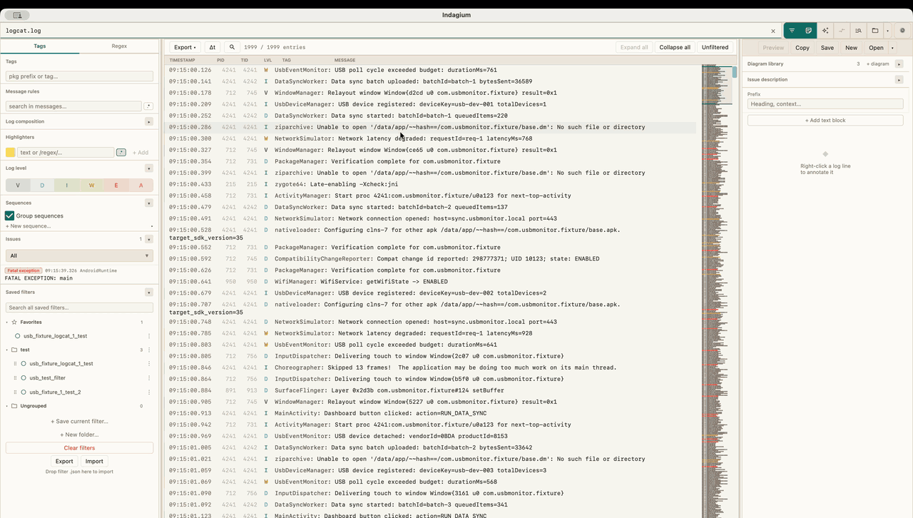
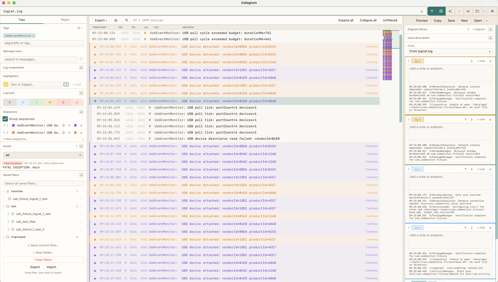
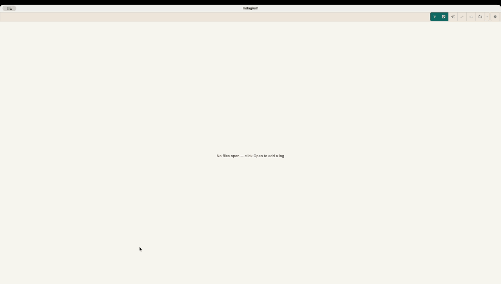
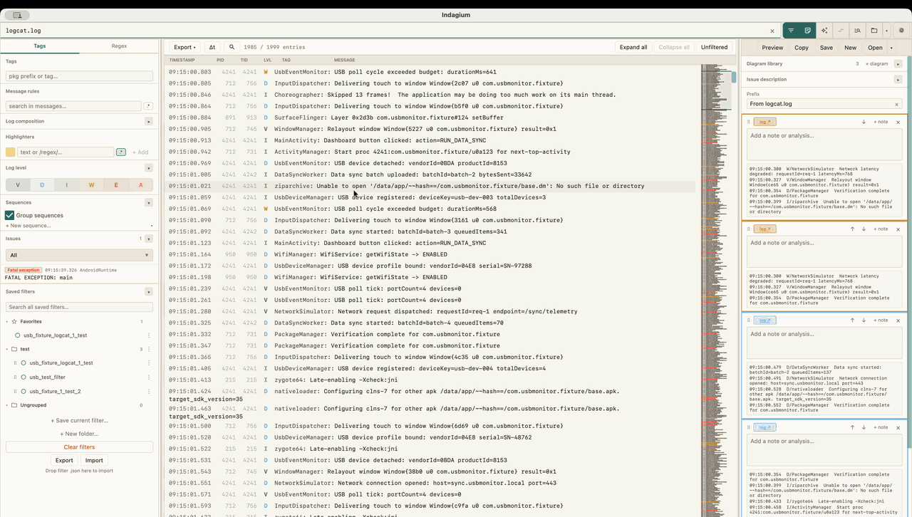
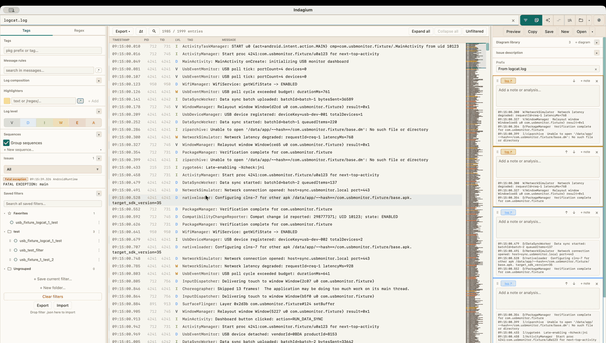
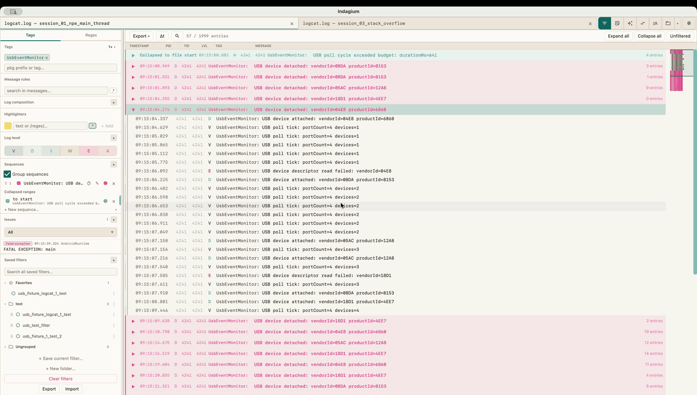
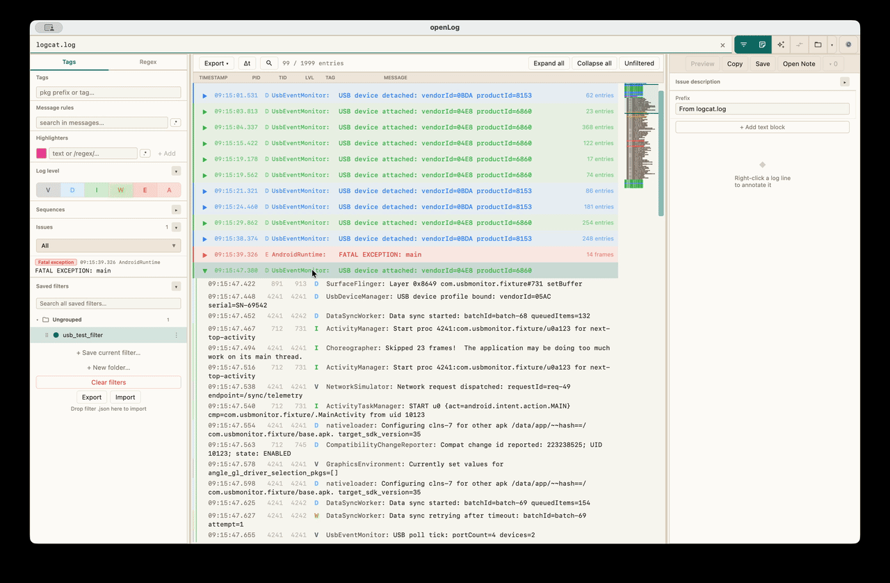
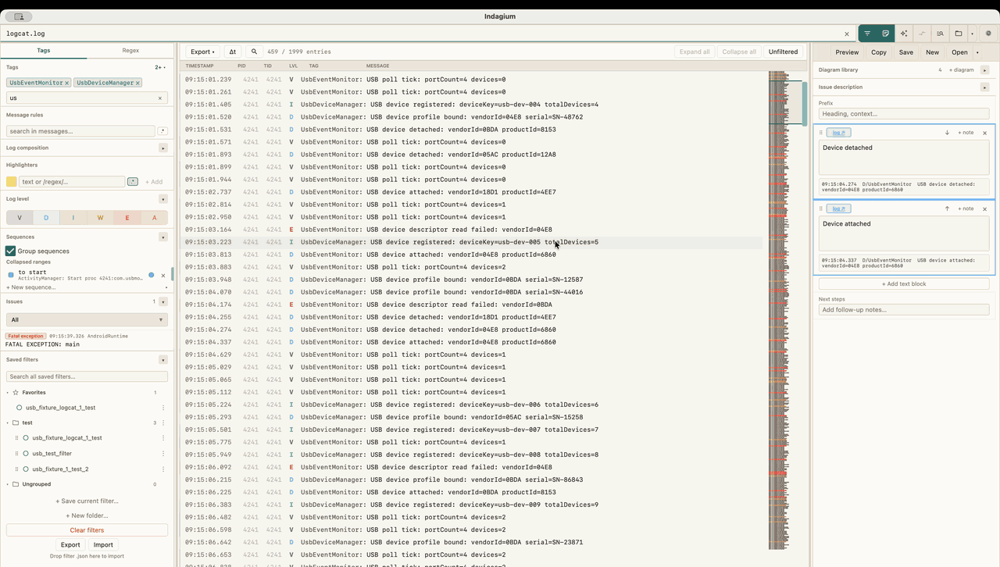
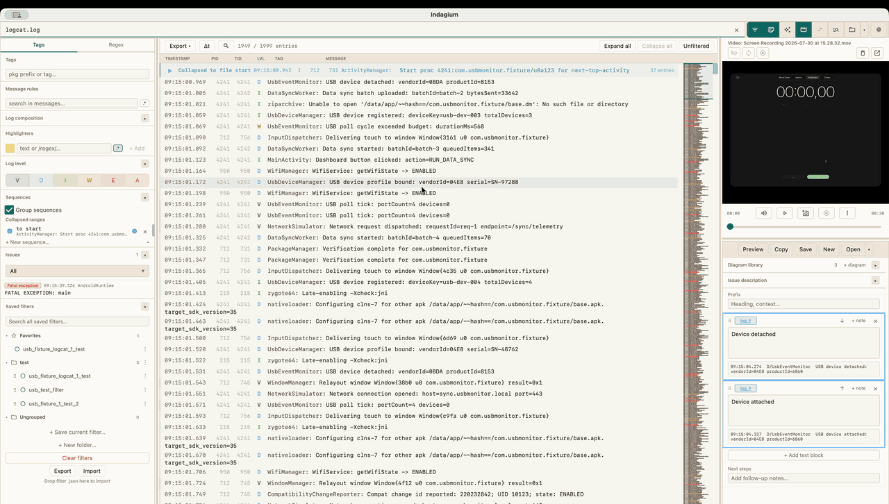
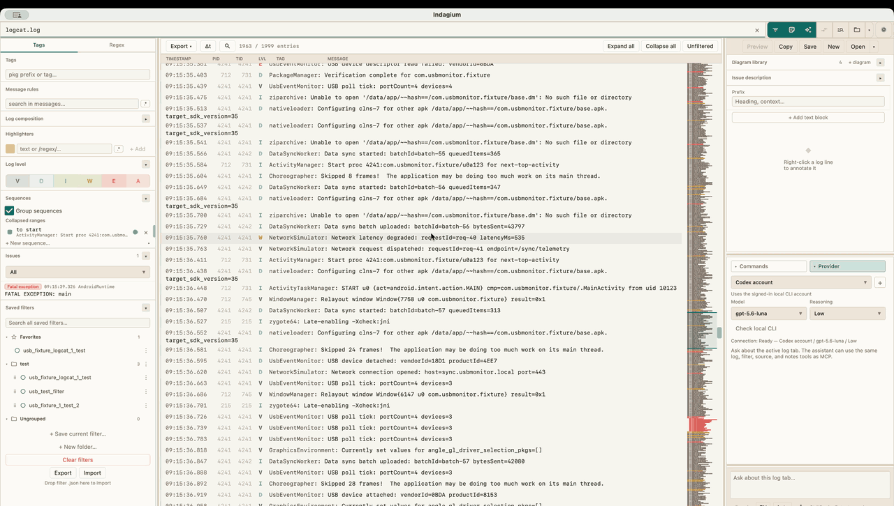

# Indagium — User Guide

Indagium turns a logcat capture into an answer. You open a log — or a whole Android bug report —
filter it down, fold away the noise, mark what matters, and export a write-up you can paste straight
into a ticket.

This guide is task-oriented. If you want the architecture instead, see [SAAD.md](SAAD.md).

---

## Contents

**Getting started** — [1. Install](#1-install) · [2. Quick start](#2-quick-start) ·
[3. The window](#3-the-window)

**Working with logs** — [4. Opening logs](#4-opening-logs) · [5. Reading the log](#5-reading-the-log) ·
[6. Filtering](#6-filtering) · [7. Highlighters](#7-highlighters) · [8. Sequences](#8-sequences) ·
[9. Collapsing ranges by hand](#9-collapsing-ranges-by-hand) · [10. Finding text](#10-finding-text) ·
[11. Minimap and thread map](#11-minimap-and-thread-map) ·
[12. Crashes, ANRs and custom issues](#12-crashes-anrs-and-custom-issues) ·
[13. Saved filters](#13-saved-filters) · [14. Comparing two logs](#14-comparing-two-logs)

**Producing output** — [15. Notes, diagrams and analysis export](#15-notes-and-analysis-export) ·
[16. Show in code](#16-show-in-code) · [17. Live tailing](#17-live-tailing) ·
[18. Merging and splitting](#18-merging-and-splitting) ·
[19. Exporting the filtered log](#19-exporting-the-filtered-log)

**Extras** — [20. Video sync](#20-video-sync) · [21. Voice dictation](#21-voice-dictation) ·
[22. AI assistant](#22-ai-assistant) · [23. External MCP clients](#23-external-mcp-clients)

**Reference** — [24. Settings](#24-settings) · [25. Keyboard shortcuts](#25-keyboard-shortcuts) ·
[26. Where your data lives](#26-where-your-data-lives) ·
[27. Troubleshooting](#27-troubleshooting) · [28. Recipes](#28-recipes)

---

## 1. Install

Download the build for your platform from the [Releases](../../../releases) page.

| Platform | File |
|---|---|
| Linux (x86-64) | `.deb` `indagium_x.y.z-1_amd64.deb` · AppImage `Indagium-x.y.z-x86_64.AppImage` · Flatpak `Indagium-x.y.z-x86_64.flatpak` |
| Linux (arm64) | `.deb` `indagium_x.y.z-1_arm64.deb` · AppImage `Indagium-x.y.z-aarch64.AppImage` · Flatpak `Indagium-x.y.z-aarch64.flatpak` |
| Windows | `Indagium-x.y.z.msi` |
| macOS (Apple Silicon) | `Indagium-x.y.z.dmg` |

### macOS: "could not verify… free of malware"

The macOS build is not signed with an Apple Developer ID, so Gatekeeper blocks a `.dmg` downloaded
through a browser. Either:

```bash
xattr -cr /Applications/Indagium.app
```

or open **System Settings → Privacy & Security**, scroll to the "Indagium was blocked" notice, and
click **Open Anyway**.

### Linux

```bash
# Debian/Ubuntu and compatible distributions
sudo dpkg -i indagium_x.y.z-1_amd64.deb

# AppImage (replace x86_64 with aarch64 on ARM64)
chmod +x Indagium-x.y.z-x86_64.AppImage
./Indagium-x.y.z-x86_64.AppImage

# Flatpak bundle (replace x86_64 with aarch64 on ARM64)
flatpak remote-add --user --if-not-exists flathub https://dl.flathub.org/repo/flathub.flatpakrepo
flatpak install --user ./Indagium-x.y.z-x86_64.flatpak
flatpak run com.indagium.Indagium
```

Choose the format that fits your system: `.deb` is best for Debian-family systems, AppImage runs
without installing system files, and Flatpak installs into your user account. All three packages
register Indagium as a *candidate* handler for `.log`, `.txt`, `.logcat`, `.trace`, and `.out` —
they do not make themselves the default. To opt in:

```bash
# Debian package
xdg-mime default indagium-Indagium.desktop text/plain text/x-log

# AppImage or Flatpak
xdg-mime default com.indagium.Indagium.desktop text/plain text/x-log
```

The Flatpak sandbox permits access to your home directory for logs and source folders, but it
cannot use host-installed **Codex account** or **Claude Code account** CLI profiles. Use an
API/network-backed provider in Flatpak instead.

### Flatpak: "No X11 DISPLAY variable was set"

Indagium's UI toolkit (Java/AWT) needs a real X11 or XWayland display. On a remote/VNC/xrdp/x2go
session, set `DISPLAY` on the **host** before launching — `flatpak run --env=DISPLAY=…` does not
work, because Flatpak decides which X11 socket to bind before the sandbox exists:

```bash
DISPLAY=:1.0 flatpak run com.indagium.Indagium
```

---

## 2. Quick start

Five minutes, start to finished ticket.

1. **Open a log.** Drag a `.log` file onto the window, or click **Open** in the toolbar.
2. **Cut it down.** In the left filter panel, click the tag you care about. The row count in the log
   toolbar tells you how much survived.
3. **Fold the noise.** Right-click a repeating line → **Hide messages like this**. Repeat twice. Most
   logs collapse by an order of magnitude with three rules.
4. **Mark what matters.** Select the interesting rows, right-click → **Add annotation**. Write one
   sentence about what they show.
5. **Export.** In the Notes panel, click **Copy** for Markdown on the clipboard, or **Save** to write
   a `_analysis.md` file next to your log.

<!-- GIF-01 · Quick start · 20s · open a log by drag-drop → click a tag in the filter panel →
     right-click a noisy line and hide it → select rows → Add annotation → Copy -->


---

## 3. The window

<!-- SHOT-02 · Annotated window · static screenshot · full window with one log open,
     filter panel + notes panel visible, a sequence collapsed, minimap on the right -->


**Toolbar** (top, left to right):

| Button | Does |
|---|---|
| **Filter** | Show/hide the left filter panel (`⌘⇧F` / `Ctrl+Shift+F`) |
| **Notes** | Show/hide the notes panel in the right sidebar (`⌘⇧A` / `Ctrl+Shift+A`) |
| **AI** | Show/hide the AI panel in the right sidebar |
| **Video** | Show/hide the video panel — appears only when the active tab has a video attached |
| **Compare** | Two tabs side by side (`⌘⇧D` / `Ctrl+Shift+D`) |
| **Open** | Open a log file |
| **▾** | Recent files |
| **⚙** | Settings |

**Tab strip** sits beside the toolbar. Tabs can be dragged to reorder; when there are more than fit,
the rest move into a **▾ N** overflow menu. Right-click a tab for close/split/merge/tail actions.

**Left — filter panel.** Everything that decides which rows are visible.

**Centre — log view.** The rows, plus its own small toolbar (row count, search, export, unfiltered
split toggle). The **minimap** replaces the scrollbar on the right edge.

**Right — sidebar.** Holds up to three stacked panels: **Video**, **Notes**, and **AI**. Turn on one
and it fills the sidebar; turn on two or three and they split at draggable dividers. Drag the divider
between the log and the sidebar to resize.

---

## 4. Opening logs

| Method | How |
|---|---|
| Toolbar | **Open** → file dialog |
| Drag and drop | Drop one or more files anywhere on the window |
| Recent files | **▾** beside Open — the last 30 files |
| Command line | `indagium path/to/file.log` |
| OS integration | "Open with" from your file manager; on macOS also via the Dock |

Opening a file while Indagium is already running reuses the running instance rather than starting a
second one (except on macOS, where the system handles it).

### Bug-report archives

Drop a `.zip` or `.7z` Android bug report and Indagium scans it for log candidates — logcat dumps, ANR
traces — and offers a picker. You can open several at once, each in its own tab. If the archive also
contains a screen recording, you can attach it to the tab in the same step (see
[§20](#20-video-sync)).

<!-- GIF-03 · Bug report archive · 12s · drop a .zip → candidate picker appears →
     select the logcat entry and a video → both open, video attached -->


### Very large files

Above a size threshold Indagium offers to **split** the file into parts before opening
([§18](#18-merging-and-splitting)). You can decline and open it whole — the log view switches into
*large file mode*, shown in the row-count label, which computes the visible rows in the background
and stays responsive while you filter.

---

## 5. Reading the log

Columns: timestamp, PID, TID, level, tag, message. Row numbers can be turned on in the log toolbar's
right-click options popup.

| Feature | Where |
|---|---|
| **Select a row** | Click. Shift-click or `⇧↑`/`⇧↓` extends. Drag to select a range |
| **Copy** | `⌘C` / `Ctrl+C` copies the selected rows |
| **Select all visible** | `⌘A` / `Ctrl+A` |
| **Time delta (Δt)** | Toggle in the log toolbar. Shows the gap between adjacent rows, or the offset from the first selected row when you have a selection — the fastest way to spot a stall |
| **Wrapping** | Long messages wrap above a configurable character count; automatic wrapping can be turned off in Settings |
| **Original / Filtered split** | The **Unfiltered** toolbar button splits the view vertically so you can see the same log with and without your filter |

**Copy masking.** Settings → Export & annotations lets you define replacement rules applied when
copying rows — useful for stripping customer identifiers before pasting into a ticket.

---

## 6. Filtering

Filtering is where most of the work happens. Everything below lives in the left panel, and everything
in the panel also has a right-click shortcut on a log row.

### Log levels

Toggle **V / D / I / W / E / A** individually. (`A` is Assert — Android's highest level.)

### Tags and packages

Click a tag to include it; there is a separate exclude list. Indagium also groups tags by package
prefix, so you can include or exclude `com.example.network.*` in one action. The panel shows the most
frequent tags first; the count is configurable in Settings.

### Keyword and regex

The panel has two modes:

- **Tags mode** — the tag lists, message rules, and everything else are active.
- **Regex mode** — a single keyword/regex box filters the whole log.

There is also an *in-tag* keyword box that matches against tag names rather than messages, and a
**PID/TID** box for narrowing to one process or thread.

### Message rules

The workhorse. A rule is: include or exclude, a substring or regex, optionally scoped to a tag or a
package prefix, and targeted at either the **message** or the **PID/TID**.

The fastest way to build them is from the log itself: right-click a row → **Hide messages like this**
(or **Show messages like this**), and pick the variant you want from the submenu. Each click adds a
rule you can then edit in the panel.

<!-- GIF-04 · Filtering · 15s · start with a full log → toggle off V and D →
     click a tag → right-click a noisy row → Hide messages like this →
     row count drops from ~200k to ~300 -->


### Clearing

**Clear filter** resets everything for the tab, with a confirmation so you cannot lose a
carefully-built filter by mis-clicking.

---

## 7. Highlighters

A highlighter colours matching rows **without** removing anything else. Use them for the lines you
need to spot while still seeing their surroundings.

Add one from the filter panel, or right-click a row → **Highlight**. Each highlighter has a pattern
(substring or regex), a colour, and an on/off toggle.

Keyword-search matches can also be highlighted in their own colour — a separate toggle in the panel.

---

## 8. Sequences

A sequence folds a recurring region of the log into a single collapsible header.

Define a **start** pattern and optionally an **end** pattern. Every occurrence of the start begins a
group; it closes at the matching end pattern, or at the next start of any sequence if no end matches.
Each sequence has a colour and a **priority** — when two sequences could claim the same line, the
lower priority number wins.

Sequences nest one level deep, so a "network request" sequence containing a "retry" sequence renders
as a group inside a group.

The quickest way to create one is from a row: right-click → **Add as sequence**, or use **Set
sequence start** and **Complete sequence end** on two different rows to define both ends at once.

Click a header to expand or collapse it. **Expand all** / **Collapse all** are in the log toolbar.

<!-- GIF-05 · Sequences · 15s · right-click a repeating line → Add as sequence →
     the log folds into colored group headers → click one to expand it -->


---

## 9. Collapsing ranges by hand

When there is no pattern to match, fold by position instead. Right-click a row:

- **Collapse to start** — everything from the top of the log to this row.
- **Collapse to end** — this row to the bottom.
- **Collapse selected** — the currently selected range.

Manual blocks appear in the filter panel's *Collapsed ranges* section, where each has a colour and an
on/off toggle. They survive a restart.

---

## 10. Finding text

`⌘F` / `Ctrl+F` opens the **Find bar** over the filtered log. `Enter` and `⇧Enter` jump between
matches; `Escape` closes it. Case sensitivity is a toggle in the bar.

Find searches the **fully expanded** log, so a match inside a collapsed group is still found.

Settings → Editor behavior lets you retarget `⌘F` if you use a different one most: the tag box, a
message rule, the keyword/regex box, or the Find bar. There is also an option to reveal the
unfiltered split automatically when you press it.

---

## 11. Minimap and thread map

**Minimap.** Replaces the vertical scrollbar with a compressed overview of the whole log, marking
levels, highlighted rows, and issue sites so you can see where the interesting parts are before
scrolling to them. Right-click the minimap (or the log toolbar) to hide it.

**Thread map.** Right-click a row → **Threads: Show map**. Indagium colours every thread inside that
row's process and draws a branch gutter beside the log, so interleaved thread activity becomes
readable. Colours are assigned once from the tab's full data, so they do not shift as you filter.
Hide it from the same menu.

---

## 12. Crashes, ANRs and custom issues

Stack traces are folded **automatically** — no configuration. Indagium recognises exception headers,
`at …` frames, `… N more`, and the process lines around them, and tracks one open trace per process
so interleaved crashes do not corrupt each other.

It also detects:

- **Exceptions** — from the folded stack traces, marked fatal or not.
- **ANRs** — from `ActivityManager` messages.
- **Native crashes** — from `Fatal signal N` on the `DEBUG` tag.

These are grouped into categories (All / Crashes / ANRs / Fatal exceptions / Exceptions / Others) you
can jump between.

**Custom issue rules.** Settings → Issues lets you add your own named regex rules. Each one becomes
its own navigable category — useful for a project-specific error marker that is not an exception.

---

## 13. Saved filters

A filter you built is worth keeping.

| Action | How |
|---|---|
| Save | Filter panel → *Saved filters* → save, name it, optionally put it in a folder |
| Load | Click a saved filter to apply it to the active tab |
| Favourite | Star it to pin it to the top |
| Organise | Create folders; drag to reorder; folders do not nest |
| Rename / delete | Right-click the entry |
| Export | Export selected filters to a `.json` library file |
| Import | Import a library — a review dialog shows each incoming filter and lets you skip, rename, add, or replace |

Editing a loaded preset turns it into a **draft** for that tab rather than silently modifying the
saved copy. Indagium also writes automatic backups of your filter library, so a bad import is
recoverable.

---

## 14. Comparing two logs

Two different features share the word "compare":

**Compare view** (`⌘⇧D` / `Ctrl+Shift+D`) puts **two tabs side by side**, each with its own filter
panel and its own scroll position. A toggle mirrors the left tab's filter onto the right one, which
is what you want when comparing a working run against a failing one — same filter, two logs.

Note this is a side-by-side view, not a textual diff: Indagium does not compute line-level
differences.

**Original / Filtered split** (the **Unfiltered** button in the log toolbar) splits **one tab**
vertically, showing the same log filtered on one side and complete on the other. Use it to check
what your filter is hiding.

<!-- GIF-06 · Compare view · 12s · open two logs → Compare → mirror the filter to the right →
     scroll both, showing the same filter applied to a good run and a bad run -->


---

## 15. Notes and analysis export

The Notes panel is where an investigation becomes a document.

### Block types

| Block | Created by |
|---|---|
| **Text** | The panel's add-text action, or `Ctrl+Enter` to add one below the selected block |
| **Log reference** | Select rows → right-click → **Add annotation**. Stores the rows themselves, so the note stays readable after you change the filter — and clicking it jumps back to those lines |
| **Image** | Paste from the clipboard anywhere in the app |
| **Video frame** | Grab the current frame from an attached video ([§20](#20-video-sync)) |

Blocks can be reordered with `Alt+↑` / `Alt+↓`, edited in place, and deleted.

### Document structure

Beyond blocks, a note has:

- **Issue description** — your private working context. It is stored with the note and used for
  similarity search, but is **never** included in the exported Markdown.
- **Prefix** and **suffix** — text before and after the blocks, for a summary and a conclusion.

### Getting it out

| Action | Result |
|---|---|
| **Copy** (`⌘C` / `Ctrl+C`) | Markdown on the clipboard |
| **Copy rich preview** | HTML with inline images — paste into a rich-text ticket field |
| **Save** (`⌘S` / `Ctrl+S`) | Writes `<logname>_analysis.md` plus a `.ann` sidecar |
| **Open Note** (`⌘O` / `Ctrl+O`) | Reopens a saved note, restoring every block exactly |
| **Preview** | Rendered Markdown in the panel |

The `.ann` sidecar is what makes a saved note fully reversible — it preserves block structure, image
bytes, and log references that plain Markdown cannot carry. Keep the two files together.

### Sequence-diagram workspaces

A sequence diagram is a dedicated, closable tab rather than a modal dialog. Create one from a
non-empty row selection to use that inclusive range, or start from the current filtered view. Its
header shows the source log, scope and save state; **Back to source log** returns to the originating
tab. You can keep several diagram tabs open at once. If the source log is closed, an existing
diagram remains viewable from its cached model, but must be relinked before it can be edited or
rebuilt from source.

The left inspector is collapsible and resizable. Every diagram is an editable interaction document;
new diagrams are seeded asynchronously from the best available source evidence, which gives you a
starting point rather than an automatic final result. The inspector groups the controls as **Scope**,
**Lifelines**, **Starting point**, **Message queue**, **Advanced structure**, **Presentation**, and
**Draft library**.
The canvas supports pan, pointer-centred zoom, fit/reset, visible scrollbars, warnings, and coverage
counts.

#### Choose and organise lifelines

The Lifelines section presents tags in three useful tiers:

- Tags on the selected rows are enabled initially.
- Tags elsewhere in the current filtered view are available but disabled initially.
- Tags outside that view are available only through search, with their analysis counts.

Every enabled tag becomes a lifeline. Rename a lifeline for a useful diagram label, merge two or more
raw tags into one lifeline, inspect its tag membership, or unmerge it again. Actors can also be added
when the diagram needs a person, service, or hardware endpoint.

The advanced **Group unmapped in-range tags as Other** switch is the only `Other` behaviour. It
groups *all* otherwise-unmapped tags in the chosen scope into one `Other` lifeline. With it off
(the default), unmapped tags are hidden. It never silently changes the status of tags that were not
explicitly selected.

#### Edit interactions

The workspace is a durable editor for the rendered message queue. Message order follows evidence and
cannot be drag-reordered; only lifeline-column presentation order is reorderable. Each compact row
shows a readable template, occurrence count, source and destination (From → To), state, and
source-entry evidence. Endpoint controls are available directly on the row; details are secondary
fields. Repeated normalized messages remain separate durable occurrences behind one ×n row.

An interaction with no destination is shown as **needs target**, counted and filterable. Its source
evidence remains intact and the canvas renders an evidence-backed dashed stub with an unresolved
marker, never a fabricated lifeline or self-call. **Fix these** opens a workspace-local guided pass
with nearby log context, numbered declared lifelines, a conservative suggestion that requires
confirmation, self-call, new-lifeline, skip, progress, and keyboard hints. Suggestions are never
silently applied.

Interactions created from selected log rows are grouped by source method/site when available,
otherwise by source, destination, line type, and message text with volatile parameter values
removed. A group shows its occurrence count (for example, ×12) and can be edited as one entity.
Expanding it shows the individual log rows; evidence remains available for explicit navigation.
Source, destination, line type, visibility, operation, result, label, and parameters are available.

Selecting multiple rows exposes only explicit safe actions: **Set from**, **Set target**, **Merge**,
**Group as fragment**, **Hide/Show**, and **Add note**. Bulk delete, bulk reorder, and bulk pattern
editing are not offered. Merge is reversible because every occurrence and its evidence are retained.

The **Starting point** section provides **Use verified source trace**, **Include same-thread
handoffs**, reviewed regeneration, and one-step undo. New inferred diagrams default to readable
evidence flow: a transient **Caller** opens the first represented lifeline when no explicit entry
actor is configured, same non-zero PID/TID rows within 250 ms can form safe handoff arrows, and
adjacent rows can form token-backed arrows only for shared high-confidence request/trace IDs. The
Caller exists only in the preview and is not saved into the diagram's durable participants or manual
document. A source build first shows new, changed-auto, removed-auto, and edited-kept rows. Applying
the review updates only safe auto interactions, preserves edited/manual messages and compatible
structure, and keeps a one-step session undo; canceling or a failed build preserves the existing
document.

Aliases remain display-only; the raw tag identity is retained for source navigation. Presentation
settings affect the authored interactions and shared canvas only; no separate inferred interaction
mode is exposed.

Each interaction remains linked to its selected log rows when evidence is available. Source
enrichment is deliberately conservative: it follows only high-confidence direct calls one hop,
shows declared return types, and surfaces ambiguous matches instead of guessing. Runtime return
values appear only when the log or a rule supplied them. Activation bars appear only for correlated
call/return evidence, never from an unrelated tag change. A **partial source trace** means verified
source structure is shown where it could be proven; other selected rows remain ordinary log events.
The inspector and MCP diagnostics expose that mode and identify stale, ambiguous, low-confidence, or
branch-incompatible rows. Labels default to the resolved source method plus the original message,
falling back to the message alone when source metadata is unavailable.

Arrows remain clickable: selecting one reveals the matching queue row, including targetless stubs;
the row's explicit evidence action navigates to the log line that supplied it. Warnings and
coverage identify hidden, grouped, truncated, or ambiguous evidence so the diagram does not look
more certain than its source.

#### Drafts, notes, and export

Save a workspace as a draft and reopen it from the Draft library. Closing a changed diagram asks
whether to save the draft, discard the changes, or cancel the close. Attach a diagram to a note as a
snapshot (self-contained) or as a linked draft. Diagram cards in Notes stay collapsed until you
expand them; their summary still shows title, scope, counts, revision, and actions.

Image is the default attachment/export representation, so a saved Markdown or Jira analysis contains
the diagram PNG (for example, `!diagram-01.png!`) as well as the image file. Choose source export
when Mermaid or PlantUML text is the useful review artifact. Changing a title, caption, or export
format updates metadata only; it does not rebuild the diagram.

**Formatting options** (Settings → Export & annotations): Markdown indented style or **Jira**
style (log blocks wrapped in `{code:java}`, images as `!frame-01.jpg!` wiki anchors), automatic block
numbering, a custom prefix label, and auto-export on every edit.

<!-- GIF-07 · Notes · 18s · select rows → Add annotation → write a sentence →
     paste a screenshot → reorder blocks with Alt+arrow → Preview → Copy -->


---

## 16. Show in code

Register your project's source folders and Indagium will tell you which line of code printed a given
log line.

**Setup.** Settings → Source code → add one or more folders. Indagium scans `.kt` and `.java` files
for `Log.*` and `Timber.*` calls, extracts the message template, resolves the `TAG` constant, and
records the enclosing method. Indexing is incremental — only changed files are re-read.

**Use.** Right-click a log row → **Show code** opens a popup with the resolved method's source, its
path, and its line range. **Open file** launches your editor instead (auto-detected, or configure the
command in Settings).

**Custom log wrappers.** If your project logs through its own helper rather than `Log.d` directly,
Settings → Source code lets you define wrapper rules: the owner type, the method name, and which
argument positions hold the tag, the message, and the throwable. There is also an auto-discovery
option that infers wrappers from the code.

When a message is too generic to identify uniquely (a bare `"done"`), Indagium says so rather than
guessing — matches below a specificity threshold are suppressed when any specific match exists, and
capped in confidence when none does.

<!-- GIF-08 · Show in code · 12s · right-click a log line → Show code →
     popup with the exact method highlighted → Open in editor -->


---

## 17. Live tailing

Right-click a tab → **Start Live Watching**. Indagium polls the file and appends new lines as they
arrive, with your filter still applied. Crash re-detection re-runs periodically rather than on every
line, so a fast-writing log stays smooth.

Available only for real files on disk — not for tabs backed by an archive entry or produced by a
merge. Autosave pauses while any tab is tailing so a session write cannot collide with an append.

Stop from the same menu.

---

## 18. Merging and splitting

**Merge** (tab right-click → **Merge…**). Combines several open tabs into one, ordered by timestamp,
with each row badged by the file it came from. Use it to interleave a main log with a system log.

> Merging orders by **time of day**. Because logcat timestamps carry no date, a merge across midnight
> or across multiple days will not be ordered correctly.

**Split** (tab right-click → **Split…**, or accept the prompt when opening a very large file).
Divides the file into N parts on line boundaries. Concatenating the parts reproduces the original
byte for byte, and Indagium can open the parts as tabs immediately.

---

## 19. Exporting the filtered log

Log toolbar → **Export ▾** → **TXT** or **CSV**.

Exports the **complete filtered set** — every row your filter admits, regardless of what is currently
collapsed or scrolled into view. CSV columns are `ts,level,tag,pid,tid,msg`.

---

## 20. Video sync

Attach a screen recording to a log and scrub one from the other.

**Attach.** Drop a video file (`.mp4`, `.mkv`, `.webm`, `.mov`, `.m4v`, `.avi`) onto the tab, or pick
it from a bug-report archive when opening one. The **Video** toolbar button appears once a tab has
an attachment.

**Anchor.** Play to the moment you care about, then right-click the log row that corresponds to it →
**Video: Link to \<time\>**. That single anchor defines the offset between video time and log time
for the whole recording.

**Then:**

- Right-click any row → **Video: Show** to jump the video to that moment.
- Turn on **Follow log** and the video tracks your scroll position through the log.
- Grab the current frame straight into your notes as a video-frame block, complete with a provenance
  line naming the source and timestamp.

The player has play/pause, seek, a rate stepper, volume and mute, rotation (for recordings captured
sideways), and a detach-to-window option.

<!-- GIF-09 · Video sync · 18s · attach a recording → play to the failure moment →
     right-click the matching log row → Link to time → enable Follow log →
     scroll the log and watch the video track it → grab a frame into notes -->


---

## 21. Voice dictation

The microphone button beside **Send** in the AI composer records your default microphone, transcribes
locally, and appends the text to the composer for you to edit. Nothing is sent anywhere and no
request starts until you press **Send** yourself.

**First use** asks before downloading a Whisper model: Base (~142 MiB, faster) or Small (~465 MiB,
better for short non-English dictation). After that one download, dictation works offline on macOS,
Windows, and Linux.

The **EN** control beside the microphone toggles local English translation.

**Native engines** (Settings → Voice input) are an opt-in alternative: on-device Apple Speech on
macOS, or an installed offline Windows Speech language pack on Windows. Neither ever falls back to a
cloud service. They transcribe in the spoken language; only Whisper offers translation.

Recordings and transcripts are never written to disk.

---

## 22. AI assistant

The AI panel can investigate the active tab using the same tools you use — filters, selection,
folding, source resolution, notes.

### Choosing a provider

Settings → AI providers. Five kinds:

| Kind | Auth | Notes |
|---|---|---|
| **LM Studio / OpenAI-compatible** | API key (often none for local) | Default profile points at `http://127.0.0.1:1234/v1` |
| **OpenAI API** | API key | |
| **Anthropic API** | API key | Supports extended thinking on capable models |
| **Codex account** | Your signed-in Codex CLI | No API key — Indagium drives the CLI |
| **Claude Code account** | Your signed-in Claude Code CLI | No API key |

API keys are held **in memory for the current launch only**. They are never written to the autosave,
settings, notes, or exports, and must be re-entered after a restart.

A non-loopback endpoint is blocked until you acknowledge, in Settings, that requests will disclose
log text, source paths and snippets, and tool results to that provider. **Test connection** probes an
endpoint without saving anything.

### Asking

Type a question, or use a quick action: **Log line**, **Check error**, **Find root cause**, **Build
timeline**, **Investigate issue**. Right-click any log row → **Ask AI** to send it with that row as
context. Type `/` in the composer for the same actions as slash commands.

**Custom commands.** Settings → AI commands lets you save your own prompts as named `/commands` —
your team's standard triage questions, one keystroke away.

### What you see back

Each reply shows when it was sent, how long the first token and the full answer took, and token usage
if the provider reports it. Tool activity appears in a collapsible **Investigation** section between
your message and the answer.

**Evidence cards** are clickable links back into the log, the source, or your notes. They are built
only from actual tool results — never from line numbers the model wrote in prose — so a card always
points at something real.

### Staying in control

| Control | Behaviour |
|---|---|
| **Confirmation cards** | Anything touching files or tabs — opening, splitting, closing, merging, tailing, exporting, saving or loading notes — pauses for **Allow** or **Deny** |
| **Tool budget** | One request is capped at a configurable number of analysis/operational tool calls (default 100). Notes and annotation operations are **unlimited**, so the agent can always write up what it found |
| **Stop** | Cancels the active run — or press `Escape` |
| **Retry** | Resends the last request after an error or cancellation |
| **Tab scope** | A conversation belongs to one tab and one launch. Switching tabs shows that tab's session; restarting clears all of them |

Account-based agents (Codex, Claude Code) get a fresh empty temporary workspace and a private,
short-lived tool endpoint that is revoked when the run ends. They receive no source-folder or
application-workspace access — all evidence reaches them through Indagium's tools.

<!-- GIF-10 · AI assistant · 20s · right-click a crash line → Ask AI → Find root cause →
     Investigation section streams tool calls → confirmation card appears → Allow →
     final answer with clickable evidence cards -->


---

## 23. External MCP clients

Indagium has a Model Context Protocol server **built into the app**. Any MCP client — LM Studio,
Claude Code, Codex, or your own tooling — can drive it over a URL, with nothing to install.

It is **off by default**. Turn it on in Settings → Automation, then click **Connection info…** for
the URL, the bearer token, and a copyable client configuration.

Full instructions: [mcp/README.md](mcp/README.md).
Tool reference: [mcp/AVAILABLE_METHODS.md](mcp/AVAILABLE_METHODS.md).
Prompt patterns: [mcp/ANALYSIS_PLAYBOOK.md](mcp/ANALYSIS_PLAYBOOK.md).

---

## 24. Settings

| Section | Covers |
|---|---|
| **Appearance** | Theme (20 built in), font size and family, interface scale, row numbers, minimap, icon-only toolbar |
| **Editor behavior** | What `⌘F` targets, whether new files open with the unfiltered split, row wrapping limits, navigation scroll margin, tag list sizes |
| **Export & annotations** | Default save directory, Markdown vs Jira log-block style, block numbering, prefix label, auto-export, copy-masking rules |
| **Automation** | MCP control server on/off, port, allow browser clients, regenerate token, connection info, diagnostic logging |
| **AI providers** | Provider profiles, models, reasoning effort, API keys, remote-disclosure acknowledgement, max tool calls per request, connection test |
| **Voice input** | Engine, languages, translation, Whisper model download and removal |
| **AI commands** | Custom `/command` prompt library |
| **Source code** | Source folders, log wrapper rules, auto-discovery, index status and reindex, editor command |
| **Issues** | Custom issue rules (name + regex) |

Also here: **clear temporary data** (archive cache and similar) and **reset all app data**, which
returns Indagium to a first-run state.

---

## 25. Keyboard shortcuts

Press `⌘/` / `Ctrl+/` in the app for this list. `⌘` on macOS, `Ctrl` elsewhere.

### Global

| Shortcut | Action |
|---|---|
| `⌘⇧F` / `Ctrl+Shift+F` | Toggle filter panel |
| `⌘⇧A` / `Ctrl+Shift+A` | Toggle notes panel |
| `⌘⇧D` / `Ctrl+Shift+D` | Toggle compare mode |
| `⌘F` / `Ctrl+F` | Find in filtered log |
| `⌘1` / `⌘2` / `⌘3` | Focus Filters / Log / Notes |
| `⌘]` / `Ctrl+]` | Next tab |
| `⌘[` / `Ctrl+[` | Previous tab |
| `Ctrl+Tab` / `Ctrl+⇧+Tab` | Next / previous tab |
| `⌘W` / `Ctrl+W` | Close current tab |
| `⌘/` / `Ctrl+/` | Show keyboard shortcuts |

### Panel navigation

| Shortcut | Action |
|---|---|
| `F6` | Move focus to next panel |
| `⇧F6` | Move focus to previous panel |
| `↑` / `↓` | Move through the focused panel |
| `Enter` / `Space` | Activate the focused item |
| `Escape` | Close popup or leave edit mode |

### Log view

| Shortcut | Action |
|---|---|
| `↑` / `↓` | Move selected log row |
| `Page Up` / `Page Down` | Move by page |
| `Home` / `End` | Jump to first / last row |
| `⇧↑` / `⇧↓` | Extend row selection |
| `⌘A` / `⌘C` | Select all visible rows / copy selected rows |
| `Enter` / `⇧F10` | Open context menu for selected row |
| `Space` | Toggle current row selection |
| `Enter` / `⇧Enter` | Jump to next / previous Find match |
| `Escape` | Close the Find bar |

### Filters

| Shortcut | Action |
|---|---|
| `↑` / `↓` | Move through filter controls |
| `←` / `→` | Change option or row action |
| `Enter` / `Space` | Apply focused filter control |
| `Alt+↑` / `Alt+↓` | Move selected sequence |
| `Delete` | Remove selected filter item |

### Notes

| Shortcut | Action |
|---|---|
| `⌘S` / `⌘O` | Save note / open note |
| `⌘C` | Copy note markdown |
| `Alt+↑` / `Alt+↓` | Move selected note block |
| `Ctrl+Enter` | Add text block below |
| `Delete` | Remove selected note block |

### Popups

| Shortcut | Action |
|---|---|
| `↑` / `↓` | Move highlight |
| `Enter` | Activate highlighted item |
| `Escape` | Close menu or popup |

---

## 26. Where your data lives

One directory holds everything Indagium stores:

| OS | Directory |
|---|---|
| macOS | `~/Library/Application Support/Indagium` |
| Windows | `%APPDATA%\Indagium` |
| Linux | `$XDG_STATE_HOME/Indagium`, or `~/.local/state/Indagium` |

| File or folder | What it is |
|---|---|
| `autosave.cache` | Your session: open tabs, filters, notes, settings, recents |
| `notes/` | Saved analyses (`*_analysis.md` + `.ann` sidecars) |
| `source-index` | The indexed source call sites |
| `case-index` | Similarity index over your past notes |
| `filter-backups/` | Automatic saved-filter backups |
| `custom-ai-commands/` | Your custom `/commands`, one `.md` each |
| `voice-models/` | Downloaded Whisper models |
| `archive-cache/` | Videos extracted from bug-report archives |
| `control-token` | Bearer token for the MCP control server |
| `indagium-debug.log` | Diagnostic log — only when you turn it on |

**What is never stored:** AI API keys (memory only, for one launch), AI conversations (cleared on
restart), voice recordings and transcripts.

**Upgrading from openLog?** The first launch after upgrading copies your session, notes, custom AI
commands, filter backups, and source/case indexes across from the old `openLog2`-named directory
into the new `Indagium` one, once. Your old directory is left untouched — nothing is deleted or
moved — so it is always safe to remove by hand later if you no longer need it.

Your session is saved automatically, a fraction of a second after each change, and restored on next
launch. Restoring shows the window immediately and streams the log bodies in behind it, so a session
with several huge files still opens fast.

---

## 27. Troubleshooting

**A file is taking forever to open.** After a while Indagium offers a dialog with *Cancel loading*,
*Close all tabs*, *Clear cache*, and *Keep waiting*. For genuinely huge files, accept the split
prompt when opening instead.

**"Port already in use" when enabling the MCP server.** Change the port in Settings → Automation.
If the server fails to start from a saved setting, Indagium turns the toggle back off rather than
retrying on every launch.

**AI provider unreachable.** Use **Test connection** in Settings → AI providers. Check the endpoint
includes its version path (most end in `/v1`), and that a local server such as LM Studio is running.

**"Choose or enter a model".** Model discovery is optional — type the exact model id your provider
exposes.

**"Remote provider blocked".** Acknowledge the remote data-disclosure notice in Settings, then save
the profile. HTTP and HTTPS are both allowed once acknowledged.

**"MCP … budget exhausted".** The analysis allowance for that request is spent. Notes operations
still work. Raise **Max MCP tool calls per request** in Settings → AI providers.

**Codex or Claude Code will not start.** Use **Detect** or **Browse** in the account profile to
select the CLI executable, then sign in to that CLI itself. Account profiles never accept API keys.

**Video will not play.** The panel shows the decoder's error. Some recordings use codecs the bundled
FFmpeg build does not support; re-encoding to H.264 MP4 is the reliable workaround.

**Show in code finds nothing.** Confirm the folder is registered and indexed (Settings → Source code
shows status), and that your project logs through `Log.*`/`Timber.*` or a configured wrapper rule.
Very generic messages are deliberately not matched.

**"Autosave failed".** An inline hint appears in Settings rather than a dialog, so it cannot
interrupt you. Check the app-data directory is writable and has space.

---

## 28. Recipes

The workflows Indagium was built for.

### Triage a crash from a bug report in under a minute

1. Drop the `.zip` on the window; pick the logcat entry from the candidate list.
2. Crash detection has already run — jump to the **Crashes** category.
3. Select the fatal exception and its stack; right-click → **Add annotation**.
4. Right-click the throwing line → **Show code** to see the method that raised it.
5. Notes → **Copy**. Paste into the ticket.

### Turn a noisy 2 GB log into a 40-line ticket timeline

1. Open the file (accept the split prompt if offered).
2. Turn off **V** and **D**.
3. Include only the two or three tags that matter.
4. Right-click the three noisiest survivors → **Hide messages like this**.
5. Turn on **Δt** and look for the gaps — stalls show up as large deltas.
6. Select each interesting cluster → **Add annotation**, one sentence each.
7. Set the note **prefix** to a summary and **Save**.

### Watch a live repro while it happens

1. Open the log file your device or emulator is writing to.
2. Right-click the tab → **Start Live Watching**.
3. Build your filter *before* you reproduce — new lines arrive already filtered.
4. Reproduce the bug and annotate as it appears.
5. Stop watching when you have what you need.

### Compare a working run against a failing one

1. Open both logs as tabs.
2. **Compare** (`⌘⇧D`).
3. Turn on filter mirroring so both sides show the same tags and rules.
4. Scroll to the divergence point. What is present on one side and missing on the other is your lead.

### Jump from a log line to the code that printed it

1. Settings → Source code → add your project root. Wait for indexing.
2. Right-click any log row → **Show code**.
3. If your project uses a logging wrapper, add a wrapper rule in the same settings section and
   reindex.

### Hand the investigation to the AI and keep the receipts

1. Turn on **AI** and select a provider.
2. Right-click the failing line → **Ask AI** → **Find root cause**.
3. Watch the **Investigation** section: each tool call is shown, and anything that touches files
   pauses for your approval.
4. Click the evidence cards to verify each claim against the actual log lines.
5. Ask it to write the findings into your notes — notes writes do not consume the tool budget — then
   **Save**.

### Scrub a log by video position

1. Drop the screen recording onto the tab (or pick it from the same bug-report archive).
2. Play to the visible moment of failure.
3. Right-click the log row that corresponds to it → **Video: Link to \<time\>**.
4. Turn on **Follow log**. Now scrolling the log moves the video, and you can grab any frame straight
   into your notes.

---

## Related documents

- [SAAD.md](SAAD.md) — architecture and design.
- [mcp/README.md](mcp/README.md) — connecting an external MCP client.
- [mcp/AVAILABLE_METHODS.md](mcp/AVAILABLE_METHODS.md) — automation tool reference.
- [mcp/ANALYSIS_PLAYBOOK.md](mcp/ANALYSIS_PLAYBOOK.md) — prompt patterns.
